# HTML 기초

## 목차
- [HTML 기초](#html-기초)
  - [목차](#목차)
  - [Overview](#overview)
    - [Basic HTML Document](#basic-html-document)
    - [HTML Tags](#html-tags)
    - [HTML Document Structure](#html-document-structure)
    - [The \<!DOCTYPE\> Declaration](#the-doctype-declaration)
  - [Basic Tags](#basic-tags)
    - [Heading Tags](#heading-tags)
    - [Paragraph Tag](#paragraph-tag)
    - [Line Break Tag](#line-break-tag)
    - [Centering Content](#centering-content)
    - [Horizontal Lines](#horizontal-lines)
    - [Preserve Formatting](#preserve-formatting)
    - [Nonbreaking Spaces](#nonbreaking-spaces)
  - [Elements](#elements)
    - [HTML Tag vs. Element](#html-tag-vs-element)
    - [Nested HTML Elements](#nested-html-elements)
  - [Attributes](#attributes)
    - [Core Attributes](#core-attributes)
      - [The Id Attribute](#the-id-attribute)
      - [The title Attribute](#the-title-attribute)
      - [The class Attribute](#the-class-attribute)
    - [The style Attribute](#the-style-attribute)
    - [Internationalization Attributes](#internationalization-attributes)
      - [The dir Attribute](#the-dir-attribute)
      - [The lang Attribute](#the-lang-attribute)
      - [The xml:lang Attribute](#the-xmllang-attribute)
    - [Generic Attributes](#generic-attributes)
  - [Formatting](#formatting)
  - [Grouping Content](#grouping-content)
  - [Phrase Tags](#phrase-tags)
  - [Meta Tags](#meta-tags)
    - [문서에 메타 태그 추가하기](#문서에-메타-태그-추가하기)
      - [속성 및 설명](#속성-및-설명)
    - [키워드 지정](#키워드-지정)
      - [예시](#예시)
    - [문서 설명](#문서-설명)
      - [예시](#예시-1)
    - [문서 수정 날짜](#문서-수정-날짜)
      - [예시](#예시-2)
    - [문서 새로 고침](#문서-새로-고침)
      - [예시](#예시-3)
    - [페이지 리디렉션](#페이지-리디렉션)
      - [예시](#예시-4)
    - [쿠키 설정](#쿠키-설정)
      - [예시](#예시-5)
    - [작성자 이름 설정](#작성자-이름-설정)
      - [예시](#예시-6)
    - [문자 집합 지정](#문자-집합-지정)
      - [예시](#예시-7)
  - [Comments](#comments)
    - [예시](#예시-8)
    - [유효한 주석과 무효한 주석](#유효한-주석과-무효한-주석)
      - [예시](#예시-9)
    - [다중 행 주석](#다중-행-주석)
      - [예시](#예시-10)
    - [조건부 주석](#조건부-주석)
      - [예시](#예시-11)
    - [Comment 태그 사용](#comment-태그-사용)
      - [예시](#예시-12)
    - [스크립트 코드 주석 처리](#스크립트-코드-주석-처리)
      - [예시](#예시-13)
    - [스타일 시트 주석 처리](#스타일-시트-주석-처리)
      - [예시](#예시-14)
  - [Images](#images)
    - [이미지 삽입](#이미지-삽입)
      - [예시](#예시-15)
    - [이미지 위치 설정](#이미지-위치-설정)
      - [예시](#예시-16)
    - [이미지 너비/높이 설정](#이미지-너비높이-설정)
      - [예시](#예시-17)
    - [이미지 테두리 설정](#이미지-테두리-설정)
      - [예시](#예시-18)
    - [이미지 정렬 설정](#이미지-정렬-설정)
      - [예시](#예시-19)
    - [무료 웹 그래픽](#무료-웹-그래픽)
  - [Tables](#tables)
    - [예시](#예시-20)
    - [테이블 헤딩](#테이블-헤딩)
    - [예시](#예시-21)
    - [셀패딩 및 셀스페이싱 속성](#셀패딩-및-셀스페이싱-속성)
    - [예시](#예시-22)
    - [colspan 및 rowspan 속성](#colspan-및-rowspan-속성)
    - [예시](#예시-23)
    - [테이블 배경 설정](#테이블-배경-설정)
    - [예시](#예시-24)
    - [테이블 높이 및 너비 설정](#테이블-높이-및-너비-설정)
    - [예시](#예시-25)
    - [테이블 캡션](#테이블-캡션)
    - [예시](#예시-26)
    - [테이블 헤더, 바디 및 풋터](#테이블-헤더-바디-및-풋터)
    - [예시](#예시-27)
    - [중첩 테이블](#중첩-테이블)
    - [예시](#예시-28)
  - [Lists](#lists)
    - [HTML 순서 없는 목록](#html-순서-없는-목록)
      - [예시](#예시-29)
    - [type 속성](#type-속성)
      - [예시](#예시-30)
    - [HTML 순서 있는 목록](#html-순서-있는-목록)
      - [예시](#예시-31)
    - [type 속성](#type-속성-1)
      - [예시](#예시-32)
    - [start 속성](#start-속성)
      - [예시](#예시-33)
    - [HTML 정의 목록](#html-정의-목록)
      - [예시](#예시-34)
  - [Text Links](#text-links)
    - [문서 링크](#문서-링크)
      - [예시](#예시-35)
    - [target 속성](#target-속성)
      - [예시](#예시-36)
    - [기본 경로 사용](#기본-경로-사용)
      - [예시](#예시-37)
    - [페이지 섹션으로 링크하기](#페이지-섹션으로-링크하기)
    - [링크 색상 설정](#링크-색상-설정)
      - [예시](#예시-38)
    - [다운로드 링크](#다운로드-링크)
      - [예시](#예시-39)
    - [파일 다운로드 대화 상자](#파일-다운로드-대화-상자)
  - [Image Links](#image-links)
    - [예시](#예시-40)
    - [마우스 감지 이미지](#마우스-감지-이미지)
    - [서버 측 이미지 맵](#서버-측-이미지-맵)
    - [클라이언트 측 이미지 맵](#클라이언트-측-이미지-맵)
    - [좌표 시스템](#좌표-시스템)
  - [Email Links](#email-links)
    - [HTML 이메일 태그](#html-이메일-태그)
    - [기본 설정](#기본-설정)
  - [Frames](#frames)
    - [프레임의 단점](#프레임의-단점)
    - [프레임 만들기](#프레임-만들기)
      - [예시](#예시-41)
      - [예시](#예시-42)
    - [`<frameset>` 태그 속성](#frameset-태그-속성)
    - [`<frame>` 태그 속성](#frame-태그-속성)
    - [프레임에 대한 브라우저 지원](#프레임에-대한-브라우저-지원)
    - [프레임의 name과 target 속성](#프레임의-name과-target-속성)
  - [Iframes](#iframes)
    - [예시](#예시-43)
    - [`<iframe>` 태그 속성](#iframe-태그-속성)
  - [Blocks](#blocks)
    - [블록 요소](#블록-요소)
    - [인라인 요소](#인라인-요소)
    - [HTML 요소 그룹화](#html-요소-그룹화)
    - [`<div>` 태그](#div-태그)
      - [예시](#예시-44)
    - [`<span>` 태그](#span-태그)
      - [예시](#예시-45)
  - [Backgrounds](#backgrounds)
    - [HTML 배경 색상](#html-배경-색상)
    - [예시](#예시-46)
    - [HTML 배경 이미지](#html-배경-이미지)
    - [예시](#예시-47)
    - [패턴 및 투명 배경](#패턴-및-투명-배경)
    - [예시](#예시-48)
  - [Colors](#colors)
    - [`<body>` 태그의 색상 속성](#body-태그의-색상-속성)
    - [HTML 색상 코딩 방법](#html-색상-코딩-방법)
    - [HTML 색상 - 색상 이름](#html-색상---색상-이름)
      - [W3C 표준 16 색상](#w3c-표준-16-색상)
      - [예시](#예시-49)
    - [HTML 색상 - 16진수 코드](#html-색상---16진수-코드)
      - [예시](#예시-50)
    - [HTML 색상 - RGB 값](#html-색상---rgb-값)
      - [예시](#예시-51)
    - [브라우저 안전 색상](#브라우저-안전-색상)
  - [Fonts](#fonts)
    - [글꼴 크기 설정](#글꼴-크기-설정)
      - [예시](#예시-52)
    - [상대적 글꼴 크기](#상대적-글꼴-크기)
      - [예시](#예시-53)
    - [글꼴 모양 설정](#글꼴-모양-설정)
      - [예시](#예시-54)
    - [대체 글꼴 모양 지정](#대체-글꼴-모양-지정)
    - [글꼴 색상 설정](#글꼴-색상-설정)
      - [예시](#예시-55)
    - [`<basefont>` 요소](#basefont-요소)
      - [예시](#예시-56)
  - [Forms](#forms)
    - [폼 속성](#폼-속성)
    - [HTML 폼 컨트롤](#html-폼-컨트롤)
      - [텍스트 입력 컨트롤](#텍스트-입력-컨트롤)
        - [단일 라인 텍스트 입력 컨트롤](#단일-라인-텍스트-입력-컨트롤)
        - [예시](#예시-57)
    - [속성](#속성)
      - [비밀번호 입력 컨트롤](#비밀번호-입력-컨트롤)
        - [예시](#예시-58)
    - [속성](#속성-1)
      - [다중 라인 텍스트 입력 컨트롤](#다중-라인-텍스트-입력-컨트롤)
        - [예시](#예시-59)
    - [속성](#속성-2)
      - [체크박스 컨트롤](#체크박스-컨트롤)
        - [예시](#예시-60)
    - [속성](#속성-3)
      - [라디오 버튼 컨트롤](#라디오-버튼-컨트롤)
        - [예시](#예시-61)
    - [속성](#속성-4)
      - [선택 상자 컨트롤](#선택-상자-컨트롤)
        - [예시](#예시-62)
    - [속성](#속성-5)
      - [파일 업로드 상자](#파일-업로드-상자)
        - [예시](#예시-63)
    - [속성](#속성-6)
      - [버튼 컨트롤](#버튼-컨트롤)
        - [예시](#예시-64)
      - [숨겨진 폼 컨트롤](#숨겨진-폼-컨트롤)
        - [예시](#예시-65)
  - [Embed Multimedia](#embed-multimedia)
    - [예시](#예시-66)
    - [`<embed>` 태그 속성](#embed-태그-속성)
    - [지원되는 비디오 타입](#지원되는-비디오-타입)
    - [배경 음악](#배경-음악)
    - [HTML `<object>` 태그](#html-object-태그)
      - [예시 - 1](#예시---1)
      - [예시 - 2](#예시---2)
      - [예시 - 3](#예시---3)
      - [예시 - 4](#예시---4)
      - [예시 - 5](#예시---5)
  - [Marquees](#marquees)
    - [문법](#문법)
    - [`<marquee>` 태그 속성](#marquee-태그-속성)
    - [예제 - 1](#예제---1)
    - [예제 - 2](#예제---2)
    - [예제 - 3](#예제---3)
    - [예제 - 4](#예제---4)
  - [Header](#header)
    - [HTML `<title>` 태그](#html-title-태그)
    - [HTML `<meta>` 태그](#html-meta-태그)
    - [HTML `<base>` 태그](#html-base-태그)
    - [HTML `<link>` 태그](#html-link-태그)
    - [HTML `<style>` 태그](#html-style-태그)
    - [HTML `<script>` 태그](#html-script-태그)
  - [Style Sheet](#style-sheet)
    - [예시](#예시-67)
    - [CSS 사용 방법](#css-사용-방법)
    - [외부 스타일 시트](#외부-스타일-시트)
    - [내부 스타일 시트](#내부-스타일-시트)
    - [인라인 스타일 시트](#인라인-스타일-시트)
  - [JavaScript](#javascript)
    - [외부 JavaScript](#외부-javascript)
    - [내부 스크립트](#내부-스크립트)
    - [이벤트 핸들러](#이벤트-핸들러)
    - [오래된 브라우저에서 스크립트 숨기기](#오래된-브라우저에서-스크립트-숨기기)
    - [`<noscript>` 요소](#noscript-요소)
    - [기본 스크립트 언어 설정](#기본-스크립트-언어-설정)
  - [Layouts](#layouts)
    - [HTML 레이아웃 - 테이블 사용](#html-레이아웃---테이블-사용)
      - [예제](#예제)
    - [다중 열 레이아웃 - 테이블 사용](#다중-열-레이아웃---테이블-사용)
      - [예제](#예제-1)
    - [HTML 레이아웃 - DIV, SPAN 사용](#html-레이아웃---div-span-사용)
      - [예제](#예제-2)
  - [출처](#출처)
  - [다음](#다음)

---
## Overview

HTML은 Hypertext Markup Language의 약자로 웹 페이지 작성에 가장 널리 사용되는 언어입니다.

 - 하이퍼텍스트는 웹 페이지(HTML 문서)가 서로 연결되는 방식을 나타냅니다. 따라서 웹페이지에서 사용할 수 있는 링크를 하이퍼텍스트라고 합니다.
 - 이름에서 알 수 있듯이 HTML은 HTML을 사용하여 웹 브라우저에 표시할 구조를 지정하는 태그를 사용하여 텍스트 문서를 간단히 "마크업"하는 것을 의미하는 마크업 언어입니다.

원래 HTML은 연구자 간의 과학 정보 공유를 용이하게 하기 위해 제목, 단락, 목록 등과 같은 문서의 구조를 정의하려는 목적으로 개발되었습니다.

이제 HTML은 HTML 언어에서 사용할 수 있는 다양한 태그의 도움으로 웹 페이지 형식을 지정하는 데 널리 사용되고 있습니다.

### Basic HTML Document

다음은 가장 간단한 HTML 문서의 예입니다.

```html
<!DOCTYPE html>
<html>

   <head>
      <title>This is document title</title>
   </head>
	
   <body>
      <h1>This is a heading</h1>
      <p>Document content goes here.....</p>
   </body>
	
</html>
```
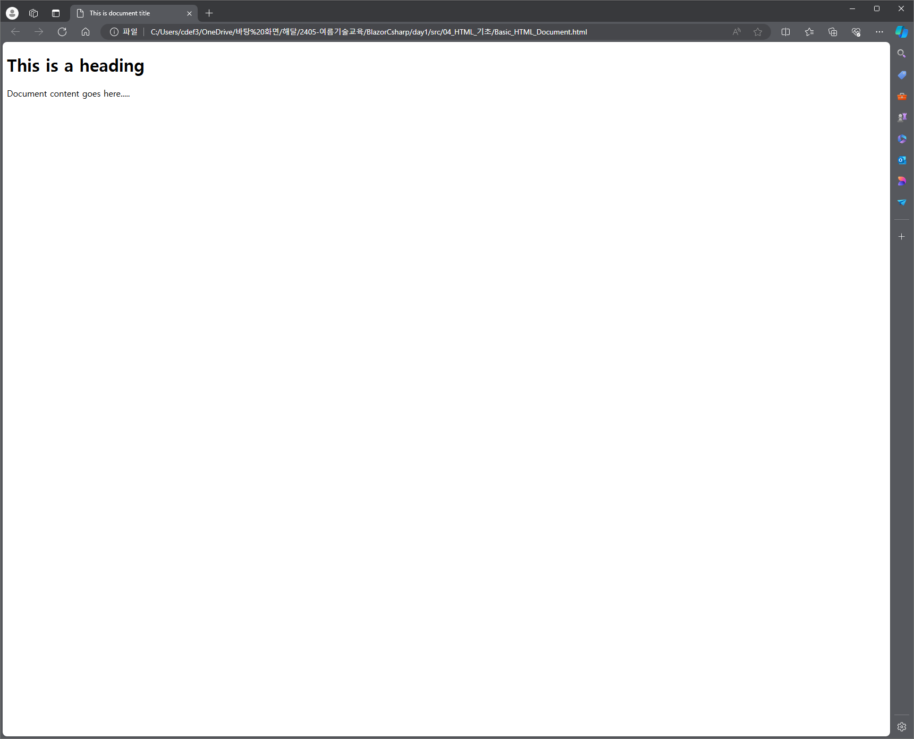

### HTML Tags

앞서 말했듯이 HTML은 마크업 언어이며 다양한 태그를 사용하여 콘텐츠 형식을 지정합니다. 이러한 태그는 `<Tag Name>` 괄호로 묶여 있습니다. 소수의 태그를 제외하고 대부분의 태그에는 해당하는 닫는 태그가 있습니다. 예를 들어 `<html>`에는 닫는 태그 `</html>`가 있고 `<body>` 태그에는 닫는 태그 `</body>` 태그가 있습니다.

위의 HTML 문서 예에서는 다음 태그를 사용합니다.

| Sr.No | Tag & Description  |
|-------|--------------------|
| 1     | `<!DOCTYPE...>`<br>이 태그는 문서 유형과 HTML 버전을 정의합니다.      |
| 2     | `<html>`<br>이 태그는 전체 HTML 문서를 포함하며 주로 `<head>...</head>`로 표시되는 문서 헤더와 `<body>...</body>` 태그로 표시되는 문서 본문으로 구성됩니다.             |
| 3     | `<head>`<br>이 태그는 `<title>`, `<link>` 등과 같은 다른 HTML 태그를 포함할 수 있는 문서의 헤더를 나타냅니다.             |
| 4     | `<title>`<br>`<title>` 태그는 문서 제목을 언급하기 위해 `<head>` 태그 내부에 사용됩니다.            |
| 5     | `<body>`<br>이 태그는 `<h1>`, `<div>`, `<p>` 등과 같은 다른 HTML 태그를 포함하는 문서의 본문을 나타냅니다.             |
| 6     | `<h1>`<br>이 태그는 제목을 나타냅니다. |
| 7     | `<p>`<br>이 태그는 단락을 나타냅니다. |

HTML을 배우려면 다양한 태그를 연구하고 텍스트 문서의 형식을 지정하면서 태그가 어떻게 작동하는지 이해해야 합니다. 

아름다운 웹페이지를 만들기 위해 텍스트나 이미지의 형식을 지정하려면 사용자가 다양한 태그의 사용법을 배워야 하기 때문에 HTML을 배우는 것은 간단합니다.

### HTML Document Structure

일반적인 HTML 문서의 구조는 다음과 같습니다.

```html
<html>
   
   <head>
      Document header related tags
   </head>
   
   <body>
      Document body related tags
   </body>
   
</html>
```

### The <!DOCTYPE> Declaration

<!DOCTYPE> 선언 태그는 웹 브라우저에서 문서에 사용된 HTML 버전을 이해하는 데 사용됩니다.

`<!DOCTYPE HTML>`

사용되는 HTML 버전에 따라 HTML 문서에서 사용할 수 있는 다른 선언 유형이 많이 있습니다. 이에 대한 자세한 내용은 다른 HTML 태그와 함께 `<!DOCTYPE...>` 태그를 논의하면서 살펴보겠습니다.

---
## Basic Tags

### Heading Tags

모든 문서는 제목으로 시작됩니다. 제목에 다양한 크기를 사용할 수 있습니다. HTML에는 `<h1>`, `<h2>`, `<h3>`, `<h4>`, `<h5>` 및 `<h6>` 요소를 사용하는 6가지 수준의 제목도 있습니다. 제목을 표시하는 동안 브라우저는 해당 제목 앞과 뒤에 한 줄을 추가합니다.

```html
<!DOCTYPE html>
<html>

   <head>
      <title>Heading Example</title>
   </head>
	
   <body>
      <h1>This is heading 1</h1>
      <h2>This is heading 2</h2>
      <h3>This is heading 3</h3>
      <h4>This is heading 4</h4>
      <h5>This is heading 5</h5>
      <h6>This is heading 6</h6>
   </body>
	
</html>
```

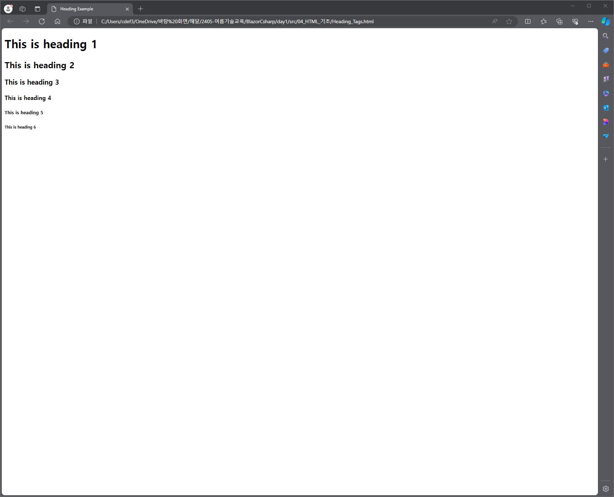

### Paragraph Tag

`<p>` 태그는 텍스트를 여러 단락으로 구성하는 방법을 제공합니다. 텍스트의 각 단락은 아래 예에 표시된 대로 여는 `<p>` 태그와 닫는 `</p>` 태그 사이에 들어가야 합니다.

```html
<!DOCTYPE html>
<html>

   <head>
      <title>Paragraph Example</title>
   </head>
	
   <body>
      <p>Here is a first paragraph of text.</p>
      <p>Here is a second paragraph of text.</p>
      <p>Here is a third paragraph of text.</p>
   </body>
	
</html>
```

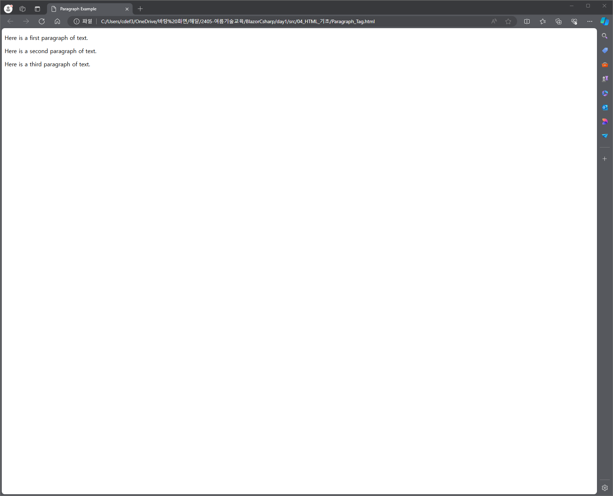

### Line Break Tag

`<br />` 요소를 사용할 때마다 그 뒤에 오는 모든 내용은 다음 줄에서 시작됩니다. 이 태그는 여는 태그와 닫는 태그 사이에 들어갈 내용이 없으므로 필요하지 않은 빈 요소 의 예입니다 .

`<br />` 태그에는 br 문자 와 슬래시 사이에 공백이 있습니다. 이 공백을 생략하면 이전 브라우저에서 줄 바꿈을 렌더링하는 데 문제가 발생하는 반면, 슬래시 문자를 놓치고 `<br>`만 사용하면 XHTML에서는 유효하지 않습니다.

```html
<!DOCTYPE html>
<html>

   <head>
      <title>Line Break  Example</title>
   </head>
	
   <body>
      <p>Hello<br />
         You delivered your assignment ontime.<br />
         Thanks<br />
         Mahnaz</p>
   </body>
	
</html>
```


### Centering Content

`<center>` 태그를 사용하면 페이지나 테이블 셀 중앙에 콘텐츠를 배치할 수 있습니다.

```html
<!DOCTYPE html>
<html>

   <head>
      <title>Centring Content Example</title>
   </head>
	
   <body>
      <p>This text is not in the center.</p>
      
      <center>
         <p>This text is in the center.</p>
      </center>
   </body>
	
</html>
```

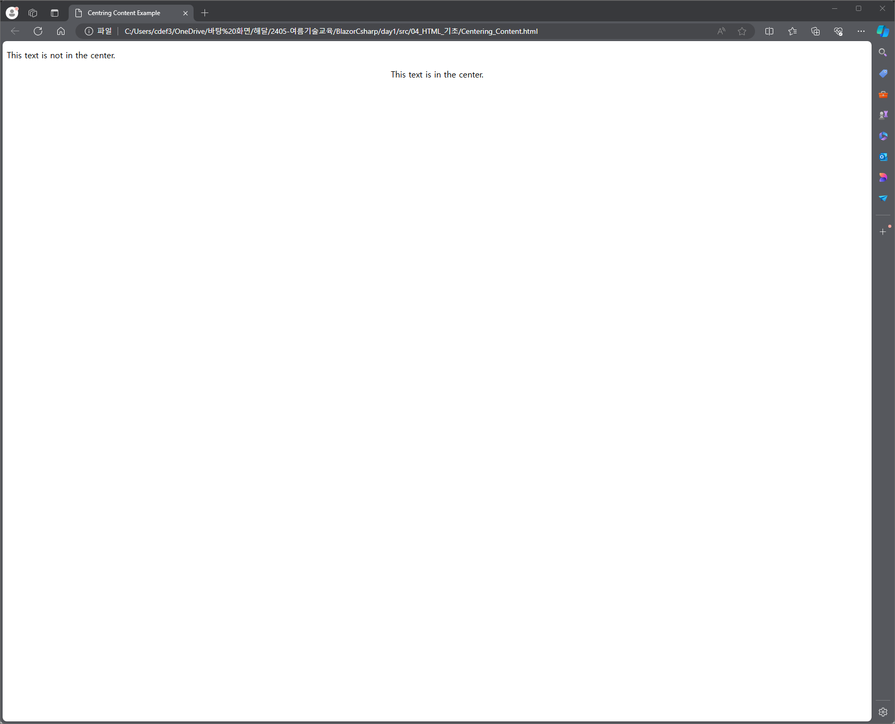

### Horizontal Lines

수평선은 문서의 섹션을 시각적으로 구분하는 데 사용됩니다. `<hr>` 태그 는 문서의 현재 위치에서 오른쪽 여백까지 줄을 만들고 그에 따라 줄을 바꿉니다.

예를 들어, 아래 주어진 예와 같이 두 단락 사이에 줄을 추가할 수 있습니다.

```html
<!DOCTYPE html>
<html>

   <head>
      <title>Horizontal Line Example</title>
   </head>
	
   <body>
      <p>This is paragraph one and should be on top</p>
      <hr />
      <p>This is paragraph two and should be at bottom</p>
   </body>
	
</html>
```

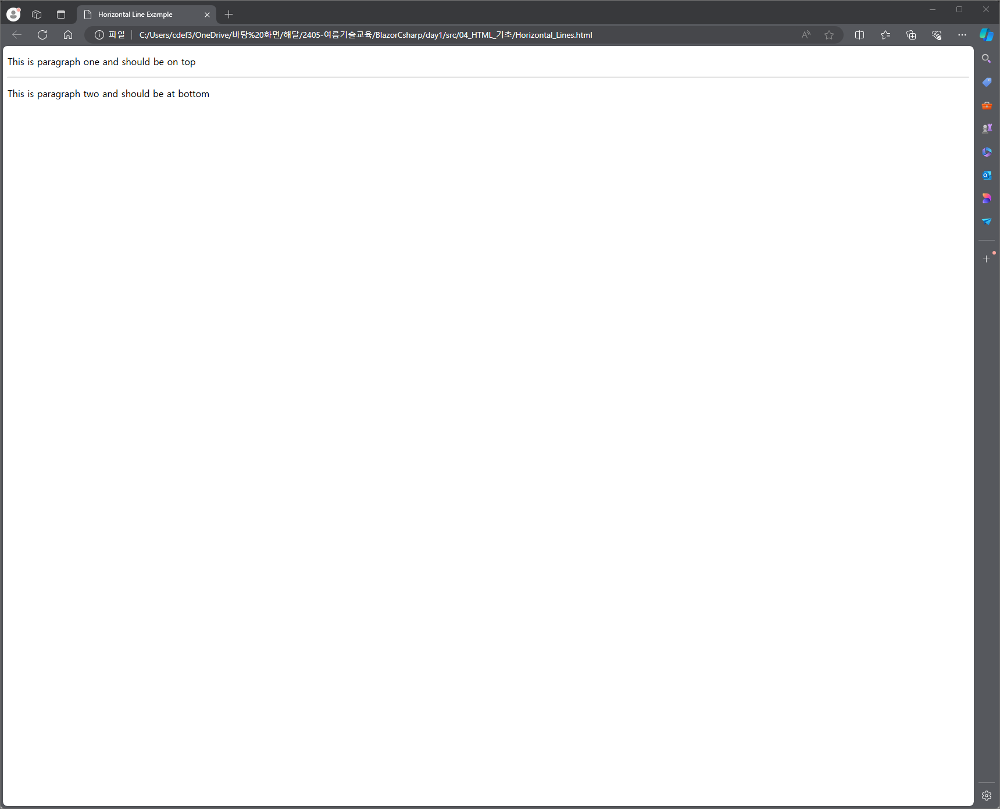

다시 `<hr />` 태그는 여는 태그와 닫는 태그가 필요하지 않은 빈 요소 의 예입니다 . 그 사이에 들어갈 항목이 없기 때문입니다.

`<hr />` 요소 에는 hr 문자 와 슬래시 사이에 공백이 있습니다 . 이 공백을 생략하면 이전 브라우저에서 수평선을 렌더링하는 데 문제가 발생합니다. 반면 슬래시 문자를 놓치고 `<hr>` 만 사용하면 XHTML에서는 유효하지 않습니다.

### Preserve Formatting

때로는 텍스트가 HTML 문서에 작성된 것과 동일한 형식을 따르기를 원할 수도 있습니다. 이러한 경우 미리 형식화된 태그 `<pre>` 를 사용할 수 있습니다 .

여는 `<pre>` 태그와 닫는 `</pre>` 태그 사이의 모든 텍스트는 소스 문서의 서식을 유지합니다.

```html
<!DOCTYPE html>
<html>

   <head>
      <title>Preserve Formatting Example</title>
   </head>
	
   <body>
      <pre>
         function testFunction( strText ){
            alert (strText)
         }
      </pre>
   </body>
	
</html>
```


### Nonbreaking Spaces

"12 Angry Men."라는 문구를 사용한다고 가정해 보겠습니다. 여기서는 브라우저가 "12, Angry"와 "Men"을 두 줄로 나누는 것을 원하지 않을 것입니다.

클라이언트 브라우저가 텍스트를 나누는 것을 원하지 않는 경우에는 일반 공간 대신 nonbreaking space entity `&nbsp;` 를 사용해야 합니다. 예를 들어, 단락에서 "12 Angry Men."를 코딩할 때 다음 코드와 유사한 것을 사용해야 합니다.

```html
<!DOCTYPE html>
<html>

   <head>
      <title>Nonbreaking Spaces Example</title>
   </head>
	
   <body>
      <p>An example of this technique appears in the movie "12&nbsp;Angry&nbsp;Men."</p>
   </body>
	
</html>
```

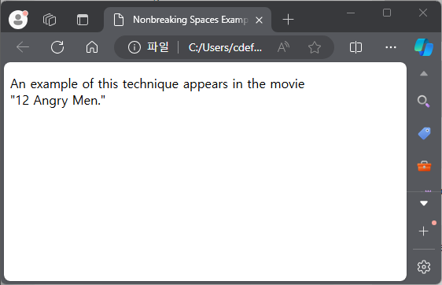

---
## Elements

HTML 요소는 시작 태그로 정의됩니다. 요소에 다른 콘텐츠가 포함되어 있으면 닫는 태그로 끝나며, 요소 이름 앞에는 슬래시가 붙습니다. 아래에 표시된 대로 몇 개의 태그가 있습니다.

| 시작 태그  | 콘텐츠       | 종료 태그   |
|--------|-----------|---------|
| `<p>`    | 단락 내용입니다. | `</p>`    |
| `<h1>`   | 제목 내용입니다. | `</h1>`   |
| `<div>`  | 분할 내용입니다. | `</div>`  |
| `<br />` |           |         |

따라서 여기서 `<p>....</p>` 는 HTML 요소이고, `<h1>...</h1>` 은 또 다른 HTML 요소입니다. `` , `<hr />` 및 `<br />` 요소 와 같이 닫을 필요가 없는 일부 HTML 요소가 있습니다 . 이를 보이드 요소 라고 합니다 .

HTML 문서는 이러한 요소의 트리로 구성되며 HTML 문서를 작성하는 방법과 HTML 문서의 어느 부분에 어떤 종류의 콘텐츠를 배치해야 하는지를 지정합니다.

### HTML Tag vs. Element

HTML 요소는 시작 태그 로 정의됩니다 . 요소에 다른 콘텐츠가 포함되어 있으면 닫는 태그 로 끝납니다 .

예를 들어 `<p>` 는 단락의 시작 태그이고 `</p>` 는 같은 단락의 닫는 태그이지만 `<p>이것은 단락입니다</p>` 는 단락 요소입니다.

### Nested HTML Elements

하나의 HTML 요소가 다른 HTML 요소를 포함하는 것이 가능합니다.

```html
<!DOCTYPE html>
<html>

   <head>
      <title>Nested Elements Example</title>
   </head>
	
   <body>
      <h1>This is <i>italic</i> heading</h1>
      <p>This is <u>underlined</u> paragraph</p>
   </body>
	
</html>
```

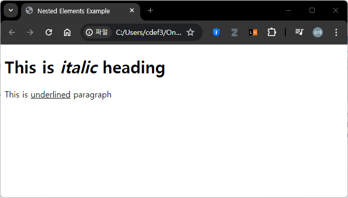

---
## Attributes

우리는 제목 태그 `<h1>`, `<h2>`, 단락 태그 `<p>` 와 같은 HTML 태그와 그 사용법을 일부 보았습니다. 지금까지는 가장 간단한 형태로 사용했지만 대부분의 HTML 태그에는 추가 정보인 속성도 있을 수 있습니다.

속성은 HTML 요소의 특성을 정의하는 데 사용되며 요소의 여는 태그 안에 배치됩니다. 모든 속성은 이름 과 값이라는 두 부분으로 구성됩니다.

 - 이름 은 설정하려는 속성입니다. 예를 들어, 예제의 단락 `<p>` 요소는 이름이 align 인 속성을 전달하며 , 이를 사용하여 페이지에서 단락 정렬을 나타낼 수 있습니다.
 - 값 은 속성 값을 설정려는 값입니다. 항상 따움표 안에 들어가야 합니다. 아래 예에서는 align 속성의 가능한 세 가지 값인 left, center 및 right 를 보여줍니다.

속성 이름과 속성 값은 대소문자를 구분하지 않습니다

```html
<!DOCTYPE html> 
<html>
 
   <head> 
      <title>Align Attribute  Example</title> 
   </head>
	
   <body> 
      <p align = "left">This is left aligned</p> 
      <p align = "center">This is center aligned</p> 
      <p align = "right">This is right aligned</p> 
   </body>
	
</html>
```

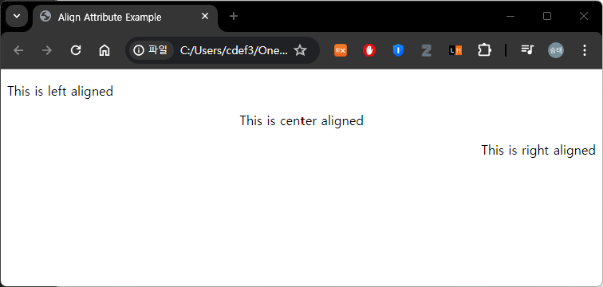

### Core Attributes

Here is the translation of the provided paragraph into Korean:

HTML 요소 대부분(모두는 아니지만)에 사용할 수 있는 네 가지 핵심 속성은 다음과 같습니다 −

 - 아이디 (Id)
 - 제목 (Title)
 - 클래스 (Class)
 - 스타일 (Style)

#### The Id Attribute

HTML 태그의 id 속성은 HTML 페이지 내의 요소를 고유하게 식별하는 데 사용할 수 있습니다. 요소에 id 속성을 사용하려는 주된 이유는 두 가지가 있습니다 −

 - 요소가 고유 식별자로 id 속성을 가지면, 해당 요소와 그 내용을 식별할 수 있습니다.
 - 웹 페이지(또는 스타일 시트) 내에서 동일한 이름의 두 요소가 있을 경우, id 속성을 사용하여 동일한 이름을 가진 요소들을 구별할 수 있습니다.

스타일 시트에 대해서는 별도의 강좌에서 다룰 예정입니다. 지금은 아래와 같이 두 개의 단락 요소를 구별하기 위해 id 속성을 사용하는 방법을 알아봅시다.

```html
<p id = "html">This para explains what is HTML</p>
<p id = "css">This para explains what is Cascading Style Sheet</p>
```

#### The title Attribute

title 속성은 요소에 제안된 제목을 제공합니다. title 속성의 문법은 id 속성에서 설명한 것과 유사합니다 −

이 속성의 동작은 이를 포함한 요소에 따라 다르지만, 종종 커서가 요소 위로 올려지거나 요소가 로딩되는 동안 툴팁으로 표시됩니다.

```html
<!DOCTYPE html>
<html>

   <head>
      <title>The title Attribute Example</title>
   </head>
	
   <body>
      <h3 title = "Hello HTML!">Titled Heading Tag Example</h3>
   </body>
	
</html>
```

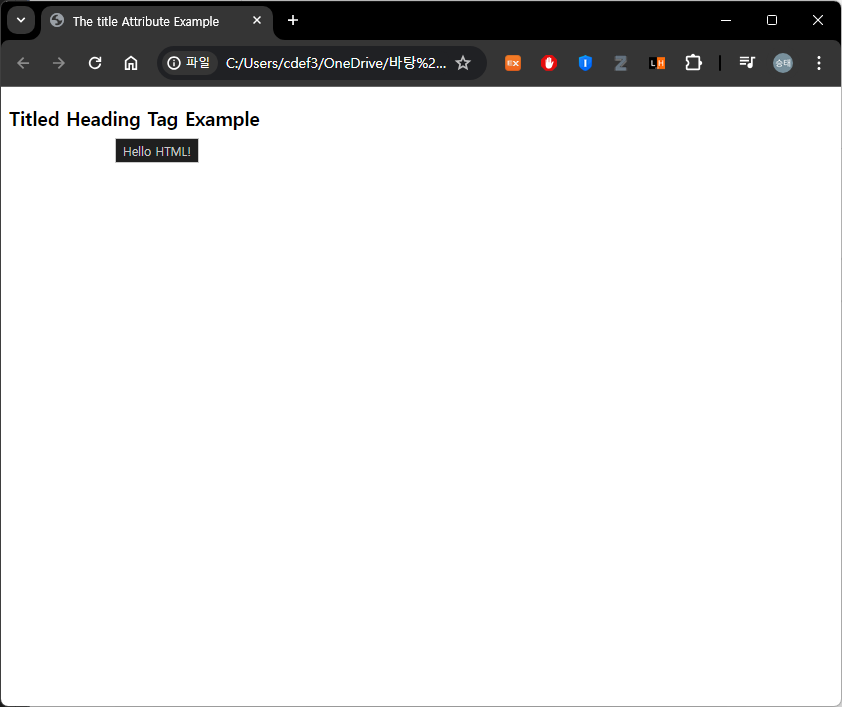

#### The class Attribute

클래스 속성은 요소를 스타일 시트와 연관시키고 요소의 클래스를 지정하는 데 사용됩니다. 클래스 속성의 사용에 대해서는 캐스케이딩 스타일 시트(CSS)를 배울 때 더 자세히 알아볼 것입니다. 따라서 지금은 이를 피할 수 있습니다.

속성의 값은 공백으로 구분된 클래스 이름 목록일 수도 있습니다.

```
class = "className1 className2 className3"
```

### The style Attribute

style 속성은 요소 내에서 캐스케이딩 스타일 시트(CSS) 규칙을 지정할 수 있게 해줍니다.

```html
<!DOCTYPE html>
<html>

   <head>
      <title>The style Attribute</title>
   </head>
	
   <body>
      <p style = "font-family:arial; color:#FF0000;">Some text...</p>
   </body>
	
</html>
```

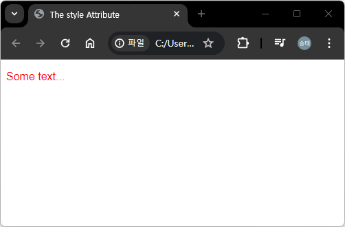

### Internationalization Attributes

대부분의 (모두는 아니지만) XHTML 요소에 사용할 수 있는 세 가지 국제화 속성이 있습니다.

 - dir
 - lang
 - xml

#### The dir Attribute

dir 속성은 텍스트가 흐르는 방향을 브라우저에 표시할 수 있게 해줍니다. dir 속성은 다음 표에서 볼 수 있듯이 두 가지 값 중 하나를 가질 수 있습니다 −

| Value | Meaning                                                                            |
|-------|------------------------------------------------------------------------------------|
| ltr   | Left to right (the default value)                                                  |
| rtl   | Right to left (for languages such as Hebrew or Arabic that are read right to left) |

```html
<!DOCTYPE html>
<html dir = "rtl">

   <head>
      <title>Display Directions</title>
   </head>
	
   <body>
      This is how IE 5 renders right-to-left directed text.
   </body>
	
</html>
```

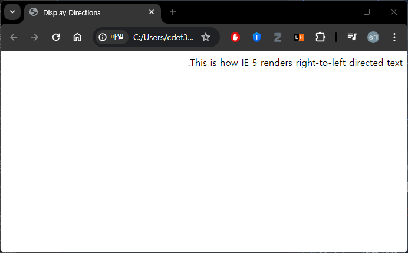

dir 속성이 `<html>` 태그 내에서 사용될 때, 문서 전체에서 텍스트가 어떻게 표시될지를 결정합니다. 다른 태그 내에서 사용될 때는, 해당 태그의 내용에 대해서만 텍스트의 방향을 제어합니다.

#### The lang Attribute

lang 속성은 문서에서 사용된 주요 언어를 표시할 수 있게 해줍니다. 그러나 이 속성은 이전 버전의 HTML과의 하위 호환성을 위해 HTML에만 유지되었습니다. 이 속성은 새로운 XHTML 문서에서는 xml:lang 속성으로 대체되었습니다.

lang 속성의 값은 ISO-639 표준 두 글자 언어 코드입니다. 전체 언어 코드 목록은 HTML 언어 코드: ISO 639를 참조하십시오.

```html
<!DOCTYPE html>
<html lang = "en">

   <head>
      <title>English Language Page</title>
   </head>

   <body>
      This page is using English Language
   </body>

</html>
```

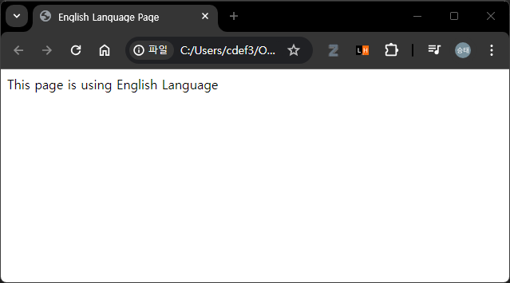

#### The xml:lang Attribute

xml:lang 속성은 lang 속성을 대체하는 XHTML 속성입니다. xml:lang 속성의 값은 이전 섹션에서 언급한 ISO-639 국가 코드여야 합니다.

### Generic Attributes

다음은 많은 HTML 태그에서 쉽게 사용할 수 있는 기타 속성들의 표입니다.

| Attribute  | Options                          | Function                                                    |
|------------|----------------------------------|-------------------------------------------------------------|
| align      | right, left, center              | Horizontally aligns tags                                    |
| valign     | top, middle, bottom              | Vertically aligns tags within an HTML element.              |
| bgcolor    | numeric, hexidecimal, RGB values | Places a background color behind an element                 |
| background | URL                              | Places a background image behind an element                 |
| id         | User Defined                     | Names an element for use with Cascading Style Sheets.       |
| class      | User Defined                     | Classifies an element for use with Cascading Style Sheets.  |
| width      | Numeric Value                    | Specifies the width of tables, images, or table cells.      |
| height     | Numeric Value                    | Specifies the height of tables, images, or table cells.     |
| title      | User Defined                     | "Pop-up" title of the elements.                             |

---
## Formatting

```html
<!DOCTYPE html>
<html>

   <head>
      <title>Formatting Example</title>
   </head>
	
   <body>
      <p>The following word uses a <b>bold</b> typeface.</p>
      <p>The following word uses an <i>italicized</i> typeface.</p>
      <p>The following word uses an <u>underlined</u> typeface.</p>
      <p>The following word uses a <strike>strikethrough</strike> typeface.</p>
      <p>The following word uses a <tt>monospaced</tt> typeface.</p>
      <p>The following word uses a <sup>superscript</sup> typeface.</p>
      <p>The following word uses a <sub>subscript</sub> typeface.</p>
      <p>I want to drink <del>cola</del> <ins>wine</ins></p>
      <p>The following word uses a <big>big</big> typeface.</p>
      <p>The following word uses a <small>small</small> typeface.</p>
   </body>
	
</html>
```

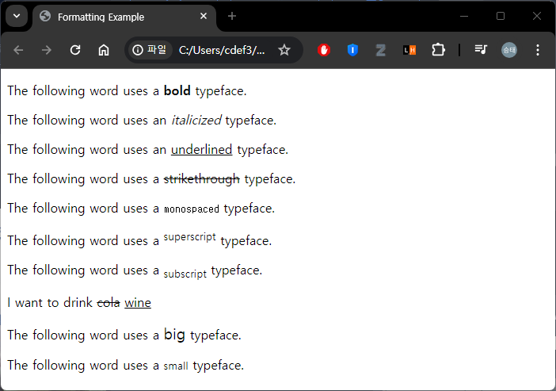

---
## Grouping Content

`<div>` 및 `<span>` 요소는 여러 요소를 그룹화하여 페이지의 섹션이나 하위 섹션을 만들 수 있게 해줍니다.

예를 들어, 페이지의 모든 각주를 `<div>` 요소 내에 넣어, 해당 `<div>` 요소 내의 모든 요소가 각주와 관련이 있음을 나타낼 수 있습니다. 그런 다음 이 `<div>` 요소에 스타일을 첨부하여 특별한 스타일 규칙 세트를 사용하여 표시되도록 할 수 있습니다.

```html
<!DOCTYPE html>
<html>

   <head>
      <title>Div Tag Example</title>
   </head>
	
   <body>
      <div id = "menu" align = "middle" >
         <a href = "/index.htm">HOME</a> | 
         <a href = "/about/contact_us.htm">CONTACT</a> | 
         <a href = "/about/index.htm">ABOUT</a>
      </div>

      <div id = "content" align = "left" >
         <h5>Content Articles</h5>
         <p>Actual content goes here.....</p>
      </div>
   </body>
	
</html>
```

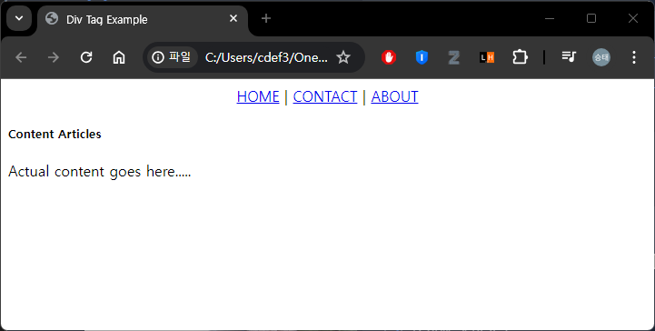

반면에 `<span>` 요소는 인라인 요소만 그룹화하는 데 사용할 수 있습니다. 따라서 문장이나 단락의 일부를 그룹화하고 싶다면, 다음과 같이 `<span>` 요소를 사용할 수 있습니다.

```html
<!DOCTYPE html>
<html>

   <head>
      <title>Span Tag Example</title>
   </head>
	
   <body>
      <p>This is the example of <span style = "color:green">span tag</span>
         and the <span style = "color:red">div tag</span> alongwith CSS</p>
   </body>
	
</html>
```


---
## Phrase Tags

구문 태그는 특정 목적을 위해 설계되었지만, 이전 장에서 보았던 `<b>`, `<i>`, `<pre>`, `<tt>`와 같은 다른 기본 태그와 유사한 방식으로 표시됩니다. 이번 장에서는 중요한 구문 태그들을 하나씩 살펴보겠습니다.

 - `<em>...</em>` 요소 내에 나타나는 모든 내용은 강조된 텍스트로 표시됩니다.
 - `<mark>...</mark>` 요소 내에 나타나는 모든 내용은 노란 잉크로 표시됩니다.
 - `<strong>...</strong>` 요소 내에 나타나는 모든 내용은 중요한 텍스트로 표시됩니다.
 - 텍스트를 줄이고자 할 때는 `<abbr>` 시작 태그와 종료 태그 `</abbr>` 사이에 넣습니다. 제목 속성이 있다면, 반드시 이 전체 설명만을 포함해야 합니다.
 - `<acronym>` 요소는 `<acronym>`과 `</acronym>` 태그 사이의 텍스트가 약어임을 표시합니다.
 - `<bdo>...</bdo>` 요소는 양방향 오버라이드를 의미하며, 현재 텍스트 방향을 무시하는 데 사용됩니다.
 - `<dfn>...</dfn>` 요소(또는 HTML 정의 요소)는 특별한 용어를 도입하고 있음을 지정할 수 있게 해줍니다. 이는 단락 중간에 기울임꼴 단어를 사용하는 것과 유사합니다.
   - 일반적으로 키 용어를 처음 도입할 때 `<dfn>` 요소를 사용합니다. 최신 브라우저 대부분은 `<dfn>` 요소의 내용을 기울임꼴로 렌더링합니다.
 - 다른 출처에서 인용한 구절을 인용하고자 할 때는 `<blockquote>...</blockquote>` 태그 사이에 넣어야 합니다.
   - `<blockquote>` 요소 내의 텍스트는 보통 주변 텍스트의 왼쪽 및 오른쪽 가장자리에서 들여쓰기 되며, 때때로 기울임꼴 글꼴을 사용합니다.
 - 문장 내에 큰따옴표를 추가하고자 할 때는 `<q>...</q>` 요소를 사용합니다.
 - 텍스트를 인용할 때, 출처를 `<cite>` 시작 태그와 종료 태그 `</cite>` 사이에 넣어 표시할 수 있습니다.
   - 인쇄 출판물에서 기대할 수 있듯이, `<cite>` 요소의 내용은 기본적으로 기울임꼴 텍스트로 렌더링됩니다.
 - 웹 페이지에 프로그래밍 코드를 표시하고자 할 때는 `<code>...</code>` 태그 내에 넣어야 합니다. 일반적으로 `<code>` 요소의 내용은 대부분의 프로그래밍 책에서와 같이 고정폭 글꼴로 표시됩니다.
 - 컴퓨터에 대해 이야기할 때, 독자에게 텍스트를 입력하라고 지시하고자 할 경우, `<kbd>...</kbd>` 요소를 사용하여 입력해야 할 내용을 표시할 수 있습니다.
 - `<var>...</var>` 요소는 보통 `<pre>` 및 `<code>` 요소와 함께 사용되어 해당 요소의 내용이 변수임을 나타냅니다.
 - `<samp>...</samp>` 요소는 프로그램, 스크립트 등의 샘플 출력을 나타냅니다. 이 요소는 주로 프로그래밍 또는 코딩 개념을 문서화할 때 사용됩니다.
` - <address>...</address>` 요소는 주소를 포함하는 데 사용됩니다.

```html
<!DOCTYPE html>
<html>

   <head>
      <title>Phrase Tags Example</title>
   </head>
	
   <body>
      <p>The following word uses an <em>emphasized</em> typeface.</p>
      <p>The following word has been <mark>marked</mark> with yellow</p>
      <p>The following word uses a <strong>strong</strong> typeface.</p>
      <p>My best friend's name is  <abbr title = "Abhishek">Abhy</abbr>.</p>
      <p>This chapter covers marking up text in <acronym>XHTML</acronym>.</p>
      <p><bdo dir = "rtl">This text will go right to left.</bdo></p>
      <p>The following word is a <dfn>special</dfn> term.</p>
      <blockquote>XHTML 1.0 is the W3C's first Recommendation for XHTML,following on 
         from earlier work on HTML 4.01, HTML 4.0, HTML 3.2 and HTML 2.0.</blockquote>
      <p>Amit is in Spain, <q>I think I am wrong</q>.</p>
      <p>This HTML tutorial is derived from <cite>W3 Standard for HTML</cite>.</p>
      <p>Regular text. <code>This is code.</code> Regular text.</p>
      <p>Regular text. <kbd>This is inside kbd element</kbd> Regular text.</p>
      <p><code>document.write("<var>user-name</var>")</code></p>
      <p>Result produced by the program is <samp>Hello World!</samp></p>
      <address>388A, Road No 22, Jubilee Hills -  Hyderabad</address>
   </body>
</html>
```

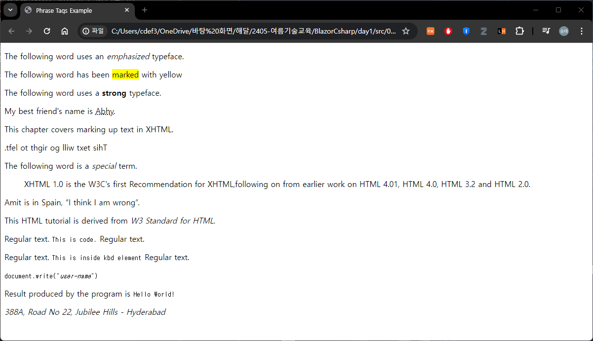

---
## Meta Tags


HTML은 문서에 대한 추가 중요한 정보를 다양한 방법으로 지정할 수 있는 메타데이터를 명시할 수 있게 해줍니다. META 요소는 HTML 문서의 속성(예: 작성자, 만료 날짜, 키워드 목록, 문서 작성자 등)을 설명하는 이름/값 쌍을 포함하는 데 사용할 수 있습니다.

`<meta>` 태그는 이러한 추가 정보를 제공하는 데 사용됩니다. 이 태그는 닫는 태그가 없는 빈 요소이며, 속성 내에 정보를 담고 있습니다.

문서에 포함하고자 하는 정보에 따라 하나 이상의 메타 태그를 문서에 포함할 수 있지만 일반적으로 메타 태그는 문서의 물리적 외관에 영향을 미치지 않으므로 외관상 중요하지 않습니다.

### 문서에 메타 태그 추가하기

메타데이터를 웹 페이지에 추가하려면 문서의 헤더에 `<meta>` 태그를 배치합니다. 헤더는 `<head>` 및 `</head>` 태그로 표현됩니다. 메타 태그는 다음과 같은 속성을 가질 수 있습니다.

#### 속성 및 설명
1. **Name**
   - 속성의 이름. 키워드, 설명, 작성자, 수정 등 다양한 이름을 사용할 수 있습니다.

2. **content**
   - 속성의 값을 지정합니다.

3. **scheme**
   - 속성의 값을 해석하기 위한 스키마를 지정합니다 (content 속성에 선언된 대로).

4. **http-equiv**
   - HTTP 응답 메시지 헤더에 사용됩니다. 예를 들어, http-equiv는 페이지를 새로 고치거나 쿠키를 설정하는 데 사용할 수 있습니다. 값으로는 content-type, expires, refresh, set-cookie 등이 있습니다.

### 키워드 지정

`<meta>` 태그를 사용하여 문서와 관련된 중요한 키워드를 지정할 수 있으며, 이러한 키워드는 검색 엔진이 웹 페이지를 색인화할 때 사용됩니다.

#### 예시
다음은 HTML, Meta Tags, Metadata를 중요한 키워드로 추가하는 예시입니다.

```html
<!DOCTYPE html>
<html>
   <head>
      <title>Meta Tags Example</title>
      <meta name="keywords" content="HTML, Meta Tags, Metadata" />
   </head>
   <body>
      <p>Hello HTML5!</p>
   </body>
</html>
```

### 문서 설명

`<meta>` 태그를 사용하여 문서에 대한 간략한 설명을 제공할 수 있습니다. 이는 검색 엔진이 웹 페이지를 색인화할 때 사용됩니다.

#### 예시

```html
<!DOCTYPE html>
<html>
   <head>
      <title>Meta Tags Example</title>
      <meta name="keywords" content="HTML, Meta Tags, Metadata" />
      <meta name="description" content="Learning about Meta Tags." />
   </head>
   <body>
      <p>Hello HTML5!</p>
   </body>
</html>
```

### 문서 수정 날짜

`<meta>` 태그를 사용하여 문서가 마지막으로 수정된 날짜를 제공할 수 있습니다. 이 정보는 웹 브라우저가 웹 페이지를 새로 고칠 때 사용될 수 있습니다.

#### 예시

```html
<!DOCTYPE html>
<html>
   <head>
      <title>Meta Tags Example</title>
      <meta name="keywords" content="HTML, Meta Tags, Metadata" />
      <meta name="description" content="Learning about Meta Tags." />
      <meta name="revised" content="Tutorialspoint, 3/7/2014" />
   </head>
   <body>
      <p>Hello HTML5!</p>
   </body>
</html>
```

### 문서 새로 고침

`<meta>` 태그를 사용하여 웹 페이지가 자동으로 새로 고쳐질 시간을 지정할 수 있습니다.

#### 예시
페이지가 5초마다 새로 고쳐지도록 하려면 다음 구문을 사용합니다.

```html
<!DOCTYPE html>
<html>
   <head>
      <title>Meta Tags Example</title>
      <meta name="keywords" content="HTML, Meta Tags, Metadata" />
      <meta name="description" content="Learning about Meta Tags." />
      <meta name="revised" content="Tutorialspoint, 3/7/2014" />
      <meta http-equiv="refresh" content="5" />
   </head>
   <body>
      <p>Hello HTML5!</p>
   </body>
</html>
```

### 페이지 리디렉션

`<meta>` 태그를 사용하여 페이지를 다른 웹 페이지로 리디렉션할 수 있습니다. 특정 시간 후에 페이지를 리디렉션하려면 시간을 지정할 수도 있습니다.

#### 예시
현재 페이지를 5초 후에 다른 페이지로 리디렉션하는 예시입니다. 즉시 리디렉션하려면 content 속성을 지정하지 마십시오.

```html
<!DOCTYPE html>
<html>
   <head>
      <title>Meta Tags Example</title>
      <meta name="keywords" content="HTML, Meta Tags, Metadata" />
      <meta name="description" content="Learning about Meta Tags." />
      <meta name="revised" content="Tutorialspoint, 3/7/2014" />
      <meta http-equiv="refresh" content="5; url=https://www.tutorialspoint.com" />
   </head>
   <body>
      <p>Hello HTML5!</p>
   </body>
</html>
```

### 쿠키 설정

쿠키는 컴퓨터의 작은 텍스트 파일에 저장된 데이터로, 웹 브라우저와 웹 서버 간에 교환되어 웹 애플리케이션의 필요에 따라 다양한 정보를 추적합니다.

`<meta>` 태그를 사용하여 클라이언트 측에 쿠키를 저장하고 나중에 웹 서버가 사이트 방문자를 추적하는 데 이 정보를 사용할 수 있습니다.

#### 예시

```html
<!DOCTYPE html>
<html>
   <head>
      <title>Meta Tags Example</title>
      <meta http-equiv="cookie" content="userid=xyz; expires=Wednesday, 08-Aug-15 23:59:59 GMT;" />
   </head>
   <body>
      <p>Hello HTML5!</p>
   </body>
</html>
```

만료 날짜와 시간을 포함하지 않으면 쿠키는 세션 쿠키로 간주되어 사용자가 브라우저를 종료할 때 삭제됩니다.

### 작성자 이름 설정

메타 태그를 사용하여 웹 페이지에 작성자 이름을 설정할 수 있습니다. 아래 예시를 참조하십시오.

#### 예시

```html
<!DOCTYPE html>
<html>
   <head>
      <title>Meta Tags Example</title>
      <meta name="keywords" content="HTML, Meta Tags, Metadata" />
      <meta name="description" content="Learning about Meta Tags." />
      <meta name="author" content="Mahnaz Mohtashim" />
   </head>
   <body>
      <p>Hello HTML5!</p>
   </body>
</html>
```

### 문자 집합 지정

`<meta>` 태그를 사용하여 웹 페이지에서 사용하는 문자 집합을 지정할 수 있습니다.

#### 예시
기본적으로 웹 서버와 웹 브라우저는 ISO-8859-1(Latin1) 인코딩을 사용하여 웹 페이지를 처리합니다. 다음은 UTF-8 인코딩을 설정하는 예시입니다.

```html
<!DOCTYPE html>
<html>
   <head>
      <title>Meta Tags Example</title>
      <meta name="keywords" content="HTML, Meta Tags, Metadata" />
      <meta name="description" content="Learning about Meta Tags." />
      <meta name="author" content="Mahnaz Mohtashim" />
      <meta http-equiv="Content-Type" content="text/html; charset=UTF-8" />
   </head>
   <body>
      <p>Hello HTML5!</p>
   </body>
</html>
```

전통적인 중국어 문자가 포함된 정적 페이지를 제공하려면 웹 페이지에 Big5 인코딩을 설정하는 `<meta>` 태그가 포함되어야 합니다.

```html
<!DOCTYPE html>
<html>
   <head>
      <title>Meta Tags Example</title>
      <meta name="keywords" content="HTML, Meta Tags, Metadata" />
      <meta name="description" content="Learning about Meta Tags." />
      <meta name="author" content="Mahnaz Mohtashim" />
      <meta http-equiv="Content-Type" content="text/html; charset=Big5" />
   </head>
   <body>
      <p>Hello HTML5!</p>
   </body>
</html>
```

## Comments


주석은 모든 웹 브라우저에 의해 무시되는 코드의 일부입니다. 특히 복잡한 문서에서는 HTML 코드에 주석을 추가하여 문서의 섹션 및 코드를 보는 사람에게 필요한 기타 메모를 표시하는 것이 좋은 관행입니다. 주석은 코드의 이해를 돕고 가독성을 높여줍니다.

HTML 주석은 `<!-- ... -->` 태그 사이에 배치됩니다. 따라서 `<!-- ... -->` 태그 내에 배치된 모든 내용은 주석으로 처리되며 브라우저에 의해 완전히 무시됩니다.

### 예시

```html
<!DOCTYPE html>
<html>

   <head>  <!-- Document Header Starts -->
      <title>This is document title</title>
   </head> <!-- Document Header Ends -->
	
   <body>
      <p>Document content goes here.....</p>
   </body>
	
</html>
```

위의 코드는 주석으로 작성된 내용 없이 결과를 출력합니다.

### 유효한 주석과 무효한 주석

주석은 중첩되지 않으며, 주석 내부에 또 다른 주석을 넣을 수 없습니다. 또한, `--` 이중 대시 시퀀스는 닫는 `-->` 태그의 일부로 나타나지 않는 한 주석 내부에 나타날 수 없습니다. 주석 시작 문자열에 공백이 없어야 합니다.

#### 예시

다음 주석은 유효한 주석이며 브라우저에 의해 무시됩니다.

```html
<!DOCTYPE html>
<html>

   <head>
      <title>Valid Comment Example</title>
   </head>
	
   <body>
      <!-- This is valid comment -->
      <p>Document content goes here.....</p>
   </body>
	
</html>
```

하지만 다음 줄은 유효하지 않은 주석이며 브라우저에 의해 표시됩니다. 이는 왼쪽 꺾쇠 괄호와 느낌표 사이에 공백이 있기 때문입니다.

```html
<!DOCTYPE html>
<html>

   <head>  
      <title>Invalid Comment Example</title>
   </head>
	
   <body>
      < !-- This is not a valid comment -->
      <p>Document content goes here.....</p>
   </body>
	
</html>
```

### 다중 행 주석

지금까지 단일 행 주석을 보았지만, HTML은 다중 행 주석도 지원합니다.

특수 시작 태그 `<!--` 와 종료 태그 `-->`를 첫 줄 앞과 마지막 줄 끝에 배치하여 여러 줄을 주석 처리할 수 있습니다.

#### 예시

```html
<!DOCTYPE html>
<html>

   <head>  
      <title>Multiline Comments</title>
   </head> 
	
   <body>
      <!-- 
         This is a multiline comment and it can
         span through as many as lines you like.
      -->
      
      <p>Document content goes here.....</p>
   </body>
	
</html>
```

### 조건부 주석

조건부 주석은 Windows의 Internet Explorer (IE)에서만 작동하며 다른 브라우저에서는 무시됩니다. IE 5 이상에서 지원되며, 다양한 버전의 IE에 조건부 지시를 제공하는 데 사용할 수 있습니다.

#### 예시

```html
<!DOCTYPE html>
<html>

   <head>  
      <title>Conditional Comments</title>

      <!--[if IE 6]>
         Special instructions for IE 6 here
      <![endif]-->
   </head> 
   
   <body>
      <p>Document content goes here.....</p>
   </body>
	
</html>
```

다양한 버전의 Internet Explorer에 따라 다른 스타일 시트를 적용해야 하는 상황에서 조건부 주석이 유용합니다.

### Comment 태그 사용

일부 브라우저는 HTML 코드의 일부를 주석 처리하기 위해 `<comment>` 태그를 지원합니다.

**참고:** `<comment>` 태그는 HTML5에서 더 이상 사용되지 않습니다. 이 요소는 사용하지 마십시오.

#### 예시

```html
<!DOCTYPE html>
<html>

   <head>
      <title>Using Comment Tag</title>
   </head>
	
   <body>
      <p>This is <comment>not</comment> Internet Explorer.</p>
   </body>
	
</html>
```

IE를 사용하는 경우 다음 결과가 나타납니다.

IE를 사용하지 않는 경우 다음 결과가 나타납니다.

### 스크립트 코드 주석 처리

HTML과 함께 JavaScript를 배우게 되겠지만, 여기서는 HTML 코드에 JavaScript 또는 VBScript를 사용하는 경우 올바른 HTML 주석 내에 스크립트 코드를 넣어야 오래된 브라우저에서도 제대로 작동할 수 있다는 점을 유의해야 합니다.

#### 예시

```html
<!DOCTYPE html>
<html>

   <head>
      <title>Commenting Script Code</title>
      
      <script>
         <!-- 
            document.write("Hello World!")
         //-->
      </script>
   </head>
	
   <body>
      <p>Hello, World!</p>
   </body>
	
</html>
```

### 스타일 시트 주석 처리

HTML과 함께 스타일 시트를 사용하는 방법을 별도의 튜토리얼에서 배우겠지만, 여기서는 HTML 코드에 CSS(Cascading Style Sheet)를 사용하는 경우 올바른 HTML 주석 내에 스타일 시트 코드를 넣어야 오래된 브라우저에서도 제대로 작동할 수 있다는 점을 유의해야 합니다.

#### 예시

```html
<!DOCTYPE html>
<html>

   <head>
      <title>Commenting Style Sheets</title>
      
      <style>
         <!--
            .example {
               border:1px solid #4a7d49;
            }
         //-->
      </style>
   </head>
	
   <body>
      <div class="example">Hello, World!</div>
   </body>
	
</html>
```

---
## Images

이미지는 웹 페이지를 아름답게 하고 복잡한 개념을 간단하게 설명하는 데 매우 중요합니다. 이 튜토리얼에서는 웹 페이지에서 이미지를 사용하는 간단한 단계를 안내합니다.

### 이미지 삽입
`` 태그를 사용하여 웹 페이지에 이미지를 삽입할 수 있습니다. 다음은 이 태그를 사용하는 간단한 문법입니다.

```html

```

`` 태그는 닫는 태그가 없는 빈 태그입니다. 즉, 속성 목록만 포함할 수 있으며 닫는 태그가 없습니다.

#### 예시
다음 예제를 시도하려면 HTML 파일 `test.htm`과 이미지 파일 `test.png`를 동일한 디렉토리에 유지하십시오.

```html
<!DOCTYPE html>
<html>

   <head>
      <title>웹 페이지에서 이미지 사용</title>
   </head>
	
   <body>
      <p>간단한 이미지 삽입</p>
      
   </body>
	
</html>
```

위 코드는 다음과 같은 결과를 생성합니다.

PNG, JPEG 또는 GIF 이미지 파일을 편의에 따라 사용할 수 있지만, `src` 속성에 올바른 이미지 파일 이름을 지정해야 합니다. 이미지 이름은 항상 대소문자를 구분합니다.

`alt` 속성은 필수 속성으로, 이미지가 표시되지 않을 경우 대체 텍스트를 지정합니다.

### 이미지 위치 설정
일반적으로 모든 이미지를 별도의 디렉토리에 보관합니다. HTML 파일 `test.htm`을 홈 디렉토리에 두고 홈 디렉토리 내에 `images` 하위 디렉토리를 만들어 이미지 `test.png`를 보관합니다.

#### 예시
이미지 위치가 "images/test.png"라고 가정하고 다음 예제를 시도하십시오.

```html
<!DOCTYPE html>
<html>

   <head>
      <title>웹 페이지에서 이미지 사용</title>
   </head>
	
   <body>
      <p>간단한 이미지 삽입</p>
      
   </body>
	
</html>
```

위 코드는 다음과 같은 결과를 생성합니다.

### 이미지 너비/높이 설정
`width` 및 `height` 속성을 사용하여 요구 사항에 따라 이미지 너비와 높이를 설정할 수 있습니다. 이미지의 너비와 높이는 픽셀 단위 또는 실제 크기의 백분율로 지정할 수 있습니다.

#### 예시

```html
<!DOCTYPE html>
<html>

   <head>
      <title>이미지 너비와 높이 설정</title>
   </head>
	
   <body>
      <p>이미지 너비와 높이 설정</p>
      
   </body>
	
</html>
```

위 코드는 다음과 같은 결과를 생성합니다.

### 이미지 테두리 설정
기본적으로 이미지에는 테두리가 있습니다. `border` 속성을 사용하여 픽셀 단위로 테두리 두께를 지정할 수 있습니다. 두께가 0이면 그림에 테두리가 없습니다.

#### 예시

```html
<!DOCTYPE html>
<html>

   <head>
      <title>이미지 테두리 설정</title>
   </head>
	
   <body>
      <p>이미지 테두리 설정</p>
      
   </body>
	
</html>
```

위 코드는 다음과 같은 결과를 생성합니다.

### 이미지 정렬 설정
기본적으로 이미지는 페이지의 왼쪽에 정렬되지만 `align` 속성을 사용하여 중앙이나 오른쪽에 설정할 수 있습니다.

#### 예시

```html
<!DOCTYPE html>
<html>

   <head>
      <title>이미지 정렬 설정</title>
   </head>
	
   <body>
      <p>이미지 정렬 설정</p>
      
   </body>
	
</html>
```

위 코드는 다음과 같은 결과를 생성합니다.

### 무료 웹 그래픽
패턴을 포함한 무료 웹 그래픽은 무료 웹 그래픽에서 찾을 수 있습니다.

---
## Tables

HTML 테이블을 사용하면 웹 저자가 텍스트, 이미지, 링크, 기타 테이블 등을 셀의 행과 열로 배열할 수 있습니다.

HTML 테이블은 `<table>` 태그를 사용하여 생성되며, `<tr>` 태그는 테이블 행을 생성하고 `<td>` 태그는 데이터 셀을 생성하는 데 사용됩니다. `<td>` 아래의 요소는 기본적으로 왼쪽 정렬됩니다.

### 예시

```html
<!DOCTYPE html>
<html>

   <head>
      <title>HTML Tables</title>
   </head>
	
   <body>
      <table border="1">
         <tr>
            <td>Row 1, Column 1</td>
            <td>Row 1, Column 2</td>
         </tr>
         
         <tr>
            <td>Row 2, Column 1</td>
            <td>Row 2, Column 2</td>
         </tr>
      </table>
   </body>
</html>
```

위 코드는 다음과 같은 결과를 생성합니다.

여기서 `border`는 `<table>` 태그의 속성으로, 모든 셀에 테두리를 추가하는 데 사용됩니다. 테두리가 필요하지 않으면 `border="0"`을 사용할 수 있습니다.

### 테이블 헤딩

테이블 헤딩은 `<th>` 태그를 사용하여 정의할 수 있습니다. 이 태그는 실제 데이터 셀을 나타내는 `<td>` 태그를 대체합니다. 일반적으로 최상단 행을 테이블 헤딩으로 설정하지만, 원하는 행에 `<th>` 요소를 사용할 수 있습니다. `<th>` 태그로 정의된 헤딩은 기본적으로 중앙 정렬되고 굵게 표시됩니다.

### 예시

```html
<!DOCTYPE html>
<html>

   <head>
      <title>HTML Table Header</title>
   </head>
	
   <body>
      <table border="1">
         <tr>
            <th>Name</th>
            <th>Salary</th>
         </tr>
         <tr>
            <td>Ramesh Raman</td>
            <td>5000</td>
         </tr>
         <tr>
            <td>Shabbir Hussein</td>
            <td>7000</td>
         </tr>
      </table>
   </body>
</html>
```

위 코드는 다음과 같은 결과를 생성합니다.

### 셀패딩 및 셀스페이싱 속성

테이블 셀의 여백을 조정하기 위해 `cellpadding`과 `cellspacing`이라는 두 가지 속성이 있습니다. `cellspacing` 속성은 테이블 셀 간의 간격을 정의하고, `cellpadding`은 셀 테두리와 셀 내용 사이의 거리를 나타냅니다.

### 예시

```html
<!DOCTYPE html>
<html>

   <head>
      <title>HTML Table Cellpadding</title>
   </head>
	
   <body>
      <table border="1" cellpadding="5" cellspacing="5">
         <tr>
            <th>Name</th>
            <th>Salary</th>
         </tr>
         <tr>
            <td>Ramesh Raman</td>
            <td>5000</td>
         </tr>
         <tr>
            <td>Shabbir Hussein</td>
            <td>7000</td>
         </tr>
      </table>
   </body>
</html>
```

위 코드는 다음과 같은 결과를 생성합니다.

### colspan 및 rowspan 속성

두 개 이상의 열을 하나의 열로 병합하려면 `colspan` 속성을 사용합니다. 유사하게, 두 개 이상의 행을 병합하려면 `rowspan` 속성을 사용합니다.

### 예시

```html
<!DOCTYPE html>
<html>

   <head>
      <title>HTML Table Colspan/Rowspan</title>
   </head>
	
   <body>
      <table border="1">
         <tr>
            <th>Column 1</th>
            <th>Column 2</th>
            <th>Column 3</th>
         </tr>
         <tr>
            <td rowspan="2">Row 1 Cell 1</td>
            <td>Row 1 Cell 2</td>
            <td>Row 1 Cell 3</td>
         </tr>
         <tr>
            <td>Row 2 Cell 2</td>
            <td>Row 2 Cell 3</td>
         </tr>
         <tr>
            <td colspan="3">Row 3 Cell 1</td>
         </tr>
      </table>
   </body>
</html>
```

위 코드는 다음과 같은 결과를 생성합니다.

### 테이블 배경 설정

테이블 배경은 다음 두 가지 방법 중 하나를 사용하여 설정할 수 있습니다.

- `bgcolor` 속성: 전체 테이블 또는 단일 셀의 배경색을 설정할 수 있습니다.
- `background` 속성: 전체 테이블 또는 단일 셀의 배경 이미지를 설정할 수 있습니다.

또한, `bordercolor` 속성을 사용하여 테두리 색상을 설정할 수도 있습니다.

**참고:** `bgcolor`, `background`, `bordercolor` 속성은 HTML5에서 더 이상 사용되지 않습니다. 이러한 속성은 사용하지 마십시오.

### 예시

```html
<!DOCTYPE html>
<html>

   <head>
      <title>HTML Table Background</title>
   </head>
	
   <body>
      <table border="1" bordercolor="green" bgcolor="yellow">
         <tr>
            <th>Column 1</th>
            <th>Column 2</th>
            <th>Column 3</th>
         </tr>
         <tr>
            <td rowspan="2">Row 1 Cell 1</td>
            <td>Row 1 Cell 2</td>
            <td>Row 1 Cell 3</td>
         </tr>
         <tr>
            <td>Row 2 Cell 2</td>
            <td>Row 2 Cell 3</td>
         </tr>
         <tr>
            <td colspan="3">Row 3 Cell 1</td>
         </tr>
      </table>
   </body>
</html>
```

위 코드는 다음과 같은 결과를 생성합니다.

배경 속성을 사용하는 예시는 다음과 같습니다. 여기서는 `/images` 디렉토리에 있는 이미지를 사용합니다.

```html
<!DOCTYPE html>
<html>

   <head>
      <title>HTML Table Background</title>
   </head>
	
   <body>
      <table border="1" bordercolor="green" background="/images/test.png">
         <tr>
            <th>Column 1</th>
            <th>Column 2</th>
            <th>Column 3</th>
         </tr>
         <tr>
            <td rowspan="2">Row 1 Cell 1</td>
            <td>Row 1 Cell 2</td>
            <td>Row 1 Cell 3</td>
         </tr>
         <tr>
            <td>Row 2 Cell 2</td>
            <td>Row 2 Cell 3</td>
         </tr>
         <tr>
            <td colspan="3">Row 3 Cell 1</td>
         </tr>
      </table>
   </body>
</html>
```

위 코드는 다음과 같은 결과를 생성합니다. 여기서 배경 이미지는 테이블 헤더에 적용되지 않았습니다.

### 테이블 높이 및 너비 설정

`width` 및 `height` 속성을 사용하여 테이블의 너비와 높이를 설정할 수 있습니다. 테이블의 너비와 높이는 픽셀 단위 또는 사용 가능한 화면 영역의 백분율로 지정할 수 있습니다.

### 예시

```html
<!DOCTYPE html>
<html>

   <head>
      <title>HTML Table Width/Height</title>
   </head>
	
   <body>
      <table border="1" width="400" height="150">
         <tr>
            <td>Row 1, Column 1</td>
            <td>Row 1, Column 2</td>
         </tr>
         
         <tr>
            <td>Row 2, Column 1</td>
            <td>Row 2, Column 2</td>
         </tr>
      </table>
   </body>
</html>
```

위 코드는 다음과 같은 결과를 생성합니다.

### 테이블 캡션

`<caption>` 태그는 테이블의 제목이나 설명을 제공하며, 테이블 상단에 표시됩니다. 이 태그는 최신 HTML/XHTML 버전에서 더 이상 사용되지 않습니다.

### 예시

```html
<!DOCTYPE html>
<html>

   <head>
      <title>HTML Table Caption</title>
   </head>
	
   <body>
      <table border="1" width="100%">
         <caption>This is the caption</caption>
         
         <tr>
            <td>row 1, column 1</td>
            <td>row 1, columnn 2</td>
         </tr>
         
         <tr>
            <td>row 2, column 1</td>
            <td>row 2, columnn 2</td>
         </tr>
      </

table>
   </body>
</html>
```

위 코드는 다음과 같은 결과를 생성합니다.

### 테이블 헤더, 바디 및 풋터

테이블은 헤더, 바디, 풋터의 세 부분으로 나눌 수 있습니다. 헤더와 풋터는 모든 페이지에 동일하게 표시되는 단어 처리 문서의 머리글 및 바닥글과 유사하며, 바디는 테이블의 주요 내용 보관 부분입니다.

테이블의 헤더, 바디, 풋터를 분리하는 세 가지 요소는 다음과 같습니다.

- `<thead>`: 별도의 테이블 헤더를 생성합니다.
- `<tbody>`: 테이블의 주요 본문을 나타냅니다.
- `<tfoot>`: 별도의 테이블 풋터를 생성합니다.

테이블에는 여러 개의 `<tbody>` 요소가 포함되어 다른 페이지나 데이터 그룹을 나타낼 수 있습니다. 하지만 `<thead>` 및 `<tfoot>` 태그는 `<tbody>`보다 먼저 나타나야 합니다.

### 예시

```html
<!DOCTYPE html>
<html>

   <head>
      <title>HTML Table</title>
   </head>
	
   <body>
      <table border="1" width="100%">
         <thead>
            <tr>
               <td colspan="4">This is the head of the table</td>
            </tr>
         </thead>
         
         <tfoot>
            <tr>
               <td colspan="4">This is the foot of the table</td>
            </tr>
         </tfoot>
         
         <tbody>
            <tr>
               <td>Cell 1</td>
               <td>Cell 2</td>
               <td>Cell 3</td>
               <td>Cell 4</td>
            </tr>
         </tbody>
      </table>
   </body>
</html>
```

위 코드는 다음과 같은 결과를 생성합니다.

### 중첩 테이블

하나의 테이블을 다른 테이블 안에 사용할 수 있습니다. 테이블뿐만 아니라 거의 모든 태그를 `<td>` 태그 안에 사용할 수 있습니다.

### 예시

다음은 테이블 셀 안에 또 다른 테이블과 다른 태그를 사용하는 예시입니다.

```html
<!DOCTYPE html>
<html>

   <head>
      <title>HTML Table</title>
   </head>
	
   <body>
      <table border="1" width="100%">
         
         <tr>
            <td>
               <table border="1" width="100%">
                  <tr>
                     <th>Name</th>
                     <th>Salary</th>
                  </tr>
                  <tr>
                     <td>Ramesh Raman</td>
                     <td>5000</td>
                  </tr>
                  <tr>
                     <td>Shabbir Hussein</td>
                     <td>7000</td>
                  </tr>
               </table>
            </td>
         </tr>
         
      </table>
   </body>
</html>
```

위 코드는 다음과 같은 결과를 생성합니다.

---
## Lists

HTML은 웹 저자들에게 정보를 나열하는 세 가지 방법을 제공합니다. 모든 목록은 하나 이상의 목록 요소를 포함해야 합니다. 목록에는 다음이 포함될 수 있습니다.

- `<ul>`: 순서 없는 목록. 이 목록은 일반적인 불릿 기호를 사용하여 항목을 나열합니다.
- `<ol>`: 순서 있는 목록. 이 목록은 항목을 나열하기 위해 다양한 숫자 체계를 사용합니다.
- `<dl>`: 정의 목록. 이 목록은 사전에서 항목이 배열된 방식과 동일한 방식으로 항목을 배열합니다.

### HTML 순서 없는 목록
순서 없는 목록은 특별한 순서나 배열이 없는 관련 항목의 모음입니다. 이 목록은 HTML `<ul>` 태그를 사용하여 생성됩니다. 목록의 각 항목은 불릿 기호로 표시됩니다.

#### 예시

```html
<!DOCTYPE html>
<html>

   <head>
      <title>HTML Unordered List</title>
   </head>
	
   <body>
      <ul>
         <li>Beetroot</li>
         <li>Ginger</li>
         <li>Potato</li>
         <li>Radish</li>
      </ul>
   </body>
   
</html>
```

위 코드는 다음과 같은 결과를 생성합니다.

### type 속성
`<ul>` 태그에 type 속성을 사용하여 원하는 불릿 유형을 지정할 수 있습니다. 기본값은 원형입니다. 가능한 옵션은 다음과 같습니다:

```html
<ul type="square">
<ul type="disc">
<ul type="circle">
```

#### 예시
다음은 `<ul type="square">`를 사용한 예시입니다.

```html
<!DOCTYPE html>
<html>

   <head>
      <title>HTML Unordered List</title>
   </head>

   <body>
      <ul type="square">
         <li>Beetroot</li>
         <li>Ginger</li>
         <li>Potato</li>
         <li>Radish</li>
      </ul>
   </body>

</html>
```

위 코드는 다음과 같은 결과를 생성합니다.

다음은 `<ul type="disc">`를 사용한 예시입니다.

```html
<!DOCTYPE html>
<html>

   <head>
      <title>HTML Unordered List</title>
   </head>
	
   <body>
      <ul type="disc">
         <li>Beetroot</li>
         <li>Ginger</li>
         <li>Potato</li>
         <li>Radish</li>
      </ul>
   </body>

</html>
```

위 코드는 다음과 같은 결과를 생성합니다.

다음은 `<ul type="circle">`를 사용한 예시입니다.

```html
<!DOCTYPE html>
<html>

   <head>
      <title>HTML Unordered List</title>
   </head>

   <body>
      <ul type="circle">
         <li>Beetroot</li>
         <li>Ginger</li>
         <li>Potato</li>
         <li>Radish</li>
      </ul>
   </body>
	
</html>
```

위 코드는 다음과 같은 결과를 생성합니다.

### HTML 순서 있는 목록
항목을 번호로 된 목록에 넣어야 하는 경우 HTML 순서 있는 목록을 사용합니다. 이 목록은 `<ol>` 태그를 사용하여 생성됩니다. 번호는 1에서 시작하며 각 순서 있는 목록 요소에 태그된 `<li>`로 하나씩 증가합니다.

#### 예시

```html
<!DOCTYPE html>
<html>

   <head>
      <title>HTML Ordered List</title>
   </head>

   <body>
      <ol>
         <li>Beetroot</li>
         <li>Ginger</li>
         <li>Potato</li>
         <li>Radish</li>
      </ol>
   </body>

</html>
```

위 코드는 다음과 같은 결과를 생성합니다.

### type 속성
`<ol>` 태그에 type 속성을 사용하여 원하는 번호 매기기 유형을 지정할 수 있습니다. 기본값은 숫자입니다. 가능한 옵션은 다음과 같습니다:

```html
<ol type="1"> - 기본 숫자.
<ol type="I"> - 대문자 로마 숫자.
<ol type="i"> - 소문자 로마 숫자.
<ol type="A"> - 대문자 알파벳.
<ol type="a"> - 소문자 알파벳.
```

#### 예시
다음은 `<ol type="1">`을 사용한 예시입니다.

```html
<!DOCTYPE html>
<html>

   <head>
      <title>HTML Ordered List</title>
   </head>

   <body>
      <ol type="1">
         <li>Beetroot</li>
         <li>Ginger</li>
         <li>Potato</li>
         <li>Radish</li>
      </ol>
   </body>

</html>
```

위 코드는 다음과 같은 결과를 생성합니다.

다음은 `<ol type="I">`를 사용한 예시입니다.

```html
<!DOCTYPE html>
<html>

   <head>
      <title>HTML Ordered List</title>
   </head>
	
   <body>
      <ol type="I">
         <li>Beetroot</li>
         <li>Ginger</li>
         <li>Potato</li>
         <li>Radish</li>
      </ol>
   </body>
	
</html>
```

위 코드는 다음과 같은 결과를 생성합니다.

다음은 `<ol type="i">`를 사용한 예시입니다.

```html
<!DOCTYPE html>
<html>
   
   <head>
      <title>HTML Ordered List</title>
   </head>
	
   <body>
      <ol type="i">
         <li>Beetroot</li>
         <li>Ginger</li>
         <li>Potato</li>
         <li>Radish</li>
      </ol>
   </body>
	
</html>
```

위 코드는 다음과 같은 결과를 생성합니다.

다음은 `<ol type="A">`를 사용한 예시입니다.

```html
<!DOCTYPE html>
<html>

   <head>
      <title>HTML Ordered List</title>
   </head>
	
   <body>
      <ol type="A">
         <li>Beetroot</li>
         <li>Ginger</li>
         <li>Potato</li>
         <li>Radish</li>
      </ol>
   </body>
	
</html>
```

위 코드는 다음과 같은 결과를 생성합니다.

다음은 `<ol type="a">`를 사용한 예시입니다.

```html
<!DOCTYPE html>
<html>
   
   <head>
      <title>HTML Ordered List</title>
   </head>
	
   <body>
      <ol type="a">
         <li>Beetroot</li>
         <li>Ginger</li>
         <li>Potato</li>
         <li>Radish</li>
      </ol>
   </body>
	
</html>
```

위 코드는 다음과 같은 결과를 생성합니다.

### start 속성
`<ol>` 태그에 start 속성을 사용하여 번호 매기기의 시작점을 지정할 수 있습니다. 가능한 옵션은 다음과 같습니다:

```html
<ol type="1" start="4">    - 숫자는 4부터 시작.
<ol type="I" start="4">    - 로마 숫자는 IV부터 시작.
<ol type="i" start="4">    - 로마 숫자는 iv부터 시작.
<ol type="a" start="4">    - 알파벳은 d부터 시작.
<ol type="A" start="4">    - 알파벳은 D부터 시작.
```

#### 예시
다음은 `<ol type="i" start="4">`를 사용한 예시입니다.

```html
<!DOCTYPE html>
<html>

   <head>
      <title>HTML Ordered List</title>
   </head>
	
   <body>
      <ol type="i" start="4">
         <li>Beetroot</li>
         <li>Ginger</li>
         <li>Potato</li>
         <li>Radish</li>
      </ol>
   </body>
	
</html>
```

위 코드는 다음과 같은 결과를 생성합니다.

### HTML 정의 목록
HTML과 XHTML은 사전이나 백과사전에서 항목이 배열된 것처럼 항목이 나열되는 정의 목록 스타일을 지원합니다. 정의 목록은 용어 목록, 용어 사전 또는 기타 이름/값 목록을 표시하는 이상적인 방법입니다.

정의 목록은 다음 세 가지 태그를 사용합니다:

- `<dl>`: 목록의 시작을 정의합니다.
- `<dt>`: 용어.
- `<dd>`: 용어 정의.
- `</dl>`: 목록의 끝을 정의합니다.

#### 예시

```html
<!DOCTYPE html>
<html>

   <head>
      <title>HTML Definition List</title>
   </head>
	
   <body>
      <dl>
         <dt><b>HTML</b></dt>
         <dd>This stands for Hyper Text Markup Language</dd>
         <dt

><b>HTTP</b></dt>
         <dd>This stands for Hyper Text Transfer Protocol</dd>
      </dl>
   </body>
	
</html>
```

위 코드는 다음과 같은 결과를 생성합니다.

---
## Text Links


웹 페이지에는 다양한 링크가 포함되어 있으며, 이를 통해 다른 페이지나 특정 페이지의 특정 부분으로 직접 이동할 수 있습니다. 이러한 링크를 하이퍼링크라고 합니다.

하이퍼링크를 사용하면 방문자가 단어, 구절 및 이미지를 클릭하여 웹 사이트 간을 탐색할 수 있습니다. 따라서 텍스트 또는 이미지를 사용하여 웹 페이지에서 하이퍼링크를 만들 수 있습니다.

### 문서 링크
링크는 HTML `<a>` 태그를 사용하여 지정됩니다. 이 태그는 앵커 태그라고 하며, 열리는 `<a>` 태그와 닫는 `</a>` 태그 사이의 모든 내용은 링크의 일부가 되어 사용자가 클릭하면 링크된 문서로 이동할 수 있습니다. 다음은 `<a>` 태그를 사용하는 간단한 문법입니다.

```html
<a href="문서 URL" ... 속성 목록>링크 텍스트</a>
```

#### 예시
다음은 페이지에 `https://www.tutorialspoint.com`을 링크하는 예시입니다.

```html
<!DOCTYPE html>
<html>
   
   <head>
      <title>하이퍼링크 예제</title>
   </head>
	
   <body>
      <p>다음 링크를 클릭하세요</p>
      <a href="https://www.tutorialspoint.com" target="_self">Tutorials Point</a>
   </body>
	
</html>
```

위 코드는 다음과 같은 결과를 생성합니다. 링크를 클릭하면 Tutorials Point의 홈페이지로 이동합니다.

### target 속성
이전 예시에서는 `target` 속성을 사용했습니다. 이 속성은 링크된 문서가 열리는 위치를 지정하는 데 사용됩니다. 가능한 옵션은 다음과 같습니다:

1. `_blank`: 링크된 문서를 새 창이나 새 탭에서 엽니다.
2. `_self`: 링크된 문서를 같은 프레임에서 엽니다.
3. `_parent`: 링크된 문서를 부모 프레임에서 엽니다.
4. `_top`: 링크된 문서를 전체 창에서 엽니다.
5. `targetframe`: 링크된 문서를 이름이 지정된 프레임에서 엽니다.

#### 예시
다음 예제를 통해 `target` 속성의 몇 가지 옵션 간의 기본적인 차이를 이해할 수 있습니다.

```html
<!DOCTYPE html>
<html>

   <head>
      <title>하이퍼링크 예제</title>
      <base href="https://www.tutorialspoint.com/">
   </head>
	
   <body>
      <p>다음 링크를 클릭하세요</p>
      <a href="/html/index.htm" target="_blank">새 창에서 열기</a> |
      <a href="/html/index.htm" target="_self">같은 창에서 열기</a> |
      <a href="/html/index.htm" target="_parent">부모 창에서 열기</a> |
      <a href="/html/index.htm" target="_top">전체 창에서 열기</a>
   </body>

</html>
```

위 코드는 다음과 같은 결과를 생성합니다. 다양한 링크를 클릭하여 `target` 속성의 다양한 옵션 간의 차이를 이해할 수 있습니다.

### 기본 경로 사용
같은 웹사이트와 관련된 HTML 문서를 링크할 때는 각 링크에 전체 URL을 제공할 필요가 없습니다. HTML 문서 헤더에 `<base>` 태그를 사용하면 이를 피할 수 있습니다. 이 태그는 모든 링크에 대한 기본 경로를 제공하는 데 사용됩니다. 따라서 브라우저는 주어진 상대 경로를 이 기본 경로에 연결하여 전체 URL을 생성합니다.

#### 예시
다음 예시는 기본 URL을 지정하기 위해 `<base>` 태그를 사용하고, 이후 모든 링크에 대해 전체 URL 대신 상대 경로를 사용할 수 있습니다.

```html
<!DOCTYPE html>
<html>

   <head>
      <title>하이퍼링크 예제</title>
      <base href="https://www.tutorialspoint.com/">
   </head>
	
   <body>
      <p>다음 링크를 클릭하세요</p>
      <a href="/html/index.htm" target="_blank">HTML 튜토리얼</a>
   </body>
	
</html>
```

위 코드는 다음과 같은 결과를 생성합니다. 생성된 HTML 튜토리얼 링크를 클릭하면 HTML 튜토리얼로 이동합니다. 

이제 주어진 URL `<a href="/html/index.htm">`이 `<a href="https://www.tutorialspoint.com/html/index.htm">`로 간주됩니다.

### 페이지 섹션으로 링크하기
웹 페이지의 특정 섹션으로 링크를 생성할 수 있습니다. 이를 위해 `name` 속성을 사용합니다. 이것은 두 단계로 이루어집니다.

**참고:** `name` 속성은 HTML5에서 더 이상 사용되지 않습니다. 대신 `id` 및 `title` 속성을 사용하십시오.

먼저, 웹 페이지 내에서 이동하려는 위치에 링크를 생성하고 `<a...>` 태그를 사용하여 이름을 지정합니다.

```html
<h1>HTML 텍스트 링크 <a name="top"></a></h1>
```

두 번째 단계는 문서와 이동하려는 위치로의 하이퍼링크를 생성하는 것입니다.

```html
<a href="/html/html_text_links.htm#top">맨 위로 이동</a>
```

위 코드는 다음과 같은 링크를 생성합니다. 생성된 "맨 위로 이동" 링크를 클릭하면 HTML 텍스트 링크 튜토리얼의 맨 위로 이동합니다.

### 링크 색상 설정
`<body>` 태그의 `link`, `alink`, `vlink` 속성을 사용하여 링크, 활성 링크 및 방문한 링크의 색상을 설정할 수 있습니다.

#### 예시
다음을 `test.htm` 파일로 저장하고 웹 브라우저에서 열어 `link`, `alink`, `vlink` 속성이 어떻게 작동하는지 확인하십시오.

```html
<!DOCTYPE html>
<html>
   
   <head>
      <title>하이퍼링크 예제</title>
      <base href="https://www.tutorialspoint.com/">
   </head>
	
   <body alink="#54A250" link="#040404" vlink="#F40633">
      <p>다음 링크를 클릭하세요</p>
      <a href="/html/index.htm" target="_blank">HTML 튜토리얼</a>
   </body>
   
</html>
```

위 코드는 다음과 같은 결과를 생성합니다. 링크를 클릭하기 전과 클릭했을 때, 그리고 방문한 후의 링크 색상을 확인하십시오.

### 다운로드 링크
PDF, DOC, ZIP 파일을 다운로드할 수 있는 텍스트 링크를 생성할 수 있습니다. 이는 매우 간단하며, 다운로드할 파일의 전체 URL을 제공하기만 하면 됩니다.

#### 예시

```html
<!DOCTYPE html>
<html>

   <head>
      <title>하이퍼링크 예제</title>
   </head>
	
   <body>
      <a href="https://www.tutorialspoint.com/page.pdf">PDF 파일 다운로드</a>
   </body>
	
</html>
```

위 코드는 다음과 같은 링크를 생성하며, 파일 다운로드에 사용됩니다.

### 파일 다운로드 대화 상자
사용자가 링크를 클릭하면 실제 콘텐츠를 표시하는 대신 "파일 다운로드" 상자가 나타나도록 옵션을 제공하고자 할 때가 있습니다. 이는 매우 간단하며 HTTP 응답에 HTTP 헤더를 사용하여 달성할 수 있습니다.

예를 들어, 링크에서 파일을 다운로드할 수 있게 하려면 다음과 같은 문법을 사용합니다.

```perl
#!/usr/bin/perl

# 추가 HTTP 헤더
print "Content-Type:application/octet-stream; name=\"FileName\"\r\n";
print "Content-Disposition:attachment; filename=\"FileName\"\r\n\n";

# 대상 파일을 열고 그 내용을 나열
open(FILE, "<FileName");

while(read(FILE, $buffer, 100)){
   print("$buffer");
}
```

**참고:** PERL CGI 프로그램에 대한 자세한 내용은 PERL 및 CGI 튜토리얼을 참조하십시오.

---
## Image Links

우리는 텍스트를 사용하여 하이퍼텍스트 링크를 생성하는 방법을 배웠고, 웹 페이지에서 이미지를 사용하는 방법도 배웠습니다. 이제 이미지를 사용하여 하이퍼링크를 생성하는 방법을 배워보겠습니다.

### 예시
이미지를 하이퍼링크로 사용하는 것은 간단합니다. 텍스트 대신 하이퍼링크 안에 이미지를 사용하면 됩니다.

```html
<!DOCTYPE html>
<html>

   <head>
      <title>이미지 하이퍼링크 예제</title>
   </head>
	
   <body>
      <p>다음 링크를 클릭하세요</p>
      <a href="https://www.tutorialspoint.com" target="_self"> 
          
      </a>
   </body>
	
</html>
```

위 코드는 다음과 같은 결과를 생성합니다. 이미지를 클릭하면 Tutorials Point의 홈페이지로 이동합니다.

이것은 이미지를 사용하여 하이퍼링크를 만드는 가장 간단한 방법입니다. 다음으로 마우스 감지 이미지 링크를 만드는 방법을 살펴보겠습니다.

### 마우스 감지 이미지
HTML 및 XHTML 표준은 단일 이미지 내에 여러 다른 링크를 포함할 수 있는 기능을 제공합니다. 이미지의 다른 좌표를 기준으로 단일 이미지에 다양한 링크를 생성할 수 있습니다. 각기 다른 좌표에 링크를 연결한 후, 이미지를 클릭하면 대상 문서를 열 수 있습니다. 이러한 마우스 감지 이미지를 이미지 맵이라고 합니다.

이미지 맵을 생성하는 방법에는 두 가지가 있습니다:

- **서버 측 이미지 맵**: `` 태그의 `ismap` 속성을 사용하여 활성화되며, 서버와 관련 이미지 맵 처리 애플리케이션에 액세스해야 합니다.
- **클라이언트 측 이미지 맵**: `` 태그의 `usemap` 속성과 해당하는 `<map>` 및 `<area>` 태그를 사용하여 생성됩니다.

### 서버 측 이미지 맵
이미지를 하이퍼링크 안에 넣고 `ismap` 속성을 사용하면 특별한 이미지가 됩니다. 사용자가 이미지 내의 어느 지점을 클릭하면 브라우저는 `<a>` 태그에 지정된 URL과 함께 마우스 포인터의 좌표를 웹 서버에 전달합니다. 서버는 마우스 포인터의 좌표를 사용하여 반환할 문서를 결정합니다.

`ismap`을 사용할 때, 포함된 `<a>` 태그의 `href` 속성에는 전달된 좌표를 기반으로 요청을 처리할 서버 애플리케이션(예: CGI 또는 PHP 스크립트 등)의 URL이 포함되어야 합니다.

마우스 위치의 좌표는 이미지의 왼쪽 상단 모서리에서 시작하여 (0,0)에서부터 화면 픽셀로 계산됩니다. 좌표는 물음표로 시작하여 URL 끝에 추가됩니다.

예를 들어, 사용자가 다음 이미지의 왼쪽 상단 모서리에서 20픽셀 오른쪽과 30픽셀 아래를 클릭하면 -

다음 코드 스니펫으로 생성된 이미지입니다.

```html
<!DOCTYPE html>
<html>

   <head>
      <title>ISMAP 하이퍼링크 예제</title>
   </head>
	
   <body>
      <p>다음 링크를 클릭하세요</p>
      
      <a href="/cgi-bin/ismap.cgi" target="_self"> 
          
      </a>
   </body>
	
</html>
```

그럼 브라우저는 다음과 같은 검색 매개변수를 웹 서버에 보내고, 이는 `ismap.cgi` 스크립트 또는 맵 파일에 의해 처리될 수 있으며, 원하는 문서를 이 좌표에 연결할 수 있습니다:

`/cgi-bin/ismap.cgi?20,30`

이렇게 하면 이미지의 다른 좌표에 다른 링크를 할당하고 해당 좌표를 클릭하면 해당 링크된 문서를 열 수 있습니다. `ismap` 속성 사용에 대해 더 알아보려면 [How to use Image ismap?](https://www.tutorialspoint.com/how-to-use-image-ismap) 을 참조하십시오.

**참고:** Perl 프로그래밍을 학습할 때 CGI 프로그래밍을 배우게 됩니다. PHP나 다른 스크립트를 사용하여 전달된 좌표를 처리하는 스크립트를 작성할 수 있습니다. 지금은 HTML 학습에 집중하고 나중에 이 섹션을 다시 방문하십시오.

### 클라이언트 측 이미지 맵
클라이언트 측 이미지 맵은 `` 태그의 `usemap` 속성을 통해 활성화되며, 특별한 `<map>` 및 `<area>` 확장 태그로 정의됩니다.

이미지를 맵으로 사용할 때는 일반적인 이미지로 `` 태그를 사용하지만, `usemap`이라는 추가 속성을 포함합니다. `usemap` 속성의 값은 `<map>` 태그에서 맵과 이미지 태그를 연결하는 데 사용되는 값입니다. `<map>` 태그와 `<area>` 태그는 모든 이미지 좌표와 해당 링크를 정의합니다.

`<map>` 태그 내의 `<area>` 태그는 이미지에서 클릭 가능한 각 핫스팟의 경계를 정의하는 모양과 좌표를 지정합니다. 다음은 이미지 맵의 예시입니다.

```html
<!DOCTYPE html>
<html>

   <head>
      <title>USEMAP 하이퍼링크 예제</title>
   </head>
	
   <body>
      <p>핫스팟을 찾아 클릭하세요</p>
      
      <!-- 맵핑 생성 -->
      
      <map name="html">
         <area shape="circle" coords="80,80,20" 
            href="/css/index.htm" alt="CSS Link" target="_self" />
         
         <area shape="rect" coords="5,5,40,40" alt="jQuery Link" 
            href="/jquery/index.htm" target="_self" />
      </map>
   </body>
   
</html>
```

위 코드는 다음과 같은 결과를 생성합니다.

### 좌표 시스템
`coords`의 실제 값은 질문하는 모양에 따라 완전히 달라집니다. 요약한 다음, 상세한 예제를 따릅니다.

- `rect = x1 , y1 , x2 , y2`
  - `x1`과 `y1`은 사각형의 왼쪽 상단 모서리의 좌표입니다. `x2`와 `y2`는 오른쪽 하단 모서리의 좌표입니다.
- `circle = xc , yc , radius`
  - `xc`와 `yc`는 원의 중심 좌표이며, `radius`는 원의 반지름입니다. 중심이 (200,50)이고 반지름이 25인 원은 `coords="200,50,25"` 속성을 갖습니다.
- `poly = x1 , y1 , x2 , y2 , x3 , y3 , ... xn , yn`
  - 다양한 `x-y` 쌍은 다각형의 꼭짓점을 정의하며, 한 점에서 다음 점으로 선이 그려집니다. 상단 점이 (20,20)이고 가장 넓은 지점에서 40픽셀인 다이아몬드 모양의 다각형은 `coords="20,20,40,40,20,60,0,40"` 속성을 갖습니다.

모든 좌표는 이미지의 왼쪽 상단 모서리(0,0)를 기준으로 합니다. 각 모양에는 관련 URL이 있습니다. 다양한 위치의 좌표를 알기 위해서는 이미지 소프트웨어를 사용할 수 있습니다.

---
## Email Links

HTML 이메일 링크를 웹 페이지에 넣는 것은 어렵지 않지만, 이메일 계정에 불필요한 스팸 문제를 일으킬 수 있습니다. 이러한 유형의 이메일을 수집하여 스팸을 보내는 프로그램을 실행하는 사람들이 있습니다.

사용자가 이메일을 보낼 수 있도록 다른 옵션을 사용할 수 있습니다. 한 가지 옵션은 HTML 폼을 사용하여 사용자 데이터를 수집하고 PHP나 CGI 스크립트를 사용하여 이메일을 보내는 것입니다.

간단한 예로, 우리의 "Contact Us" 폼을 확인해 보세요. 우리는 이 폼을 사용하여 사용자 피드백을 받고, 이 정보를 수집하여 지정된 이메일 주소로 이메일을 보내는 CGI 프로그램을 사용하고 있습니다.

**참고**: HTML 폼에 대해서는 HTML Forms에서 배우고, CGI에 대해서는 다른 튜토리얼인 Perl CGI Programming에서 배울 것입니다.

### HTML 이메일 태그
HTML `<a>` 태그를 사용하여 이메일 주소를 지정하여 이메일을 보낼 수 있습니다. `<a>` 태그를 이메일 태그로 사용할 때, `mailto:` 이메일 주소와 함께 `href` 속성을 사용합니다. 다음은 `mailto`를 사용하는 문법입니다.

```html
<a href="mailto:abc@example.com">이메일 보내기</a>
```

이 코드는 이메일을 보내기 위한 다음과 같은 링크를 생성합니다.

**이메일 보내기**

사용자가 이 링크를 클릭하면 사용자 컴퓨터에 설치된 이메일 클라이언트(Lotus Notes, Outlook Express 등)가 실행됩니다. 이 옵션을 사용하여 이메일을 보내는 또 다른 위험은 사용자가 컴퓨터에 이메일 클라이언트를 설치하지 않은 경우 이메일을 보낼 수 없다는 점입니다.

### 기본 설정
기본 이메일 제목과 이메일 본문을 이메일 주소와 함께 지정할 수 있습니다. 다음은 기본 제목과 본문을 사용하는 예입니다.

```html
<a href="mailto:abc@example.com?subject=Feedback&body=Message">
피드백 보내기
</a>
```

이 코드는 이메일을 보내기 위한 다음과 같은 링크를 생성합니다.

**피드백 보내기**

---
## Frames


HTML 프레임은 브라우저 창을 여러 섹션으로 나누어 각 섹션에 별도의 HTML 문서를 로드할 수 있도록 합니다. 브라우저 창에 있는 프레임 모음을 프레임셋이라고 합니다. 창은 테이블이 행과 열로 구성되는 것과 유사한 방식으로 프레임으로 나누어집니다.

### 프레임의 단점
프레임을 사용하는 데에는 몇 가지 단점이 있으므로 웹 페이지에서 프레임을 사용하는 것은 권장되지 않습니다.

- 일부 작은 장치는 화면이 분할될 만큼 충분히 크지 않아서 프레임을 처리할 수 없습니다.
- 때때로 페이지가 다른 컴퓨터에서 다른 화면 해상도로 인해 다르게 표시될 수 있습니다.
- 브라우저의 뒤로 가기 버튼이 사용자가 원하는 대로 작동하지 않을 수 있습니다.
- 여전히 프레임 기술을 지원하지 않는 브라우저가 있습니다.

### 프레임 만들기
페이지에서 프레임을 사용하려면 `<body>` 태그 대신 `<frameset>` 태그를 사용합니다. `<frameset>` 태그는 창을 프레임으로 나누는 방법을 정의합니다. `<frameset>` 태그의 `rows` 속성은 가로 프레임을 정의하고, `cols` 속성은 세로 프레임을 정의합니다. 각 프레임은 `<frame>` 태그로 표시되며, 해당 프레임에 열릴 HTML 문서를 정의합니다.

**참고**: `<frame>` 태그는 HTML5에서 더 이상 사용되지 않습니다. 이 요소를 사용하지 마십시오.

#### 예시
다음은 세 개의 가로 프레임을 만드는 예시입니다.

```html
<!DOCTYPE html>
<html>

   <head>
      <title>HTML 프레임</title>
   </head>
	
   <frameset rows="10%,80%,10%">
      <frame name="top" src="/html/top_frame.htm" />
      <frame name="main" src="/html/main_frame.htm" />
      <frame name="bottom" src="/html/bottom_frame.htm" />
   
      <noframes>
         <body>브라우저가 프레임을 지원하지 않습니다.</body>
      </noframes>
      
   </frameset>
   
</html>
```

위 코드는 다음과 같은 결과를 생성합니다.

#### 예시
위 예시에서 `rows` 속성을 `cols`로 대체하고 너비를 변경한 예시입니다. 이는 세 개의 프레임을 세로로 생성합니다.

```html
<!DOCTYPE html>
<html>
   
   <head>
      <title>HTML 프레임</title>
   </head>
   
   <frameset cols="25%,50%,25%">
      <frame name="left" src="/html/top_frame.htm" />
      <frame name="center" src="/html/main_frame.htm" />
      <frame name="right" src="/html/bottom_frame.htm" />
      
      <noframes>
         <body>브라우저가 프레임을 지원하지 않습니다.</body>
      </noframes>
   </frameset>
   
</html>
```

위 코드는 다음과 같은 결과를 생성합니다.

### `<frameset>` 태그 속성
다음은 `<frameset>` 태그의 중요한 속성들입니다.

1. **cols**
   - 프레임셋에 포함된 열의 수와 각 열의 크기를 지정합니다. 열의 너비는 다음 네 가지 방법 중 하나로 지정할 수 있습니다.
     - 픽셀 단위의 절대값: 예를 들어, 세 개의 세로 프레임을 생성하려면 `cols="100, 500, 100"`을 사용합니다.
     - 브라우저 창의 백분율: 예를 들어, 세 개의 세로 프레임을 생성하려면 `cols="10%, 80%, 10%"`을 사용합니다.
     - 와일드카드 기호 사용: 예를 들어, 세 개의 세로 프레임을 생성하려면 `cols="10%, *, 10%"`을 사용합니다. 이 경우 와일드카드는 창의 나머지 부분을 차지합니다.
     - 브라우저 창의 상대 너비: 예를 들어, 세 개의 세로 프레임을 생성하려면 `cols="3*, 2*, 1*"`을 사용합니다. 이는 백분율의 대안입니다. 여기서 창은 여섯 번째로 나뉩니다. 첫 번째 열은 창의 절반을 차지하고, 두 번째 열은 1/3, 세 번째 열은 1/6을 차지합니다.

2. **rows**
   - 이 속성은 `cols` 속성과 동일한 값을 가지며, 프레임셋의 행을 지정하는 데 사용됩니다. 예를 들어, 두 개의 가로 프레임을 생성하려면 `rows="10%, 90%"`을 사용합니다. 각 행의 높이는 위에서 설명한 열의 경우와 동일한 방식으로 지정할 수 있습니다.

3. **border**
   - 각 프레임의 테두리 너비를 픽셀 단위로 지정합니다. 예를 들어, `border="5"`는 테두리 너비가 5픽셀임을 나타냅니다. 값이 0이면 테두리가 없습니다.

4. **frameborder**
   - 프레임 간에 3차원 테두리를 표시할지 여부를 지정합니다. 이 속성은 1(예) 또는 0(아니요) 값을 가집니다. 예를 들어, `frameborder="0"`은 테두리가 없음을 나타냅니다.

5. **framespacing**
   - 프레임셋의 프레임 간의 간격을 지정합니다. 이는 임의의 정수 값을 가질 수 있습니다. 예를 들어, `framespacing="10"`은 각 프레임 사이에 10픽셀의 간격이 있음을 의미합니다.

### `<frame>` 태그 속성
다음은 `<frame>` 태그의 중요한 속성들입니다.

1. **src**
   - 프레임에 로드될 파일 이름을 지정하는 데 사용됩니다. 값은 URL이 될 수 있습니다. 예를 들어, `src="/html/top_frame.htm"`은 `html` 디렉토리에 있는 HTML 파일을 로드합니다.

2. **name**
   - 프레임에 이름을 부여할 수 있습니다. 이는 문서를 로드할 프레임을 지정하는 데 사용됩니다. 특히 한 프레임에서 다른 프레임으로 페이지를 로드할 링크를 생성할 때 중요합니다. 이 경우 두 번째 프레임은 링크의 대상임을 식별하기 위해 이름이 필요합니다.

3. **frameborder**
   - 해당 프레임의 테두리를 표시할지 여부를 지정합니다. 이는 `<frameset>` 태그의 `frameborder` 속성 값을 무시하며, 1(예) 또는 0(아니요) 값을 가질 수 있습니다.

4. **marginwidth**
   - 프레임의 왼쪽 및 오른쪽 테두리와 프레임 내용 사이의 간격 너비를 지정할 수 있습니다. 값은 픽셀 단위로 주어집니다. 예를 들어, `marginwidth="10"`입니다.

5. **marginheight**
   - 프레임의 상단 및 하단 테두리와 내용 사이의 간격 높이를 지정할 수 있습니다. 값은 픽셀 단위로 주어집니다. 예를 들어, `marginheight="10"`입니다.

6. **noresize**
   - 기본적으로 프레임의 테두리를 클릭하고 드래그하여 프레임 크기를 조정할 수 있습니다. `noresize` 속성은 사용자가 프레임 크기를 조정하지 못하도록 방지합니다. 예를 들어, `noresize="noresize"`입니다.

7. **scrolling**
   - 프레임에 나타나는 스크롤바의 모양을 제어합니다. 이 속성은 "yes", "no" 또는 "auto" 값을 가질 수 있습니다. 예를 들어, `scrolling="no"`는 스크롤바가 없음을 의미합니다.

8. **longdesc**
   - 프레임의 내용에 대한 긴 설명을 포함하는 다른 페이지로의 링크를 제공할 수 있습니다. 예를 들어, `longdesc="framedescription.htm"`입니다.

### 프레임에 대한 브라우저 지원
사용자가 프레임을 지원하지 않는 오래된 브라우저나 어떤 브라우저를 사용하는 경우 `<noframes>` 요소가 표시되어야 합니다.

따라서 `<frameset>` 요소는 `<body>` 요소를 대체하도록 되어 있지만, 브라우저가 `<frameset>` 요소를 이해하지 못하는 경우 `<noframes>` 요소에 포함된 `<body>` 요소를 이해해야 합니다.

오래된 브라우저를 사용하는 사용자에게 좋은 메시지를 표시할 수 있습니다. 예를 들어, "죄송합니다! 브라우저가 프레임을 지원하지 않습니다."와 같이 표시할 수 있습니다.

### 프레임의 name과 target 속성
프레임의 가장 일반적인 용도 중 하나는 한 프레임에 네비게이션 바를 배치하고 다른 프레임에 메인 페이지를 로드하는 것입니다.

다음 예제를 통해 `test.htm` 파일에 다음 코

드를 작성합니다.

```html
<!DOCTYPE html>
<html>

   <head>
      <title>HTML 타겟 프레임</title>
   </head>
	
   <frameset cols="200, *">
      <frame src="/html/menu.htm" name="menu_page" />
      <frame src="/html/main.htm" name="main_page" />
      
      <noframes>
         <body>브라우저가 프레임을 지원하지 않습니다.</body>
      </noframes>
   </frameset>
	
</html>
```

여기서 두 개의 열을 생성하여 두 개의 프레임을 채웁니다. 첫 번째 프레임은 너비가 200픽셀이며, `menu.htm` 파일에 의해 구현된 네비게이션 메뉴 바를 포함합니다. 두 번째 열은 남은 공간을 차지하며, 페이지의 메인 부분을 포함하며 `main.htm` 파일에 의해 구현됩니다. 메뉴 바에 있는 세 개의 링크에 대해 타겟 프레임을 `main_page`로 지정했으므로, 메뉴 바의 링크를 클릭하면 해당 링크가 메인 페이지에 열립니다.

다음은 `menu.htm` 파일의 내용입니다.

```html
<!DOCTYPE html>
<html>

   <body bgcolor="#4a7d49">
      <a href="https://www.google.com" target="main_page">Google</a>
      <br />
      <br />
      
      <a href="https://www.microsoft.com" target="main_page">Microsoft</a>
      <br />
      <br />
      
      <a href="http://news.bbc.co.uk" target="main_page">BBC News</a>
   </body>
	
</html>
```

다음은 `main.htm` 파일의 내용입니다.

```html
<!DOCTYPE html>
<html>

   <body bgcolor="#b5dcb3">
      <h3>이곳은 메인 페이지이며, 링크의 내용이 여기에 표시됩니다.</h3>
      <p>이제 링크를 클릭하여 결과를 확인해 보세요.</p>
   </body>
	
</html>
```

`test.htm` 파일을 로드하면 다음과 같은 결과를 생성합니다.

이제 왼쪽 패널의 링크를 클릭하고 결과를 확인해 보세요. `target` 속성은 다음 값 중 하나를 가질 수 있습니다.

1. **_self**
   - 현재 프레임에 페이지를 로드합니다.

2. **_blank**
   - 새 브라우저 창에 페이지를 로드합니다. 새 창 열기.

3. **_parent**
   - 부모 창에 페이지를 로드합니다. 단일 프레임셋의 경우 메인 브라우저 창입니다.

4. **_top**
   - 브라우저 창에 페이지를 로드하여 현재 프레임을 대체합니다.

5. **targetframe**
   - 이름이 지정된 타겟 프레임에 페이지를 로드합니다.

---
## Iframes

HTML 태그 `<iframe>`를 사용하여 인라인 프레임을 정의할 수 있습니다. `<iframe>` 태그는 `<frameset>` 태그와는 다르게 문서 어디에서나 나타날 수 있습니다. `<iframe>` 태그는 문서 내에 직사각형 영역을 정의하여 브라우저가 스크롤바와 테두리를 포함한 별도의 문서를 표시할 수 있도록 합니다. 인라인 프레임은 현재 HTML 문서 내에 다른 문서를 삽입하는 데 사용됩니다.

`src` 속성은 인라인 프레임을 차지하는 문서의 URL을 지정하는 데 사용됩니다.

### 예시
다음은 `<iframe>`을 사용하는 방법을 보여주는 예시입니다.

```html
<!DOCTYPE html>
<html>

   <head>
      <title>HTML Iframes</title>
   </head>
	
   <body>
      <p>문서 내용이 여기에 들어갑니다...</p>
      
      <iframe src="/html/menu.htm" width="555" height="200">
         죄송합니다. 브라우저가 인라인 프레임을 지원하지 않습니다.
      </iframe>
      
      <p>문서 내용이 여기도 들어갑니다...</p>
   </body>
	
</html>
```

위 코드는 다음과 같은 결과를 생성합니다.

### `<iframe>` 태그 속성
대부분의 `<iframe>` 태그 속성은 `<frame>` 태그의 해당 속성과 동일하게 작동합니다. 여기에는 `name`, `class`, `frameborder`, `id`, `longdesc`, `marginheight`, `marginwidth`, `scrolling`, `style`, `title` 속성이 포함됩니다.

**참고**: `frameborder`, `marginwidth`, `longdesc`, `scrolling`, `marginheight` 속성은 HTML5에서 더 이상 사용되지 않습니다. 이 속성들은 사용하지 마십시오.

1. **src**
   - 이 속성은 프레임에 로드될 파일 이름을 지정하는 데 사용됩니다. 값은 URL일 수 있습니다. 예를 들어, `src="/html/top_frame.htm"`은 `html` 디렉토리에 있는 HTML 파일을 로드합니다.

2. **name**
   - 이 속성은 프레임에 이름을 부여할 수 있습니다. 이는 문서를 로드할 프레임을 지정하는 데 사용됩니다. 특히 한 프레임에서 다른 프레임으로 페이지를 로드할 링크를 생성할 때 중요합니다.

3. **frameborder**
   - 이 속성은 해당 프레임의 테두리를 표시할지 여부를 지정합니다. 이는 `<frameset>` 태그의 `frameborder` 속성 값을 무시하며, 1(예) 또는 0(아니요) 값을 가질 수 있습니다.

4. **marginwidth**
   - 프레임의 왼쪽 및 오른쪽 테두리와 프레임 내용 사이의 간격 너비를 지정할 수 있습니다. 값은 픽셀 단위로 주어집니다. 예를 들어, `marginwidth="10"`입니다.

5. **marginheight**
   - 프레임의 상단 및 하단 테두리와 내용 사이의 간격 높이를 지정할 수 있습니다. 값은 픽셀 단위로 주어집니다. 예를 들어, `marginheight="10"`입니다.

6. **height**
   - 이 속성은 `<iframe>`의 높이를 지정합니다.

7. **scrolling**
   - 이 속성은 프레임에 나타나는 스크롤바의 모양을 제어합니다. 이 속성은 "yes", "no" 또는 "auto" 값을 가질 수 있습니다. 예를 들어, `scrolling="no"`는 스크롤바가 없음을 의미합니다.

8. **longdesc**
   - 이 속성은 프레임의 내용에 대한 긴 설명을 포함하는 다른 페이지로의 링크를 제공할 수 있습니다. 예를 들어, `longdesc="framedescription.htm"`입니다.

9. **width**
   - 이 속성은 `<iframe>`의 너비를 지정합니다.

---
## Blocks

모든 HTML 요소는 두 가지 범주로 분류할 수 있습니다: (a) 블록 레벨 요소 (b) 인라인 요소

### 블록 요소
블록 요소는 화면에 표시될 때 그들 앞뒤에 줄 바꿈이 있는 것처럼 보입니다. 예를 들어, `<p>`, `<h1>`, `<h2>`, `<h3>`, `<h4>`, `<h5>`, `<h6>`, `<ul>`, `<ol>`, `<dl>`, `<pre>`, `<hr />`, `<blockquote>`, `<address>` 요소는 모두 블록 레벨 요소입니다. 이들은 모두 새로운 줄에서 시작하며, 그 다음에 오는 모든 것은 자체의 새로운 줄에 나타납니다.

### 인라인 요소
반면에 인라인 요소는 문장 내에 나타날 수 있으며, 새로운 줄에 나타날 필요가 없습니다. `<b>`, `<i>`, `<u>`, `<em>`, `<strong>`, `<sup>`, `<sub>`, `<big>`, `<small>`, `<li>`, `<ins>`, `<del>`, `<code>`, `<cite>`, `<dfn>`, `<kbd>`, `<var>` 요소는 모두 인라인 요소입니다.

### HTML 요소 그룹화
다양한 다른 HTML 태그를 그룹화하는 데 매우 자주 사용하는 두 가지 중요한 태그가 있습니다: (i) `<div>` 태그와 (ii) `<span>` 태그

### `<div>` 태그
이 태그는 다양한 다른 HTML 태그를 그룹화하고 요소 그룹에 CSS를 적용하는 데 큰 역할을 하는 매우 중요한 블록 레벨 태그입니다. 현재도 `<div>` 태그를 사용하여 페이지의 다른 부분(왼쪽, 오른쪽, 상단 등)을 정의하여 웹페이지 레이아웃을 만들 수 있습니다. 이 태그는 블록에 시각적인 변화를 제공하지 않지만, CSS와 함께 사용될 때 더 의미가 있습니다.

#### 예시
다음은 `<div>` 태그의 간단한 예입니다. CSS는 별도의 장에서 배우겠지만, 여기서는 `<div>` 태그의 사용법을 보여주기 위해 사용했습니다.

```html
<!DOCTYPE html>
<html>
   
   <head>
      <title>HTML div Tag</title>
   </head>
	
   <body>
      <!-- 첫 번째 태그 그룹 -->
      <div style="color:red">
         <h4>This is first group</h4>
         <p>다음은 채소 목록입니다</p>
         
         <ul>
            <li>Beetroot</li>
            <li>Ginger</li>
            <li>Potato</li>
            <li>Radish</li>
         </ul>
      </div>

      <!-- 두 번째 태그 그룹 -->
      <div style="color:green">
         <h4>This is second group</h4>
         <p>다음은 과일 목록입니다</p>
         
         <ul>
            <li>Apple</li>
            <li>Banana</li>
            <li>Mango</li>
            <li>Strawberry</li>
         </ul>
      </div>
   </body>
   
</html>
```

위 코드는 다음과 같은 결과를 생성합니다.

### `<span>` 태그
HTML `<span>`은 인라인 요소이며, HTML 문서에서 인라인 요소를 그룹화하는 데 사용할 수 있습니다. 이 태그도 블록에 시각적인 변화를 제공하지 않지만, CSS와 함께 사용될 때 더 의미가 있습니다.

`<span>` 태그와 `<div>` 태그의 차이점은 `<span>` 태그가 인라인 요소와 함께 사용되는 반면, `<div>` 태그는 블록 레벨 요소와 함께 사용된다는 점입니다.

#### 예시
다음은 `<span>` 태그의 간단한 예입니다. CSS는 별도의 장에서 배우겠지만, 여기서는 `<span>` 태그의 사용법을 보여주기 위해 사용했습니다.

```html
<!DOCTYPE html>
<html>

   <head>
      <title>HTML span Tag</title>
   </head>
	
   <body>
      <p>This is <span style="color:red">red</span> and this is
         <span style="color:green">green</span></p>
   </body>
	
</html>
```

위 코드는 다음과 같은 결과를 생성합니다.

---

## Backgrounds


기본적으로 웹페이지의 배경은 흰색입니다. 마음에 들지 않을 수도 있지만 걱정하지 마세요. HTML은 웹페이지 배경을 꾸미기 위한 두 가지 좋은 방법을 제공합니다.

1. HTML 배경 색상
2. HTML 배경 이미지

이제 적절한 예시를 통해 두 가지 접근 방식을 하나씩 살펴보겠습니다.

### HTML 배경 색상
`bgcolor` 속성은 HTML 요소의 배경을 제어하는 데 사용되며, 특히 페이지 본문과 테이블 배경에 사용됩니다.

**참고**: `bgcolor` 속성은 HTML5에서 더 이상 사용되지 않습니다. 이 속성을 사용하지 마십시오.

다음은 `bgcolor` 속성을 사용하여 HTML 태그에 배경색을 설정하는 문법입니다.

```html
<tagname bgcolor="color_value"...>
```

이 `color_value`는 다음 형식 중 하나로 지정할 수 있습니다.

```html
<!-- 형식 1 - 색상 이름 사용 -->
<table bgcolor="lime">
 
<!-- 형식 2 - 16진수 값 사용 -->
<table bgcolor="#f1f1f1">
 
<!-- 형식 3 - RGB 값 사용 -->
<table bgcolor="rgb(0,0,120)">
```

### 예시
다음은 HTML 태그의 배경색을 설정하는 예시입니다.

```html
<!DOCTYPE html>
<html>

   <head>
      <title>HTML Background Colors</title>
   </head>
	
   <body>
      <!-- 형식 1 - 색상 이름 사용 -->
      <table bgcolor="yellow" width="100%">
         <tr>
            <td>
               이 배경은 노란색입니다
            </td>
         </tr>
      </table>
 
      <!-- 형식 2 - 16진수 값 사용 -->
      <table bgcolor="#6666FF" width="100%">
         <tr>
            <td>
               이 배경은 하늘색입니다
            </td>
         </tr>
      </table>
 
      <!-- 형식 3 - RGB 값 사용 -->
      <table bgcolor="rgb(255,0,255)" width="100%">
         <tr>
            <td>
               이 배경은 녹색입니다
            </td>
         </tr>
      </table>
   </body>
   
</html>
```

위 코드는 다음과 같은 결과를 생성합니다.

### HTML 배경 이미지
`background` 속성은 HTML 요소의 배경을 제어하는 데 사용되며, 특히 페이지 본문과 테이블 배경에 사용됩니다. HTML 페이지나 테이블의 배경을 설정하기 위해 이미지를 지정할 수 있습니다.

**참고**: `background` 속성은 HTML5에서 더 이상 사용되지 않습니다. 이 속성을 사용하지 마십시오.

다음은 `background` 속성을 사용하여 HTML 태그에 배경 이미지를 설정하는 문법입니다.

**참고**: `background` 속성은 더 이상 사용되지 않으며, 배경 설정을 위해 스타일 시트를 사용하는 것이 권장됩니다.

```html
<tagname background="Image URL"...>
```

가장 자주 사용되는 이미지 형식은 JPEG, GIF 및 PNG입니다.

### 예시
다음은 테이블의 배경 이미지를 설정하는 예시입니다.

```html
<!DOCTYPE html>
<html>

   <head>
      <title>HTML Background Images</title>
   </head>
	
   <body>
      <!-- 테이블 배경 설정 -->
      <table background="/images/html.gif" width="100%" height="100">
         <tr><td>
            이 배경은 HTML 이미지로 채워져 있습니다.
         </td></tr>
      </table>
   </body>
   
</html>
```

위 코드는 다음과 같은 결과를 생성합니다.

### 패턴 및 투명 배경
다양한 웹사이트에서 많은 패턴이나 투명 배경을 보았을 것입니다. 이는 단순히 패턴 이미지나 투명 이미지를 배경에 사용하는 것으로 달성할 수 있습니다.

패턴 또는 투명 GIF나 PNG 이미지를 생성할 때, 로딩 속도를 느리게 하지 않도록 가능한 작은 크기(심지어 1x1 크기)로 사용하는 것이 좋습니다.

### 예시
다음은 테이블의 배경 패턴을 설정하는 예시입니다.

```html
<!DOCTYPE html>
<html>

   <head>
      <title>HTML Background Images</title>
   </head>
	
   <body>
      <!-- 패턴을 사용하여 테이블 배경 설정 -->
      <table background="/images/pattern1.gif" width="100%" height="100">
         <tr>
            <td>
               이 배경은 패턴 이미지로 채워져 있습니다.
            </td>
         </tr>
      </table>

      <!-- 또 다른 패턴을 사용한 테이블 배경 설정 예시 -->
      <table background="/images/pattern2.gif" width="100%" height="100">
         <tr>
            <td>
               이 배경은 패턴 이미지로 채워져 있습니다.
            </td>
         </tr>
      </table>
   </body>
   
</html>
```

위 코드는 다음과 같은 결과를 생성합니다.

---
## Colors

색상은 웹사이트의 좋은 외관과 느낌을 제공하는 데 매우 중요합니다. 페이지 수준에서 `<body>` 태그를 사용하여 색상을 지정하거나 개별 태그에 `bgcolor` 속성을 사용하여 색상을 설정할 수 있습니다.

### `<body>` 태그의 색상 속성
다음은 `<body>` 태그를 사용하여 다양한 색상을 설정할 수 있는 속성들입니다.

- `bgcolor`: 페이지 배경색을 설정합니다.
- `text`: 본문 텍스트의 색상을 설정합니다.
- `alink`: 활성 링크 또는 선택된 링크의 색상을 설정합니다.
- `link`: 링크된 텍스트의 색상을 설정합니다.
- `vlink`: 방문한 링크의 색상을 설정합니다. 즉, 이미 클릭한 링크 텍스트의 색상을 설정합니다.

### HTML 색상 코딩 방법
웹 페이지에서 색상을 설정하는 세 가지 방법이 있습니다.

1. **색상 이름**: green, blue, red와 같이 색상 이름을 직접 지정할 수 있습니다.
2. **16진수 코드**: 빨강, 초록, 파랑의 양을 나타내는 6자리 코드입니다.
3. **색상 10진수 또는 백분율 값**: `rgb()` 속성을 사용하여 값을 지정합니다.

이제 이러한 색상 지정 방법을 하나씩 살펴보겠습니다.

### HTML 색상 - 색상 이름
텍스트나 배경 색상을 설정하기 위해 직접 색상 이름을 지정할 수 있습니다. W3C는 HTML 검증기에 유효한 16가지 기본 색상 이름을 나열했지만, 주요 브라우저에서 지원하는 200가지 이상의 다른 색상 이름이 있습니다.

**참고**: HTML 색상 이름의 전체 목록을 확인하십시오.

#### W3C 표준 16 색상
다음은 W3C 표준 16 색상 이름 목록이며, 이를 사용하는 것이 좋습니다.

| Black | Gray  | Silver | White   |
|-------|-------|--------|---------|
| Yellow| Lime  | Aqua   | Fuchsia |
| Red   | Green | Blue   | Purple  |
| Maroon| Olive | Navy   | Teal    |

#### 예시
다음은 색상 이름을 사용하여 HTML 태그의 배경을 설정하는 예시입니다.

```html
<!DOCTYPE html>
<html>

   <head>
      <title>HTML Colors by Name</title>
   </head>
	
   <body text="blue" bgcolor="green">
      <p>본문과 테이블에 다른 색상 이름을 사용하고 결과를 확인하세요.</p>
      
      <table bgcolor="black">
         <tr>
            <td>
               <font color="white">이 텍스트는 검정 배경에 흰색으로 나타납니다.</font>
            </td>
         </tr>
      </table>
   </body>
   
</html>
```

### HTML 색상 - 16진수 코드
16진수 코드는 색상의 6자리 표현입니다. 첫 두 자리는 빨간색 값(RR), 다음 두 자리는 초록색 값(GG), 마지막 두 자리는 파란색 값(BB)을 나타냅니다.

각 16진수 코드는 `#` 기호로 시작합니다. 다음은 16진수 표기법을 사용한 몇 가지 색상의 목록입니다.

| Color  | Color HEX  |
|--------|------------|
| Black  | #000000    |
| Red    | #FF0000    |
| Green  | #00FF00    |
| Blue   | #0000FF    |
| Yellow | #FFFF00    |
| Aqua   | #00FFFF    |
| Fuchsia| #FF00FF    |
| Silver | #C0C0C0    |
| White  | #FFFFFF    |

#### 예시
다음은 16진수 색상 코드를 사용하여 HTML 태그의 배경을 설정하는 예시입니다.

```html
<!DOCTYPE html>
<html>

   <head>
      <title>HTML Colors by Hex</title>
   </head>
	
   <body text="#0000FF" bgcolor="#00FF00">
      <p>본문과 테이블에 다른 16진수 색상을 사용하고 결과를 확인하세요.</p>
      
      <table bgcolor="#000000">
         <tr>
            <td>
               <font color="#FFFFFF">이 텍스트는 검정 배경에 흰색으로 나타납니다.</font>
            </td>
         </tr>
      </table>
   </body>
   
</html>
```

### HTML 색상 - RGB 값
이 색상 값은 `rgb()` 속성을 사용하여 지정됩니다. 이 속성은 빨강, 초록, 파랑 각각의 값을 세 개로 받습니다. 값은 0에서 255 사이의 정수이거나 백분율일 수 있습니다.

**참고**: 모든 브라우저가 `rgb()` 색상 속성을 지원하지 않으므로 사용하지 않는 것이 좋습니다.

다음은 RGB 값을 사용한 몇 가지 색상의 목록입니다.

| Color  | Color RGB        |
|--------|------------------|
| Black  | rgb(0,0,0)       |
| Red    | rgb(255,0,0)     |
| Green  | rgb(0,255,0)     |
| Blue   | rgb(0,0,255)     |
| Yellow | rgb(255,255,0)   |
| Aqua   | rgb(0,255,255)   |
| Fuchsia| rgb(255,0,255)   |
| Silver | rgb(192,192,192) |
| White  | rgb(255,255,255) |

#### 예시
다음은 `rgb()` 값을 사용하여 HTML 태그의 배경을 설정하는 예시입니다.

```html
<!DOCTYPE html>
<html>

   <head>
      <title>HTML Colors by RGB code</title>
   </head>
	
   <body text="rgb(0,0,255)" bgcolor="rgb(0,255,0)">
      <p>본문과 테이블에 다른 색상 코드를 사용하고 결과를 확인하세요.</p>
      
      <table bgcolor="rgb(0,0,0)">
         <tr>
            <td>
               <font color="rgb(255,255,255)">이 텍스트는 검정 배경에 흰색으로 나타납니다.</font>
            </td>
         </tr>
      </table>
   </body>
   
</html>
```

### 브라우저 안전 색상
다음은 216가지 색상의 목록으로, 가장 안전하고 컴퓨터에 독립적인 색상입니다. 이 색상들은 16진수 코드 `000000`에서 `FFFFFF`까지 변하며, 256색 팔레트를 가진 모든 컴퓨터에서 지원됩니다.

---
## Fonts

글꼴은 웹사이트를 더 사용자 친화적으로 만들고 콘텐츠의 가독성을 높이는 데 매우 중요한 역할을 합니다. 글꼴 모양과 색상은 페이지를 보는 컴퓨터와 브라우저에 따라 다르지만, HTML `<font>` 태그를 사용하여 웹사이트 텍스트에 스타일, 크기, 색상을 추가할 수 있습니다. `<basefont>` 태그를 사용하여 모든 텍스트를 동일한 크기, 모양 및 색상으로 설정할 수 있습니다.

`<font>` 태그는 글꼴을 사용자 정의하기 위해 `size`, `color`, `face`라는 세 가지 속성을 가지고 있습니다. 웹페이지 내에서 언제든지 글꼴 속성을 변경하려면 `<font>` 태그를 사용하면 됩니다. 그 후의 텍스트는 `</font>` 태그로 닫을 때까지 변경된 상태로 유지됩니다. 하나의 `<font>` 태그 내에서 하나 이상의 글꼴 속성을 변경할 수 있습니다.

**참고**: `<font>` 및 `<basefont>` 태그는 더 이상 사용되지 않으며, HTML의 향후 버전에서 제거될 예정입니다. 따라서 이 태그들은 사용하지 않는 것이 좋으며, 대신 CSS 스타일을 사용하여 글꼴을 조작하는 것이 좋습니다. 하지만 학습 목적으로 이 장에서는 `<font>` 및 `<basefont>` 태그를 자세히 설명합니다.

### 글꼴 크기 설정
`size` 속성을 사용하여 콘텐츠의 글꼴 크기를 설정할 수 있습니다. 허용되는 값의 범위는 1(가장 작음)에서 7(가장 큼)까지입니다. 기본 글꼴 크기는 3입니다.

#### 예시
다음은 글꼴 크기를 설정하는 예시입니다.

```html
<!DOCTYPE html>
<html>

   <head>
      <title>Setting Font Size</title>
   </head>

   <body>
      <font size="1">Font size = "1"</font><br />
      <font size="2">Font size = "2"</font><br />
      <font size="3">Font size = "3"</font><br />
      <font size="4">Font size = "4"</font><br />
      <font size="5">Font size = "5"</font><br />
      <font size="6">Font size = "6"</font><br />
      <font size="7">Font size = "7"</font>
   </body>

</html>
```

### 상대적 글꼴 크기
사전 설정된 글꼴 크기보다 몇 크기 더 크게 또는 작게 지정할 수 있습니다. `<font size="+n">` 또는 `<font size="-n">`와 같이 지정할 수 있습니다.

#### 예시
다음은 상대적 글꼴 크기를 설정하는 예시입니다.

```html
<!DOCTYPE html>
<html>

   <head>
      <title>Relative Font Size</title>
   </head>

   <body>
      <font size="-1">Font size = "-1"</font><br />
      <font size="+1">Font size = "+1"</font><br />
      <font size="+2">Font size = "+2"</font><br />
      <font size="+3">Font size = "+3"</font><br />
      <font size="+4">Font size = "+4"</font>
   </body>

</html>
```

### 글꼴 모양 설정
`face` 속성을 사용하여 글꼴 모양을 설정할 수 있지만, 페이지를 보는 사용자가 해당 글꼴을 설치하지 않은 경우 기본 글꼴 모양이 표시됩니다.

#### 예시
다음은 글꼴 모양을 설정하는 예시입니다.

```html
<!DOCTYPE html>
<html>

   <head>
      <title>Font Face</title>
   </head>

   <body>
      <font face="Times New Roman" size="5">Times New Roman</font><br />
      <font face="Verdana" size="5">Verdana</font><br />
      <font face="Comic sans MS" size="5">Comic Sans MS</font><br />
      <font face="WildWest" size="5">WildWest</font><br />
      <font face="Bedrock" size="5">Bedrock</font><br />
   </body>

</html>
```

### 대체 글꼴 모양 지정
방문자가 해당 글꼴을 설치한 경우에만 글꼴을 볼 수 있습니다. 따라서 쉼표로 구분하여 두 개 이상의 대체 글꼴 모양을 지정할 수 있습니다.

```html
<font face="arial,helvetica">
<font face="Lucida Calligraphy,Comic Sans MS,Lucida Console">
```

페이지가 로드되면 브라우저는 사용 가능한 첫 번째 글꼴 모양을 표시합니다. 지정된 글꼴이 설치되어 있지 않으면 기본 글꼴 모양인 Times New Roman이 표시됩니다.

**참고**: HTML 표준 글꼴 목록을 확인하십시오.

### 글꼴 색상 설정
`color` 속성을 사용하여 원하는 글꼴 색상을 설정할 수 있습니다. 색상 이름 또는 색상의 16진수 코드를 사용하여 색상을 지정할 수 있습니다.

**참고**: HTML 색상 이름과 코드의 전체 목록을 확인하십시오.

#### 예시
다음은 글꼴 색상을 설정하는 예시입니다.

```html
<!DOCTYPE html>
<html>

   <head>
      <title>Setting Font Color</title>
   </head>
	
   <body>
      <font color="#FF00FF">This text is in pink</font><br />
      <font color="red">This text is red</font>
   </body>
	
</html>
```

### `<basefont>` 요소
`<basefont>` 요소는 문서의 다른 부분에 `<font>` 태그가 포함되지 않은 경우 기본 글꼴 크기, 색상 및 서체를 설정하는 데 사용됩니다. `<font>` 요소를 사용하여 `<basefont>` 설정을 재정의할 수 있습니다.

`<basefont>` 태그는 `color`, `size`, `face` 속성을 가지며, 크기 값을 `+1` 또는 `-2`로 설정하여 상대적인 글꼴 설정을 지원합니다.

#### 예시
다음은 `<basefont>` 요소를 설정하는 예시입니다.

```html
<!DOCTYPE html>
<html>

   <head>
      <title>Setting Basefont Color</title>
   </head>
	
   <body>
      <basefont face="arial, verdana, sans-serif" size="2" color="#ff0000">
      <p>This is the page's default font.</p>
      <h2>Example of the &lt;basefont&gt; Element</h2>
      
      <p><font size="+2" color="darkgray">
            This is darkgray text with two sizes larger
         </font>
      </p>

      <p><font face="courier" size="-1" color="#000000">
            It is a courier font, a size smaller and black in color.
         </font>
      </p>
   </body>
	
</html>
```

---
## Forms

HTML 폼은 사이트 방문자로부터 데이터를 수집하고자 할 때 필요합니다. 예를 들어, 사용자 등록 시 이름, 이메일 주소, 신용카드 정보 등을 수집하고자 할 때 사용됩니다.

폼은 사이트 방문자로부터 입력을 받아 이를 CGI, ASP 스크립트 또는 PHP 스크립트 등의 백엔드 애플리케이션에 전송합니다. 백엔드 애플리케이션은 애플리케이션 내부에 정의된 비즈니스 로직에 따라 전달된 데이터를 처리합니다.

텍스트 필드, 텍스트 영역, 드롭다운 메뉴, 라디오 버튼, 체크박스 등 다양한 폼 요소가 있습니다.

HTML `<form>` 태그는 HTML 폼을 생성하는 데 사용되며 다음과 같은 문법을 가집니다.

```html
<form action="Script URL" method="GET|POST">
   form elements like input, textarea etc.
</form>
```

### 폼 속성
일반 속성 외에도 자주 사용되는 폼 속성은 다음과 같습니다.

1. **action**
   - 전달된 데이터를 처리할 준비가 된 백엔드 스크립트.

2. **method**
   - 데이터를 업로드하는 데 사용할 방법. 가장 자주 사용되는 것은 GET 및 POST 방법입니다.

3. **target**
   - 스크립트 결과가 표시될 대상 창 또는 프레임을 지정합니다. `_blank`, `_self`, `_parent` 등의 값을 가질 수 있습니다.

4. **enctype**
   - 브라우저가 데이터를 서버로 전송하기 전에 인코딩하는 방식을 지정합니다. 가능한 값은 다음과 같습니다:
     - `application/x-www-form-urlencoded`: 대부분의 폼에서 간단한 시나리오에 사용되는 표준 방법입니다.
     - `multipart/form-data`: 이미지, 워드 파일 등과 같은 바이너리 데이터를 업로드할 때 사용됩니다.

**참고**: 폼 데이터 업로드 방법에 대한 자세한 내용은 Perl & CGI를 참조하십시오.

### HTML 폼 컨트롤
HTML 폼을 사용하여 데이터를 수집하는 데 사용할 수 있는 다양한 폼 컨트롤이 있습니다:

- 텍스트 입력 컨트롤
- 체크박스 컨트롤
- 라디오 버튼 컨트롤
- 선택 상자 컨트롤
- 파일 선택 상자
- 숨겨진 컨트롤
- 클릭 가능한 버튼
- 제출 및 재설정 버튼

#### 텍스트 입력 컨트롤
폼에서 사용되는 세 가지 유형의 텍스트 입력이 있습니다:

1. **단일 라인 텍스트 입력 컨트롤**: 검색 상자 또는 이름과 같이 한 줄의 사용자 입력만 필요한 항목에 사용됩니다. HTML `<input>` 태그를 사용하여 생성됩니다.
2. **비밀번호 입력 컨트롤**: 이것도 단일 라인 텍스트 입력이지만 사용자가 입력하는 문자를 마스킹합니다. HTML `<input>` 태그를 사용하여 생성되며 `type` 속성은 `password`로 설정됩니다.
3. **다중 라인 텍스트 입력 컨트롤**: 사용자가 한 문장을 넘는 자세한 정보를 입력해야 할 때 사용됩니다. HTML `<textarea>` 태그를 사용하여 생성됩니다.

##### 단일 라인 텍스트 입력 컨트롤
이 컨트롤은 한 줄의 사용자 입력만 필요한 항목에 사용됩니다. HTML `<input>` 태그를 사용하여 생성됩니다.

##### 예시
다음은 이름과 성을 입력받기 위한 기본 단일 라인 텍스트 입력 예시입니다.

```html
<!DOCTYPE html>
<html>

   <head>
      <title>Text Input Control</title>
   </head>
	
   <body>
      <form>
         First name: <input type="text" name="first_name" /><br>
         Last name: <input type="text" name="last_name" />
      </form>
   </body>
	
</html>
```

### 속성
다음은 텍스트 필드를 생성하기 위한 `<input>` 태그의 속성 목록입니다.

1. **type**
   - 입력 컨트롤의 유형을 나타내며, 텍스트 입력 컨트롤의 경우 `text`로 설정됩니다.

2. **name**
   - 서버로 전송되어 값을 인식하고 가져오는 데 사용되는 컨트롤의 이름을 지정합니다.

3. **value**
   - 컨트롤 내부에 초기 값을 제공하는 데 사용됩니다.

4. **size**
   - 문자의 개수로 텍스트 입력 컨트롤의 너비를 지정할 수 있습니다.

5. **maxlength**
   - 사용자가 텍스트 상자에 입력할 수 있는 최대 문자 수를 지정할 수 있습니다.

#### 비밀번호 입력 컨트롤
이 컨트롤도 단일 라인 텍스트 입력이지만 사용자가 입력하는 문자를 마스킹합니다. HTML `<input>` 태그를 사용하여 생성되며 `type` 속성은 `password`로 설정됩니다.

##### 예시
다음은 사용자 비밀번호를 입력받기 위한 기본 단일 라인 비밀번호 입력 예시입니다.

```html
<!DOCTYPE html>
<html>

   <head>
      <title>Password Input Control</title>
   </head>
	
   <body>
      <form>
         User ID: <input type="text" name="user_id" /><br>
         Password: <input type="password" name="password" />
      </form>
   </body>
	
</html>
```

### 속성
다음은 비밀번호 필드를 생성하기 위한 `<input>` 태그의 속성 목록입니다.

1. **type**
   - 입력 컨트롤의 유형을 나타내며, 비밀번호 입력 컨트롤의 경우 `password`로 설정됩니다.

2. **name**
   - 서버로 전송되어 값을 인식하고 가져오는 데 사용되는 컨트롤의 이름을 지정합니다.

3. **value**
   - 컨트롤 내부에 초기 값을 제공하는 데 사용됩니다.

4. **size**
   - 문자의 개수로 텍스트 입력 컨트롤의 너비를 지정할 수 있습니다.

5. **maxlength**
   - 사용자가 텍스트 상자에 입력할 수 있는 최대 문자 수를 지정할 수 있습니다.

#### 다중 라인 텍스트 입력 컨트롤
사용자가 한 문장을 넘는 자세한 정보를 입력해야 할 때 사용됩니다. HTML `<textarea>` 태그를 사용하여 생성됩니다.

##### 예시
다음은 항목 설명을 입력받기 위한 기본 다중 라인 텍스트 입력 예시입니다.

```html
<!DOCTYPE html>
<html>

   <head>
      <title>Multiple-Line Input Control</title>
   </head>
	
   <body>
      <form>
         Description: <br />
         <textarea rows="5" cols="50" name="description">
            Enter description here...
         </textarea>
      </form>
   </body>
	
</html>
```

### 속성
다음은 `<textarea>` 태그의 속성 목록입니다.

1. **name**
   - 서버로 전송되어 값을 인식하고 가져오는 데 사용되는 컨트롤의 이름을 지정합니다.

2. **rows**
   - 텍스트 영역 상자의 행 수를 나타냅니다.

3. **cols**
   - 텍스트 영역 상자의 열 수를 나타냅니다.

#### 체크박스 컨트롤
체크박스는 여러 옵션을 선택해야 할 때 사용됩니다. HTML `<input>` 태그를 사용하여 생성되며 `type` 속성은 `checkbox`로 설정됩니다.

##### 예시
다음은 두 개의 체크박스를 포함하는 폼의 예시 HTML 코드입니다.

```html
<!DOCTYPE html>
<html>

   <head>
      <title>Checkbox Control</title>
   </head>
	
   <body>
      <form>
         <input type="checkbox" name="maths" value="on"> Maths
         <input type="checkbox" name="physics" value="on"> Physics
      </form>
   </body>
	
</html>
```

### 속성
다음은 `<checkbox>` 태그의 속성 목록입니다.

1. **type**
   - 입력 컨트롤의 유형을 나타내며, 체크박스 입력 컨트롤의 경우 `checkbox`로 설정됩니다.

2. **name**
   - 서버로 전송되어 값을 인식하고 가져오는 데 사용되는 컨트롤의 이름을 지정합니다.

3. **value**
   - 체크박스가 선택되었을 때 사용할 값입니다.

4. **checked**
   - 기본적으로 선택하려면 `checked`로 설정합니다.

#### 라디오 버튼 컨트롤
라디오 버튼은 여러 옵션 중에서 하나의 옵션만 선택해야 할 때 사용됩니다. HTML `<input>` 태그를 사용하여 생성되며 `type` 속성은 `radio`로 설정됩니다.

##### 예시
다음은 두 개의 라디오 버튼을 포함하는 폼의 예시 HTML 코드입니다.

```html
<!DOCTYPE html>
<html>

   <head>
      <title>Radio Box Control</title>
   </head>

   <body>
      <form>
         <input type="radio" name="subject" value="maths"> Maths
         <input type="radio" name="subject" value="physics"> Physics
      </form>
   </body>

</html>
```

### 속성
다음은 라디오 버튼의 속성 목록입니다.

1

. **type**
   - 입력 컨트롤의 유형을 나타내며, 라디오 버튼 입력 컨트롤의 경우 `radio`로 설정됩니다.

2. **name**
   - 서버로 전송되어 값을 인식하고 가져오는 데 사용되는 컨트롤의 이름을 지정합니다.

3. **value**
   - 라디오 버튼이 선택되었을 때 사용할 값입니다.

4. **checked**
   - 기본적으로 선택하려면 `checked`로 설정합니다.

#### 선택 상자 컨트롤
선택 상자는 드롭다운 상자라고도 하며, 드롭다운 목록 형태로 여러 옵션을 나열하여 사용자가 하나 이상의 옵션을 선택할 수 있습니다.

##### 예시
다음은 하나의 드롭다운 상자가 있는 폼의 예시 HTML 코드입니다.

```html
<!DOCTYPE html>
<html>

   <head>
      <title>Select Box Control</title>
   </head>
	
   <body>
      <form>
         <select name="dropdown">
            <option value="Maths" selected>Maths</option>
            <option value="Physics">Physics</option>
         </select>
      </form>
   </body>
	
</html>
```

### 속성
다음은 `<select>` 태그의 중요한 속성 목록입니다.

1. **name**
   - 서버로 전송되어 값을 인식하고 가져오는 데 사용되는 컨트롤의 이름을 지정합니다.

2. **size**
   - 스크롤 목록 상자로 표시할 수 있습니다.

3. **multiple**
   - "multiple"로 설정하면 사용자가 메뉴에서 여러 항목을 선택할 수 있습니다.

다음은 `<option>` 태그의 중요한 속성 목록입니다.

1. **value**
   - 선택 상자에서 옵션이 선택되었을 때 사용할 값입니다.

2. **selected**
   - 페이지가 로드될 때 이 옵션이 초기 선택 값이 되도록 지정합니다.

3. **label**
   - 옵션을 라벨링하는 대체 방법입니다.

#### 파일 업로드 상자
사용자가 웹사이트에 파일을 업로드할 수 있도록 하려면 파일 선택 상자라고도 하는 파일 업로드 상자를 사용해야 합니다. HTML `<input>` 요소를 사용하여 생성되며 `type` 속성은 `file`로 설정됩니다.

##### 예시
다음은 하나의 파일 업로드 상자가 있는 폼의 예시 HTML 코드입니다.

```html
<!DOCTYPE html>
<html>

   <head>
      <title>File Upload Box</title>
   </head>

   <body>
      <form>
         <input type="file" name="fileupload" accept="image/*" />
      </form>
   </body>
	
</html>
```

### 속성
다음은 파일 업로드 상자의 중요한 속성 목록입니다.

1. **name**
   - 서버로 전송되어 값을 인식하고 가져오는 데 사용되는 컨트롤의 이름을 지정합니다.

2. **accept**
   - 서버에서 허용하는 파일 유형을 지정합니다.

#### 버튼 컨트롤
HTML에는 클릭 가능한 버튼을 만드는 다양한 방법이 있습니다. `<input>` 태그를 사용하여 `type` 속성을 `button`으로 설정하여 클릭 가능한 버튼을 만들 수 있습니다. `type` 속성은 다음 값을 가질 수 있습니다.

1. **submit**
   - 폼을 자동으로 제출하는 버튼을 생성합니다.

2. **reset**
   - 폼 컨트롤을 초기 값으로 자동으로 재설정하는 버튼을 생성합니다.

3. **button**
   - 사용자가 버튼을 클릭할 때 클라이언트 측 스크립트를 트리거하는 버튼을 생성합니다.

4. **image**
   - 클릭 가능한 버튼을 생성하지만, 버튼의 배경으로 이미지를 사용할 수 있습니다.

##### 예시
다음은 세 가지 유형의 버튼이 있는 폼의 예시 HTML 코드입니다.

```html
<!DOCTYPE html>
<html>

   <head>
      <title>File Upload Box</title>
   </head>
	
   <body>
      <form>
         <input type="submit" name="submit" value="Submit" />
         <input type="reset" name="reset" value="Reset" />
         <input type="button" name="ok" value="OK" />
         <input type="image" name="imagebutton" src="/html/images/logo.png" />
      </form>
   </body>
	
</html>
```

#### 숨겨진 폼 컨트롤
숨겨진 폼 컨트롤은 페이지 내에서 데이터를 숨기기 위해 사용되며 나중에 서버로 전송할 수 있습니다. 이 컨트롤은 코드 내에 숨겨져 있으며 실제 페이지에는 나타나지 않습니다. 예를 들어, 다음 숨겨진 폼은 현재 페이지 번호를 유지하는 데 사용됩니다. 사용자가 다음 페이지를 클릭하면 숨겨진 컨트롤의 값이 웹 서버로 전송되며, 이를 기반으로 다음에 표시할 페이지를 결정합니다.

##### 예시
다음은 숨겨진 컨트롤의 사용을 보여주는 예시 HTML 코드입니다.

```html
<!DOCTYPE html>
<html>

   <head>
      <title>File Upload Box</title>
   </head>

   <body>
      <form>
         <p>This is page 10</p>
         <input type="hidden" name="pagename" value="10" />
         <input type="submit" name="submit" value="Submit" />
         <input type="reset" name="reset" value="Reset" />
      </form>
   </body>
	
</html>
```
---

## Embed Multimedia


가끔 웹 페이지에 음악이나 비디오를 추가해야 할 때가 있습니다. 웹 사이트에 비디오나 사운드를 추가하는 가장 쉬운 방법은 `<embed>`라는 특별한 HTML 태그를 사용하는 것입니다. 이 태그는 브라우저가 `<embed>` 태그와 주어진 미디어 타입을 지원하면 브라우저 자체에서 멀티미디어 컨트롤을 자동으로 포함시킵니다.

또한 `<embed>` 태그를 인식하지 못하는 브라우저를 위해 `<noembed>` 태그를 포함시킬 수도 있습니다. 예를 들어, `<embed>`를 사용하여 원하는 영화를 표시하고, `<noembed>`를 사용하여 브라우저가 `<embed>` 태그를 지원하지 않는 경우 단일 JPG 이미지를 표시할 수 있습니다.

### 예시
다음은 내장된 midi 파일을 재생하는 간단한 예시입니다.

```html
<!DOCTYPE html>
<html>

   <head>
      <title>HTML embed Tag</title>
   </head>
	
   <body>
      <embed src="/html/yourfile.mid" width="100%" height="60">
         <noembed></noembed>
      </embed>
   </body>

</html>
```

### `<embed>` 태그 속성
다음은 `<embed>` 태그와 함께 사용할 수 있는 중요한 속성 목록입니다.

**참고**: `align` 및 `autostart` 속성은 HTML5에서 더 이상 사용되지 않습니다. 이러한 속성을 사용하지 마십시오.

1. **align**
   - 객체를 정렬하는 방법을 결정합니다. `center`, `left`, `right`로 설정할 수 있습니다.

2. **autostart**
   - 미디어를 자동으로 시작할지 여부를 나타내는 boolean 속성입니다. `true` 또는 `false`로 설정할 수 있습니다.

3. **loop**
   - 사운드를 계속 재생할지 여부를 지정합니다. `true`로 설정하면 계속 재생하고, 양의 값으로 설정하면 특정 횟수만큼 재생하며, `false`로 설정하면 재생하지 않습니다.

4. **playcount**
   - 사운드를 재생할 횟수를 지정합니다. IE를 사용하는 경우 `loop`의 대안 옵션입니다.

5. **hidden**
   - 멀티미디어 객체를 페이지에 표시할지 여부를 지정합니다. `false`는 표시하지 않음을 의미하고, `true`는 표시함을 의미합니다.

6. **width**
   - 객체의 너비를 픽셀 단위로 지정합니다.

7. **height**
   - 객체의 높이를 픽셀 단위로 지정합니다.

8. **name**
   - 객체를 참조하는 데 사용되는 이름입니다.

9. **src**
   - 임베드할 객체의 URL입니다.

10. **volume**
    - 사운드의 볼륨을 제어합니다. 0(끄기)에서 100(최대 볼륨)까지 설정할 수 있습니다.

### 지원되는 비디오 타입
다음과 같은 다양한 미디어 타입을 `<embed>` 태그 내에서 사용할 수 있습니다: Flash movies (.swf), AVI's (.avi), MOV's (.mov) 파일 타입.

- `.swf` 파일: Macromedia의 Flash 프로그램으로 생성된 파일 타입입니다.
- `.wmv` 파일: Microsoft의 Windows Media Video 파일 타입입니다.
- `.mov` 파일: Apple의 Quick Time Movie 형식입니다.
- `.mpeg` 파일: Moving Pictures Expert Group에서 생성한 동영상 파일입니다.

```html
<!DOCTYPE html>
<html>

   <head>
      <title>HTML embed Tag</title>
   </head>

   <body>
      <embed src="/html/yourfile.swf" width="200" height="200">
         <noembed></noembed>
      </embed>
   </body>

</html>
```

### 배경 음악
웹페이지의 배경음악을 재생하기 위해 HTML `<bgsound>` 태그를 사용할 수 있습니다. 이 태그는 Internet Explorer에서만 지원되며 대부분의 다른 브라우저는 이 태그를 무시합니다. 호스트 문서가 처음 사용자에게 다운로드되어 표시될 때 오디오 파일을 다운로드하고 재생합니다. 배경음악 파일은 사용자가 브라우저를 새로 고칠 때마다 다시 재생됩니다.

**참고**: `<bgsound>` 태그는 더 이상 사용되지 않으며 HTML의 향후 버전에서 제거될 예정입니다. 대신 HTML5의 `<audio>` 태그를 사용하여 소리를 추가하는 것이 좋습니다. 하지만 학습 목적으로 이 장에서는 `<bgsound>` 태그를 자세히 설명합니다.

이 태그는 `loop`와 `src`라는 두 가지 속성만 가지고 있습니다. 이 속성들은 앞에서 설명한 것과 같은 의미를 가집니다.

다음은 작은 midi 파일을 재생하는 간단한 예시입니다.

```html
<!DOCTYPE html>
<html>

   <head>
      <title>HTML embed Tag</title>
   </head>
	
   <body>
      <bgsound src="/html/yourfile.mid">
         <noembed></noembed>
      </bgsound>
   </body>
	
</html>
```

### HTML `<object>` 태그
HTML 4는 객체 삽입에 대한 범용 솔루션을 제공하는 `<object>` 요소를 도입합니다. `<object>` 요소는 사용자 에이전트에 의해 객체를 표시하는 데 필요한 모든 것을 지정할 수 있게 합니다.

다음은 몇 가지 예시입니다.

#### 예시 - 1
HTML 문서 내에 HTML 문서를 삽입할 수 있습니다.

```html
<object data="data/test.htm" type="text/html" width="300" height="200">
   alt: <a href="data/test.htm">test.htm</a>
</object>
```
여기서 `alt` 속성은 브라우저가 `<object>` 태그를 지원하지 않는 경우 나타납니다.

#### 예시 - 2
HTML 문서 내에 PDF 문서를 삽입할 수 있습니다.

```html
<object data="data/test.pdf" type="application/pdf" width="300" height="200">
   alt: <a href="data/test.pdf">test.pdf</a>
</object>
```

#### 예시 - 3
문서와 관련된 몇 가지 매개변수를 `<param>` 태그로 지정할 수 있습니다. 다음은 wav 파일을 삽입하는 예시입니다.

```html
<object data="data/test.wav" type="audio/x-wav" width="200" height="20">
   <param name="src" value="data/test.wav">
   <param name="autoplay" value="false">
   <param name="autoStart" value="0">
   alt: <a href="data/test.wav">test.wav</a>
</object>
```

#### 예시 - 4
플래시 문서를 다음과 같이 추가할 수 있습니다.

```html
<object classid="clsid:D27CDB6E-AE6D-11cf-96B8-444553540000" id="penguin" 
   codebase="someplace/swflash.cab" width="200" height="300">
   
   <param name="movie" value="flash/penguin.swf">
   <param name="quality" value="high">
   
</object>
```

#### 예시 - 5
자바 애플릿을 HTML 문서에 다음과 같이 추가할 수 있습니다.

```html
<object classid="clsid:8ad9c840-044e-11d1-b3e9-00805f499d93" 
   width="200" height="200">
   <param name="code" value="applet.class">
</object>
```
`classid` 속성은 사용할 자바 플러그인의 버전을 식별합니다. 선택적으로 `codebase` 속성을 사용하여 JRE 다운로드 방법을 지정할 수 있습니다.

---

## Marquees

HTML 마퀴는 설정에 따라 웹페이지에 수평으로 또는 수직으로 표시되는 스크롤링 텍스트입니다. 이는 HTML `<marquee>` 태그를 사용하여 생성됩니다.

**참고**: `<marquee>` 태그는 HTML5에서 더 이상 사용되지 않습니다. 이 요소를 사용하지 말고, 대신 JavaScript와 CSS를 사용하여 이러한 효과를 만드십시오.

### 문법
HTML `<marquee>` 태그를 사용하는 간단한 문법은 다음과 같습니다.

```html
<marquee attribute_name = "attribute_value" ....more attributes>
   One or more lines or text message or image
</marquee>
```

### `<marquee>` 태그 속성
다음은 `<marquee>` 태그와 함께 사용할 수 있는 중요한 속성 목록입니다.

1. **width**
   - 마퀴의 너비를 지정합니다. 값은 10 또는 20% 등일 수 있습니다.

2. **height**
   - 마퀴의 높이를 지정합니다. 값은 10 또는 20% 등일 수 있습니다.

3. **direction**
   - 마퀴가 스크롤될 방향을 지정합니다. 값은 up, down, left, right 중 하나일 수 있습니다.

4. **behavior**
   - 마퀴의 스크롤 유형을 지정합니다. 값은 scroll, slide, alternate 중 하나일 수 있습니다.

5. **scrolldelay**
   - 각 점프 사이의 지연 시간을 지정합니다. 값은 10 등일 수 있습니다.

6. **scrollamount**
   - 마퀴 텍스트의 속도를 지정합니다. 값은 10 등일 수 있습니다.

7. **loop**
   - 루프 횟수를 지정합니다. 기본값은 INFINITE로, 이는 마퀴가 무한히 반복됨을 의미합니다.

8. **bgcolor**
   - 색상 이름 또는 색상 16진수 값을 사용하여 배경색을 지정합니다.

9. **hspace**
   - 마퀴 주위의 수평 공간을 지정합니다. 값은 10 또는 20% 등일 수 있습니다.

10. **vspace**
    - 마퀴 주위의 수직 공간을 지정합니다. 값은 10 또는 20% 등일 수 있습니다.

아래는 마퀴 태그 사용 예제입니다.

### 예제 - 1

```html
<!DOCTYPE html>
<html>

   <head>
      <title>HTML marquee Tag</title>
   </head>
	
   <body>
      <marquee>This is basic example of marquee</marquee>
   </body>
	
</html>
```
이 예제는 기본 마퀴의 예시를 보여줍니다.

### 예제 - 2

```html
<!DOCTYPE html>
<html>

   <head>
      <title>HTML marquee Tag</title>
   </head>
	
   <body>
      <marquee width="50%">This example will take only 50% width</marquee>
   </body>
	
</html>
```
이 예제는 마퀴가 50% 너비만 차지하는 예시를 보여줍니다.

### 예제 - 3

```html
<!DOCTYPE html>
<html>

   <head>
      <title>HTML marquee Tag</title>
   </head>

   <body>
      <marquee direction="right">This text will scroll from left to right</marquee>
   </body>
	
</html>
```
이 예제는 텍스트가 왼쪽에서 오른쪽으로 스크롤되는 예시를 보여줍니다.

### 예제 - 4

```html
<!DOCTYPE html>
<html>

   <head>
      <title>HTML marquee Tag</title>
   </head>
	
   <body>
      <marquee direction="up">This text will scroll from bottom to up</marquee>
   </body>
	
</html>
```
이 예제는 텍스트가 아래에서 위로 스크롤되는 예시를 보여줍니다.

---

## Header


HTML 문서는 다음과 같은 구조를 갖습니다:

```html
<!DOCTYPE html>
<html>
   
   <head>
      문서 헤더 관련 태그
   </head>

   <body>
      문서 본문 관련 태그
   </body>
   
</html>
```

이 장에서는 HTML `<head>` 태그로 표현되는 헤더 부분에 대해 자세히 알아보겠습니다. `<head>` 태그는 `<title>`, `<meta>`, `<link>`, `<base>`, `<style>`, `<script>`, `<noscript>` 태그와 같은 다양한 중요한 태그들의 컨테이너입니다.

### HTML `<title>` 태그
HTML `<title>` 태그는 HTML 문서의 제목을 지정하는 데 사용됩니다. 다음은 HTML 문서에 제목을 부여하는 예입니다:

```html
<!DOCTYPE html>
<html>

   <head>
      <title>HTML Title Tag Example</title>
   </head>

   <body>
      <p>Hello, World!</p>
   </body>

</html>
```

### HTML `<meta>` 태그
HTML `<meta>` 태그는 HTML 문서에 대한 메타데이터를 제공하는 데 사용되며, 페이지 만료 정보, 페이지 작성자, 키워드 목록, 페이지 설명 등을 포함합니다.

다음은 HTML 문서 내에서 `<meta>` 태그의 중요한 사용 예입니다:

```html
<!DOCTYPE html>
<html>

   <head>
      <title>HTML Meta Tag Example</title>

      <!-- 키워드 목록 제공 -->
      <meta name = "keywords" content = "C, C++, Java, PHP, Perl, Python">

      <!-- 페이지 설명 제공 -->
      <meta name = "description" content = "Simply Easy Learning by Tutorials Point">

      <!-- 작성자 정보 -->
      <meta name = "author" content = "Tutorials Point">

      <!-- 페이지 콘텐츠 타입 -->
      <meta http-equiv = "content-type" content = "text/html; charset = UTF-8">

      <!-- 페이지 새로 고침 지연 시간 -->
      <meta http-equiv = "refresh" content = "30">

      <!-- 페이지 만료 -->
      <meta http-equiv = "expires" content = "Wed, 21 June 2006 14:25:27 GMT">

      <!-- 로봇에게 페이지 콘텐츠를 인덱싱하지 말라고 지시하는 태그 -->
      <meta name = "robots" content = "noindex, nofollow">

   </head>

   <body>
      <p>Hello, World!</p>
   </body>
	
</html>
```

### HTML `<base>` 태그
HTML `<base>` 태그는 페이지의 모든 상대 URL에 대한 기본 URL을 지정하는 데 사용됩니다. 이는 다른 URL을 찾을 때 기본 URL과 결합된다는 것을 의미합니다.

예를 들어, 모든 페이지와 이미지는 https://www.tutorialspoint.com/ 디렉토리로 접두사가 붙어 검색됩니다:

```html
<!DOCTYPE html>
<html>

   <head>
      <title>HTML Base Tag Example</title>
      <base href = "https://www.tutorialspoint.com/" />
   </head>

   <body>
      
      <a href = "/html/index.htm" title = "HTML Tutorial">HTML Tutorial</a> 
   </body>

</html>
```

하지만 기본 URL을 https://www.tutorialspoint.com/home 으로 변경하면 이미지와 다른 링크는 https://www.tutorialspoint.com/home/images/logo.png 및 https://www.tutorialspoint.com/html/index.htm 로 바뀝니다.

### HTML `<link>` 태그
HTML `<link>` 태그는 현재 문서와 외부 리소스 간의 관계를 지정하는 데 사용됩니다. 다음은 웹 루트의 css 하위 디렉토리에 있는 외부 스타일 시트 파일을 링크하는 예입니다:

```html
<!DOCTYPE html>
<html>

   <head>
      <title>HTML link Tag Example</title>
      <base href = "https://www.tutorialspoint.com/" />
      <link rel = "stylesheet" type = "text/css" href = "/css/style.css">
   </head>
	
   <body>
      <p>Hello, World!</p>
   </body>
	
</html>
```

### HTML `<style>` 태그
HTML `<style>` 태그는 현재 HTML 문서의 스타일 시트를 지정하는 데 사용됩니다. 다음은 `<style>` 태그 내부에 몇 가지 스타일 시트 규칙을 정의하는 예입니다:

```html
<!DOCTYPE html>
<html>

   <head>
      <title>HTML style Tag Example</title>
      <base href = "https://www.tutorialspoint.com/" />
      
      <style type = "text/css">
         .myclass {
            background-color: #aaa;
            padding: 10px;
         }
      </style>
   </head>
	
   <body>
      <p class = "myclass">Hello, World!</p>
   </body>

</html>
```

**참고**: Cascading Style Sheet가 어떻게 작동하는지에 대해 배우려면 css 튜토리얼을 참조하십시오.

### HTML `<script>` 태그
HTML `<script>` 태그는 외부 스크립트 파일을 포함하거나 HTML 문서에 내부 스크립트를 정의하는 데 사용됩니다. 다음은 JavaScript를 사용하여 간단한 JavaScript 함수를 정의하는 예입니다:

```html
<!DOCTYPE html>
<html>

   <head>
      <title>HTML script Tag Example</title>
      <base href = "https://www.tutorialspoint.com/" />
      
      <script type = "text/JavaScript">
         function Hello() {
            alert("Hello, World");
         }
      </script>
   </head>

   <body>
      <input type = "button" onclick = "Hello();" name = "ok" value = "OK"  />
   </body>

</html>
```

**참고**: JavaScript가 어떻게 작동하는지에 대해 배우려면 javascript 튜토리얼을 참조하십시오.

---
## Style Sheet

Cascading Style Sheets(CSS)는 문서가 화면, 인쇄물 또는 발음되는 방식에 대해 설명합니다. W3C는 1994년에 설립된 이후로 웹에서 스타일 시트 사용을 적극적으로 권장해 왔습니다.

CSS는 HTML 태그의 다양한 속성을 지정하기 위한 쉽고 효과적인 대안을 제공합니다. CSS를 사용하면 주어진 HTML 요소에 대해 여러 스타일 속성을 지정할 수 있습니다. 각 속성은 이름과 값으로 구성되며, 콜론(:)으로 구분됩니다. 각 속성 선언은 세미콜론(;)으로 구분됩니다.

### 예시
먼저 텍스트 색상과 글꼴 크기를 지정하기 위해 `<font>` 태그와 관련 속성을 사용하는 HTML 문서의 예를 살펴보겠습니다.

**참고**: `<font>` 태그는 더 이상 사용되지 않으며 HTML의 향후 버전에서 제거될 예정입니다. 따라서 사용하지 말고 CSS 스타일을 사용하여 글꼴을 조작하는 것이 좋습니다. 그러나 학습 목적을 위해, 이 장에서는 `<font>` 태그를 사용한 예제를 다룹니다.

```html
<!DOCTYPE html>
<html>

   <head>
      <title>HTML CSS</title>
   </head>
	
   <body>
      <p><font color="green" size="5">Hello, World!</font></p>
   </body>

</html>
```

위 예제를 스타일 시트를 사용하여 다시 작성할 수 있습니다:

```html
<!DOCTYPE html>
<html>

   <head>
      <title>HTML CSS</title>
   </head>

   <body>
      <p style="color:green; font-size:24px;">Hello, World!</p>
   </body>

</html>
```

### CSS 사용 방법
HTML 문서에서 CSS를 사용하는 방법에는 세 가지가 있습니다:

1. **외부 스타일 시트**: 스타일 시트 규칙을 별도의 .css 파일에 정의한 다음 HTML 문서에서 `<link>` 태그를 사용하여 해당 파일을 포함합니다.
2. **내부 스타일 시트**: 스타일 시트 규칙을 HTML 문서의 헤더 섹션에 `<style>` 태그를 사용하여 정의합니다.
3. **인라인 스타일 시트**: HTML 요소와 함께 `style` 속성을 사용하여 스타일 시트 규칙을 직접 정의합니다.

각각의 경우를 적절한 예제와 함께 살펴보겠습니다.

### 외부 스타일 시트
여러 페이지에서 스타일 시트를 사용해야 하는 경우, 공통 스타일 시트를 별도의 파일로 정의하는 것이 좋습니다. 외부 스타일 시트 파일의 확장자는 .css이며, `<link>` 태그를 사용하여 HTML 파일에 포함됩니다.

```css
/* style.css 파일 */
.red {
   color: red;
}
.thick {
   font-size: 20px;
}
.green {
   color: green;
}
```

위에서 정의한 외부 CSS 파일을 HTML 문서에서 사용하는 예는 다음과 같습니다:

```html
<!DOCTYPE html>
<html>

   <head>
      <title>HTML External CSS</title>
      <link rel="stylesheet" type="text/css" href="/html/style.css">
   </head>

   <body>
      <p class="red">This is red</p>
      <p class="thick">This is thick</p>
      <p class="green">This is green</p>
      <p class="thick green">This is thick and green</p>
   </body>

</html>
```

### 내부 스타일 시트
단일 문서에만 스타일 시트 규칙을 적용하려는 경우, HTML 문서의 헤더 섹션에 `<style>` 태그를 사용하여 규칙을 포함할 수 있습니다. 내부 스타일 시트에 정의된 규칙은 외부 CSS 파일에 정의된 규칙을 덮어씁니다.

```html
<!DOCTYPE html> 
<html>
 
   <head> 
      <title>HTML Internal CSS</title> 
      
      <style type="text/css"> 
         .red { 
            color: red; 
         } 
         .thick { 
            font-size: 20px; 
         } 
         .green { 
            color: green; 
         } 
      </style> 
   </head>
	
   <body> 
      <p class="red">This is red</p>  
      <p class="thick">This is thick</p>  
      <p class="green">This is green</p>  
      <p class="thick green">This is thick and green</p> 
   </body>
	
</html>
```

### 인라인 스타일 시트
HTML 요소에 직접 스타일 시트 규칙을 적용하려면 해당 태그의 `style` 속성을 사용하면 됩니다. 이는 특정 HTML 요소에만 변경을 적용하고자 할 때 사용해야 합니다. 요소와 함께 정의된 규칙은 외부 CSS 파일과 `<style>` 요소에 정의된 규칙을 모두 덮어씁니다.

```html
<!DOCTYPE html> 
<html>
 
   <head> 
      <title>HTML Inline CSS</title> 
   </head>
 
   <body> 
      <p style="color:red;">This is red</p>  
      <p style="font-size:20px;">This is thick</p>  
      <p style="color:green;">This is green</p>  
      <p style="color:green; font-size:20px;">This is thick and green</p> 
   </body>
 
</html> 
```

---
## JavaScript


스크립트는 웹사이트에 상호작용을 추가할 수 있는 작은 프로그램입니다. 예를 들어, 스크립트는 팝업 경고 상자 메시지를 생성하거나 드롭다운 메뉴를 제공할 수 있습니다. 이 스크립트는 JavaScript 또는 VBScript를 사용하여 작성될 수 있습니다.

각종 스크립트 언어를 사용하여 이벤트 핸들러라 불리는 다양한 작은 함수를 작성하고 HTML 속성을 사용하여 해당 함수를 트리거할 수 있습니다.

요즘 대부분의 웹 개발자는 JavaScript와 관련 프레임워크만을 사용하며, VBScript는 주요 브라우저에서 지원되지 않습니다.

JavaScript 코드를 별도의 파일에 저장한 후 필요할 때마다 포함하거나 HTML 문서 내부에 기능을 정의할 수 있습니다. 두 가지 경우를 적절한 예제와 함께 살펴보겠습니다.

### 외부 JavaScript

여러 HTML 문서에서 사용할 기능을 정의할 경우, 해당 기능을 별도의 JavaScript 파일에 저장하고 HTML 문서에 포함하는 것이 좋습니다. JavaScript 파일의 확장자는 .js이며, `<script>` 태그를 사용하여 HTML 파일에 포함됩니다.

**예제**

script.js 파일에 다음과 같이 작은 함수를 정의한다고 가정합니다.

```javascript
function Hello() {
   alert("Hello, World");
}
```

이제 위의 외부 JavaScript 파일을 HTML 문서에서 사용하는 예를 살펴보겠습니다.

```html
<!DOCTYPE html>
<html>

   <head>
      <title>Javascript External Script</title>
      <script src="/html/script.js" type="text/javascript"></script>
   </head>

   <body>
      <input type="button" onclick="Hello();" name="ok" value="Click Me" />
   </body>

</html>
```

### 내부 스크립트

스크립트 코드를 HTML 문서에 직접 작성할 수 있습니다. 일반적으로 스크립트 코드는 문서의 헤더에 `<script>` 태그를 사용하여 작성하지만, 문서 어디에나 작성할 수 있습니다.

**예제**

```html
<!DOCTYPE html>
<html>

   <head>
      <title>JavaScript Internal Script</title>
      <base href="https://www.tutorialspoint.com/" />
      
      <script type="text/JavaScript">
         function Hello() {
            alert("Hello, World");
         }
      </script>
   </head>

   <body>
      <input type="button" onclick="Hello();" name="ok" value="Click Me" />
   </body>

</html>
```

### 이벤트 핸들러

이벤트 핸들러는 마우스나 키보드 이벤트에 대해 호출될 수 있는 간단한 함수입니다. 이벤트 핸들러 내에서 비즈니스 로직을 정의할 수 있으며, 이는 단일 코드에서 수천 줄의 코드로 확장될 수 있습니다.

다음 예제는 이벤트 핸들러를 작성하는 방법을 설명합니다. 문서의 헤더에 간단한 함수 `EventHandler()`를 작성하고 사용자가 단락 위로 마우스를 가져갈 때 이 함수를 호출합니다.

```html
<!DOCTYPE html>
<html>

   <head>
      <title>Event Handlers Example</title>
      <base href="https://www.tutorialspoint.com/" />
      
      <script type="text/JavaScript">
         function EventHandler() {
            alert("I'm event handler!!");
         }
      </script>
   </head>

   <body>
      <p onmouseover="EventHandler();">Bring your mouse here to see an alert</p>
   </body>

</html>
```

### 오래된 브라우저에서 스크립트 숨기기

대부분의 브라우저가 JavaScript를 지원하지만, 여전히 일부 오래된 브라우저는 지원하지 않습니다. 브라우저가 JavaScript를 지원하지 않으면, 스크립트를 실행하는 대신 코드를 사용자에게 표시합니다. 이를 방지하려면 스크립트 주위에 HTML 주석을 추가할 수 있습니다.

**JavaScript 예제**:

```html
<script type="text/JavaScript">
   <!--
      document.write("Hello JavaScript!");
   //-->
</script>
```

**VBScript 예제**:

```html
<script type="text/vbscript">
   <!--
      document.write("Hello VBScript!")
   '-->
</script>
```

### `<noscript>` 요소

스크립트를 지원하지 않는 브라우저나 스크립트 옵션이 비활성화된 사용자에게 대체 정보를 제공할 수 있습니다. 이를 위해 `<noscript>` 태그를 사용할 수 있습니다.

**JavaScript 예제**:

```html
<script type="text/JavaScript">
   <!--
      document.write("Hello JavaScript!");
   //-->
</script>

<noscript>Your browser does not support JavaScript!</noscript>
```

**VBScript 예제**:

```html
<script type="text/vbscript">
   <!--
      document.write("Hello VBScript!")
   '-->
</script>

<noscript>Your browser does not support VBScript!</noscript>
```

### 기본 스크립트 언어 설정

여러 스크립트 파일을 포함하고 여러 `<script>` 태그를 사용하는 상황이 있을 수 있습니다. 모든 스크립트 태그에 대해 기본 스크립트 언어를 지정할 수 있습니다. 이렇게 하면 페이지 내에서 스크립트 태그를 사용할 때마다 언어를 지정할 필요가 없습니다.

```html
<meta http-equiv="Content-Script-Type" content="text/JavaScript" />
```

기본 언어를 설정했더라도, 여전히 스크립트 태그 내에서 언어를 지정하여 기본 설정을 재정의할 수 있습니다.

---
## Layouts

웹페이지 레이아웃은 웹사이트의 외관을 향상시키는 데 매우 중요합니다. 멋진 레이아웃을 디자인하는 데에는 상당한 시간이 걸립니다.

요즘 대부분의 최신 웹사이트는 CSS와 JavaScript 기반의 프레임워크를 사용하여 반응형 및 동적 웹사이트를 구현하지만, 간단한 HTML 테이블 또는 division 태그를 다른 형식 태그와 결합하여도 훌륭한 레이아웃을 만들 수 있습니다. 이 장에서는 순수 HTML과 그 속성을 사용하여 간단하지만 작동하는 웹페이지 레이아웃을 만드는 몇 가지 예제를 소개합니다.

### HTML 레이아웃 - 테이블 사용
가장 간단하고 인기 있는 레이아웃 생성 방법은 HTML `<table>` 태그를 사용하는 것입니다. 이 테이블은 열과 행으로 배열되므로 원하는 방식으로 이 행과 열을 활용할 수 있습니다.

#### 예제
다음은 3개의 행과 2개의 열로 구성된 테이블을 사용하여 레이아웃을 만드는 예제입니다. 여기서 헤더와 푸터 열은 colspan 속성을 사용하여 두 열을 모두 차지합니다.

```html
<!DOCTYPE html>
<html>

   <head>
      <title>HTML Layout using Tables</title>
   </head>

   <body>
      <table width = "100%" border = "0">
         
         <tr>
            <td colspan = "2" bgcolor = "#b5dcb3">
               <h1>This is Web Page Main title</h1>
            </td>
         </tr>
         <tr valign = "top">
            <td bgcolor = "#aaa" width = "50">
               <b>Main Menu</b><br />
               HTML<br />
               PHP<br />
               PERL...
            </td>
            
            <td bgcolor = "#eee" width = "100" height = "200">
               Technical and Managerial Tutorials
            </td>
         </tr>
         <tr>
            <td colspan = "2" bgcolor = "#b5dcb3">
               <center>
                  Copyright © 2007 Tutorialspoint.com
               </center>
            </td>
         </tr>
         
      </table>
   </body>

</html>
```

### 다중 열 레이아웃 - 테이블 사용
웹 페이지를 여러 페이지로 나눠서 디자인할 수 있습니다. 가운데 열에는 콘텐츠를, 왼쪽 열에는 메뉴를, 오른쪽 열에는 광고나 기타 내용을 배치할 수 있습니다. 이 레이아웃은 tutorialspoint.com 웹사이트와 유사합니다.

#### 예제
다음은 세 개의 열로 구성된 레이아웃을 만드는 예제입니다.

```html
<!DOCTYPE html>
<html>

   <head>
      <title>Three Column HTML Layout</title>
   </head>

   <body>
      <table width = "100%" border = "0">
         
         <tr valign = "top">
            <td bgcolor = "#aaa" width = "20%">
               <b>Main Menu</b><br />
               HTML<br />
               PHP<br />
               PERL...
            </td>
				
            <td bgcolor = "#b5dcb3" height = "200" width = "60%">
               Technical and Managerial Tutorials
            </td>
				
            <td bgcolor = "#aaa" width = "20%">
               <b>Right Menu</b><br />
               HTML<br />
               PHP<br />
               PERL...
            </td>
         </tr>
         
      <table>
   </body>

</html>
```

### HTML 레이아웃 - DIV, SPAN 사용
`<div>` 요소는 HTML 요소를 그룹화하는 데 사용되는 블록 레벨 요소입니다. `<div>` 태그는 블록 레벨 요소인 반면, HTML `<span>` 요소는 인라인 수준에서 요소를 그룹화하는 데 사용됩니다.

HTML 테이블로도 꽤 멋진 레이아웃을 만들 수 있지만, 테이블은 레이아웃 도구로 설계된 것이 아닙니다. 테이블은 주로 표 형식의 데이터를 표시하는 데 적합합니다.

**참고**: 이 예제는 CSS(종속 스타일 시트)를 사용하므로, 이 예제를 이해하려면 CSS 작동 방식에 대한 기본적인 이해가 필요합니다.

#### 예제
여기에서는 이전 예제에서 `<table>` 태그를 사용하여 달성한 것과 동일한 결과를 `<div>` 태그와 CSS를 사용하여 달성해 보겠습니다.

```html
<!DOCTYPE html>
<html>

   <head>
      <title>HTML Layouts using DIV, SPAN</title>
   </head>

   <body>
      <div style = "width:100%">
		
         <div style = "background-color:#b5dcb3; width:100%">
            <h1>This is Web Page Main title</h1>
         </div>
			
         <div style = "background-color:#aaa; height:200px; width:100px; float:left;">
            <div><b>Main Menu</b></div>
            HTML<br />
            PHP<br />
            PERL...
         </div>
			
         <div style = "background-color:#eee; height:200px; width:350px; float:left;" >
            <p>Technical and Managerial Tutorials</p>
         </div>
		
         <div style = "background-color:#aaa; height:200px; width:100px; float:right;">
            <div><b>Right Menu</b></div>
            HTML<br />
            PHP<br />
            PERL...
         </div>
			
         <div style = "background-color:#b5dcb3; clear:both">
            <center>
               Copyright © 2007 Tutorialspoint.com
            </center>
         </div>
			
      </div>
   </body>

</html>
```

CSS를 사용하여 DIV와 SPAN을 사용한 더 나은 레이아웃을 만들 수 있습니다. CSS에 대한 자세한 내용은 CSS 튜토리얼을 참조하세요.


---
## 출처
 - [Tutorialspoint HTML - Quick Guide](https://www.tutorialspoint.com/html/html_quick_guide.htm)
---
## [다음](./05_CSS_기초.md)


