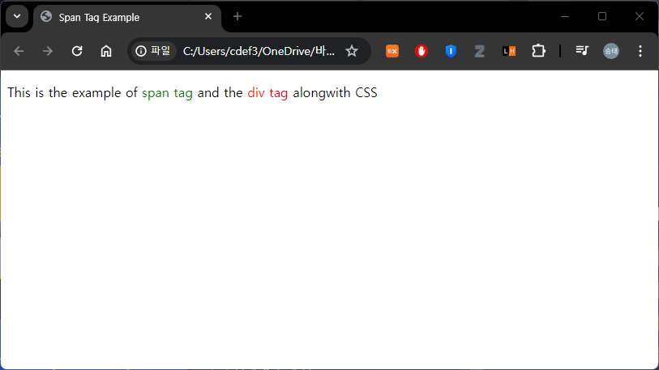

# HTML 기초

## 목차
- [HTML 기초](#html-기초)
  - [목차](#목차)
  - [Overview](#overview)
    - [Basic HTML Document](#basic-html-document)
    - [HTML Tags](#html-tags)
    - [HTML Document Structure](#html-document-structure)
    - [The \<!DOCTYPE\> Declaration](#the-doctype-declaration)
  - [Basic Tags](#basic-tags)
    - [Heading Tags](#heading-tags)
    - [Paragraph Tag](#paragraph-tag)
    - [Line Break Tag](#line-break-tag)
    - [Centering Content](#centering-content)
    - [Horizontal Lines](#horizontal-lines)
    - [Preserve Formatting](#preserve-formatting)
    - [Nonbreaking Spaces](#nonbreaking-spaces)
  - [Elements](#elements)
    - [HTML Tag vs. Element](#html-tag-vs-element)
    - [Nested HTML Elements](#nested-html-elements)
  - [Attributes](#attributes)
    - [Core Attributes](#core-attributes)
      - [The Id Attribute](#the-id-attribute)
      - [The title Attribute](#the-title-attribute)
      - [The class Attribute](#the-class-attribute)
    - [The style Attribute](#the-style-attribute)
    - [Internationalization Attributes](#internationalization-attributes)
      - [The dir Attribute](#the-dir-attribute)
      - [The lang Attribute](#the-lang-attribute)
      - [The xml:lang Attribute](#the-xmllang-attribute)
    - [Generic Attributes](#generic-attributes)
  - [Formatting](#formatting)
  - [Grouping Content](#grouping-content)
  - [Phrase Tags](#phrase-tags)
  - [Meta Tags](#meta-tags)
  - [출처](#출처)
  - [다음](#다음)

---
## Overview

HTML은 Hypertext Markup Language의 약자로 웹 페이지 작성에 가장 널리 사용되는 언어입니다.

 - 하이퍼텍스트는 웹 페이지(HTML 문서)가 서로 연결되는 방식을 나타냅니다. 따라서 웹페이지에서 사용할 수 있는 링크를 하이퍼텍스트라고 합니다.
 - 이름에서 알 수 있듯이 HTML은 HTML을 사용하여 웹 브라우저에 표시할 구조를 지정하는 태그를 사용하여 텍스트 문서를 간단히 "마크업"하는 것을 의미하는 마크업 언어입니다.

원래 HTML은 연구자 간의 과학 정보 공유를 용이하게 하기 위해 제목, 단락, 목록 등과 같은 문서의 구조를 정의하려는 목적으로 개발되었습니다.

이제 HTML은 HTML 언어에서 사용할 수 있는 다양한 태그의 도움으로 웹 페이지 형식을 지정하는 데 널리 사용되고 있습니다.

### Basic HTML Document

다음은 가장 간단한 HTML 문서의 예입니다.

```html
<!DOCTYPE html>
<html>

   <head>
      <title>This is document title</title>
   </head>
	
   <body>
      <h1>This is a heading</h1>
      <p>Document content goes here.....</p>
   </body>
	
</html>
```


### HTML Tags

앞서 말했듯이 HTML은 마크업 언어이며 다양한 태그를 사용하여 콘텐츠 형식을 지정합니다. 이러한 태그는 `<Tag Name>` 괄호로 묶여 있습니다. 소수의 태그를 제외하고 대부분의 태그에는 해당하는 닫는 태그가 있습니다. 예를 들어 `<html>`에는 닫는 태그 `</html>`가 있고 `<body>` 태그에는 닫는 태그 `</body>` 태그가 있습니다.

위의 HTML 문서 예에서는 다음 태그를 사용합니다.

| Sr.No | Tag & Description  |
|-------|--------------------|
| 1     | `<!DOCTYPE...>`<br>이 태그는 문서 유형과 HTML 버전을 정의합니다.      |
| 2     | `<html>`<br>이 태그는 전체 HTML 문서를 포함하며 주로 `<head>...</head>`로 표시되는 문서 헤더와 `<body>...</body>` 태그로 표시되는 문서 본문으로 구성됩니다.             |
| 3     | `<head>`<br>이 태그는 `<title>`, `<link>` 등과 같은 다른 HTML 태그를 포함할 수 있는 문서의 헤더를 나타냅니다.             |
| 4     | `<title>`<br>`<title>` 태그는 문서 제목을 언급하기 위해 `<head>` 태그 내부에 사용됩니다.            |
| 5     | `<body>`<br>이 태그는 `<h1>`, `<div>`, `<p>` 등과 같은 다른 HTML 태그를 포함하는 문서의 본문을 나타냅니다.             |
| 6     | `<h1>`<br>이 태그는 제목을 나타냅니다. |
| 7     | `<p>`<br>이 태그는 단락을 나타냅니다. |

HTML을 배우려면 다양한 태그를 연구하고 텍스트 문서의 형식을 지정하면서 태그가 어떻게 작동하는지 이해해야 합니다. 

아름다운 웹페이지를 만들기 위해 텍스트나 이미지의 형식을 지정하려면 사용자가 다양한 태그의 사용법을 배워야 하기 때문에 HTML을 배우는 것은 간단합니다.

### HTML Document Structure

일반적인 HTML 문서의 구조는 다음과 같습니다.

```html
<html>
   
   <head>
      Document header related tags
   </head>
   
   <body>
      Document body related tags
   </body>
   
</html>
```

### The <!DOCTYPE> Declaration

<!DOCTYPE> 선언 태그는 웹 브라우저에서 문서에 사용된 HTML 버전을 이해하는 데 사용됩니다.

`<!DOCTYPE HTML>`

사용되는 HTML 버전에 따라 HTML 문서에서 사용할 수 있는 다른 선언 유형이 많이 있습니다. 이에 대한 자세한 내용은 다른 HTML 태그와 함께 `<!DOCTYPE...>` 태그를 논의하면서 살펴보겠습니다.

---
## Basic Tags

### Heading Tags

모든 문서는 제목으로 시작됩니다. 제목에 다양한 크기를 사용할 수 있습니다. HTML에는 `<h1>`, `<h2>`, `<h3>`, `<h4>`, `<h5>` 및 `<h6>` 요소를 사용하는 6가지 수준의 제목도 있습니다. 제목을 표시하는 동안 브라우저는 해당 제목 앞과 뒤에 한 줄을 추가합니다.

```html
<!DOCTYPE html>
<html>

   <head>
      <title>Heading Example</title>
   </head>
	
   <body>
      <h1>This is heading 1</h1>
      <h2>This is heading 2</h2>
      <h3>This is heading 3</h3>
      <h4>This is heading 4</h4>
      <h5>This is heading 5</h5>
      <h6>This is heading 6</h6>
   </body>
	
</html>
```


### Paragraph Tag

`<p>` 태그는 텍스트를 여러 단락으로 구성하는 방법을 제공합니다. 텍스트의 각 단락은 아래 예에 표시된 대로 여는 `<p>` 태그와 닫는 `</p>` 태그 사이에 들어가야 합니다.

```html
<!DOCTYPE html>
<html>

   <head>
      <title>Paragraph Example</title>
   </head>
	
   <body>
      <p>Here is a first paragraph of text.</p>
      <p>Here is a second paragraph of text.</p>
      <p>Here is a third paragraph of text.</p>
   </body>
	
</html>
```


### Line Break Tag

`<br />` 요소를 사용할 때마다 그 뒤에 오는 모든 내용은 다음 줄에서 시작됩니다. 이 태그는 여는 태그와 닫는 태그 사이에 들어갈 내용이 없으므로 필요하지 않은 빈 요소 의 예입니다 .

`<br />` 태그에는 br 문자 와 슬래시 사이에 공백이 있습니다. 이 공백을 생략하면 이전 브라우저에서 줄 바꿈을 렌더링하는 데 문제가 발생하는 반면, 슬래시 문자를 놓치고 `<br>`만 사용하면 XHTML에서는 유효하지 않습니다.

```html
<!DOCTYPE html>
<html>

   <head>
      <title>Line Break  Example</title>
   </head>
	
   <body>
      <p>Hello<br />
         You delivered your assignment ontime.<br />
         Thanks<br />
         Mahnaz</p>
   </body>
	
</html>
```


### Centering Content

`<center>` 태그를 사용하면 페이지나 테이블 셀 중앙에 콘텐츠를 배치할 수 있습니다.

```html
<!DOCTYPE html>
<html>

   <head>
      <title>Centring Content Example</title>
   </head>
	
   <body>
      <p>This text is not in the center.</p>
      
      <center>
         <p>This text is in the center.</p>
      </center>
   </body>
	
</html>
```


### Horizontal Lines

수평선은 문서의 섹션을 시각적으로 구분하는 데 사용됩니다. `<hr>` 태그 는 문서의 현재 위치에서 오른쪽 여백까지 줄을 만들고 그에 따라 줄을 바꿉니다.

예를 들어, 아래 주어진 예와 같이 두 단락 사이에 줄을 추가할 수 있습니다.

```html
<!DOCTYPE html>
<html>

   <head>
      <title>Horizontal Line Example</title>
   </head>
	
   <body>
      <p>This is paragraph one and should be on top</p>
      <hr />
      <p>This is paragraph two and should be at bottom</p>
   </body>
	
</html>
```


다시 `<hr />` 태그는 여는 태그와 닫는 태그가 필요하지 않은 빈 요소 의 예입니다 . 그 사이에 들어갈 항목이 없기 때문입니다.

`<hr />` 요소 에는 hr 문자 와 슬래시 사이에 공백이 있습니다 . 이 공백을 생략하면 이전 브라우저에서 수평선을 렌더링하는 데 문제가 발생합니다. 반면 슬래시 문자를 놓치고 `<hr>` 만 사용하면 XHTML에서는 유효하지 않습니다.

### Preserve Formatting

때로는 텍스트가 HTML 문서에 작성된 것과 동일한 형식을 따르기를 원할 수도 있습니다. 이러한 경우 미리 형식화된 태그 `<pre>` 를 사용할 수 있습니다 .

여는 `<pre>` 태그와 닫는 `</pre>` 태그 사이의 모든 텍스트는 소스 문서의 서식을 유지합니다.

```html
<!DOCTYPE html>
<html>

   <head>
      <title>Preserve Formatting Example</title>
   </head>
	
   <body>
      <pre>
         function testFunction( strText ){
            alert (strText)
         }
      </pre>
   </body>
	
</html>
```


### Nonbreaking Spaces

"12 Angry Men."라는 문구를 사용한다고 가정해 보겠습니다. 여기서는 브라우저가 "12, Angry"와 "Men"을 두 줄로 나누는 것을 원하지 않을 것입니다.

클라이언트 브라우저가 텍스트를 나누는 것을 원하지 않는 경우에는 일반 공간 대신 nonbreaking space entity `&nbsp;` 를 사용해야 합니다. 예를 들어, 단락에서 "12 Angry Men."를 코딩할 때 다음 코드와 유사한 것을 사용해야 합니다.

```html
<!DOCTYPE html>
<html>

   <head>
      <title>Nonbreaking Spaces Example</title>
   </head>
	
   <body>
      <p>An example of this technique appears in the movie "12&nbsp;Angry&nbsp;Men."</p>
   </body>
	
</html>
```


---
## Elements

HTML 요소는 시작 태그로 정의됩니다. 요소에 다른 콘텐츠가 포함되어 있으면 닫는 태그로 끝나며, 요소 이름 앞에는 슬래시가 붙습니다. 아래에 표시된 대로 몇 개의 태그가 있습니다.

| 시작 태그  | 콘텐츠       | 종료 태그   |
|--------|-----------|---------|
| `<p>`    | 단락 내용입니다. | `</p>`    |
| `<h1>`   | 제목 내용입니다. | `</h1>`   |
| `<div>`  | 분할 내용입니다. | `</div>`  |
| `<br />` |           |         |

따라서 여기서 `<p>....</p>` 는 HTML 요소이고, `<h1>...</h1>` 은 또 다른 HTML 요소입니다. `` , `<hr />` 및 `<br />` 요소 와 같이 닫을 필요가 없는 일부 HTML 요소가 있습니다 . 이를 보이드 요소 라고 합니다 .

HTML 문서는 이러한 요소의 트리로 구성되며 HTML 문서를 작성하는 방법과 HTML 문서의 어느 부분에 어떤 종류의 콘텐츠를 배치해야 하는지를 지정합니다.

### HTML Tag vs. Element

HTML 요소는 시작 태그 로 정의됩니다 . 요소에 다른 콘텐츠가 포함되어 있으면 닫는 태그 로 끝납니다 .

예를 들어 `<p>` 는 단락의 시작 태그이고 `</p>` 는 같은 단락의 닫는 태그이지만 `<p>이것은 단락입니다</p>` 는 단락 요소입니다.

### Nested HTML Elements

하나의 HTML 요소가 다른 HTML 요소를 포함하는 것이 가능합니다.

```html
<!DOCTYPE html>
<html>

   <head>
      <title>Nested Elements Example</title>
   </head>
	
   <body>
      <h1>This is <i>italic</i> heading</h1>
      <p>This is <u>underlined</u> paragraph</p>
   </body>
	
</html>
```


---
## Attributes

우리는 제목 태그 `<h1>`, `<h2>`, 단락 태그 `<p>` 와 같은 HTML 태그와 그 사용법을 일부 보았습니다. 지금까지는 가장 간단한 형태로 사용했지만 대부분의 HTML 태그에는 추가 정보인 속성도 있을 수 있습니다.

속성은 HTML 요소의 특성을 정의하는 데 사용되며 요소의 여는 태그 안에 배치됩니다. 모든 속성은 이름 과 값이라는 두 부분으로 구성됩니다.

 - 이름 은 설정하려는 속성입니다. 예를 들어, 예제의 단락 `<p>` 요소는 이름이 align 인 속성을 전달하며 , 이를 사용하여 페이지에서 단락 정렬을 나타낼 수 있습니다.
 - 값 은 속성 값을 설정려는 값입니다. 항상 따움표 안에 들어가야 합니다. 아래 예에서는 align 속성의 가능한 세 가지 값인 left, center 및 right 를 보여줍니다.

속성 이름과 속성 값은 대소문자를 구분하지 않습니다

```html
<!DOCTYPE html> 
<html>
 
   <head> 
      <title>Align Attribute  Example</title> 
   </head>
	
   <body> 
      <p align = "left">This is left aligned</p> 
      <p align = "center">This is center aligned</p> 
      <p align = "right">This is right aligned</p> 
   </body>
	
</html>
```


### Core Attributes

Here is the translation of the provided paragraph into Korean:

HTML 요소 대부분(모두는 아니지만)에 사용할 수 있는 네 가지 핵심 속성은 다음과 같습니다 −

 - 아이디 (Id)
 - 제목 (Title)
 - 클래스 (Class)
 - 스타일 (Style)

#### The Id Attribute

HTML 태그의 id 속성은 HTML 페이지 내의 요소를 고유하게 식별하는 데 사용할 수 있습니다. 요소에 id 속성을 사용하려는 주된 이유는 두 가지가 있습니다 −

 - 요소가 고유 식별자로 id 속성을 가지면, 해당 요소와 그 내용을 식별할 수 있습니다.
 - 웹 페이지(또는 스타일 시트) 내에서 동일한 이름의 두 요소가 있을 경우, id 속성을 사용하여 동일한 이름을 가진 요소들을 구별할 수 있습니다.

스타일 시트에 대해서는 별도의 강좌에서 다룰 예정입니다. 지금은 아래와 같이 두 개의 단락 요소를 구별하기 위해 id 속성을 사용하는 방법을 알아봅시다.

```html
<p id = "html">This para explains what is HTML</p>
<p id = "css">This para explains what is Cascading Style Sheet</p>
```

#### The title Attribute

title 속성은 요소에 제안된 제목을 제공합니다. title 속성의 문법은 id 속성에서 설명한 것과 유사합니다 −

이 속성의 동작은 이를 포함한 요소에 따라 다르지만, 종종 커서가 요소 위로 올려지거나 요소가 로딩되는 동안 툴팁으로 표시됩니다.

```html
<!DOCTYPE html>
<html>

   <head>
      <title>The title Attribute Example</title>
   </head>
	
   <body>
      <h3 title = "Hello HTML!">Titled Heading Tag Example</h3>
   </body>
	
</html>
```


#### The class Attribute

클래스 속성은 요소를 스타일 시트와 연관시키고 요소의 클래스를 지정하는 데 사용됩니다. 클래스 속성의 사용에 대해서는 캐스케이딩 스타일 시트(CSS)를 배울 때 더 자세히 알아볼 것입니다. 따라서 지금은 이를 피할 수 있습니다.

속성의 값은 공백으로 구분된 클래스 이름 목록일 수도 있습니다.

```
class = "className1 className2 className3"
```

### The style Attribute

style 속성은 요소 내에서 캐스케이딩 스타일 시트(CSS) 규칙을 지정할 수 있게 해줍니다.

```html
<!DOCTYPE html>
<html>

   <head>
      <title>The style Attribute</title>
   </head>
	
   <body>
      <p style = "font-family:arial; color:#FF0000;">Some text...</p>
   </body>
	
</html>
```


### Internationalization Attributes

대부분의 (모두는 아니지만) XHTML 요소에 사용할 수 있는 세 가지 국제화 속성이 있습니다.

 - dir
 - lang
 - xml

#### The dir Attribute

dir 속성은 텍스트가 흐르는 방향을 브라우저에 표시할 수 있게 해줍니다. dir 속성은 다음 표에서 볼 수 있듯이 두 가지 값 중 하나를 가질 수 있습니다 −

| Value | Meaning                                                                            |
|-------|------------------------------------------------------------------------------------|
| ltr   | Left to right (the default value)                                                  |
| rtl   | Right to left (for languages such as Hebrew or Arabic that are read right to left) |

```html
<!DOCTYPE html>
<html dir = "rtl">

   <head>
      <title>Display Directions</title>
   </head>
	
   <body>
      This is how IE 5 renders right-to-left directed text.
   </body>
	
</html>
```


dir 속성이 `<html>` 태그 내에서 사용될 때, 문서 전체에서 텍스트가 어떻게 표시될지를 결정합니다. 다른 태그 내에서 사용될 때는, 해당 태그의 내용에 대해서만 텍스트의 방향을 제어합니다.

#### The lang Attribute

lang 속성은 문서에서 사용된 주요 언어를 표시할 수 있게 해줍니다. 그러나 이 속성은 이전 버전의 HTML과의 하위 호환성을 위해 HTML에만 유지되었습니다. 이 속성은 새로운 XHTML 문서에서는 xml:lang 속성으로 대체되었습니다.

lang 속성의 값은 ISO-639 표준 두 글자 언어 코드입니다. 전체 언어 코드 목록은 HTML 언어 코드: ISO 639를 참조하십시오.

```html
<!DOCTYPE html>
<html lang = "en">

   <head>
      <title>English Language Page</title>
   </head>

   <body>
      This page is using English Language
   </body>

</html>
```


#### The xml:lang Attribute

xml:lang 속성은 lang 속성을 대체하는 XHTML 속성입니다. xml:lang 속성의 값은 이전 섹션에서 언급한 ISO-639 국가 코드여야 합니다.

### Generic Attributes

다음은 많은 HTML 태그에서 쉽게 사용할 수 있는 기타 속성들의 표입니다.

| Attribute  | Options                          | Function                                                    |
|------------|----------------------------------|-------------------------------------------------------------|
| align      | right, left, center              | Horizontally aligns tags                                    |
| valign     | top, middle, bottom              | Vertically aligns tags within an HTML element.              |
| bgcolor    | numeric, hexidecimal, RGB values | Places a background color behind an element                 |
| background | URL                              | Places a background image behind an element                 |
| id         | User Defined                     | Names an element for use with Cascading Style Sheets.       |
| class      | User Defined                     | Classifies an element for use with Cascading Style Sheets.  |
| width      | Numeric Value                    | Specifies the width of tables, images, or table cells.      |
| height     | Numeric Value                    | Specifies the height of tables, images, or table cells.     |
| title      | User Defined                     | "Pop-up" title of the elements.                             |

---
## Formatting

```html
<!DOCTYPE html>
<html>

   <head>
      <title>Formatting Example</title>
   </head>
	
   <body>
      <p>The following word uses a <b>bold</b> typeface.</p>
      <p>The following word uses an <i>italicized</i> typeface.</p>
      <p>The following word uses an <u>underlined</u> typeface.</p>
      <p>The following word uses a <strike>strikethrough</strike> typeface.</p>
      <p>The following word uses a <tt>monospaced</tt> typeface.</p>
      <p>The following word uses a <sup>superscript</sup> typeface.</p>
      <p>The following word uses a <sub>subscript</sub> typeface.</p>
      <p>I want to drink <del>cola</del> <ins>wine</ins></p>
      <p>The following word uses a <big>big</big> typeface.</p>
      <p>The following word uses a <small>small</small> typeface.</p>
   </body>
	
</html>
```


---
## Grouping Content

`<div>` 및 `<span>` 요소는 여러 요소를 그룹화하여 페이지의 섹션이나 하위 섹션을 만들 수 있게 해줍니다.

예를 들어, 페이지의 모든 각주를 `<div>` 요소 내에 넣어, 해당 `<div>` 요소 내의 모든 요소가 각주와 관련이 있음을 나타낼 수 있습니다. 그런 다음 이 `<div>` 요소에 스타일을 첨부하여 특별한 스타일 규칙 세트를 사용하여 표시되도록 할 수 있습니다.

```html
<!DOCTYPE html>
<html>

   <head>
      <title>Div Tag Example</title>
   </head>
	
   <body>
      <div id = "menu" align = "middle" >
         <a href = "/index.htm">HOME</a> | 
         <a href = "/about/contact_us.htm">CONTACT</a> | 
         <a href = "/about/index.htm">ABOUT</a>
      </div>

      <div id = "content" align = "left" >
         <h5>Content Articles</h5>
         <p>Actual content goes here.....</p>
      </div>
   </body>
	
</html>
```


반면에 `<span>` 요소는 인라인 요소만 그룹화하는 데 사용할 수 있습니다. 따라서 문장이나 단락의 일부를 그룹화하고 싶다면, 다음과 같이 `<span>` 요소를 사용할 수 있습니다.

```html
<!DOCTYPE html>
<html>

   <head>
      <title>Span Tag Example</title>
   </head>
	
   <body>
      <p>This is the example of <span style = "color:green">span tag</span>
         and the <span style = "color:red">div tag</span> alongwith CSS</p>
   </body>
	
</html>
```



---
## Phrase Tags

구문 태그는 특정 목적을 위해 설계되었지만, 이전 장에서 보았던 `<b>`, `<i>`, `<pre>`, `<tt>`와 같은 다른 기본 태그와 유사한 방식으로 표시됩니다. 이번 장에서는 중요한 구문 태그들을 하나씩 살펴보겠습니다.

 - `<em>...</em>` 요소 내에 나타나는 모든 내용은 강조된 텍스트로 표시됩니다.
 - `<mark>...</mark>` 요소 내에 나타나는 모든 내용은 노란 잉크로 표시됩니다.
 - `<strong>...</strong>` 요소 내에 나타나는 모든 내용은 중요한 텍스트로 표시됩니다.
 - 텍스트를 줄이고자 할 때는 `<abbr>` 시작 태그와 종료 태그 `</abbr>` 사이에 넣습니다. 제목 속성이 있다면, 반드시 이 전체 설명만을 포함해야 합니다.
 - `<acronym>` 요소는 `<acronym>`과 `</acronym>` 태그 사이의 텍스트가 약어임을 표시합니다.
 - `<bdo>...</bdo>` 요소는 양방향 오버라이드를 의미하며, 현재 텍스트 방향을 무시하는 데 사용됩니다.
 - `<dfn>...</dfn>` 요소(또는 HTML 정의 요소)는 특별한 용어를 도입하고 있음을 지정할 수 있게 해줍니다. 이는 단락 중간에 기울임꼴 단어를 사용하는 것과 유사합니다.
   - 일반적으로 키 용어를 처음 도입할 때 `<dfn>` 요소를 사용합니다. 최신 브라우저 대부분은 `<dfn>` 요소의 내용을 기울임꼴로 렌더링합니다.
 - 다른 출처에서 인용한 구절을 인용하고자 할 때는 `<blockquote>...</blockquote>` 태그 사이에 넣어야 합니다.
   - `<blockquote>` 요소 내의 텍스트는 보통 주변 텍스트의 왼쪽 및 오른쪽 가장자리에서 들여쓰기 되며, 때때로 기울임꼴 글꼴을 사용합니다.
 - 문장 내에 큰따옴표를 추가하고자 할 때는 `<q>...</q>` 요소를 사용합니다.
 - 텍스트를 인용할 때, 출처를 `<cite>` 시작 태그와 종료 태그 `</cite>` 사이에 넣어 표시할 수 있습니다.
   - 인쇄 출판물에서 기대할 수 있듯이, `<cite>` 요소의 내용은 기본적으로 기울임꼴 텍스트로 렌더링됩니다.
 - 웹 페이지에 프로그래밍 코드를 표시하고자 할 때는 `<code>...</code>` 태그 내에 넣어야 합니다. 일반적으로 `<code>` 요소의 내용은 대부분의 프로그래밍 책에서와 같이 고정폭 글꼴로 표시됩니다.
 - 컴퓨터에 대해 이야기할 때, 독자에게 텍스트를 입력하라고 지시하고자 할 경우, `<kbd>...</kbd>` 요소를 사용하여 입력해야 할 내용을 표시할 수 있습니다.
 - `<var>...</var>` 요소는 보통 `<pre>` 및 `<code>` 요소와 함께 사용되어 해당 요소의 내용이 변수임을 나타냅니다.
 - `<samp>...</samp>` 요소는 프로그램, 스크립트 등의 샘플 출력을 나타냅니다. 이 요소는 주로 프로그래밍 또는 코딩 개념을 문서화할 때 사용됩니다.
` - <address>...</address>` 요소는 주소를 포함하는 데 사용됩니다.

```html
<!DOCTYPE html>
<html>

   <head>
      <title>Phrase Tags Example</title>
   </head>
	
   <body>
      <p>The following word uses an <em>emphasized</em> typeface.</p>
      <p>The following word has been <mark>marked</mark> with yellow</p>
      <p>The following word uses a <strong>strong</strong> typeface.</p>
      <p>My best friend's name is  <abbr title = "Abhishek">Abhy</abbr>.</p>
      <p>This chapter covers marking up text in <acronym>XHTML</acronym>.</p>
      <p><bdo dir = "rtl">This text will go right to left.</bdo></p>
      <p>The following word is a <dfn>special</dfn> term.</p>
      <blockquote>XHTML 1.0 is the W3C's first Recommendation for XHTML,following on 
         from earlier work on HTML 4.01, HTML 4.0, HTML 3.2 and HTML 2.0.</blockquote>
      <p>Amit is in Spain, <q>I think I am wrong</q>.</p>
      <p>This HTML tutorial is derived from <cite>W3 Standard for HTML</cite>.</p>
      <p>Regular text. <code>This is code.</code> Regular text.</p>
      <p>Regular text. <kbd>This is inside kbd element</kbd> Regular text.</p>
      <p><code>document.write("<var>user-name</var>")</code></p>
      <p>Result produced by the program is <samp>Hello World!</samp></p>
      <address>388A, Road No 22, Jubilee Hills -  Hyderabad</address>
   </body>
</html>
```


---
## Meta Tags

---
## 출처
 - [Tutorialspoint HTML - Quick Guide](https://www.tutorialspoint.com/html/html_quick_guide.htm)
---
## [다음](./05_CSS_기초.md)


