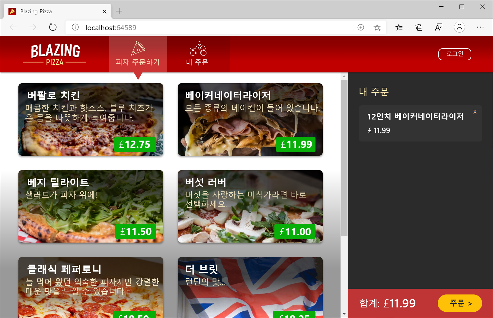

# Blazor를 사용한 웹 개발 소개

## 목차
- [Blazor를 사용한 웹 개발 소개](#blazor를-사용한-웹-개발-소개)
  - [목차](#목차)
  - [소개](#소개)
    - [시나리오](#시나리오)
  - [Blazor란?](#blazor란)
  - [Blazor 작동 방식](#blazor-작동-방식)
    - [Blazor 구성 요소](#blazor-구성-요소)
    - [표준 웹 기술 사용](#표준-웹-기술-사용)
    - [UI 이벤트 처리 및 데이터 바인딩](#ui-이벤트-처리-및-데이터-바인딩)
    - [서버 및 클라이언트 쪽 렌더링](#서버-및-클라이언트-쪽-렌더링)
    - [Blazor를 사용하여 피자 가게 만들기](#blazor를-사용하여-피자-가게-만들기)
  - [Blazor를 사용해야 하는 경우](#blazor를-사용해야-하는-경우)
  - [요약](#요약)
    - [참조](#참조)
  - [출처](#출처)
  - [다음](#다음)

---
## 소개

웹앱을 빌드하는 작업은 복잡할 수 있습니다. 웹 개발 프로젝트에 적합한 웹 프레임워크를 선택하는 것은 중요한 첫 번째 단계입니다. Blazor는 웹앱을 더 쉽고 생산적인 빌드를 가능하게 하는 .NET의 견고한 기반을 기반으로 하는 완전한 프런트 엔드 웹 프레임워크입니다.

이 모듈에서는 Blazor가 무엇이며 유연한 구성 요소 모델을 통해 빠르고 풍부한 대화형 웹앱을 쉽게 빌드할 수 있는 방법을 알아봅니다.

### 시나리오

고객이 신선한 피자 스페셜 컬렉션에서 쉽게 선택한 다음 피자 주문을 사용자 지정할 수 있도록 피자 가게에 대한 새로운 웹앱을 출시할 준비를 하고 있다고 상상해 보십시오. 고객은 주문을 제출하고 피자 배달을 추적하기 위한 명확한 경로를 가지고 있어야 합니다. 고객을 위한 훌륭한 사용자 환경을 구축하는 데 도움이 되는 웹앱을 빌드하기 위한 웹 프레임워크를 선택하려고 합니다.



---
## Blazor란?

Blazor는 웹앱을 더 빠르게 빌드하는 데 도움이 되는 HTML, CSS 및 C#을 기반으로 하는 최신 프런트 엔드 웹 프레임워크입니다. Blazor를 사용하면 클라이언트와 서버 모두에서 실행할 수 있는 재사용 가능한 구성 요소를 사용하여 웹앱을 빌드하여 뛰어난 웹 환경을 제공할 수 있습니다. Blazor는 무엇이든 빌드하기 위한 개발자 플랫폼인 .NET의 일부입니다. .NET은 무료 오픈 소스이며 플랫폼 간을 실행합니다.

Blazor 사용의 이점은 다음과 같습니다.

 - 재사용 가능한 구성 요소를 사용하여 웹 UI를 빠르게 빌드: Blazor의 유연한 구성 요소 모델을 사용하면 앱을 빠르게 어셈블하는 데 사용할 수 있는 재사용 가능한 구성 요소를 쉽게 빌드할 수 있습니다.
 - C#에서 다양한 대화형 작업 추가: 브라우저에서 임의의 UI 이벤트를 처리하고 학습하기 쉽고 매우 다양한 최신 형식 안전 언어인 C#으로 구성 요소 논리를 구현합니다.
 - 하나의 개발 스택: 단일 개발 스택을 사용하여 프런트 엔드에서 백 엔드로 전체 웹앱을 빌드하고 클라이언트 및 서버의 공통 논리에 대한 코드를 공유합니다.
 - 효율적인 차이 기반 렌더링: 구성 요소가 렌더링될 때 Blazor는 UI 업데이트가 빠르고 효율적으로 변경된 DOM 부분을 신중하게 추적합니다.
 - 서버 및 클라이언트 쪽 렌더링: 서버와 클라이언트 모두에서 구성 요소를 렌더링하여 다양한 웹앱 아키텍처를 구현하고 최상의 웹앱 환경을 제공합니다.
 - 점진적으로 향상된 서버 렌더링: 향상된 탐색 및 양식 처리 및 스트리밍 렌더링에 대한 기본 제공 지원을 사용하여 서버 렌더링 웹앱의 사용자 환경을 점진적으로 향상시킵니다.
 - JavaScript와의 Interop: C# 코드에서 JavaScript 라이브러리 및 브라우저 API의 에코시스템을 사용합니다.
 - 기존 앱과 통합: Blazor 구성 요소를 기존 MVC, Razor Pages 또는 JavaScript 기반 앱과 통합합니다.
 - 유용한 도구: Visual Studio 또는 Visual Studio Code를 사용하여 몇 초 안에 시작하고 훌륭한 코드 편집 지원을 통해 생산성을 유지할 수 있습니다.
 - 웹, 모바일 및 데스크톱: Blazor 구성 요소를 사용하여 Blazor Hybrid라는 네이티브 및 웹 하이브리드를 사용하여 네이티브 모바일 및 데스크톱 앱을 빌드할 수도 있습니다.

---
## Blazor 작동 방식

Blazor는 다음 웹앱 프로젝트를 빠르게 시작하고 제공하는 데 도움이 되는 많은 기능을 제공합니다. Blazor의 핵심 기능을 둘러보고 다음 멋진 웹앱에 Blazor를 사용해야 하는지 여부를 결정해 보겠습니다.

### Blazor 구성 요소

Blazor 앱은 구성 요소에서 빌드됩니다. Blazor 구성 요소는 재사용 가능한 웹 UI 조각입니다. Blazor 구성 요소는 렌더링 및 UI 이벤트 처리 논리를 모두 캡슐화합니다. Blazor에는 양식 처리, 사용자 입력 유효성 검사, 대용량 데이터 집합 표시, 인증 및 권한 부여를 위한 다양한 기본 제공 구성 요소가 포함되어 있습니다. 개발자는 자체 사용자 지정 구성 요소를 빌드하고 공유할 수도 있으며, Blazor 에코시스템에서 미리 빌드된 많은 Blazor 구성 요소를 사용할 수 있습니다.

### 표준 웹 기술 사용

HTML, CSS 및 C#을 편리하게 혼합한 Razor 구문을 사용하여 Blazor 구성 요소를 작성합니다. Razor 파일에는 조건부, 제어 흐름 및 식 평가와 같은 렌더링 논리를 정의하는 일반 HTML 및 C#이 포함되어 있습니다. 그런 다음 Razor 파일은 구성 요소의 렌더링 논리를 캡슐화하는 C# 클래스로 컴파일됩니다. Razor에서 작성된 Blazor 구성 요소는 C# 클래스일 뿐이므로 구성 요소에서 임의의 .NET 코드를 호출할 수 있습니다.

### UI 이벤트 처리 및 데이터 바인딩

대화형 Blazor 구성 요소는 C# 이벤트 처리기를 사용하여 표준 웹 UI 상호 작용을 처리할 수 있습니다. 구성 요소는 UI 이벤트에 대한 응답으로 상태를 업데이트하고 그에 따라 렌더링을 조정할 수 있습니다. Blazor에는 구성 요소 상태를 UI 요소와 동기화된 상태로 유지하는 방법으로 UI 요소에 대한 양방향 데이터 바인딩도 지원됩니다.

다음은 Razor에서 구현된 간단한 Blazor 카운터 구성 요소의 예입니다. 대부분의 콘텐츠는 HTML이지만 블록에는 <code>@code</code> C#이 포함됩니다. 단추를 누를 <code>IncrementCount</code> 때마다 C# 메서드가 호출되어 필드가 증가 <code>currentCount</code> 한 다음 구성 요소가 업데이트된 값을 렌더링합니다.

```razor
<h1>Counter</h1>

<p role="status">Current count: @currentCount</p>

<button class="btn btn-primary" @onclick="IncrementCount">Click me</button>

@code {
    private int currentCount = 0;

    private void IncrementCount()
    {
        currentCount++;
    }
}
```

### 서버 및 클라이언트 쪽 렌더링

Blazor는 다양한 웹 UI 아키텍처를 처리하기 위해 구성 요소의 서버 및 클라이언트 쪽 렌더링을 모두 지원합니다. 서버에서 렌더링된 구성 요소는 데이터베이스 및 백 엔드 서비스와 같은 서버 리소스에 액세스할 수 있습니다. 기본적으로 Blazor 구성 요소는 서버에서 정적으로 렌더링되어 요청에 대한 응답으로 HTML을 생성합니다.

또한 서버 구성 요소를 대화형으로 구성하여 임의 UI 이벤트를 처리하고, 상호 작용 간에 상태를 기본, 동적으로 업데이트를 렌더링할 수 있습니다. 대화형 서버 구성 요소는 브라우저와의 WebSocket 연결을 통해 UI 상호 작용 및 업데이트를 처리합니다.


또는 Blazor 구성 요소를 클라이언트에서 대화형으로 렌더링할 수 있습니다. 구성 요소는 클라이언트에 다운로드되고 WebAssembly를 통해 브라우저에서 실행됩니다. 대화형 WebAssembly 구성 요소는 로컬 스토리지 및 하드웨어와 같은 웹 플랫폼을 통해 클라이언트 리소스에 액세스할 수 있으며 다운로드한 후에도 오프라인으로 작동할 수 있습니다.


동일한 앱 내에서 서버 또는 클라이언트에서 다른 구성 요소를 렌더링하도록 선택할 수 있습니다. 앱의 많은 페이지에는 상호 작용이 전혀 필요하지 않을 수 있으며 서버에서 정적으로 렌더링될 수 있지만 앱의 다른 대화형 부분은 서버 또는 클라이언트에서 처리할 수 있습니다. 디자인 타임 또는 런타임에 사용할 구성 요소 렌더링 모드를 결정할 수 있습니다. Blazor를 사용하면 시나리오에 적합한 웹앱 아키텍처를 유연하게 빌드할 수 있습니다.

### Blazor를 사용하여 피자 가게 만들기

피자 가게 앱의 UI는 탐색 모음이 있는 페이지 레이아웃, 개별 페이지, 피자 카탈로그 및 편집기, 주문 구성 요소 등 재사용 가능한 여러 구성 요소로 나뉩니다. Blazor는 양식 및 유효성 검사에 대한 구성 요소와 같은 많은 구성 요소에 대한 빌드 기능을 제공합니다. 앱의 많은 페이지는 정적 서버 쪽 렌더링을 사용하여 서버에서 처리할 수 있으므로 사이트는 대부분 상태 비 상태이며 크기를 조정할 준비가 되어 있습니다. 더 많은 대화형 작업이 필요한 경우 대화형 렌더링 모드를 적용하여 구성 요소가 대화형으로 만들어집니다. 서버에서 작업을 오프로드하기 위해 WebAssembly를 통해 대화형 구성 요소가 클라이언트에서 렌더링됩니다. 단일 웹 개발 스택으로 전체 앱을 빌드하면 앱이 빠르게 결합되고 곧 피자 주문이 유입됩니다.

---
## Blazor를 사용해야 하는 경우

Blazor는 최신 웹앱의 요구 사항을 처리하도록 설계된 완전한 기능을 갖춘 웹 UI 프레임워크입니다. 그러나 Blazor가 적합한 프레임워크인지 여부는 많은 요인에 따라 달라집니다.

다음과 같은 경우 웹 개발에 Blazor를 사용하는 것이 좋습니다.

 - 생산성이 높은 전체 스택 웹 개발 솔루션을 찾고 있습니다.
 - 별도의 프런트 엔드 개발 팀이 필요 없이 웹 환경을 신속하게 제공해야 합니다.
 - 이미 .NET을 사용하고 있으며 기존 .NET 기술 및 리소스를 웹에 적용하려고 합니다.
 - 웹앱에 전원을 공급하려면 고성능 및 확장성이 뛰어난 백 엔드가 필요합니다.

Blazor는 다음과 같은 경우 적합하지 않을 수 있습니다.

 - 클라이언트 쪽 자산의 다운로드 크기 및 로드 시간을 완전히 최적화해야 합니다.
 - 다른 프런트 엔드 프레임워크 에코시스템과 크게 통합해야 합니다.
 - 최신 웹 플랫폼을 지원하지 않는 이전 웹 브라우저를 지원해야 합니다.

---
## 요약

이 모듈에서는 Blazor가 HTML, CSS 및 C#을 기반으로 하는 최신 전체 스택 웹 UI 프레임워크임을 알아보았습니다. Blazor 앱은 서버 또는 클라이언트에서 실행할 수 있는 구성 요소로 구성된다는 것을 배웠습니다. 또한 다음 웹앱 프로젝트에 Blazor를 선택할지 여부를 결정하는 데 도움이 되는 몇 가지 기준을 알아보았습니다.

첫 번째 Blazor 웹앱을 빌드할 준비가 되셨나요? 다음 모듈을 계속 진행하여 시작합니다.

또한 Blazor에 대해 자세히 알아보려면 다음 추가 리소스를 검사.

### 참조
 - [Blazor 홈페이지](https://blazor.net/)
 - [Blazor 문서](https://learn.microsoft.com/ko-kr/aspnet/core/blazor)
 - [Blazor 고객 쇼케이스](https://dotnet.microsoft.com/platform/customers/blazor)

---
## 출처
[Microsoft learn Blazor를 사용하여 웹앱 빌드](https://learn.microsoft.com/ko-kr/training/paths/build-web-apps-with-blazor/)

---
## [다음](./02_Blazor를_사용하여_첫_번째_웹앱_빌드.md)