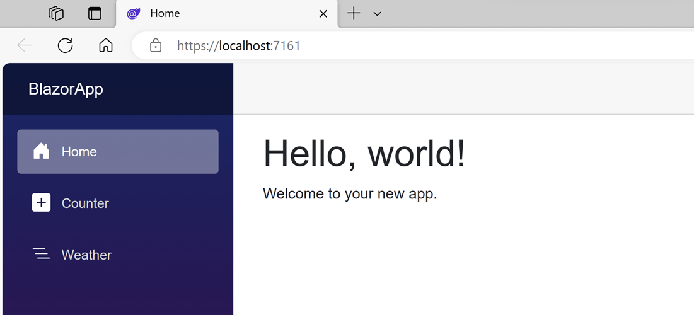
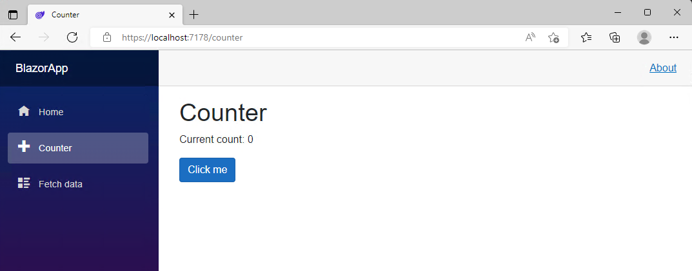
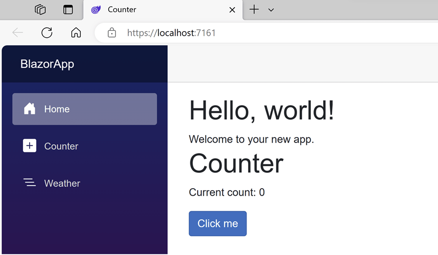
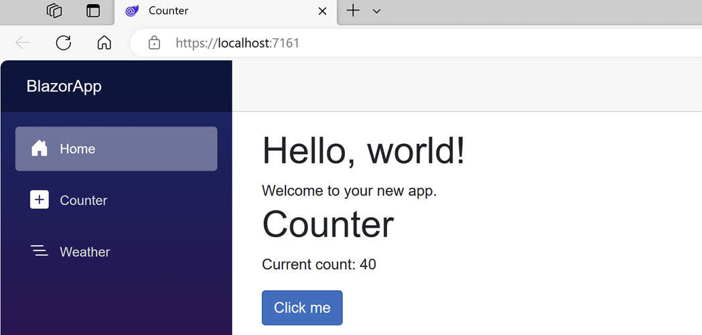

# Blazor를 사용하여 첫 번째 웹앱 빌드

## 목차
- [Blazor를 사용하여 첫 번째 웹앱 빌드](#blazor를-사용하여-첫-번째-웹앱-빌드)
  - [목차](#목차)
  - [소개](#소개)
  - [그럼 시작하겠습니다.](#그럼-시작하겠습니다)
  - [개발 환경 구성](#개발-환경-구성)
    - [.NET SDK 사용](#net-sdk-사용)
    - [Blazor 도구](#blazor-도구)
  - [연습 - Blazor 웹앱 만들기 및 실행](#연습---blazor-웹앱-만들기-및-실행)
    - [C# 개발 키트를 사용하여 새 Blazor 웹앱 만들기](#c-개발-키트를-사용하여-새-blazor-웹앱-만들기)
    - [선택 사항: .NET CLI를 사용하여 새 Blazor 앱 만들기](#선택-사항-net-cli를-사용하여-새-blazor-앱-만들기)
    - [통합 디버거를 사용하여 앱 실행](#통합-디버거를-사용하여-앱-실행)
    - [선택 사항: .NET CLI를 사용하여 앱 실행](#선택-사항-net-cli를-사용하여-앱-실행)
  - [Razor 구성 요소](#razor-구성-요소)
    - [홈페이지](#홈페이지)
    - [Razor란?](#razor란)
    - [Razor 구성 요소란?](#razor-구성-요소란)
    - [구성 요소 사용](#구성-요소-사용)
    - [구성 요소 매개 변수](#구성-요소-매개-변수)
    - [@code 블록](#code-블록)
    - [카운터 사용해 보기](#카운터-사용해-보기)
  - [연습 - 구성 요소 추가](#연습---구성-요소-추가)
    - [홈페이지에 카운터 구성 요소 추가](#홈페이지에-카운터-구성-요소-추가)
    - [구성 요소 수정](#구성-요소-수정)
  - [요약](#요약)
    - [자세한 정보](#자세한-정보)
  - [출처](#출처)
  - [다음](#다음)

---
## 소개

첫 번째 Blazor 웹앱을 빌드할 준비를 하세요! .NET 플랫폼의 성능과 유연성을 사용하여 웹 개발을 시작하려는 경우 올바른 위치에 있습니다. Blazor는 웹앱을 빠르게 빌드하는 데 도움이 되는 HTML, CSS 및 C#을 기반으로 하는 최신 프런트 엔드 웹 프레임워크입니다.

Blazor를 사용하여 빌드를 시작하려면 먼저 .NET SDK 및 기본 코드 편집기를 설치하여 개발 환경을 설정해야 합니다. 그런 다음 첫 번째 Blazor 웹앱 프로젝트를 만들고 Blazor 구성 요소 작업의 기본 사항을 알아볼 수 있습니다.

이 모듈에서는 .NET 개발 환경을 설정하고 몇 분 만에 첫 번째 Blazor를 만들고 실행하기 위해 알아야 할 모든 것을 알아봅니다. 구성 요소를 만들고 사용하는 방법, 구성 요소를 페이지로 전환하는 방법 및 기본 이벤트 처리 및 데이터 바인딩을 수행하는 방법을 알아봅니다. 그런 다음 학습한 모든 항목을 사용하여 기본 할 일 목록 앱을 빌드합니다.

이 모듈을 마치면 Blazor 개발 환경, Blazor 구성 요소에 대한 기본적인 이해, 직접 빌드한 실행 중인 Blazor 웹앱이 있어야 합니다.

그럼 시작하겠습니다.
---
## 개발 환경 구성
Blazor를 시작하려면 먼저 .NET SDK와 적절한 코드 편집기를 설치해야 합니다.

### .NET SDK 사용

.NET SDK는 [.NET 웹 사이트](https://dot.net/)에서 다운로드할 수 있습니다. .NET은 다양한 플랫폼 및 아키텍처에 대한 설치 관리자 및 설치 지침을 제공합니다. .NET SDK에는 .NET 프로젝트를 만들고, 빌드하고, 실행하고, 게시하고, 테스트하기 위한 .NET 런타임 및 도구가 포함되어 있습니다. .NET CLI(명령줄 인터페이스)를 사용하여 .NET SDK와 직접 상호 작용할 수 있습니다.

.NET SDK에는 다양한 종류의 .NET 프로젝트를 만들기 위한 템플릿이 포함되어 있습니다. 명령을 사용하여 새 프로젝트를 만듭니다 <code>dotnet new <template-name></code>. 예를 들어 새 Blazor 웹앱 프로젝트를 만들려면 실행할 <code>dotnet new blazor</code>수 있습니다. Visual Studio 및 Visual Studio Code와 같은 도구는 .NET SDK의 템플릿을 사용하여 .NET 프로젝트를 만들기 위한 편리한 사용자 인터페이스를 제공합니다.

새 .NET 프로젝트를 만든 후에는 명령 및 명령을 사용하여 <code>dotnet build</code> 프로젝트를 빌드하고 <code>dotnet run</code> 실행할 수 있습니다. 이 <code>dotnet watch</code> 명령을 사용하여 프로젝트를 빌드하고 실행한 다음, 코드 변경 내용이 만들어질 때 자동으로 적용할 수 있습니다. Visual Studio 및 Visual Studio Code 내에서 .NET 프로젝트를 실행하고 디버그할 수 있습니다.

### Blazor 도구

Blazor 도구는 Windows의 [Visual Studio](https://visualstudio.com/vs) 및 Windows, macOS 및 Linux에서 지원되는 [Visual Studio Code용 C# Dev Kit](https://marketplace.visualstudio.com/items?itemName=ms-dotnettools.csdevkit) 확장에서 사용할 수 있습니다. Windows의 Visual Studio는 완전히 통합된 IDE(개발 환경)이며, Visual Studio Code는 풍부한 확장 에코시스템을 갖춘 가벼운 코드 편집기입니다. 둘 다 학습 및 커뮤니티 사용에 사용할 수 있는 무료 옵션이 있습니다. Windows에 Visual Studio를 설치하면 자동으로 .NET SDK가 포함됩니다. .NET SDK는 현재 Visual Studio Code용 C# 개발 키트에 포함되지 않으며 별도로 설치해야 합니다.

---
## 연습 - Blazor 웹앱 만들기 및 실행

### C# 개발 키트를 사용하여 새 Blazor 웹앱 만들기

C# 개발 키트를 사용하여 Visual Studio Code에서 새 Blazor 웹앱 프로젝트를 만들려면 다음을 수행합니다.

1. Ctrl+Shift+P를 사용하여 명령 팔레트를 표시한 다음 ".NET"을 입력합니다.
2. .NET: 새 프로젝트 명령을 찾아 선택합니다.
3. 드롭다운 목록에서 Blazor 웹앱을 선택합니다.
4. 새 프로젝트를 만들 폴더를 선택합니다.
5. 프로젝트 이름을 BlazorApp으로 지정하고 Enter 키를 눌러 확인합니다.
6. 솔루션 탐색기 새 Blazor 앱 프로젝트를 봅니다.

### 선택 사항: .NET CLI를 사용하여 새 Blazor 앱 만들기

명령줄에서 .NET SDK를 사용하여 Blazor 웹앱 프로젝트를 만들려면 다음 명령을 사용합니다.

```bash
dotnet new blazor
```

Visual Studio Code 또는 .NET CLI를 사용하여 Blazor 앱을 만들었는지 여부에 관계없이 생성된 프로젝트에는 다음 파일과 페이지가 포함됩니다.

 - Program.cs 서버를 시작하고 앱 서비스 및 미들웨어를 구성하는 앱의 진입점입니다.
 - App.razor 는 앱의 루트 구성 요소입니다.
 - Routes.razor 는 Blazor 라우터를 구성합니다.
 - 구성 요소/페이지 디렉터리에는 앱에 대한 몇 가지 예제 웹 페이지가 포함되어 있습니다.
 - BlazorApp.csproj는 앱 프로젝트 및 해당 종속성을 정의하며 솔루션 탐색기 프로젝트 노드를 두 번 클릭하여 볼 수 있습니다.
 - 속성 디렉터리 내의 시작설정.json 파일은 로컬 개발 환경에 대한 다양한 프로필 설정을 정의합니다. 포트 번호는 프로젝트를 만들 때 자동으로 할당되고 이 파일에 저장됩니다.

### 통합 디버거를 사용하여 앱 실행

1. Visual Studio Code의 메뉴에서 실행을 선택합니다.
2. 디버깅 시작을 선택합니다.
3. 선택 디버거 드롭다운에서 C#을 선택합니다.
4. C#을 선택합니다 . BlazorApp [기본 구성]

디버깅을 사용하도록 설정하여 앱을 빌드하고 시작합니다. 앱은 기본 브라우저에서 자동으로 열립니다. 브라우저에서 사이트가 안전하지 않다고 경고할 수 있습니다. 그렇지만 계속 진행해도 안전합니다.



### 선택 사항: .NET CLI를 사용하여 앱 실행

1. 터미널 창에서 다음 명령을 복사하여 붙여넣어 앱을 실행하고 파일 변경 내용을 확인합니다.
```bash
dotnet watch
```
이 명령은 앱을 빌드하고 시작한 다음 실행 중인 앱에 코드 변경 내용을 적용합니다. 앱은 기본 브라우저에서 자동으로 열립니다. 브라우저에서 사이트에 아직 유효한 인증서가 없음을 경고할 수 있습니다. 계속 진행해도 안전합니다.

첫 번째 Blazor 앱을 성공적으로 실행했습니다!

다음 연습에서 이 Blazor 앱을 사용합니다.

---
## Razor 구성 요소

이제 개발 환경을 설정했으므로 Blazor 프로젝트의 구조를 살펴보고 Blazor 구성 요소의 작동 방식을 알아보겠습니다.

### 홈페이지
앱의 홈페이지는 구성 요소/페이지 디렉터리 내에 있는 Home.razor 파일로 정의됩니다. Home.razor 에는 다음 코드가 포함되어 있습니다.

```razor
@page "/"

<PageTitle>Home</PageTitle>

<h1>Hello, world!</h1>

Welcome to your new app.
```

맨 위에 있는 지시문은 <code>@page</code> 사용자가 앱의 루트로 이동할 때 구성 요소가 표시되도록 <code>Home</code> 이 페이지의 경로를 지정합니다. 태그는 <code>PageTitle</code> 브라우저 탭에 표시되도록 현재 페이지의 제목을 설정하는 Blazor 구성 요소입니다. 나머지 파일은 페이지의 콘텐츠를 정의하는 일반 HTML입니다.

### Razor란?

Razor는 HTML 및 C#을 기반으로 하는 태그 구문입니다. Razor 파일(.razor)에는 조건부, 제어 흐름 및 식 평가와 같은 렌더링 논리를 정의하는 일반 HTML과 C#이 포함되어 있습니다. 그런 다음 Razor 파일은 구성 요소의 렌더링 논리를 캡슐화하는 C# 클래스로 컴파일됩니다.

### Razor 구성 요소란?

Blazor 프로젝트에서 파일을 탐색하는 경우 프로젝트를 구성하는 대부분의 파일이 .razor 파일임을 확인할 수 있습니다. Blazor에서 Razor 파일은 앱 UI의 일부를 구성하는 재사용 가능한 구성 요소를 정의합니다. 구성 요소는 렌더링할 HTML 및 사용자 이벤트를 처리하는 방법을 정의합니다.

컴파일 시 각 Razor 구성 요소는 C# 클래스에 기본 제공됩니다. 클래스에는 상태, 렌더링 논리, 수명 주기 메서드 및 이벤트 처리기와 같은 일반적인 UI 요소가 포함될 수 있습니다. Razor에서 작성된 Blazor 구성 요소는 C# 클래스일 뿐이므로 구성 요소에서 임의의 .NET 코드를 사용할 수 있습니다.

### 구성 요소 사용

다른 구성 요소의 구성 요소를 사용하려면 구성 요소 이름과 일치하는 이름을 가진 HTML 스타일 태그를 추가합니다. 예를 들어 MyButton.razor라는 구성 요소가 있는 경우 태그를 <code>MyButton</code> 추가하여 구성 요소를 다른 구성 요소에 추가할 <code><MyButton /></code> 수 있습니다.

### 구성 요소 매개 변수

구성 요소에는 매개 변수가 있을 수도 있습니다. 이 매개 변수를 사용하면 사용할 때 구성 요소에 데이터를 전달할 수 있습니다. 구성 요소 매개 변수는 특성이 <code>[Parameter]</code> 있는 구성 요소에 공용 C# 속성을 추가하여 정의됩니다. 그런 다음 속성 이름과 일치하는 HTML 스타일 특성을 사용하여 구성 요소 매개 변수의 값을 지정할 수 있습니다. 매개 변수의 값은 C# 식일 수 있습니다.

### @code 블록

<code>@code</code> Razor 파일의 블록은 C# 클래스 멤버(필드, 속성 및 메서드)를 구성 요소에 추가하는 데 사용됩니다. 구성 요소 상태를 추적하고, 구성 요소 매개 변수를 추가하고, 구성 요소 수명 주기 이벤트를 구현하고, 이벤트 처리기를 정의할 수 @code 있습니다.

### 카운터 사용해 보기

실행 중인 앱에서 왼쪽 사이드바에 있는 카운터 탭을 클릭하여 카운터 페이지로 이동합니다. 그러면 다음 페이지가 표시됩니다.



Click me 단추를 선택하여 페이지 새로 고침 없이 개수를 증분시킵니다. 웹 페이지에서 카운터를 증분시키려면 일반적으로 JavaScript를 작성해야 하지만, Blazor에서는 C#을 사용할 수 있습니다.

구성 요소의 <code>Counter</code> 구현은 Components/Pages/Counter.razor에서 찾을 수 있습니다.

```razor
@page "/counter"
@rendermode InteractiveServer

<PageTitle>Counter</PageTitle>

<h1>Counter</h1>

<p role="status">Current count: @currentCount</p>

<button class="btn btn-primary" @onclick="IncrementCount">Click me</button>

@code {
    private int currentCount = 0;

    private void IncrementCount()
    {
        currentCount++;
    }
}
```

맨 위에 있는 <code>@page</code> 지시문에 지정된 대로 브라우저에서 <code>/counter</code>를 요청하면 <code>Counter</code> 구성 요소가 해당 콘텐츠를 렌더링합니다. 지시문은 <code>@rendermode</code> 구성 요소에 대한 대화형 서버 렌더링을 사용하도록 설정하므로 브라우저에서 사용자 인터페이스 이벤트를 처리할 수 있습니다.

Click me 단추를 선택할 때마다

 - onclick 이벤트가 발생합니다.
 - IncrementCount 메서드가 호출됩니다.
 - currentCount가 증가합니다.
 - 업데이트된 개수를 표시하도록 구성 요소가 렌더링됩니다.

---
## 연습 - 구성 요소 추가

이 연습에서는 앱의 홈페이지에 Razor 구성 요소를 추가합니다.

### 홈페이지에 카운터 구성 요소 추가

 1. Components/Pages/Home.razor 파일을 엽니다.
 2. <code>Home.razor</code> 파일 끝에 <code><Counter /></code> 요소를 추가하여 <code>Counter</code> 구성 요소를 페이지에 추가합니다.
    ```razor
    @page "/"

    <PageTitle>Home</PageTitle>

    <h1>Hello, world!</h1>

    Welcome to your new app.

    <Counter />
    ```
 3. 앱을 다시 시작하거나 핫 다시 로드를 사용하여 변경 사항을 적용합니다. Counter 구성 요소가 홈페이지에 표시됩니다. <br> 

### 구성 요소 수정

모든 단추를 클릭할 때마다 증가되는 양을 지정하는 구성 요소의 매개 변수 <code>Counter</code> 를 정의합니다.

 1. <code>[Parameter]</code> 특성을 사용하여 <code>IncrementAmount</code>의 공용 속성을 추가합니다.
 2. <code>IncrementCount</code> 값을 증분할 때 값을 사용하도록 <code>IncrementAmount</code> 메서드를 <code>currentCount</code>변경합니다.<br>Counter.razor의 업데이트된 코드는 다음과 같습니다.
    ```razor
    @page "/counter"
    @rendermode InteractiveServer

    <PageTitle>Counter</PageTitle>

    <h1>Counter</h1>

    <p role="status">Current count: @currentCount</p>

    <button class="btn btn-primary" @onclick="IncrementCount">Click me</button>

    @code {
        private int currentCount = 0;

        [Parameter]
        public int IncrementAmount { get; set; } = 1;

        private void IncrementCount()
        {
            currentCount += IncrementAmount;
        }
    }
    ```
 3. <code>Home.razor</code>에서 <code><Counter /></code> 요소를 업데이트하여 다음 코드의 마지막 줄에 표시된 대로 증분 크기를 10으로 변경하는 <code>IncrementAmount</code> 특성을 추가합니다.
    ```razor
    @page "/"

    <h1>Hello, world!</h1>

    Welcome to your new app.

    <Counter IncrementAmount="10" />
    ```
 4. 실행 중인 앱에 변경 내용을 적용합니다.<br>이제 다음 이미지에 표시된 대로 <code>Home</code> 구성 요소에는 Click me 단추를 선택할 때마다 10씩 증분되는 고유한 카운터가 있습니다.<br><br><code>Counter</code> 구성 <code>/counter</code> 요소는 계속 1씩 증가합니다.

---
## 요약

이 모듈에서는 Blazor 웹앱을 만들고 빌드할 수 있는 개발 환경을 설정했습니다. 그리고 다음을 수행했습니다.
 - 새 Blazor 웹앱을 만들고 실행했습니다.
 - Razor 구성 요소를 다시 사용했습니다.
 - 구성 요소에 매개 변수를 추가했습니다.

첫 번째 Blazor 웹앱을 빌드한 것을 축하합니다!

### 자세한 정보
 - [Blazor 홈 페이지](https://blazor.net/)
 - [Blazor 문서](https://learn.microsoft.com/ko-kr/aspnet/core/blazor)
 - [Blazor 앱의 프로젝트 구조](https://learn.microsoft.com/ko-kr/aspnet/core/blazor/project-structure)

---
## 출처
[Microsoft learn Blazor를 사용하여 첫 번째 웹앱 빌드](https://learn.microsoft.com/ko-kr/training/modules/build-your-first-blazor-web-app/)

---
## [다음](./03_Blazor를_사용하여_할_일_목록_빌드.md)