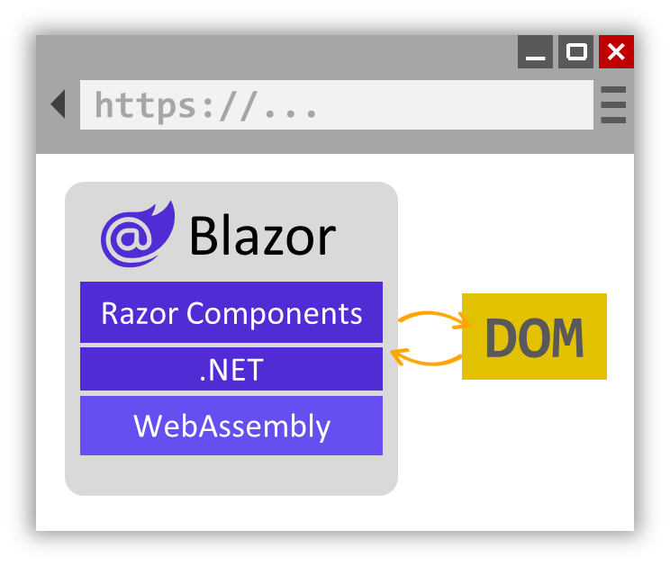

# Blazor를 사용하여 할 일 목록 빌드

## 목차
- [Blazor를 사용하여 할 일 목록 빌드](#blazor를-사용하여-할-일-목록-빌드)
  - [목차](#목차)
  - [소개](#소개)
  - [데이터 바인딩 및 이벤트](#데이터-바인딩-및-이벤트)
    - [C# 식 값 렌더링](#c-식-값-렌더링)
    - [제어 흐름 추가](#제어-흐름-추가)
    - [이벤트 처리](#이벤트-처리)
    - [데이터 바인딩](#데이터-바인딩)
    - [Razor 지시문](#razor-지시문)
    - [대화형 작업 사용](#대화형-작업-사용)
  - [연습 - 할 일 목록 만들기](#연습---할-일-목록-만들기)
    - [할 일 목록 페이지 만들기](#할-일-목록-페이지-만들기)
    - [탐색 메뉴에 할 일 페이지 추가](#탐색-메뉴에-할-일-페이지-추가)
    - [할 일 항목 목록 작성](#할-일-항목-목록-작성)
    - [할 일 항목 추가](#할-일-항목-추가)
    - [완료 표시란 추가 및 남은 할 일 항목 수 계산](#완료-표시란-추가-및-남은-할-일-항목-수-계산)
  - [요약](#요약)
    - [자세한 정보](#자세한-정보)
  - [출처](#출처)
  - [다음](#다음)

---
## 소개

대화형 사용자 인터페이스를 빌드하려면 브라우저에서 UI 이벤트를 처리하고 그에 따라 UI를 업데이트할 수 있어야 합니다. Blazor 구성 요소는 C#을 사용하여 다양한 종류의 UI 이벤트를 처리한 다음 Razor 구문을 사용하여 이벤트에 따라 업데이트를 렌더링할 수 있습니다. Blazor는 동기 및 비동기 콜백을 포함하여 이벤트 콜백을 정의하기 위한 몇 가지 패턴을 제공합니다. Blazor를 사용하면 UI 요소 값과 코드 간에 양방향 데이터 바인딩을 쉽게 만들 수 있습니다.

이 모듈을 마치면 Blazor에서 이벤트 처리 및 데이터 바인딩의 기본 사항을 이해할 수 있습니다. 학습한 내용을 사용하여 Blazor를 사용하여 기본 할 일 목록을 작성합니다.

---
## 데이터 바인딩 및 이벤트

구성 요소 렌더링 논리를 정의하고 UI 이벤트를 처리하는 방법을 살펴보겠습니다.

### C# 식 값 렌더링

Razor에서 C# 식의 값을 렌더링하려는 경우 선행 @ 문자를 사용합니다. 예를 들어 Counter 구성 요소는 다음과 같이 해당 필드의 값을 렌더링할 currentCount 수 있습니다.

```razor
<p role="status">Current count: @currentCount</p>
```

Razor는 일반적으로 C# 식이 종료되고 HTML 작성으로 다시 전환한 시기를 파악할 수 있습니다. 그러나 파렌을 사용하여 식의 시작과 끝에 대해 명시적으로 지정할 수도 있습니다.

```razor
<p role="status">Current count: @(currentCount)</p>
```

### 제어 흐름 추가

일반 C# 문을 사용하여 구성 요소 렌더링 논리에 제어 흐름을 추가할 수 있습니다. 예를 들어 다음과 같이 C# if-statement를 사용하여 일부 콘텐츠를 조건부로 렌더링할 수 있습니다.

```razor
@if (currentCount > 3)
{
    <p>You win!</p>
}
```

C#을 사용하여 데이터를 반복하고 항목 목록을 렌더링할 수도 있습니다.

```razor
<ul>
    @foreach (var item in items)
    {
        <li>@item.Name</li>
    }
</ul>
```

### 이벤트 처리

Blazor 구성 요소는 종종 UI 이벤트를 처리합니다. UI 요소에서 이벤트에 대한 이벤트 콜백을 지정하려면 이벤트 이름으로 시작하고 @on 끝나는 특성을 사용합니다. 예를 들어 다음과 같이 특성을 사용하여 단추 클릭 이벤트에 대한 처리기로 메서드를 @onclick 지정할 IncrementCount 수 있습니다.

```razor
<button class="btn btn-primary" @onclick="IncrementCount">Click me</button>
```

같은 다른 HTML 이벤트에 대해서도 @onchange@oninputC# 이벤트 처리기를 지정할 수 있습니다. 이벤트 처리 메서드는 동기 또는 비동기일 수 있습니다. C# 람다 식을 사용하여 이벤트 처리기를 인라인으로 정의할 수도 있습니다.

```razor
<button class="btn btn-primary" @onclick="() => currentCount++">Click me</button>
```

이벤트 처리기 메서드는 필요에 따라 이벤트에 대한 정보와 함께 이벤트 인수를 사용할 수 있습니다. 예를 들어 다음과 같이 변경된 입력 요소의 값에 액세스할 수 있습니다.

```razor
<input @onchange="InputChanged" />
<p>@message</p>

@code {
    string message = "";

    void InputChanged(ChangeEventArgs e)
    {
        message = (string)e.Value;
    }
}
```
이벤트 처리기가 실행되면 Blazor는 구성 요소를 새 상태로 자동으로 렌더링하므로 입력이 변경된 후 메시지가 표시됩니다.

### 데이터 바인딩

UI 요소의 값을 코드의 특정 값에 바인딩하려는 경우가 많습니다. UI 요소의 값이 변경되면 코드 값이 변경되고 코드 값이 변경되면 UI 요소가 새 값을 표시해야 합니다. Blazor의 데이터 바인딩 지원을 사용하면 이러한 종류의 양방향 데이터 바인딩을 쉽게 설정할 수 있습니다.

특성을 사용하여 코드의 특정 값에 UI 요소를 바인딩합니다 @bind . 예시:
```razor
<input @bind="text" />
<button @onclick="() => text = string.Empty">Clear</button>
<p>@text</p>

@code {
    string text = "";
}
```

입력 값을 변경하면 필드가 text 새 값으로 업데이트됩니다. 지우기 단추를 클릭하여 필드 값을 text 변경하면 입력 값도 지워집니다.

### Razor 지시문

Razor 지시문은 Razor 파일이 컴파일되는 방식에 영향을 주는 Razor 구문의 예약된 키워드(keyword). Razor 지시문은 항상 문자로 시작합니다 @ . 일부 Razor 지시문은 새 줄의 시작 부분에 표시되며@code, @page 다른 지시문은 요소에 특성(예@bind: 특성)으로 적용할 수 있는 특성입니다. [Razor 구문 참조에서 Razor 지시문의 전체 목록을 찾을 수 있습니다](https://learn.microsoft.com/ko-kr/aspnet/core/mvc/views/razor).

### 대화형 작업 사용

구성 요소에서 UI 이벤트를 처리하고 데이터 바인딩을 사용하려면 구성 요소가 대화형이어야 합니다. 기본적으로 Blazor 구성 요소는 서버에서 정적으로 렌더링됩니다. 즉, 요청에 대한 응답으로 HTML을 생성하고 그렇지 않으면 UI 이벤트를 처리할 수 없습니다. 지시문을 사용하여 대화형 렌더링 모드를 적용하여 구성 요소를 대화형으로 만듭니다 @rendermode .

구성 요소 정의에 @rendermode 지시문을 적용할 수 있습니다.

```razor
@rendermode InteractiveServer
```

또는 구성 요소 인스턴스에 다음을 수행합니다.

```razor
<Counter @rendermode="InteractiveServer" />
```

Counter 구성 요소는 현재 앱에서 유일한 대화형 구성 요소이며 대화형 서버 렌더링을 사용합니다. 대화형 서버 렌더링은 브라우저와의 WebSocket 연결을 통해 서버의 UI 이벤트를 처리합니다. Blazor는 앱의 구성 요소에서 처리할 수 있도록 이 연결을 통해 서버에 UI 이벤트를 보냅니다. 그런 다음 Blazor는 렌더링된 업데이트를 사용하여 브라우저 DOM 업데이트를 처리합니다.


또는 Blazor 구성 요소는 렌더링 모드를 InteractiveWebAssembly 사용하여 클라이언트에서 대화형으로 렌더링할 수 있습니다. 이 모드에서는 구성 요소 코드가 브라우저에 다운로드되고 WebAssembly 기반 .NET 런타임을 사용하여 클라이언트 쪽을 실행합니다.



사용하도록 선택한 대화형 렌더링 모드는 앱의 요구 사항에 따라 달라집니다. 현재 Blazor 프로젝트는 서버 기반 렌더링에 대해서만 설정되므로 이 모듈의 경우 정적 및 대화형 서버 렌더링을 고수합니다.

---
## 연습 - 할 일 목록 만들기

### 할 일 목록 페이지 만들기

1. 새 Blazor 웹앱 프로젝트를 만듭니다.
2. 구성 요소/Pages 폴더에 Todo.razor 파일 추가<br>Visual Studio와 Visual Studio Code에서 솔루션 탐색기에 있는 구성 요소/페이지 폴더를 마우스 오른쪽 단추로 클릭하고 새 파일 추가에 해당하는 옵션을 선택하여 Razor 파일을 추가할 수 있습니다.<br>.NET CLI에서 다음 명령을 사용하여 Razor 파일을 만들 수도 있습니다.<br>
    ```bash
    dotnet new razorcomponent -n Todo -o Components/Pages
    ``` 
    <br>이전 명령의 -n|--name 옵션은 새 Razor 구성 요소의 이름을 지정합니다. 새 구성 요소는 -o|--output 옵션을 사용하여 프로젝트의 Components/Pages 폴더에 만들어집니다.
    <br> * Razor 구성 요소 파일 이름은 다른 HTML 요소와 쉽게 구별할 수 있도록 첫 번째 문자가 대문자여야 합니다.
3. Todo 구성 요소를 열고 상대 URL이 /todo인 파일 맨 위에 @page Razor 지시문을 추가하고, 구성 요소가 UI 이벤트를 처리할 수 있도록 렌더링 모드를 InteractiveServer(으)로 설정합니다. <br>
    ```cshtml
    @page "/todo"
    @rendermode InteractiveServer

    <h3>Todo</h3>

    @code {

    }
    ```
4. 앱에 변경 내용을 적용하고 "/todo"로 이동하여 새 페이지를 확인합니다.

### 탐색 메뉴에 할 일 페이지 추가

새 할 일 목록 페이지는 아직 다른 기존 페이지가 있는 탐색 메뉴에 표시되지 않습니다. 탐색 메뉴는 앱 레이아웃의 일부인 NavMenu 구성 요소에서 정의됩니다. NavMenu 구성 요소를 업데이트하여 할 일 목록 페이지에 대한 링크를 추가해 보겠습니다.

1. Components/Layout/NavMenu.razor를 엽니다.
2. NavMenu 구성 요소에서 nav 요소를 찾고 날씨 페이지의 기존 탐색 항목 아래에 다음 div 요소를 추가합니다.<br>
    ```razor
    <div class="nav-item px-3">
        <NavLink class="nav-link" href="todo">
            <span class="bi bi-list-nested-nav-menu" aria-hidden="true"></span> Todo
        </NavLink>
    </div>
    ```
    NavLink 구성 요소는 앵커 태그를 렌더링하는 기본 제공 Blazor 구성 요소입니다. 현재 브라우저 주소가 NavLink의 href과(와) 일치하는 경우 링크 스타일을 지정하는 데 사용할 수 있는 active CSS 클래스도 렌더링합니다.<br>이 변경 내용을 적용한 후에는 이제 탐색 메뉴에 할 일 페이지가 표시되는 것을 볼 수 있습니다.<br>

### 할 일 항목 목록 작성

1. 프로젝트의 루트(Program.cs과(와) 동일한 수준)에 새 TodoItem.cs 파일을 만들고 다음 C# 클래스를 추가합니다.
    ```C#
    public class TodoItem
    {
        public string? Title { get; set; }
        public bool IsDone { get; set; } = false;
    }
    ```
2. Todo.razor에서 @code 블록에 할 일 항목 목록 필드를 추가합니다.
    ```razor
    @code {
        private List<TodoItem> todos = new();
    }
    ```
3. foreach 루프를 사용하여 정렬되지 않은 모든 할 일 목록을 렌더링합니다.
    ```razor
    <ul>
        @foreach (var todo in todos)
        {
            <li>@todo.Title</li>
        }
    </ul>
    ```
    목록이 비어 있으므로 아직 할 일 목록에 대한 렌더링 결과가 보이지 않습니다. 할 일 항목을 추가하는 방법이 필요합니다.

### 할 일 항목 추가

할 일 항목을 목록에 추가하기 위한 몇 가지 UI 요소를 추가해 보겠습니다.

1. Todo.razor에서 정렬되지 않은 목록 아래에 input 태그와 button을(를) 추가합니다.
    ```razor
    <input />
    <button>Add todo</button>
    ```
2. newTodo 문자열 필드를 만들고 @bind 지시문 특성을 사용하여 input에 바인딩합니다.
    ```razor
    <input @bind="newTodo" />
    <button>Add todo</button>

    @code {
        private List<TodoItem> todos = new();
        string newTodo = "";
    }
    ```
3. newTodo 값에 따라 todos 목록에 새 TodoItem을(를) 추가한 다음 newTodo 값을 빈 문자열로 다시 설정하는 @onclick 처리기를 button에 추가합니다.
    ```razor
    <input @bind="newTodo" />
    <button @onclick="AddTodo">Add todo</button>

    @code {
        private List<TodoItem> todos = new();
        string newTodo = "";

        void AddTodo()
        {
            if (!string.IsNullOrWhiteSpace(newTodo))
            {
                todos.Add(new TodoItem { Title = newTodo });
                newTodo = string.Empty;
            }
        }
    }
    ```
4. 이제 할 일 항목을 추가할 수 있고 목록에 표시되는지 확인합니다. 또한 input 값은 각 할 일 항목을 추가한 후 다시 설정해야 합니다.

### 완료 표시란 추가 및 남은 할 일 항목 수 계산

끝낸 할 일 항목을 완료로 표시하고, 기존 할 일 항목을 편집하고, 남은 할 일 항목 수를 계산하는 방법이 필요합니다.

1. li 요소의 내용을 업데이트하여 todo.IsDone에 바인딩된 checkbox 형식의 input과(와) todo.Title에 바인딩된 텍스트 input을(를) 렌더링합니다.
    ```razor
    <ul>
        @foreach (var todo in todos)
        {
            <li>
                <input type="checkbox" @bind="todo.IsDone" />
                <input @bind="todo.Title" />
            </li>
        }
    </ul>
    ```
2. <h3> 헤더를 업데이트하여 완료되지 않은(IsDone이 false) todo 항목의 수를 표시합니다.
    ```razor
    <h3>Todo (@todos.Count(todo => !todo.IsDone))</h3>
    ```
3. 앱에 변경 내용을 적용한 후 항목을 추가하고, 편집하고, 완료로 표시하면서 구성 요소를 테스트해 봅니다.<br>

이제 Blazor 할 일 목록이 ✅에서 완료되었습니다.

---
## 요약

이 모듈에서는 Blazor 구성 요소를 사용하여 UI 요소와 코드 간에 양방향 데이터 바인딩을 설정하는 방법을 포함하여 UI 이벤트를 처리하는 방법을 알아보았습니다. 학습한 내용을 사용하여 할 일 목록을 만들었습니다.

### 자세한 정보
 - [Blazor 홈 페이지](https://blazor.net/)
 - [Blazor 문서](https://learn.microsoft.com/ko-kr/aspnet/core/blazor)
 - [Razor 구문 참조](https://learn.microsoft.com/ko-kr/aspnet/core/mvc/views/razor)
 - [Blazor 렌더링 모드](https://learn.microsoft.com/ko-kr/aspnet/core/blazor/components/render-modes)

---
## 출처
[Microsoft learn Blazor를 사용하여 할 일 목록 빌드](https://learn.microsoft.com/ko-kr/training/modules/build-blazor-todo-list/)

---
## [다음](./04_Blazor_웹앱에서_데이터와_상호_작용.md)