# Blazor 웹앱에서 데이터와 상호 작용

## 목차
- [Blazor 웹앱에서 데이터와 상호 작용](#blazor-웹앱에서-데이터와-상호-작용)
  - [목차](#목차)
  - [소개](#소개)
    - [학습 목표](#학습-목표)
  - [Blazor 구성 요소를 사용하여 사용자 인터페이스 만들기](#blazor-구성-요소를-사용하여-사용자-인터페이스-만들기)
    - [Blazor 구성 요소 이해](#blazor-구성-요소-이해)
    - [Blazor 구성 요소 만들기](#blazor-구성-요소-만들기)
    - [Blazor 구성 요소에서 코드 작성](#blazor-구성-요소에서-코드-작성)
  - [연습 - Blazor 구성 요소를 사용하여 사용자 인터페이스 만들기](#연습---blazor-구성-요소를-사용하여-사용자-인터페이스-만들기)
    - [새 Blazor 앱 만들기](#새-blazor-앱-만들기)
    - [설정 테스트](#설정-테스트)
    - [Blazing Pizza 자산 및 시작 파일 다운로드](#blazing-pizza-자산-및-시작-파일-다운로드)
    - [피자 만들기](#피자-만들기)
  - [Blazor 구성 요소에서 데이터 액세스](#blazor-구성-요소에서-데이터-액세스)
    - [등록된 데이터 서비스 만들기](#등록된-데이터-서비스-만들기)
    - [서비스를 사용하여 데이터 가져오기](#서비스를-사용하여-데이터-가져오기)
      - [서비스 삽입](#서비스-삽입)
      - [OnInitializedAsync 메서드 재정의](#oninitializedasync-메서드-재정의)
      - [서비스를 호출하여 데이터 가져오기](#서비스를-호출하여-데이터-가져오기)
    - [사용자에게 데이터 표시](#사용자에게-데이터-표시)
      - [데이터 확인](#데이터-확인)
      - [개체 컬렉션 렌더링](#개체-컬렉션-렌더링)
  - [연습 - Blazor 구성 요소에서 데이터 액세스](#연습---blazor-구성-요소에서-데이터-액세스)
    - [데이터베이스 액세스를 지원하는 패키지 추가](#데이터베이스-액세스를-지원하는-패키지-추가)
    - [데이터베이스 컨텍스트 추가](#데이터베이스-컨텍스트-추가)
    - [컨트롤러 추가](#컨트롤러-추가)
    - [데이터베이스에 데이터 로드](#데이터베이스에-데이터-로드)
    - [데이터베이스를 사용하여 피자 표시](#데이터베이스를-사용하여-피자-표시)
  - [Blazor 애플리케이션에서 데이터 공유](#blazor-애플리케이션에서-데이터-공유)
    - [구성 요소 매개 변수를 사용하여 다른 구성 요소와 정보 공유](#구성-요소-매개-변수를-사용하여-다른-구성-요소와-정보-공유)
    - [연계 매개 변수를 사용하여 정보 공유](#연계-매개-변수를-사용하여-정보-공유)
    - [AppState를 사용하여 정보 공유](#appstate를-사용하여-정보-공유)
  - [연습 - Blazor 애플리케이션에서 데이터 공유](#연습---blazor-애플리케이션에서-데이터-공유)
    - [새 주문 구성 대화 상자 추가](#새-주문-구성-대화-상자-추가)
    - [피자 주문](#피자-주문)
    - [주문 상태 처리](#주문-상태-처리)
    - [피자 주문 취소 및 만들기](#피자-주문-취소-및-만들기)
  - [Blazor 애플리케이션의 컨트롤을 데이터에 바인딩](#blazor-애플리케이션의-컨트롤을-데이터에-바인딩)
    - [데이터 바인딩이란?](#데이터-바인딩이란)
    - [특정 이벤트에 요소를 바인딩](#특정-이벤트에-요소를-바인딩)
    - [바인딩된 값 서식 지정](#바인딩된-값-서식-지정)
  - [연습 - Blazor 애플리케이션의 컨트롤을 데이터에 바인딩](#연습---blazor-애플리케이션의-컨트롤을-데이터에-바인딩)
    - [고객의 피자 주문 표시](#고객의-피자-주문-표시)
    - [고객의 주문에서 피자 제거](#고객의-주문에서-피자-제거)
    - [동적으로 피자 사이즈 구성](#동적으로-피자-사이즈-구성)
  - [요약](#요약)
    - [자세한 정보](#자세한-정보)
  - [출처](#출처)
  - [다음](#다음)

---
## 소개

Blazor는 클라이언트 쪽 JavaScript 라이브러리를 관리하는 복잡성 없이 서버 및 클라이언트 쪽 모두에서 앱 논리를 공유할 수 있는 .NET 코드를 사용하여 대화형 웹 애플리케이션을 만듭니다.

피자 배달 회사에서 고객 대면 웹 사이트를 현대화하기 위해 고용되었다고 가정합니다. 그래픽 디자이너로부터 웹 페이지 모형을 제공받았으며 모든 관련자와 사이트 기능에 대해 자세히 논의했습니다. 이제 기본 피자 검색 페이지를 사용하여 사이트 빌드를 시작하려고 합니다. 팀은 몇 년 동안 C#으로 작업해 왔으며 JavaScript에 대한 경험은 더 적으므로 .NET에서 최대한 많은 코드를 작성하려고 합니다. 이 학습 경로의 이후 모듈에서는 체크 아웃 및 인증 페이지를 빌드합니다.

이 모듈에서는 Blazor 구성 요소에 대해 살펴보고 이들을 사용하여 동적 데이터를 표시하는 사용자 인터페이스를 만드는 방법을 알아봅니다.

### 학습 목표
이 모듈을 마치면 다음을 수행할 수 있습니다.
 - Blazor 구성 요소를 만들어 웹앱의 사용자 인터페이스를 어셈블합니다.
 - 웹앱에 표시할 데이터에 액세스합니다.
 - 웹앱의 데이터를 여러 Blazor 구성 요소 간에 공유합니다.
 - Blazor 구성 요소의 변수에 HTML 요소를 바인딩합니다.

---
## Blazor 구성 요소를 사용하여 사용자 인터페이스 만들기

Blazor 구성 요소를 사용하면 .NET 코드를 사용하여 동적 콘텐츠가 포함된 HTML의 웹 페이지 또는 일부를 정의할 수 있습니다. Blazor에서는 JavaScript를 사용하는 대신 C#을 사용하여 동적 콘텐츠를 작성할 수 있습니다.

피자 배달 회사에서 새로운 최신 웹 사이트를 만들기 위해 작업하고 있다고 가정합니다. 사이트 사용자 대부분의 방문 페이지가 될 시작 페이지부터 시작합니다. 해당 페이지에 특별 제안 및 인기 있는 피자를 표시하려고 합니다.

이 단원에서는 Blazor에서 구성 요소를 만들고 해당 구성 요소에 동적 콘텐츠를 렌더링하는 코드를 작성하는 방법을 알아봅니다.

### Blazor 구성 요소 이해

Blazor는 개발자가 C# 코드를 작성하여 풍부한 대화형 UI(사용자 인터페이스)를 만드는 데 사용할 수 있는 프레임워크입니다. Blazor를 사용하면 서버 쪽과 클라이언트 쪽 모두에서 모든 코드에 동일한 언어를 사용하고 모바일 디바이스의 브라우저를 포함하여 다양한 브라우저에 표시하기 위해 렌더링할 수 있습니다.

```
참고

Blazor 앱에는 두 가지 코드 호스팅 모델이 있습니다.

 - Blazor Server: 이 모델에서 앱은 ASP.NET Core 앱 내의 웹 서버에서 실행됩니다. 클라이언트 쪽의 UI 업데이트, 이벤트 및 JavaScript 호출은 클라이언트와 서버 간의 SignalR 연결을 통해 전송됩니다. 이 모듈에서는 이 모델에 대해 설명하고 코딩합니다.
 - Blazor WebAssembly: 이 모델에서는 Blazor 앱, 해당 종속성 및 .NET 런타임이 다운로드되어 브라우저에서 실행됩니다.
```

Blazor에서는 “구성 요소”라고 하는 코드의 자체 포함 부분에서 UI를 빌드합니다. 각 구성 요소는 HTML 및 C# 코드가 혼합되어 있을 수 있습니다. 구성 요소는 코드가 @code 지시문으로 표시되는 Razor 구문을 사용하여 작성됩니다. 다른 지시문을 사용하여 변수에 액세스하고, 값에 바인딩하고, 다른 렌더링 작업을 수행할 수 있습니다. 앱이 컴파일되면 HTML 및 코드가 구성 요소 클래스로 컴파일됩니다. 구성 요소는 .razor 확장명의 파일로 작성됩니다.

```
참고

Razor 구문은 .NET 코드를 웹 페이지에 포함시키는 데 사용됩니다. 파일 확장명이 .cshtml인 ASP.NET MVC 애플리케이션에서 이 구문을 사용할 수 있습니다. Razor 구문은 Blazor에서 구성 요소를 작성하는 데 사용됩니다. 이러한 구성 요소에는 대신 .razor 확장자가 있으며 컨트롤러와 보기가 엄격하게 구분되지 않습니다.
```

Blazor 구성 요소의 간단한 예제는 다음과 같습니다.

```razor
@page "/index"

<h1>Welcome to Blazing Pizza</h1>

<p>@welcomeMessage</p>

@code {
  private string welcomeMessage = "However you like your pizzas, we can deliver them blazing fast!";
}
```

이 예제에서 코드는 welcomeMessage라는 문자열 변수의 값을 설정합니다. 이 변수는 HTML의 \<p> 태그 내에서 렌더링됩니다. 이 단원의 뒷부분에서 더 복잡한 예제를 살펴보겠습니다.

### Blazor 구성 요소 만들기

Blazor 앱을 만들 때 dotnet CLI(명령줄 인터페이스)에서 blazorserver 템플릿을 사용하면 기본적으로 다음과 같은 몇 가지 구성 요소가 포함됩니다.

```bash
dotnet new blazorserver -o BlazingPizzaSite -f net6.0
```

기본 구성 요소에는 Index.razor 홈페이지와 Counter.razor 데모 구성 요소가 포함됩니다. 이 두 구성 요소는 모두 Pages 폴더에 있습니다. 필요에 맞게 이러한 보기를 수정 또는 삭제하고 새 구성 요소로 바꿀 수 있습니다.

기존 웹앱에 새 구성 요소를 추가하려면 다음 명령을 사용합니다.

```bash
dotnet new razorcomponent -n PizzaBrowser -o Pages -f net6.0
```
 - -n 옵션은 추가할 구성 요소의 이름을 지정합니다. 이 예제에서는 PizzaBrowser.razor라는 새 파일을 추가합니다.
 - -o 옵션은 새 구성 요소가 포함될 폴더를 지정합니다.
 - -f 옵션은 강제로 프레임워크 버전 .NET 6을 사용하여 애플리케이션을 빌드합니다.

```
중요

Blazor 구성 요소의 이름은 대문자로 시작해야 합니다.
```

구성 요소를 만든 후에는 Visual Studio Code에서 구성 요소를 열어 편집할 수 있습니다.

```bash
code Pages/PizzaBrowser
```

### Blazor 구성 요소에서 코드 작성

Blazor에서 UI를 빌드할 때 흔히 동일한 파일에 있는 정적 HTML 및 CSS 태그를 C# 코드와 혼합합니다. 이러한 코드 형식을 구분하기 위해 Razor 구문을 사용합니다. Razor 구문에는 C# 코드, 라우팅 매개 변수, 바인딩된 데이터, 가져온 클래스 및 기타 기능을 구분하는, @ 기호가 접두사로 추가된 지시문이 포함됩니다.

다음 예제 구성 요소를 다시 살펴보겠습니다.

```razor
@page "/index"

<h1>Welcome to Blazing Pizza</h1>

<p>@welcomeMessage</p>

@code {
  private string welcomeMessage = "However you like your pizzas, we can deliver them fast!";
}
```
\<h1> 및 \<p> 태그를 통해 HTML 태그를 알아볼 수 있습니다. 이 태그는 코드가 동적 콘텐츠를 삽입하는 페이지의 정적 프레임워크입니다. Razor 태그는 다음으로 구성됩니다.

 - @page 지시문: 이 지시문은 Blazor에 경로 템플릿을 제공합니다. 런타임에 Blazor는 이 템플릿을 사용자가 요청한 URL과 일치시켜 렌더링할 페이지를 찾습니다. 이 경우 http://yourdomain.com/index 양식의 URL과 일치시킬 수 있습니다.
 - @code 지시문: 이 지시문은 다음 블록의 텍스트가 C# 코드임을 선언합니다. 구성 요소에 필요한 만큼 코드 블록을 포함할 수 있습니다. 이러한 코드 블록에서 구성 요소 클래스 멤버를 정의하고 계산, 데이터 조회 작업 또는 기타 소스에서 해당 값을 설정할 수 있습니다. 이 경우 코드는 welcomeMessage라는 단일 구성 요소 멤버를 정의하고 해당 문자열 값을 설정합니다.
 - 멤버 액세스 지시문: 렌더링 논리에 멤버의 값을 포함하려면 @ 기호 뒤에 멤버 이름 같은 C# 식을 사용합니다. 여기서는 @welcomeMessage 지시문이 <p> 태그에서 welcomeMessage 멤버의 값을 렌더링하는 데 사용됩니다.

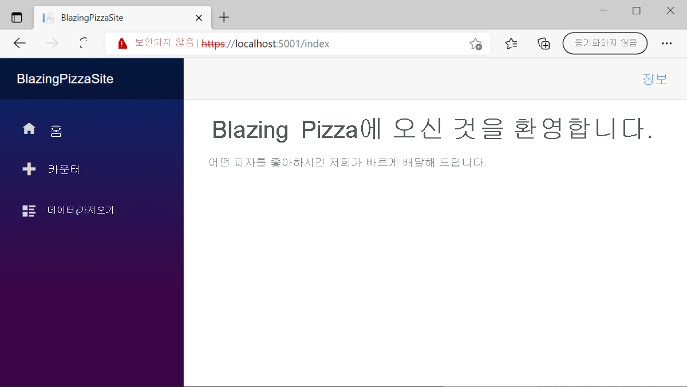

---
## 연습 - Blazor 구성 요소를 사용하여 사용자 인터페이스 만들기

이 연습에서는 피자 배달 회사를 위한 새로운 Blazing Pizza 앱을 만들기 시작합니다. 회사는 기존 사이트의 현재 CSS, 이미지 및 HTML을 제공했습니다.

```
참고

이 모듈에서는 로컬 개발에 .NET CLI 및 Visual Studio Code를 사용합니다. 이 모듈을 완료한 후 Visual Studio(Windows) 또는 Mac용 Visual Studio(macOS)를 사용하여 개념을 적용할 수 있습니다. 지속적인 개발의 경우 Windows, Linux 및 macOS에 Visual Studio Code를 사용할 수 있습니다.
```

이전에 Blazor 앱을 만든 적이 없는 경우 [Blazor 설치 지침](https://aka.ms/blazor-getting-started)에 따라 올바른 버전의 .NET을 설치하고 머신이 올바르게 설정되었는지 확인합니다. 앱 만들기 단계에서 중지합니다.

### 새 Blazor 앱 만들기

이 모듈에서는 .NET 6.0 SDK를 사용합니다. 기본 설정 터미널에서 다음 명령을 실행하여 .NET 6.0이 설치되어 있는지 확인합니다.

```bash
dotnet --list-sdks
```

그러면 다음과 같은 출력이 표시됩니다.

```console
3.1.100 [C:\program files\dotnet\sdk]
5.0.100 [C:\program files\dotnet\sdk]
6.0.100 [C:\program files\dotnet\sdk]
```

6으로 시작하는 버전이 나열되어 있는지 확인합니다. 나열되는 버전이 없거나 명령을 찾을 수 없는 경우 [최신 .NET 6.0 SDK](https://dotnet.microsoft.com/download)를 설치합니다.

.NET를 사용하면 모든 버전의 Visual Studio 또는 터미널 명령으로 새 프로젝트를 만들 수 있습니다. 다음 연습에서는 터미널 및 Visual Studio Code를 사용하는 단계를 보여줍니다.

1. Visual Studio Code를 엽니다.
2. 보기를 선택하여 Visual Studio Code에서 통합 터미널을 엽니다. 그런 다음, 주 메뉴에서 터미널을 선택합니다.
3. 터미널에서 프로젝트를 만들려는 위치로 이동합니다.
4. 다음 dotnet terminal 명령을 실행합니다.
    ```bash
    dotnet new blazorserver -o BlazingPizza --no-https true -f net6.0
    ```
    이 명령은 BlazingPizza라는 폴더에 새 Blazor 서버 프로젝트를 만듭니다. 또한 프로젝트에 HTTPS를 비활성화하도록 지시합니다.
5. 파일>폴더 열기를 선택합니다.
6. 열기 대화 상자에서 BlazingPizza 폴더로 이동하여 폴더 선택을 선택합니다.
7. Visual Studio Code는 프로젝트를 빌드하고 디버그하는 데 필요한 자산을 추가하라는 메시지를 표시합니다. 예를 선택합니다.<br>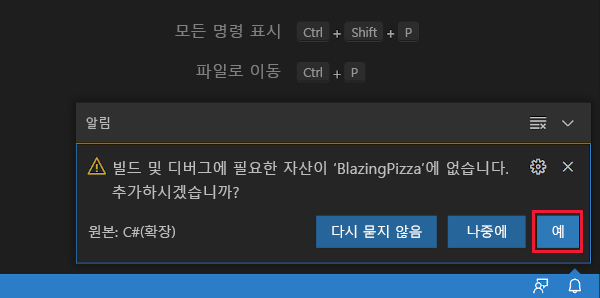
8. Visual Studio Code가 프로젝트의 .vscode 폴더에 launch.json 및 tasks.json을 추가합니다.

이러한 파일은 Visual Studio Code 디버깅 도구를 사용하여 Blazor 앱을 실행하고 디버그하는 데 필요합니다.

### 설정 테스트

터미널을 사용하거나 Visual Studio Code를 사용하여 앱을 실행하도록 선택할 수 있습니다.

1. 터미널 창에서 다음을 사용하여 Blazor 앱을 시작합니다.
    ```bash
    dotnet watch
    ```
    이 명령은 앱을 빌드한 후 시작합니다. watch 명령은 dotnet에 모든 프로젝트 파일을 감시하도록 지시합니다. 프로젝트 파일을 변경하면 자동으로 다시 빌드가 트리거된 다음, 앱이 다시 시작됩니다.
    컴퓨터 기본 브라우저가 http://localhost:5000에서 새 페이지를 엽니다.
2. 앱을 중지하려면 터미널 창에서 Ctrl + C를 선택합니다.

Visual Studio Code를 사용하여 프로젝트를 실행하고 디버그할 수도 있습니다.
1. Visual Studio Code에서 F5 키를 선택합니다. 또는 실행 메뉴에서 디버깅 시작을 선택합니다.<br>
앱이 빌드되고 새 브라우저 페이지가 열립니다.
2. 또한 Visual Studio Code가 앱을 다시 시작하거나 중지할 수 있는 실행 및 디버그 창으로 전환됩니다.<br>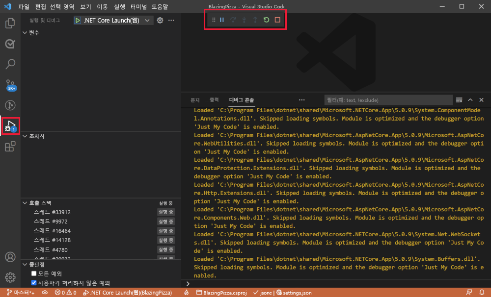
3. Shift + F5를 선택하여 앱을 중지합니다.

### Blazing Pizza 자산 및 시작 파일 다운로드

이제 [GitHub 리포지토리](https://github.com/MicrosoftDocs/mslearn-interact-with-data-blazor-web-apps.git)에서 팀의 기존 Blazor 앱 프로젝트 파일을 복제합니다.

1. 파일 탐색기 또는 Visual Studio Code를 사용하여 BlazingPizza 폴더를 삭제합니다.
2. 터미널에서 현재 작업 파일을 새 BlazingPizza 폴더에 복제합니다.
    ```powershell
    git clone https://github.com/MicrosoftDocs/mslearn-interact-with-data-blazor-web-apps.git BlazingPizza
    ```
3. 현재 버전의 앱을 실행합니다. F5 키를 선택합니다.<br>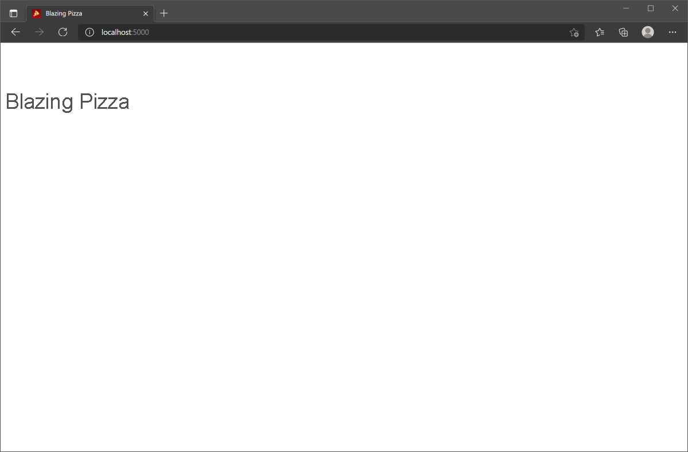

### 피자 만들기

Pages/Index.razor 구성 요소를 사용하면 고객이 주문할 피자를 선택하고 구성할 수 있습니다. 이 구성 요소는 앱의 루트 URL에 응답합니다.

팀은 앱의 모델을 나타내는 클래스도 만들었습니다. 현재 PizzaSpecial 모델을 검토합니다.

1. Visual Studio Code의 파일 탐색기에서 Model 폴더를 확장합니다. 그런 다음, PizzaSpecial을 선택합니다.
    ```C#
    namespace BlazingPizza;

    /// <summary>
    /// Represents a pre-configured template for a pizza a user can order
    /// </summary>
    public class PizzaSpecial
    {
        public int Id { get; set; }

        public string Name { get; set; }

        public decimal BasePrice { get; set; }

        public string Description { get; set; }

        public string ImageUrl { get; set; }

        public string GetFormattedBasePrice() => BasePrice.ToString("0.00");
    }
    ```
    피자 주문에는 Name, BasePrice, Description 및 ImageUrl이 있습니다.
2. 파일 탐색기에서 페이지를 확장한 다음, index.razor를 선택합니다.
    ```razor
    @page "/"

    <h1>Blazing Pizzas</h1>
    ```
    현재, 제목에 대한 단일 H1 태그만 있습니다. 피자 스페셜을 만들기 위한 코드를 추가하려고 합니다.
3. \<h1> 태그 아래에 다음 C# 코드를 추가합니다.
    ```razor
    @code {
        List<PizzaSpecial> specials = new();

        protected override void OnInitialized()
        {
            specials.AddRange(new List<PizzaSpecial>
            {
                new PizzaSpecial { Name = "The Baconatorizor", BasePrice =  11.99M, Description = "It has EVERY kind of bacon", ImageUrl="img/pizzas/bacon.jpg"},
                new PizzaSpecial { Name = "Buffalo chicken", BasePrice =  12.75M, Description = "Spicy chicken, hot sauce, and blue cheese, guaranteed to warm you up", ImageUrl="img/pizzas/meaty.jpg"},
                new PizzaSpecial { Name = "Veggie Delight", BasePrice =  11.5M, Description = "It's like salad, but on a pizza", ImageUrl="img/pizzas/salad.jpg"},
                new PizzaSpecial { Name = "Margherita", BasePrice =  9.99M, Description = "Traditional Italian pizza with tomatoes and basil", ImageUrl="img/pizzas/margherita.jpg"},
                new PizzaSpecial { Name = "Basic Cheese Pizza", BasePrice =  11.99M, Description = "It's cheesy and delicious. Why wouldn't you want one?", ImageUrl="img/pizzas/cheese.jpg"},
                new PizzaSpecial { Name = "Classic pepperoni", BasePrice =  10.5M, Description = "It's the pizza you grew up with, but Blazing hot!", ImageUrl="img/pizzas/pepperoni.jpg" }               
            });
        }
    }
    ```
    @code 블록은 스페셜 피자를 보관할 배열을 만듭니다. 페이지가 초기화되면 배열에 6개의 피자를 추가합니다.
4. F5를 선택하거나 실행을 선택합니다. 그런 다음, 디버깅 시작을 선택합니다.<br>
   앱이 컴파일되고 실행됩니다. 하지만 변경된 것을 볼 수 없습니다. 이 코드는 클라이언트 쪽 HTML에서 사용되지 않습니다. 문제를 해결해 보겠습니다.
5. Shift + F5를 누르거나 디버깅 중지를 선택합니다.
6. Index.razor에서 \<h1>Blazing Pizzas\</h1>를 다음 코드로 바꿉니다.
    ```razor
    <div class="main">
    <h1>Blazing Pizzas</h1>
    <ul class="pizza-cards">
        @if (specials != null)
        {
        @foreach (var special in specials)
        {
            <li style="background-image: url('@special.ImageUrl')">
            <div class="pizza-info">
                <span class="title">@special.Name</span>
                    @special.Description
                    <span class="price">@special.GetFormattedBasePrice()</span>
            </div>
            </li>
        }
        }
    </ul>
    </div>
    ```
    이 코드는 일반 HTML을 루프 및 멤버 액세스 지시문과 함께 결합합니다. @foreach 루프는 specials 배열의 각 피자에 대한 \<li> 태그를 만듭니다.<br>
    루프 내에서 각 스페셜 피자는 멤버 지시문을 사용하여 이름, 설명, 가격 및 이미지를 표시합니다.
7. F5를 선택하거나 실행을 선택합니다. 그런 다음, 디버깅 시작을 선택합니다.<br>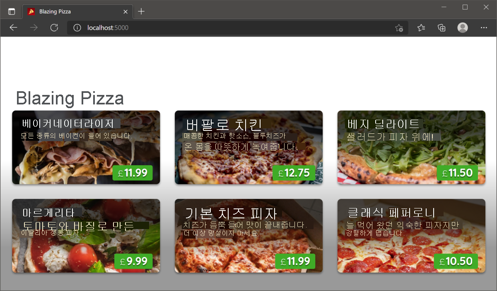

이제 고객이 피자를 주문할 수 있는 피자 기본 구성 요소를 만들었습니다. 다음 연습에서는 이 구성 요소를 개선합니다.

---
## Blazor 구성 요소에서 데이터 액세스

참여적인 웹 사이트는 항상 변경될 수 있는 동적 콘텐츠를 표시해야 합니다. 데이터베이스 또는 웹 서비스 같은 동적 소스에서 데이터를 가져오는 것은 웹 개발의 기본 기술입니다.

피자 배달 회사에서 고객 대면 웹 사이트를 업데이트하는 작업을 하고 있다고 가정합니다. Blazor 구성 요소로 레이아웃되고 디자인된 일련의 웹 페이지가 있습니다. 이제 이러한 페이지를 데이터베이스에서 가져올 피자, 토 핑 및 주문에 대한 정보로 채워야 합니다.

이 단원에서는 사용자에게 표시하기 위해 데이터에 액세스하고 HTML 태그 내에서 렌더링하는 방법을 알아봅니다.

### 등록된 데이터 서비스 만들기

사용자에게 변경되는 정보를 표시하는 동적 웹 사이트를 만들려면 어디선가 해당 데이터를 가져오는 코드를 작성해야 합니다. 예를 들어 회사가 판매하는 모든 피자를 저장하는 데이터베이스가 있다고 가정합니다. 피자는 항상 변경되므로 웹 사이트 HTML로 하드 코드하는 것은 좋지 않습니다. 대신, C# 코드 및 Blazor를 사용하여 데이터베이스를 쿼리한 다음, 사용자가 즐겨찾기를 선택할 수 있도록 세부 정보를 HTML로 형식을 지정합니다.

Blazor Server 앱에서 등록된 서비스를 만들어 데이터 원본을 표시하고 데이터를 가져올 수 있습니다.

```
참고

Blazor 앱에서 사용할 수 있는 데이터 원본에는 관계형 데이터베이스, NoSQL 데이터베이스, 웹 서비스, 다양한 Azure 서비스 등 많은 시스템이 포함됩니다. Entity Framework, HTTP 클라이언트, ODBC와 같은 .NET 기술을 사용하여 이러한 원본을 쿼리할 수 있습니다. 이러한 기술은 이 모듈의 범위를 벗어나는 것입니다. 여기서는 이러한 원본 및 기술 중 하나에서 얻은 데이터의 형식을 지정하고 사용하는 방법을 알아봅니다.
```

등록된 서비스 만들기는 해당 속성을 정의하는 클래스를 작성하는 것으로 시작합니다. 다음은 피자를 나타내기 위해 작성할 수 있는 예제입니다.

```C#
namespace BlazingPizza.Data;

public class Pizza
{
    public int PizzaId { get; set; }
    
    public string Name { get; set; }
    
    public string Description { get; set; }
    
    public decimal Price { get; set; }
    
    public bool Vegetarian { get; set; }
    
    public bool Vegan { get; set; }
}
```

클래스는 피자의 속성 및 데이터 형식을 정의합니다. 이러한 속성이 데이터 원본의 피자 스키마와 일치하도록 해야 합니다. 프로젝트의 Data 폴더에 이 클래스를 만들고 Data라는 멤버 네임스페이스를 사용하는 것이 좋습니다. 원하는 경우 다른 폴더 및 네임스페이스를 선택할 수 있습니다.

다음으로 서비스를 정의합니다.

```C#
namespace BlazingPizza.Data;

public class PizzaService
{
    public Task<Pizza[]> GetPizzasAsync()
    {
    // Call your data access technology here
    }
}
```

서비스는 비동기 호출을 사용하여 데이터에 액세스하고 Pizza 개체의 컬렉션을 반환합니다. 데이터 원본은 Blazor 코드가 실행 중인 서버에서 멀리 떨어져 있을 수 있습니다. 이 경우 비동기 호출을 사용합니다. 데이터 원본이 느리게 응답하는 경우 응답을 기다리는 동안 다른 코드가 계속 실행될 수 있습니다.

또한 Program.cs 파일의 Add Services to the container 섹션에 줄을 추가하여 서비스를 등록합니다.

```C#
...
// Add services to the container.
builder.Services.AddRazorPages();
builder.Services.AddServerSideBlazor();
// Register the pizzas service
builder.Services.AddSingleton<PizzaService>();
...
```

### 서비스를 사용하여 데이터 가져오기

이제 Blazor 구성 요소에서 호출하고 데이터를 가져와 정의한 서비스를 사용합니다. 다음과 같은 구성 요소 코드가 있고 여기에 피자를 표시하려 한다고 가정합니다.

```razor
@page "/pizzas"

<h1>Choose your pizza</h1>

<p>We have all these delicious recipes:</p>
```

#### 서비스 삽입

구성 요소에서 서비스를 호출하려면 먼저 종속성 삽입을 사용하여 서비스를 추가해야 합니다. @page 지시문 뒤에 다음 코드를 추가하여 서비스를 삽입합니다.

```razor
@using BlazingPizza.Data
@inject PizzaService PizzaSvc
```

일반적으로 구성 요소와 서비스는 서로 다른 네임스페이스 멤버에 있으므로 @using 지시문을 포함해야 합니다. 이 지시문은 C# 코드 파일의 맨 위에 있는 using 문과 동일한 방식으로 작동합니다. @inject 지시문은 서비스를 현재 구성 요소에 추가하고 해당 서비스의 인스턴스를 시작합니다. 지시문에서 서비스 클래스의 이름을 지정합니다. 이 구성 요소의 서비스 인스턴스에 사용할 이름을 따릅니다.

#### OnInitializedAsync 메서드 재정의

서비스를 호출하고 데이터를 가져오기 적합한 위치는 OnInitializedAsync 메서드입니다. 이 이벤트는 구성 요소의 초기화가 완료되고 초기 매개 변수가 지정되었지만 페이지가 렌더링되어 사용자에게 표시되기 전에 발생합니다. 이벤트는 Blazor 구성 요소의 기본 클래스에서 정의됩니다. 이 예시와 같이 코드 블록에서 재정의할 수 있습니다.

```C#
protected override async Task OnInitializedAsync()
{
    \\ Call the service here
}
```

#### 서비스를 호출하여 데이터 가져오기

서비스를 호출하는 경우 호출이 비동기 호출이므로 await 키워드를 사용합니다.

```C#
private Pizza[] todaysPizzas;

protected override async Task OnInitializedAsync()
{
    todaysPizzas = await PizzaSvc.GetPizzasAsync();
}
```

### 사용자에게 데이터 표시

서비스에서 일부 데이터를 가져온 후 사용자에게 표시하려고 합니다. 피자 예제에서는 서비스에서 사용자가 선택할 수 있는 피자 목록을 반환해야 합니다. Blazor에는 사용자에게 표시되는 페이지에 이 데이터를 삽입하는 데 사용할 수 있는 다양한 지시문이 포함되어 있습니다.

#### 데이터 확인

먼저 피자가 로드되기 전에 페이지에 표시되는 내용을 결정합니다. todaysPizzas 컬렉션이 null인지 여부를 확인하여 이 작업을 수행할 수 있습니다. Blazor 구성 요소에서 조건부 렌더링 코드를 실행하려면 @if 지시문을 사용합니다.

```razor
@if (todaysPizzas == null)
{
    <p>We're finding out what pizzas are available today...</p>
}
else
{
    <!-- This markup will be rendered once the pizzas are loaded -->
}
```

@if 지시문은 C# 식에서 true를 반환하는 경우에만 첫 번째 코드 블록의 태그를 렌더링합니다. else if 코드 블록을 사용하여 다른 테스트를 실행하고 true인 경우 태그를 렌더링할 수도 있습니다. 마지막으로, 이전 조건이 true를 반환하지 않은 경우 코드를 렌더링하도록 else 코드 블록을 지정할 수 있습니다. @if 코드 블록에서 null을 확인하여 Blazor가 서비스에서 데이터를 가져오기 전에 피자 정보를 표시하지 않도록 합니다.

```
참고

또한 Blazor에는 여러 값을 반환할 수 있는 테스트를 기반으로 하는 태그 렌더링을 위한 @switch 지시문이 포함되어 있습니다. @switch 지시문은 C# switch 문과 비슷한 방식으로 작동합니다.
```

#### 개체 컬렉션 렌더링

Blazor가 앞의 코드에서 else 문을 실행하면 서비스에서 일부 피자를 가져온 것을 알 수 있습니다. 다음 작업은 사용자에게 이러한 피자를 표시하는 것입니다. 간단한 HTML 테이블에 이 데이터를 표시하는 방법을 살펴보겠습니다.

이 페이지를 코딩할 때 얼마나 많은 피자를 사용할 수 있을지 알 수 없습니다. @foreach 지시문을 사용하여 todaysPizzas 컬렉션의 모든 개체를 반복하고 각 개체에 대한 행을 렌더링할 수 있습니다.

```razor
<table>
 <thead>
  <tr>
   <th>Pizza Name</th>
   <th>Description</th>
   <th>Vegetarian?</th>
   <th>Vegan?</th>
   <th>Price</th>
  </tr>
 </thead>
 <tbody>
  @foreach (var pizza in todaysPizzas)
  {
   <tr>
    <td>@pizza.Name</td>
    <td>@pizza.Description</td>
    <td>@pizza.Vegetarian</td>
    <td>@pizza.Vegan</td>
    <td>@pizza.Price</td>
   </tr>
  }
 </tbody>
</table>
```

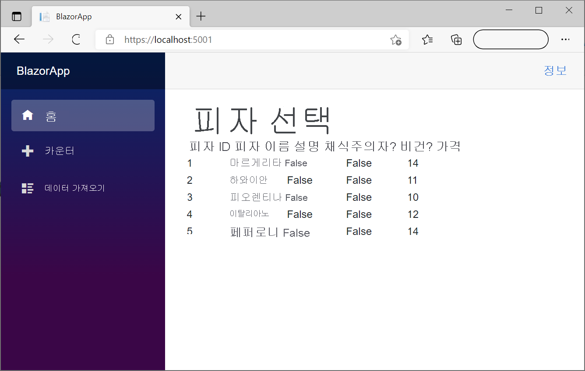

물론 이 예에 표시된 일반 테이블보다 더 풍부한 피자를 표시하고 싶을 수 있습니다. 가격 및 기타 값의 형식을 지정하는 것이 좋습니다. 그래픽 디자이너와 협력하여 더욱 매력적인 UI를 개발하세요. 예를 들어 각 피자의 사진을 포함합니다.

```
참고

Blazor에는 @for, @while 및 @do while 등 다른 반복 지시문이 포함되어 있습니다. 이러한 지시문은 반복된 표시 블록을 반환합니다. 동등한 C# for, while 및 do...while 루프와 비슷한 방식으로 작동합니다.
```

다음 단원에서는 사용자 고유의 데이터 서비스를 등록합니다.

---
## 연습 - Blazor 구성 요소에서 데이터 액세스

현재 앱에 하드 코드된 피자를 데이터베이스로 바꾸어야 합니다. Microsoft Entity Framework를 사용하면 데이터 원본에 대한 연결을 추가할 수 있습니다. 이 앱에서 SQLite 데이터베이스를 사용하여 피자를 저장합니다.

이 연습에서는 데이터베이스 기능을 지원하는 패키지를 추가하고, 클래스를 백 엔드 데이터베이스에 연결하고, 회사의 피자 데이터를 미리 로드하는 도우미 클래스를 추가합니다.

### 데이터베이스 액세스를 지원하는 패키지 추가

1. 앱이 계속 실행되고 있으면 중지합니다.
2. Visual Studio Code 내에서 터미널>새 터미널을 선택합니다.
3. 새 터미널 창에서 위치를 BlazingPizza 디렉터리로 설정합니다.
    ```bash
    cd BlazingPizza
    ```
4. 다음 명령을 실행하여 Microsoft.EntityFrameworkCore, Microsoft.EntityFrameworkCore.Sqlite 및 System.Net.Http.Json 패키지를 추가합니다.
    ```bash
    dotnet add package Microsoft.EntityFrameworkCore --version 6.0.8
    dotnet add package Microsoft.EntityFrameworkCore.Sqlite --version 6.0.8
    dotnet add package System.Net.Http.Json --version 6.0.0
    ```
    다음 명령은 BlazingPizza.csproj 파일에 패키지 참조를 추가합니다.
    ```xml
    <ItemGroup>
        <PackageReference Include="Microsoft.EntityFrameworkCore" Version="6.0.8" />
        <PackageReference Include="Microsoft.EntityFrameworkCore.Sqlite" Version="6.0.8" />
        <PackageReference Include="System.Net.Http.Json" Version="6.0.0" />
    </ItemGroup>
    ```

### 데이터베이스 컨텍스트 추가

1. Visual Studio Code에서 BlazingPizza 폴더에 새 폴더를 만듭니다. 이름을 Data로 지정합니다.
2. Data 폴더에 새 파일을 만듭니다. 이름을 PizzaStoreContext.cs로 지정합니다.
3. 클래스에 대해 다음 코드를 입력합니다.
    ```C#
    using Microsoft.EntityFrameworkCore;

    namespace BlazingPizza.Data;

    public class PizzaStoreContext : DbContext
    {
        public PizzaStoreContext(DbContextOptions options) : base(options)
        {
        }

        public DbSet<PizzaSpecial> Specials { get; set; }
    }
    ```
    이 클래스는 데이터베이스 서비스를 등록하는 데 사용할 수 있는 데이터베이스 컨텍스트를 만듭니다. 컨텍스트를 사용하면 데이터베이스에 액세스하는 컨트롤러를 사용할 수도 있습니다.
4. 변경 내용을 저장합니다.

### 컨트롤러 추가

1. BlazingPizza 폴더에 새 폴더를 만듭니다. 이름을 Controllers로 지정합니다.
2. Controllers 폴더에 새 파일을 만듭니다. 이름을 SpecialsController.cs로 지정합니다.
3. 클래스에 대해 다음 코드를 입력합니다.
    ```C#
    using Microsoft.AspNetCore.Mvc;
    using Microsoft.EntityFrameworkCore;
    using BlazingPizza.Data;

    namespace BlazingPizza.Controllers;

    [Route("specials")]
    [ApiController]
    public class SpecialsController : Controller
    {
        private readonly PizzaStoreContext _db;

        public SpecialsController(PizzaStoreContext db)
        {
            _db = db;
        }

        [HttpGet]
        public async Task<ActionResult<List<PizzaSpecial>>> GetSpecials()
        {
            return (await _db.Specials.ToListAsync()).OrderByDescending(s => s.BasePrice).ToList();
        }
    }
    ```
    이 클래스는 피자 스페셜에 대한 데이터베이스를 쿼리하고 (http://localhost:5000/specials) URL에서 JSON으로 반환할 수 있는 컨트롤러를 만듭니다.
4. 변경 내용을 저장합니다.

### 데이터베이스에 데이터 로드

앱은 기존 SQLite 데이터베이스가 있는지 확인하고 미리 만든 피자를 사용하여 데이터베이스를 하나 만듭니다.

1. Data 디렉터리에 새 파일을 만듭니다. 이름을 SeedData.cs로 지정합니다.
2. 클래스에 대해 다음 코드를 입력합니다.
    ```C#
    namespace BlazingPizza.Data;

    public static class SeedData
    {
        public static void Initialize(PizzaStoreContext db)
        {
            var specials = new PizzaSpecial[]
            {
                new PizzaSpecial()
                {
                    Name = "Basic Cheese Pizza",
                    Description = "It's cheesy and delicious. Why wouldn't you want one?",
                    BasePrice = 9.99m,
                    ImageUrl = "img/pizzas/cheese.jpg",
                },
                new PizzaSpecial()
                {
                    Id = 2,
                    Name = "The Baconatorizor",
                    Description = "It has EVERY kind of bacon",
                    BasePrice = 11.99m,
                    ImageUrl = "img/pizzas/bacon.jpg",
                },
                new PizzaSpecial()
                {
                    Id = 3,
                    Name = "Classic pepperoni",
                    Description = "It's the pizza you grew up with, but Blazing hot!",
                    BasePrice = 10.50m,
                    ImageUrl = "img/pizzas/pepperoni.jpg",
                },
                new PizzaSpecial()
                {
                    Id = 4,
                    Name = "Buffalo chicken",
                    Description = "Spicy chicken, hot sauce and bleu cheese, guaranteed to warm you up",
                    BasePrice = 12.75m,
                    ImageUrl = "img/pizzas/meaty.jpg",
                },
                new PizzaSpecial()
                {
                    Id = 5,
                    Name = "Mushroom Lovers",
                    Description = "It has mushrooms. Isn't that obvious?",
                    BasePrice = 11.00m,
                    ImageUrl = "img/pizzas/mushroom.jpg",
                },
                new PizzaSpecial()
                {
                    Id = 7,
                    Name = "Veggie Delight",
                    Description = "It's like salad, but on a pizza",
                    BasePrice = 11.50m,
                    ImageUrl = "img/pizzas/salad.jpg",
                },
                new PizzaSpecial()
                {
                    Id = 8,
                    Name = "Margherita",
                    Description = "Traditional Italian pizza with tomatoes and basil",
                    BasePrice = 9.99m,
                    ImageUrl = "img/pizzas/margherita.jpg",
                },
            };
            db.Specials.AddRange(specials);
            db.SaveChanges();
        }
    }
    ```
    클래스는 전달된 데이터베이스 컨텍스트를 사용하여 배열에 몇몇 PizzaSpecial 개체를 만든 다음 저장합니다.
3. 파일 탐색기에서 Program.cs를 선택합니다.
4. 맨 위쪽에서 새 PizzaStoreContext에 대한 참조를 추가합니다.
    ```C#
    using BlazingPizza.Data;
    ```
    이 문을 사용하면 앱이 새 서비스를 사용할 수 있습니다.
5. 다음 세그먼트를 app.Run(); 메서드 위에 삽입합니다.
    ```C#
    ...
    // Initialize the database
    var scopeFactory = app.Services.GetRequiredService<IServiceScopeFactory>();
    using (var scope = scopeFactory.CreateScope())
    {
        var db = scope.ServiceProvider.GetRequiredService<PizzaStoreContext>();
        if (db.Database.EnsureCreated())
        {
            SeedData.Initialize(db);
        }
    }

    app.Run();
    ```
    이 변경으로 인해 PizzaStoreContext가 있는 데이터베이스 범위가 만들어집니다. 데이터베이스가 아직 만들어지지 않은 경우 SeedData 정적 클래스를 호출하여 데이터베이스를 만듭니다.
6. 지금은 PizzaStoreContext를 초기화하지 않았기 때문에 앱이 작동하지 않습니다. Program.cs 파일의 Add Services to the container 상위 섹션에서 현재 서비스(builder.Services.를 시작하는 줄) 아래에 다음 코드를 추가합니다.
    ```C#
    builder.Services.AddHttpClient();
    builder.Services.AddSqlite<PizzaStoreContext>("Data Source=pizza.db");
    ```
    이 코드는 두 서비스를 등록합니다. 첫 번째 AddHttpClient 문을 사용하면 앱이 HTTP 명령에 액세스할 수 있습니다. 앱은 HttpClient를 사용하여 피자 스페셜에 대한 JSON을 가져옵니다. 두 번째 문은 새 PizzaStoreContext를 등록하고 SQLite 데이터베이스의 파일 이름을 제공합니다.

### 데이터베이스를 사용하여 피자 표시

이제 Index.razor 페이지에서 하드 코드된 피자를 바꿀 수 있습니다.

1. 파일 탐색기에서 Index.razor를 선택합니다.
2. 기존 OnInitialized() 메서드를 다음으로 바꿉니다.
    ```C#
    protected override async Task OnInitializedAsync()
    {
        specials = await HttpClient.GetFromJsonAsync<List<PizzaSpecial>>(NavigationManager.BaseUri + "specials");
    }
    ```
    ```
    참고

    이 코드는 OnInitialized()를 OnInitializedAsync()로 대체합니다. 이제 스페셜이 앱에서 비동기식으로 JSON으로 반환됩니다.
    ```
3. 수정해야 하는 몇 가지 오류가 있습니다. @page 지시문 아래에 다음 @inject 문을 추가합니다.
    ```razor
    @inject HttpClient HttpClient
    @inject NavigationManager NavigationManager
    ```
4. 모든 변경 내용을 저장한 다음, F5를 선택하거나 실행을 선택합니다. 그런 다음, 디버깅 시작을 선택합니다.<br>앱을 실행할 때 런타임 오류가 발생합니다. JsonReader에서 예외가 발생했습니다.
5. 앱은 (http://localhost:5000/specials)에서 JSON을 만들어야 합니다. 해당 URL로 이동합니다.<br>
    앱은 이 요청을 라우팅하는 방법을 모릅니다. 라우팅에 대해서는 Blazor 라우팅 모듈에서 알아봅니다. 이제 오류를 해결해 보겠습니다.
6. Shift + F5를 선택하거나 디버깅 중지를 선택합니다.
7. 파일 탐색기에서 Program.cs를 선택합니다.
8. 파일 중간에 app.를 시작하는 줄 뒤에 다음 엔드포인트를 추가합니다.
    ```C#
    app.MapControllerRoute("default", "{controller=Home}/{action=Index}/{id?}");
    ```
    이제 코드는 다음과 같습니다.

    ```C#
    ...
    app.MapRazorPages();
    app.MapBlazorHub();
    app.MapFallbackToPage("/_Host");
    app.MapControllerRoute("default", "{controller=Home}/{action=Index}/{id?}");
    ...
    ```
9. F5를 선택하거나 실행을 선택합니다. 그런 다음, 디버깅 시작을 선택합니다.<br>이제 앱이 작동하지만 JSON이 올바르게 생성되고 있는지 확인해 보겠습니다.
10. (http://localhost:5000/specials)로 이동하여 다음을 확인하세요.<br>
    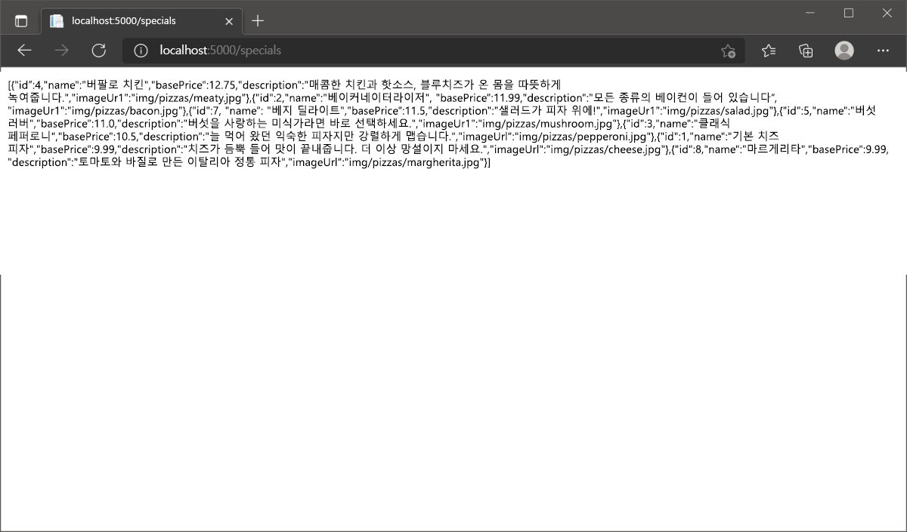<br>JSON에는 스페셜 피자 컨트롤러에 지정된 대로 가격이 내림차순으로 나열된 피자가 있습니다.
    <br>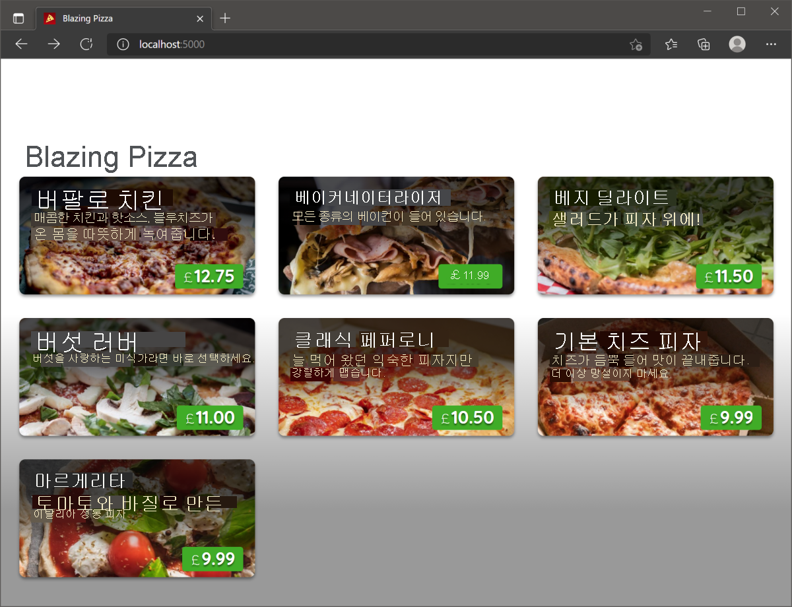
---
## Blazor 애플리케이션에서 데이터 공유

Blazor에는 구성 요소 간에 정보를 공유하는 여러 가지 방법이 포함되어 있습니다. 구성 요소 매개 변수 또는 연계 매개 변수를 사용하여 부모 구성 요소에서 자식 구성 요소로 값을 보낼 수 있습니다. AppState 패턴은 값을 저장하고 애플리케이션의 모든 구성 요소에서 액세스하는 데 사용할 수 있는 또 다른 방법입니다.

새 피자 배달 웹 사이트에서 작업 중이라고 가정합니다. 홈페이지에서 여러 피자를 동일한 방식으로 표시해야 합니다. 각 피자에 대해 자식 구성 요소를 렌더링하여 피자를 표시하려고 합니다. 이제 표시할 피자를 결정하는 해당 자식 구성 요소에 ID를 전달하려고 합니다. 또한 여러 구성 요소에 오늘 판매한 총 피자 수를 표시하는 값을 저장하고 표시하려고 합니다.

이 단원에서는 둘 이상의 Blazor 구성 요소 간에 값을 공유하는 데 사용할 수 있는 세 가지 기술을 알아봅니다.

### 구성 요소 매개 변수를 사용하여 다른 구성 요소와 정보 공유

Blazor 웹앱에서 각 구성 요소는 HTML의 일부를 렌더링합니다. 일부 구성 요소는 전체 페이지를 렌더링하지만 다른 구성 요소는 테이블, 양식 또는 단일 컨트롤과 같은 더 작은 태그 조각을 렌더링합니다. 구성 요소가 태그의 일부만 렌더링하는 경우 이를 부모 구성 요소 내에서 자식 구성 요소로 사용해야 합니다. 자식 구성 요소는 그 안에 렌더링되는 다른 작은 구성 요소의 부모일 수도 있습니다. 자식 구성 요소를 중첩된 구성 요소라고도 합니다.

이 부모 및 자식 구성 요소 계층 구조에서는 구성 요소 매개 변수를 사용하여 구성 요소 간에 정보를 공유할 수 있습니다. 자식 구성 요소에서 이러한 매개 변수를 정의한 다음, 부모 구성 요소에서 해당 값을 설정합니다. 예를 들어 피자 사진을 표시하는 자식 구성 요소가 있는 경우 구성 요소 매개 변수를 사용하여 피자 ID를 전달할 수 있습니다. 자식 구성 요소는 ID에서 피자를 검색하고 사진 및 기타 데이터를 얻습니다. 다양한 피자를 표시하려는 경우 동일한 부모 페이지에서 이 자식 구성 요소를 여러 번 사용하여 각 자식에 다른 ID를 전달할 수 있습니다.

자식 구성 요소에서 구성 요소 매개 변수를 정의하는 것으로 시작합니다. C# 공용 속성으로 정의되고 [Parameter] 특성으로 데코레이트됩니다.

```razor
<h2>New Pizza: @PizzaName</h2>

<p>@PizzaDescription</p>

@code {
    [Parameter]
    public string PizzaName { get; set; }
    
    [Parameter]
    public string PizzaDescription { get; set; } = "The best pizza you've ever tasted."
}
```

구성 요소 매개 변수는 자식 구성 요소의 멤버이므로 Blazor의 예약된 @ 기호 및 해당 이름을 사용하여 HTML에서 렌더링할 수 있습니다. 또한 앞의 코드는 PizzaDescription 매개 변수의 기본값을 지정합니다. 부모 구성 요소가 값을 전달하지 않으면 이 값이 렌더링됩니다. 아니면 부모로부터 전달된 값으로 재정의됩니다.

프로젝트에서 사용자 지정 클래스를 구성 요소 매개 변수로 사용할 수도 있습니다. 토핑을 설명하는 다음 클래스를 생각해 보겠습니다.

```C#
public class PizzaTopping
{
    public string Name { get; set; }
    public string Ingredients { get; set; }
}
```

점 구문을 사용하여 클래스의 개별 속성에 액세스하는 매개 변수 값과 동일한 방식으로 이를 구성 요소 매개 변수로 사용할 수 있습니다.

```razor
<h2>New Topping: @Topping.Name</h2>

<p>Ingredients: @Topping.Ingredients</p>

@code {
    [Parameter]
    public PizzaTopping Topping { get; set; }
}
```

부모 구성 요소에서 자식 구성 요소 태그의 특성을 사용하여 매개 변수 값을 설정합니다. 간단한 구성 요소를 직접 설정합니다. 사용자 지정 클래스를 기반으로 하는 매개 변수를 사용하여 인라인 C# 코드로 해당 클래스의 새 인스턴스를 만들고 해당 값을 설정합니다.

```razor
@page "/pizzas-toppings"

<h1>Our Latest Pizzas and Topping</h1>

<Pizza PizzaName="Hawaiian" PizzaDescription="The one with pineapple" />

<PizzaTopping Topping="@(new PizzaTopping() { Name = "Chilli Sauce", Ingredients = "Three kinds of chilli." })" />
```

### 연계 매개 변수를 사용하여 정보 공유

구성 요소 매개 변수는 구성 요소의 직계 자식에 값을 전달하려는 경우에 잘 작동합니다. 자식의 자식이 있는 심층 계층 구조가 있는 경우 상황이 어려워집니다. 구성 요소 매개 변수는 상위 구성 요소에서 손자 구성 요소 또는 계층 구조의 하위 구성 요소로 자동으로 전달되지 않습니다. 이 문제를 자연스럽게 처리하기 위해 Blazor에는 연계 매개 변수가 포함되어 있습니다. 구성 요소에서 연계 매개 변수의 값을 설정하면 모든 깊이의 모든 하위 구성 요소에서 해당 값을 자동으로 사용할 수 있습니다.

부모 구성 요소에서 \<CascadingValue> 태그를 사용하면 모든 하위 항목에 계단식으로 배열할 정보가 지정됩니다. 이 태그는 기본 제공 Blazor 구성 요소로 구현됩니다. 해당 태그 내에서 렌더링되는 모든 구성 요소는 값에 액세스할 수 있습니다.

```razor
@page "/specialoffers"

<h1>Special Offers</h1>

<CascadingValue Name="DealName" Value="Throwback Thursday">
    <!-- Any descendant component rendered here will be able to access the cascading value. -->
</CascadingValue>
```

하위 구성 요소에서 구성 요소 멤버를 사용하고 [CascadingParameter] 특성으로 데코레이트하여 연계 값에 액세스할 수 있습니다.

```razor
<h2>Deal: @DealName</h2>

@code {
    [CascadingParameter(Name="DealName")]
    private string DealName { get; set; }
}
```

따라서 이 예제에서 \<h2> 태그는 상위 구성 요소에 의해 연계 값이 설정되었기 때문에 Deal: Throwback Thursday 콘텐츠를 갖습니다.

```
참고

구성 요소 매개 변수에서는 더 복잡한 요구 사항이 있는 경우 개체를 연계 매개 변수로 전달할 수 있습니다.
```

앞의 예제에서 연계 값은 부모의 Name 특성으로 식별되며 [CascadingParameter] 특성의 Name 값과 일치됩니다. 필요에 따라 이러한 이름을 생략할 수 있습니다. 이 경우 특성은 형식을 기준으로 일치됩니다. 이름을 누락하는 방법은 해당 형식의 매개 변수가 하나만 있는 경우에 잘 작동합니다. 서로 다른 두 문자열 값을 계단식으로 배열하려면 매개 변수 이름을 사용하여 모호성을 방지해야 합니다.

### AppState를 사용하여 정보 공유

다른 구성 요소 간에 정보를 공유하는 또 다른 방법은 AppState 패턴을 사용하는 것입니다. 저장하려는 속성을 정의하고 범위가 지정된 서비스로 등록하는 클래스를 만듭니다. AppState 값을 설정 또는 사용하려는 모든 구성 요소에서 서비스를 삽입한 다음 해당 속성에 액세스할 수 있습니다. 구성 요소 매개 변수 및 연계 매개 변수와 달리 AppState의 값은 해당 값을 저장한 구성 요소의 자식이 아닌 구성 요소까지 포함하여 애플리케이션의 모든 구성 요소에서 사용할 수 있습니다.

예를 들어 매출에 대한 값을 저장하는 이 클래스를 사용하는 것이 좋습니다.

```C#
public class PizzaSalesState
{
    public int PizzasSoldToday { get; set; }
}
```
Program.cs 파일에서 클래스를 범위가 지정된 서비스로 추가합니다.
```C#
...
// Add services to the container
builder.Services.AddRazorPages();
builder.Services.AddServerSideBlazor();

// Add the AppState class
builder.Services.AddScoped<PizzaSalesState>();
...
```
이제 AppState 값을 설정하거나 검색하려는 구성 요소에서 클래스를 삽입한 다음 속성에 액세스할 수 있습니다.
```razor
@page "/"
@inject PizzaSalesState SalesState

<h1>Welcome to Blazing Pizzas</h1>

<p>Today, we've sold this many pizzas: @SalesState.PizzasSoldToday</p>

<button @onclick="IncrementSales">Buy a Pizza</button>

@code {
    private void IncrementSales()
    {
        SalesState.PizzasSoldToday++;
    }
}
```
```
참고

이 코드는 Blazor 자습서 - 첫 번째 Blazor 앱 빌드 예제와 마찬가지로 사용자가 단추를 선택할 때 증가하는 카운터를 구현합니다. 차이점은 이 경우 카운터의 값을 AppState 범위가 지정된 서비스에 저장했으므로 페이지 로드 간에 횟수가 유지되고 다른 사용자가 볼 수 있다는 것입니다.
```

다음 단원에서는 직접 시도해 볼 수 있습니다.

---

## 연습 - Blazor 애플리케이션에서 데이터 공유

이제 사용자의 앱이 데이터베이스에 연결되었으므로 고객이 피자를 주문하고 구성하는 기능을 추가할 차례입니다.

Blazing Pizza는 고객이 스페셜 피자의 사이즈를 변경할 수 있는 기능을 구축하도록 요구하고 있습니다. 주문을 저장해야 하며 컨테이너 서비스에 애플리케이션 상태를 저장하도록 선택했습니다.

이 연습에서는 새 주문 구성 요소에 데이터를 전달하고 OrderState 범위가 지정된 서비스에서 앱의 상태를 저장하는 방법을 확인합니다.

### 새 주문 구성 대화 상자 추가
1. 앱이 계속 실행되고 있으면 중지합니다.
2. Visual Studio Code에서 Shared 폴더를 마우스 오른쪽 단추로 클릭하고 새 파일을 선택합니다.
3. 파일 이름으로 ConfigurePizzaDialog.razor를 입력합니다.
4. 새 주문 구성 요소의 UI에 대해 다음 코드를 입력합니다.
    ```razor
    @inject HttpClient HttpClient

    <div class="dialog-container">
        <div class="dialog">
            <div class="dialog-title">
                <h2>@Pizza.Special.Name</h2>
                @Pizza.Special.Description
            </div>
            <form class="dialog-body">
                <div>
                    <label>Size:</label>
                    <input type="range" min="@Pizza.MinimumSize" max="@Pizza.MaximumSize" step="1" />
                    <span class="size-label">
                        @(Pizza.Size)" (£@(Pizza.GetFormattedTotalPrice()))
                    </span>
                </div>
            </form>

            <div class="dialog-buttons">
                <button class="btn btn-secondary mr-auto" >Cancel</button>
                <span class="mr-center">
                    Price: <span class="price">@(Pizza.GetFormattedTotalPrice())</span>
                </span>
                <button class="btn btn-success ml-auto" >Order ></button>
            </div>
        </div>
    </div>
    ```
    이 구성 요소는 선택된 스페셜 피자를 표시하고 고객이 피자 사이즈를 선택할 수 있도록 하는 대화 상자입니다.<br>

    구성 요소에는 피자의 멤버 값에 액세스하기 위해 인덱스 페이지 구성 요소의 스페셜 피자가 필요합니다.
5. 매개 변수를 구성 요소에 전달할 수 있도록 Blazor @code 블록을 추가합니다.
    ```razor
    @code {
        [Parameter] public Pizza Pizza { get; set; }
    }
    ```

### 피자 주문

고객이 피자를 선택하면 대화 상자에서 피자 사이즈를 변경할 수 있어야 합니다. index.razor 컨트롤을 개선하여 이 대화형 작업을 추가해 보겠습니다.

1. 파일 탐색기에서 페이지를 확장한 다음, index.razor를 선택합니다.
2. @code 블록의 List\<PizzaSpecial> 변수 아래에 다음 코드를 추가합니다.
    ```C#
        Pizza configuringPizza;
        bool showingConfigureDialog;
    ```
3. OnInitializedAsync() 메서드 아래에 피자를 만드는 코드를 추가합니다.
    ```C#
        void ShowConfigurePizzaDialog(PizzaSpecial special)
        {
            configuringPizza = new Pizza()
            {
                Special = special,
                SpecialId = special.Id,
                Size = Pizza.DefaultSize
            };

            showingConfigureDialog = true;
        }
    ```
4. 고객이 피자의 \<li> 태그를 선택할 수 있도록 하여 웹 페이지가 서버 쪽 ShowConfigurePizzaDialog 메서드를 호출하도록 허용합니다. \<li> 줄을 다음 코드로 바꿉니다.
    ```razor
    <li @onclick="@(() => ShowConfigurePizzaDialog(special))" style="background-image: url('@special.ImageUrl')">
    ```
    고객이 피자를 선택하면 서버는 스페셜 피자 데이터를 사용하여 피자를 만들고 showingConfigureDialog 변수를 true로 설정하는 ShowConfigurePizzaDialog 메서드를 실행합니다.
5. 페이지에는 새 ConfigurePizzaDialog 구성 요소를 표시하는 방법이 필요합니다. @code 블록 바로 위에 다음 코드를 추가합니다.
    ```razor
    @if (showingConfigureDialog)
    {
        <ConfigurePizzaDialog Pizza="configuringPizza" />
    }
    ```
    이제 전체 index.razor 파일은 다음 예제와 같이 표시됩니다.
    ```razor
        @page "/"
        @inject HttpClient HttpClient
        @inject NavigationManager NavigationManager

        <div class="main">
        <h1>Blazing Pizzas</h1>
        <ul class="pizza-cards">
            @if (specials != null)
            {
            @foreach (var special in specials)
            {
                <li @onclick="@(() => ShowConfigurePizzaDialog(special))" style="background-image: url('@special.ImageUrl')">
                <div class="pizza-info">
                <span class="title">@special.Name</span>
                @special.Description
                <span class="price">@special.GetFormattedBasePrice()</span>
                </div>
                </li>
            }
            }
        </ul>
        </div>

        @if (showingConfigureDialog)
        {
            <ConfigurePizzaDialog Pizza="configuringPizza" />
        }

        @code {
        List<PizzaSpecial> specials = new();
        Pizza configuringPizza;
        bool showingConfigureDialog;

        protected override async Task OnInitializedAsync()
        {
            specials = await HttpClient.GetFromJsonAsync<List<PizzaSpecial>>(NavigationManager.BaseUri + "specials");
        }

        void ShowConfigurePizzaDialog(PizzaSpecial special)
        {
            configuringPizza = new Pizza()
            {
                Special = special,
                SpecialId = special.Id,
                Size = Pizza.DefaultSize
            };

            showingConfigureDialog = true;
        }
        }
    ```
6. F5를 선택하거나 실행을 선택합니다. 그런 다음, 디버깅 시작을 선택합니다.
7. 피자를 선택하고 표시되는 새 대화 상자를 관찰합니다.<br>
    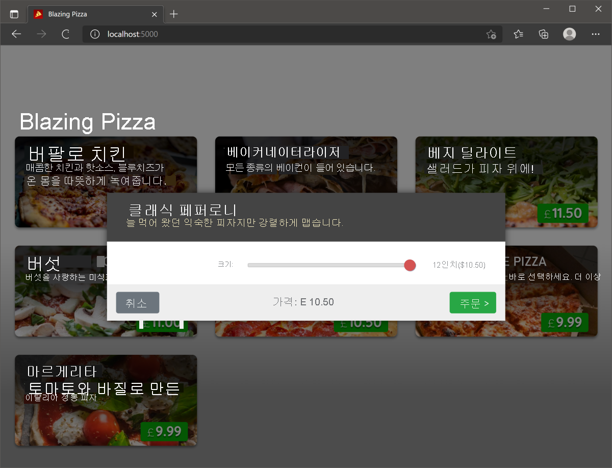

### 주문 상태 처리

현재, 앱은 구성 대화 상자를 표시하지만 피자를 취소하거나 피자 주문으로 이동할 수는 없습니다. 주문 상태를 관리하려면 새 주문 상태 컨테이너 서비스를 추가합니다.

1. 앱이 계속 실행되고 있으면 중지합니다.
2. BlazingPizza 폴더에 새 폴더를 만듭니다. 이름을 Services로 지정합니다.
3. Services 폴더에 새 파일을 만듭니다. 이름을 OrderState.cs로 지정합니다.
4. 클래스에 대해 다음 코드를 입력합니다.
    ```C#
    namespace BlazingPizza.Services;

    public class OrderState
    {
        public bool ShowingConfigureDialog { get; private set; }
        public Pizza ConfiguringPizza { get; private set; }
        public Order Order { get; private set; } = new Order();

        public void ShowConfigurePizzaDialog(PizzaSpecial special)
        {
            ConfiguringPizza = new Pizza()
            {
                Special = special,
                SpecialId = special.Id,
                Size = Pizza.DefaultSize,
                Toppings = new List<PizzaTopping>(),
            };

            ShowingConfigureDialog = true;
        }

        public void CancelConfigurePizzaDialog()
        {
            ConfiguringPizza = null;

            ShowingConfigureDialog = false;
        }

        public void ConfirmConfigurePizzaDialog()
        {
            Order.Pizzas.Add(ConfiguringPizza);
            ConfiguringPizza = null;

            ShowingConfigureDialog = false;
        }
    }
    ```
    현재 index.razor 구성 요소에 새 클래스로 이동할 수 있는 코드가 있음을 알 수 있습니다. 다음 단계는 앱에서 이 서비스를 사용할 수 있도록 하는 것입니다.
5. 파일 탐색기에서 Program.cs를 선택합니다.
6. builder.Services.로 시작하는 줄이 있는 파일 부분에 다음 줄을 추가합니다.
    ```C#
    builder.Services.AddScoped<OrderState>();
    ```
    이전 연습에서는 여기에 데이터베이스 컨텍스트를 추가했습니다. 이 코드는 새 OrderState 서비스를 추가합니다. 이 코드가 있으면 이제 index.razor 구성 요소에서 사용할 수 있습니다.
7. 다음 using 지시문을 파일의 맨 위에 추가하여 OrderState 클래스를 확인합니다.
    ```C#
    using BlazingPizza.Services;
    ```
8. 파일 탐색기에서 페이지를 확장한 다음, index.razor를 선택합니다.
9. 파일 맨 위에 있는 @inject NavigationManager NavigationManager 아래에 다음 코드를 추가합니다.
    ```razor
    @using BlazingPizza.Services
    @inject OrderState OrderState
    ```
10. @code 블록에서 configuringPizza, showingConfigureDialog, ShowConfigurePizzaDialog()를 제거합니다. 이제 다음과 같이 표시됩니다.
    ```razor
    @code {
        List<PizzaSpecial> specials = new List<PizzaSpecial>();

        protected override async Task OnInitializedAsync()
        {
            specials = await HttpClient.GetFromJsonAsync<List<PizzaSpecial>>(NavigationManager.BaseUri + "specials");
        }
    }
    ```
    이제 모든 코드가 삭제된 항목을 참조하는 오류가 있습니다.
11. OrderState 버전을 사용하도록 ShowConfigurePizzaDialog(special)) 호출을 변경합니다.
    ```razor
    <li @onclick="@(() => OrderState.ShowConfigurePizzaDialog(special))" style="background-image: url('@special.ImageUrl')">
    ```
12. 부울 showingConfigureDialog에 대한 참조를 변경합니다.
    ```razor
    @if (OrderState.ShowingConfigureDialog)
    ```
13. configuringPizza를 사용하여 매개 변수를 변경합니다.
    ```razor
    <ConfigurePizzaDialog Pizza="OrderState.ConfiguringPizza" />
    ```
14. F5를 선택하거나 실행을 선택합니다. 그런 다음, 디버깅 시작을 선택합니다.<br>모든 것이 올바르면 아무런 차이가 나타나지 않습니다. 대화 상자는 이전과 같이 표시됩니다.

### 피자 주문 취소 및 만들기

OrderState 클래스에서 아직 사용하지 않은 두 메서드가 있다는 것을 알아차렸을 것입니다. CancelConfigurePizzaDialog 및 ConfirmConfigurePizzaDialog 메서드는 고객이 주문을 확인하면 대화 상자를 닫고 Order 개체에 피자를 추가합니다. 이러한 메서드를 구성 대화 상자 단추에 연결해 보겠습니다.

1. 앱이 계속 실행되고 있으면 중지합니다.
2. 파일 탐색기에서 공유를 확장합니다. 그런 다음, ConfigurePizzaDialog.razor를 선택합니다.
3. @code 블록에서 다음과 같이 두 개의 새 매개 변수를 추가합니다.
    ```razor
    @code {
        [Parameter] public Pizza Pizza { get; set; }
        [Parameter] public EventCallback OnCancel { get; set; }
        [Parameter] public EventCallback OnConfirm { get; set; }
    }
    ```
4. 이제 단추에 @onclick 지시문을 추가할 수 있습니다. 대화 상자 단추의 현재 코드를 다음 태그로 변경합니다.
    ```razor
    <div class="dialog-buttons">
        <button class="btn btn-secondary mr-auto" @onclick="OnCancel">Cancel</button>
        <span class="mr-center">
            Price: <span class="price">@(Pizza.GetFormattedTotalPrice())</span>
        </span>
        <button class="btn btn-success ml-auto" @onclick="OnConfirm">Order ></button>
    </div>
    ```
5. 마지막 단계는 주문을 취소 및 확인하기 위한 OrderState 메서드를 전달하는 것입니다. 파일 탐색기에서 페이지를 확장합니다. 그런 다음, Index.razor를 선택합니다.
6. ConfigurePizzaDialog 구성 요소를 호출하기 위한 코드를 변경합니다.
    ```razor
        <ConfigurePizzaDialog
        Pizza="OrderState.ConfiguringPizza"
        OnCancel="OrderState.CancelConfigurePizzaDialog"
        OnConfirm="OrderState.ConfirmConfigurePizzaDialog" />
    ```
7. F5를 선택하거나 실행을 선택합니다. 그런 다음, 디버깅 시작을 선택합니다.

이제 앱에서 고객이 주문에서 구성된 피자를 취소하거나 추가할 수 있습니다. 피자 사이즈가 변경되면 현재 주문을 표시하거나 가격을 업데이트할 방법이 없습니다. 다음 연습에서는 이러한 기능을 추가합니다.

---
## Blazor 애플리케이션의 컨트롤을 데이터에 바인딩

Blazor를 사용하면 변경되는 값이 UI(사용자 인터페이스)에 자동으로 표시되도록 HTML 컨트롤을 속성에 바인딩할 수 있습니다.

고객의 피자 선호에 대한 정보를 수집하는 페이지를 개발한다고 가정합니다. 데이터베이스에서 정보를 로드하고 고객이 즐겨찾는 토핑을 기록하는 등 변경을 할 수 있도록 하려고 합니다. 데이터베이스에서 사용자에 의한 변경 또는 업데이트가 있는 경우 UI에 가능한 한 빨리 새 값을 표시하려고 합니다.

이 단원에서는 Blazor에서 데이터 바인딩을 사용하여 UI 요소를 데이터 값, 속성 또는 식에 연결하는 방법을 알아봅니다.

### 데이터 바인딩이란?

HTML 요소가 값을 표시하도록 하려면 디스플레이를 변경하는 코드를 작성할 수 있습니다. 값이 변경될 때 디스플레이를 업데이트하려면 추가 코드를 작성해야 합니다. Blazor에서 데이터 바인딩을 사용하여 HTML 요소를 필드, 속성 또는 식에 연결할 수 있습니다. 이렇게 하면 값이 변경될 때 HTML 요소가 자동으로 업데이트됩니다. 업데이트는 일반적으로 변경 후 빠르게 이루어지며 업데이트 코드를 작성할 필요가 없습니다.

컨트롤을 바인딩하려면 @bind 지시문을 사용합니다.

```razor
@page "/"

<p>
    Your email address is:
    <input @bind="customerEmail" />
</p>

@code {
    private string customerEmail = "user@contoso.com"
}
```

앞 페이지에서 customerEmail 변수의 값이 변경될 때마다 \<input> 값이 업데이트됩니다.

```
참고

<input> 같은 컨트롤은 필드의 값이 변경될 때가 아니라 구성 요소가 렌더링될 때만 해당 디스플레이를 업데이트합니다. Blazor 구성 요소는 이벤트 처리기 코드가 실행된 후 렌더링되므로 실제로 업데이트는 일반적으로 빠르게 표시됩니다.
```

### 특정 이벤트에 요소를 바인딩

@bind 지시문은 스마트하며 사용하는 컨트롤을 이해합니다. 예를 들어 값을 \<input> 텍스트 상자에 바인딩하면 value 특성이 바인딩됩니다. HTML 확인란 \<input>에는 value 특성 대신 checked 특성이 있습니다. @bind 특성은 이 checked 특성을 대신 자동으로 사용합니다. 기본적으로 컨트롤은 DOM onchange 이벤트에 바인딩됩니다. 예를 들어 다음 페이지를 생각해 보세요.

```razor
@page "/"

<h1>My favorite pizza is: @favPizza</h1>

<p>
    Enter your favorite pizza:
    <input @bind="favPizza" />
</p>

@code {
    private string favPizza { get; set; } = "Margherita"
}
```

페이지가 렌더링되면 기본값 Margherita가 \<h1> 요소 및 텍스트 상자 모두에 표시됩니다. 텍스트 상자에 새 즐겨찾는 피자를 입력하면 텍스트 상자 밖을 탭하거나 Enter 키를 선택할 때까지는 \<h1> 요소가 변경되지 않습니다. 그 시점에 onchange DOM 이벤트가 발생하기 때문입니다.

이것이 원하는 동작인 경우가 많습니다. 하지만 텍스트 상자에 문자를 입력하는 즉시 \<h1> 요소를 업데이트하려 한다고 가정합니다. 대신 oninput DOM 이벤트에 바인딩하여 이 결과를 얻을 수 있습니다. 이 이벤트에 바인딩하려면 @bind-value 및 @bind-value:event 지시문을 사용해야 합니다.

```razor
@page "/"

<h1>My favorite pizza is: @favPizza</h1>

<p>
    Enter your favorite pizza:
    <input @bind-value="favPizza" @bind-value:event="oninput" />
</p>

@code {
    private string favPizza { get; set; } = "Margherita"
}
```
이 경우 텍스트 상자에 문자를 입력하는 즉시 제목이 변경됩니다.

### 바인딩된 값 서식 지정

사용자에게 날짜를 표시하는 경우 현지 데이터 형식을 사용할 수 있습니다. 예를 들어 요일이 앞에 오도록 날짜를 작성하는 것을 선호하는 영국 사용자를 위해 페이지를 작성한다고 가정합니다. @bind:format 지시문을 사용하여 단일 날짜 서식 문자열을 지정할 수 있습니다.

```razor
@page "/ukbirthdaypizza"

<h1>Order a pizza for your birthday!</h1>

<p>
    Enter your birth date:
    <input @bind="birthdate" @bind:format="dd-MM-yyyy" />
</p>

@code {
    private DateTime birthdate { get; set; } = new(2000, 1, 1);
}
```

```
참고

이 문서 작성 시 서식 문자열은 날짜 값에서만 지원됩니다. 나중에 통화 형식, 숫자 형식 및 기타 형식이 추가될 수 있습니다. 바인딩 형식에 대한 최신 내용을 확인하려면 Blazor 설명서의 [형식 문자열](https://learn.microsoft.com/ko-kr/aspnet/core/blazor/components/data-binding#format-strings-1)을 참조하세요.
```
@bind:format 지시문을 사용하는 대신 바인딩된 값의 서식을 지정하는 C# 코드를 작성할 수 있습니다. 다음 예제와 같이 멤버 정의에서 get 및 set 접근자를 사용합니다.

```razor
@page "/pizzaapproval"
@using System.Globalization

<h1>Pizza: @PizzaName</h1>

<p>Approval rating: @approvalRating</p>

<p>
    <label>
        Set a new approval rating:
        <input @bind="ApprovalRating" />
    </label>
</p>

@code {
    private decimal approvalRating = 1.0;
    private NumberStyles style = NumberStyles.AllowDecimalPoint | NumberStyles.AllowLeadingSign;
    private CultureInfo culture = CultureInfo.CreateSpecificCulture("en-US");
    
    private string ApprovalRating
    {
        get => approvalRating.ToString("0.000", culture);
        set
        {
            if (Decimal.TryParse(value, style, culture, out var number))
            {
                approvalRating = Math.Round(number, 3);
            }
        }
    }
}
```

다음 단원에서는 배운 내용을 적용합니다.

---
## 연습 - Blazor 애플리케이션의 컨트롤을 데이터에 바인딩

Blazing Pizza 앱은 고객이 피자를 수정하고 주문에 추가할 때 인터페이스를 업데이트해야 합니다. Blazor를 사용하면 HTML 컨트롤을 C# 속성에 바인딩하여 값이 변경되면 업데이트할 수 있습니다.

고객은 주문하는 피자와 선택하는 사이즈가 지불하는 가격에 어떤 영향을 미치는지 확인해야 합니다.

이 연습에서는 주문을 업데이트하고 편집할 수 있는 위치에 Blazing Pizza 앱을 제공합니다. 피자의 속성에 컨트롤을 바인딩하고 그 변경 내용에 따라 가격을 다시 계산하는 방법을 확인할 수 있습니다.

### 고객의 피자 주문 표시

고객이 주문에 추가한 모든 피자를 표시하는 사이드바를 추가하려고 합니다.

1. 앱이 계속 실행되고 있으면 중지합니다.
2. Visual Studio Code의 파일 탐색기에서 페이지를 확장한 다음, Index.razor를 선택합니다.
3. @if 및 @code 블록 간에 다음 코드를 추가합니다.
    ```razor
    <div class="sidebar">
        @if (order.Pizzas.Any())
        {
            <div class="order-contents">
                <h2>Your order</h2>

                @foreach (var configuredPizza in order.Pizzas)
                {
                <div class="cart-item">
                    <div class="title">@(configuredPizza.Size)" @configuredPizza.Special.Name</div>
                    <div class="item-price">
                        @configuredPizza.GetFormattedTotalPrice()
                    </div>
                </div>
                }
            </div>
        }
        else
        {
            <div class="empty-cart">Choose a pizza<br>to get started</div>
        }

        <div class="order-total @(order.Pizzas.Any() ? "" : "hidden")">
            Total:
            <span class="total-price">@order.GetFormattedTotalPrice()</span>
            <a href="checkout" class="@(OrderState.Order.Pizzas.Count == 0 ? "btn btn-warning disabled" : "btn btn-warning")">
                Order >
            </a>
        </div>
    </div>
    ```
    이 HTML은 페이지에 사이드바를 추가합니다. OrderState.Order에 피자가 있으면 이를 표시합니다. 주문이 없으면 고객에게 주문을 추가하라는 메시지가 표시됩니다.<br>
    구성 요소가 주문이 무엇인지 모르기 때문에 몇 가지 오류가 표시됩니다.
4. @code 블록에서 List\<PizzaSpecial> specials = new(); 아래에 다음 코드를 추가합니다.
    ```C#
    Order order => OrderState.Order;
    ```
5. F5를 선택하거나 실행을 선택합니다. 그런 다음, 디버깅 시작을 선택합니다.
    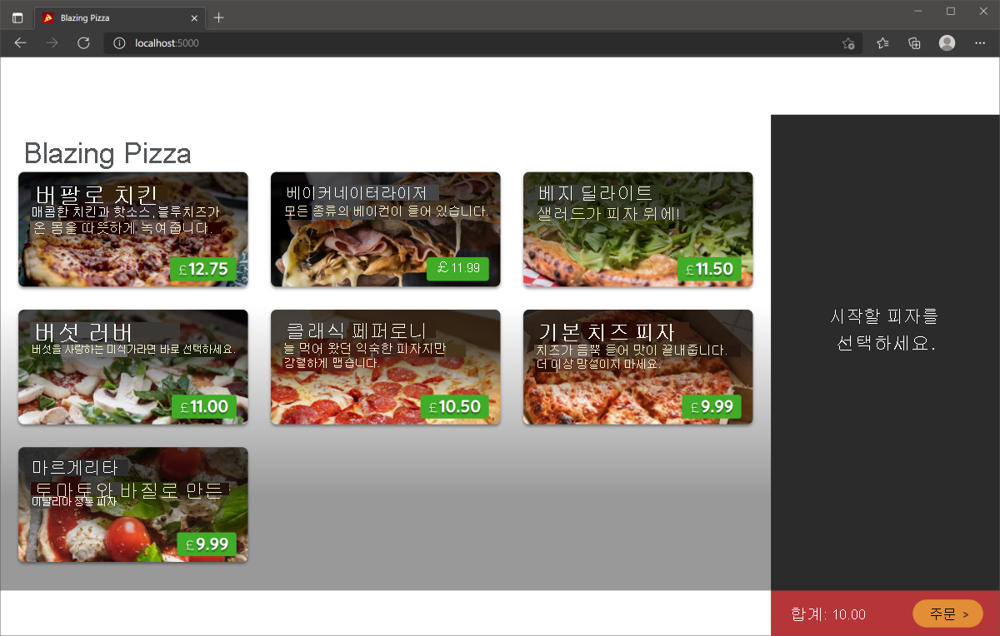
    몇몇 피자를 주문하고 일부를 취소해 보세요. 피자가 장바구니에 추가되고 주문 총액이 업데이트되는 것을 볼 수 있습니다.
6. Shift+F5를 누르거나 디버깅 중지를 선택합니다.

### 고객의 주문에서 피자 제거

고객의 장바구니에서 구성된 피자를 제거할 방법이 없다는 것을 알 수 있습니다. 이 기능을 추가해 보겠습니다.

첫 번째 단계는 주문에서 피자를 제거하는 방법을 제공할 수 있도록 OrderState 서비스를 업데이트하는 것입니다.

1. 파일 탐색기에서 Services/OrderState.cs를 선택합니다.
2. 클래스의 맨 아래에 다음 메서드를 추가합니다.
    ```C#
    public void RemoveConfiguredPizza(Pizza pizza)
    {
        Order.Pizzas.Remove(pizza);
    }
    ```
3. 파일 탐색기에서 페이지를 확장한 다음, index.razor를 선택합니다.
4. \<div class="cart-item">에서 닫는 \</div> 앞에 \<a> 태그를 추가하여 제거 단추를 만듭니다.
    ```razor
    <a @onclick="@(() => OrderState.RemoveConfiguredPizza(configuredPizza))" class="delete-item">x</a>
    ```
    이 태그는 주문 사이드바의 각 피자에 X를 추가합니다. 선택하면 OrderState 서비스에서 RemoveConfiguredPizza 메서드를 호출합니다.
5. F5를 선택하거나 실행을 선택합니다. 그런 다음, 디버깅 시작을 선택합니다.
    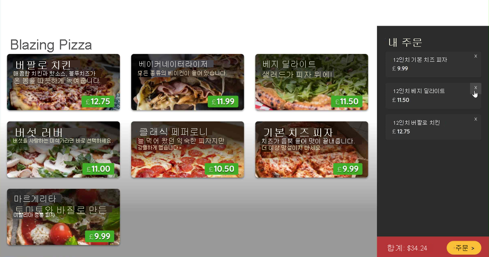
6. Shift+F5를 누르거나 디버깅 중지를 선택합니다.

### 동적으로 피자 사이즈 구성

사이즈 슬라이더가 변경될 때 피자 구성 대화 상자가 업데이트되지 않습니다. 구성 요소에는 피자, 사이즈를 업데이트한 다음, 가격을 다시 계산하는 방법이 필요합니다.

1. 파일 탐색기에서 공유를 확장한 다음, ConfigurePizzaDialog.razor를 선택합니다.
2. input HTML 컨트롤에 코드를 추가하여 해당 값을 피자 사이즈에 바인딩합니다.
    ```razor
    <input type="range" min="@Pizza.MinimumSize" max="@Pizza.MaximumSize" step="1" @bind="Pizza.Size"/>
    ```
3. F5를 선택하거나 실행을 선택합니다. 그런 다음, 디버깅 시작을 선택합니다.<br>
    업데이트된 대화 상자를 사용하여 주문에 다른 사이즈의 피자를 추가합니다. 끌기 대신 슬라이더 막대를 클릭합니다. 컨트롤에서의 마우스 위로 이벤트로 피자 사이즈가 업데이트되는 것을 관찰합니다.<br>
    슬라이더를 끌면 마우스를 놓을 때까지 사이즈가 변경되지 않습니다. 문제를 해결해 보겠습니다.
4. Shift+F5를 누르거나 디버깅 중지를 선택합니다.
5. 컨트롤을 바인딩해야 하는 이벤트를 추가합니다.
    ```razor
    <input type="range" min="@Pizza.MinimumSize" max="@Pizza.MaximumSize" step="1" @bind="Pizza.Size" @bind:event="oninput" />
    ```
6. F5를 선택하거나 실행을 선택합니다. 그런 다음, 디버깅 시작을 선택합니다.
    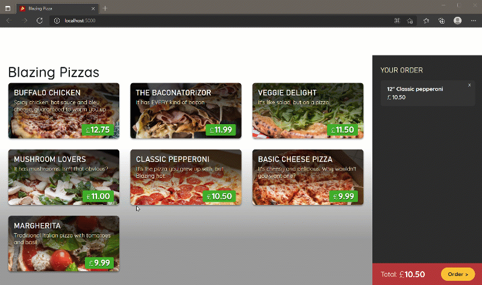

@bind="Pizza.Size" 코드를 추가한 것이 어떻게 그 많은 기능을 제공했나요? ConfigurePizzaDialog.razor 코드 전체를 살펴보면 팀에서 이미 다른 요소를 피자의 속성에 연결한 것을 확인할 수 있습니다.

예를 들어 이 코드로 인해 가격이 업데이트됩니다.
```razor
Price: <span class="price">@(Pizza.GetFormattedTotalPrice())</span>
```
피자에 대한 메서드 GetFormattedTotalPrice()는 피자 사이즈를 사용하여 총 가격을 계산하기 때문에 피자 사이즈 변경에 따라 가격이 업데이트됩니다.

Blazing Pizza 앱이 개선되었습니다. 계속 개선하려면 이 학습 경로의 다음 모듈을 완료하세요.

---
## 요약

귀하는 새로운 웹 사이트를 원하는 피자 배달 회사에서 일하고 있고 C#에 대한 다년간의 경험을 보유한 팀이 있습니다. Blazor를 선택하면 클라이언트 쪽 코드와 서버 쪽 코드를 C#으로 작성하고 JavaScript 코드를 최소화할 수 있습니다.

Blazor 이전에는 개발자에게 JavaScript 및 기타 웹 기술을 교육하는 데 투자해야 했습니다. Blazor에서는 이 교육이 필요하지 않습니다. 그리고 Blazor는 웹 애플리케이션 개발 프로젝트를 가속화하는 데 도움이 될 수 있습니다.

이 모듈을 완료하면 다음을 수행하는 방법을 알 수 있습니다.
 - Blazor 구성 요소를 만들어 웹앱의 사용자 인터페이스를 어셈블합니다.
 - 웹앱에 표시할 데이터에 액세스합니다.
 - 웹앱의 데이터를 여러 Blazor 구성 요소 간에 공유합니다.
 - Blazor 구성 요소의 변수에 HTML 요소를 바인딩합니다.

### 자세한 정보
 - [ASP.NET Core Blazor 소개](https://learn.microsoft.com/ko-kr/aspnet/core/blazor/)
 - [ASP.NET Core Razor 구성 요소](https://learn.microsoft.com/ko-kr/aspnet/core/blazor/components/)
 - [ASP.NET Core Blazor 호스팅 모델](https://learn.microsoft.com/ko-kr/aspnet/core/blazor/hosting-models)
 - [ASP.NET Core Blazor 연계 값 및 매개 변수](https://learn.microsoft.com/ko-kr/aspnet/core/blazor/components/cascading-values-and-parameters)
 - [ASP.NET Core Blazor 데이터 바인딩](https://learn.microsoft.com/ko-kr/aspnet/core/blazor/components/data-binding)
 - [Blazor - 앱 빌딩 워크샵](https://github.com/dotnet-presentations/blazor-workshop)

---
## 출처
[Microsoft learn Blazor 웹앱에서 데이터와 상호 작용](https://learn.microsoft.com/ko-kr/training/modules/interact-with-data-blazor-web-apps/)

---
## [다음](./05_페이지_라우팅_및_레이아웃을_사용하여_Blazor_탐색_개선.md)