# Blazor 웹앱에서 폼 및 유효성 검사의 작동 방식 개선

## 목차
- [Blazor 웹앱에서 폼 및 유효성 검사의 작동 방식 개선](#blazor-웹앱에서-폼-및-유효성-검사의-작동-방식-개선)
  - [목차](#목차)
  - [소개](#소개)
    - [학습 목표](#학습-목표)
  - [Blazor 이벤트 처리기를 사용하여 C# 코드를 DOM 이벤트에 연결](#blazor-이벤트-처리기를-사용하여-c-코드를-dom-이벤트에-연결)
    - [Blazor 및 C#을 사용하여 이벤트 처리](#blazor-및-c을-사용하여-이벤트-처리)
    - [JavaScript에서의 이벤트 처리와 Blazor를 사용한 이벤트 처리의 차이 이해](#javascript에서의-이벤트-처리와-blazor를-사용한-이벤트-처리의-차이-이해)
    - [비동기식으로 이벤트 처리](#비동기식으로-이벤트-처리)
    - [이벤트를 사용하여 DOM 요소에 포커스 설정](#이벤트를-사용하여-dom-요소에-포커스-설정)
    - [인라인 이벤트 처리기 작성](#인라인-이벤트-처리기-작성)
    - [이벤트에 대한 기본 DOM 작업 재정의](#이벤트에-대한-기본-dom-작업-재정의)
    - [EventCallback을 사용하여 구성 요소 간에 이벤트 처리](#eventcallback을-사용하여-구성-요소-간에-이벤트-처리)
  - [연습 - onclick 이벤트에 대한 Blazor 이벤트 처리기 만들기](#연습---onclick-이벤트에-대한-blazor-이벤트-처리기-만들기)
    - [팀의 기존 앱 복제](#팀의-기존-앱-복제)
    - [체크 아웃 페이지 리팩터링](#체크-아웃-페이지-리팩터링)
    - [새 체크 아웃 페이지 테스트](#새-체크-아웃-페이지-테스트)
    - [양식의 유용성 향상](#양식의-유용성-향상)
  - [Blazor 양식의 강력한 기능을 활용](#blazor-양식의-강력한-기능을-활용)
    - [EditForm이란?](#editform이란)
    - [데이터 바인딩을 사용하여 EditForm 만들기](#데이터-바인딩을-사용하여-editform-만들기)
    - [Blazor 입력 컨트롤 이해](#blazor-입력-컨트롤-이해)
    - [양식 제출 처리](#양식-제출-처리)
  - [연습 - Blazor 구성 요소를 사용하여 주소 양식 만들기](#연습---blazor-구성-요소를-사용하여-주소-양식-만들기)
    - [Blazor EditForm 구성 요소 추가](#blazor-editform-구성-요소-추가)
    - [HTML 요소를 Blazor 구성 요소로 바꾸기](#html-요소를-blazor-구성-요소로-바꾸기)
    - [양식을 제출하기 전에 빈 필드 확인](#양식을-제출하기-전에-빈-필드-확인)
  - [출처](#출처)
  - [다음](#다음)

---
## 소개

Blazor를 사용하면 .NET을 사용하여 대화형 웹 애플리케이션을 만들 수 있습니다. 클라이언트 쪽 JavaScript 라이브러리를 관리하는 복잡성 없이 서버 쪽 및 클라이언트 쪽 모두에서 앱 논리를 공유할 수 있습니다.

피자 배달 회사에서 고객 대면 웹 사이트를 개선하기 위해 고용되었다고 가정합니다. 주문에서 주소 세부 정보를 입력할 때 고객 경험을 향상시키라는 요청을 받았습니다. 구체적으로 말하면 회사는 과거에 기록되어 좋지 않은 고객 경험을 제공한 주문의 빈 주소를 중지해야 합니다.

이 모듈에서는 Blazor 이벤트 처리기에 대해 알아보고 유효성 검사에 Blazor 양식의 기능을 사용하는 방법을 살펴봅니다.

### 학습 목표
이 세션을 마치면 다음을 수행할 수 있습니다.

 - Blazor 이벤트 처리기를 사용하여 앱의 대화형 작업을 개선합니다.
 - Blazor 양식을 사용하여 데이터 입력 활성화.
 - 서버 및 클라이언트 쪽 유효성 검사를 사용하여 Blazor 양식을 확장합니다.

---
## Blazor 이벤트 처리기를 사용하여 C# 코드를 DOM 이벤트에 연결

부분의 HTML 요소는 페이지 로딩이 완료되거나, 사용자가 단추를 클릭했거나, HTML 요소의 내용이 변경된 경우와 같이 중요한 일이 발생할 때 트리거되는 이벤트를 노출합니다. 앱은 다음과 같은 여러 가지 방법으로 이벤트를 처리할 수 있습니다.

 - 앱은 이벤트를 무시할 수 있습니다.
 - 앱은 JavaScript로 작성된 이벤트 처리기를 실행하여 이벤트를 처리할 수 있습니다.
 - 앱은 C#으로 작성된 Blazor 이벤트 처리기를 실행하여 이벤트를 처리할 수 있습니다.

이 단원에서는 세 번째 옵션, 즉 C#에서 Blazor 이벤트 처리기를 만들어 이벤트를 처리하는 방법을 자세히 살펴봅니다.

### Blazor 및 C#을 사용하여 이벤트 처리

Blazor 앱의 HTML 태그에 있는 각 요소는 여러 이벤트를 지원합니다. 이러한 이벤트는 대부분 일반 웹 애플리케이션에서 사용할 수 있는 DOM 이벤트에 해당하지만 코드를 작성하여 트리거되는 사용자 정의 이벤트를 만들 수도 있습니다. Blazor를 사용하여 이벤트를 캡처하려면 이벤트를 처리하는 C# 메서드를 작성한 다음 Blazor 지시문을 사용하여 이벤트를 메서드에 바인딩합니다. DOM 이벤트의 경우 Blazor 지시문은 @onkeydown 또는 @onfocus 같은 동등한 HTML 이벤트와 동일한 이름을 공유합니다. 예를 들어 Blazor Server 앱을 사용하여 생성된 샘플 앱은 Counter.razor 페이지에 다음 코드를 포함합니다. 이 페이지에는 단추가 표시됩니다. 사용자가 단추를 선택하면 @onclick 이벤트는 단추를 클릭한 횟수를 나타내는 카운터를 증가시키는 IncrementCount 메서드를 트리거합니다. 카운터 변수의 값은 페이지에서 \<p> 요소에 의해 표시됩니다.

```razor
@page "/counter"

<h1>Counter</h1>

<p>Current count: @currentCount</p>

<button class="btn btn-primary" @onclick="IncrementCount">Click me</button>

@code {
    private int currentCount = 0;

    private void IncrementCount()
    {
        currentCount++;
    }
}
```

많은 이벤트 처리기 메서드는 추가 컨텍스트 정보를 제공하는 매개 변수를 사용합니다. 이 매개 변수를 EventArgs 매개 변수라고 합니다. 예를 들어, @onclick 이벤트는 사용자가 클릭한 단추에 대한 정보를 전달하거나, 단추를 클릭할 때 Ctrl 또는 Alt와 같은 버튼을 함께 눌렀는지 여부에 대한 정보를 MouseEventArgs 매개 변수로 전달합니다. 메서드를 호출할 때는 이 매개 변수를 제공할 필요가 없습니다. Blazor 런타임은 자동으로 이를 추가합니다. 이 매개 변수는 이벤트 처리기에서 쿼리할 수 있습니다. 다음 코드는 사용자가 버튼을 클릭할 때 Ctrl 키를 함께 누르는 경우 이전 예제에 표시된 카운터를 5씩 증가시킵니다.

```razor
@page "/counter"

<h1>Counter</h1>

<p>Current count: @currentCount</p>

<button class="btn btn-primary" @onclick="IncrementCount">Click me</button>


@code {
    private int currentCount = 0;

    private void IncrementCount(MouseEventArgs e)
    {
        if (e.CtrlKey) // Ctrl key pressed as well
        {
            currentCount += 5;
        }
        else
        {
            currentCount++;
        }
    }
}
```

다른 이벤트는 다른 EventArgs 매개 변수를 제공합니다. 예를 들어, @onkeypress 이벤트는 사용자가 누른 키를 나타내는 KeyboardEventArgs 매개 변수를 전달합니다. DOM 이벤트의 경우 이 정보가 필요하지 않으면 이벤트 처리 메서드에서 EventArgs 매개 변수를 생략하면 됩니다.

### JavaScript에서의 이벤트 처리와 Blazor를 사용한 이벤트 처리의 차이 이해

기존 웹 애플리케이션은 JavaScript를 사용하여 이벤트를 캡처하고 처리합니다. HTML <스크립트> 요소의 일부로 함수를 만든 다음 이벤트가 발생할 때 해당 함수를 호출하도록 합니다. 앞의 Blazor 예제와 비교하기 위해 다음 코드는 값을 증분하고 사용자가 내 클릭 단추를 선택할 때마다 결과를 표시하는 HTML 페이지의 조각을 표시합니다. 이 코드는 jQuery 라이브러리를 사용하여 DOM에 액세스합니다.

```html
<p id="currentCount">Current count: 0</p>

<button class="btn btn-primary" onclick="incrementCount()">Click me</button>

<!-- Omitted for brevity -->

<script src="https://code.jquery.com/jquery-3.6.0.min.js"></script>
<script>
    var currentCount = 0;

    function incrementCount() {
        currentCount++;
        $('#currentCount').html('Current count:' + currentCount);
    }
</script>
```
두 버전의 이벤트 처리기에서 구문상 차이점 외에도 다음과 같은 기능 차이를 식별해야 합니다.

 - JavaScript는 이벤트 이름 앞에 @ 기호를 붙이지 않으며 이는 Blazor 지시문이 아닙니다.
 - Blazor 코드에서 이벤트에 연결할 때 이벤트 처리 메서드의 이름을 지정합니다. JavaScript에서는 이벤트 처리 메서드를 호출하는 문을 작성하고 둥근 대괄호와 필요한 매개 변수를 지정합니다.
 - 가장 중요한 점은 JavaScript 이벤트 처리기는 클라이언트의 브라우저에서 실행된다는 것입니다. Blazor Server 앱을 빌드하는 경우 Blazor 이벤트 처리기는 서버에서 실행되며 이벤트 처리기가 완료된 경우 UI에 대한 변경 내용으로만 브라우저를 업데이트합니다. 또한 Blazor 메커니즘을 사용하면 이벤트 처리기가 세션 간에 공유되는 고정적인 데이터에 액세스할 수 있지만 JavaScript 모델은 그렇지 않습니다. 그러나 @onmousemove와 같이 자주 발생하는 일부 이벤트를 처리하면 서버로의 네트워크 왕복이 필요하기 때문에 사용자 인터페이스가 느려질 수 있습니다. JavaScript를 사용하여 브라우저에서 이와 같은 이벤트를 처리하는 것이 좋습니다.

```
중요

이벤트 처리기에서 JavaScript 코드를 사용하여 DOM을 조작할 수 있을 뿐 아니라 C# Blazor 코드를 사용하여 DOM을 조작할 수도 있습니다. 하지만 Blazor는 필요한 경우 사용자 인터페이스를 새로 고치는 데 사용되는 DOM의 자체 복사본을 유지 관리합니다. JavaScript 및 Blazor 코드를 사용하여 DOM에서 동일한 요소를 변경하는 경우 DOM이 손상될 위험이 있으며 웹앱에서 데이터의 프라이버시 및 보안이 손상될 수도 있습니다.
```

### 비동기식으로 이벤트 처리

기본적으로 Blazor 이벤트 처리기는 동기식입니다. 이벤트 처리기가 잠재적으로 장기 실행 작업(예: 웹 서비스 호출)을 수행하는 경우 작업이 완료될 때까지 이벤트 처리기를 실행하는 스레드가 차단됩니다. 이로 인해 사용자 인터페이스에서 응답이 잘못될 수 있습니다. 이를 위해 이벤트 처리기 메서드를 비동기식으로 지정할 수 있습니다. C# async 키워드를 사용합니다. 메서드는 Task 개체를 반환해야 합니다. 그런 다음 이벤트 처리기 메서드 내에서 await 연산자를 사용하여 별도의 스레드에서 장기 실행 작업을 시작하고 다른 작업을 위해 현재 스레드를 해제할 수 있습니다. 장기 실행 작업이 완료되면 이벤트 처리기가 다시 시작됩니다. 아래 예제 이벤트 처리기는 시간이 많이 걸리는 메서드를 비동기식으로 실행합니다.

```razor
<button @onclick="DoWork">Run time-consuming operation</button>

@code {
    private async Task DoWork()
    {
        // Call a method that takes a long time to run and free the current thread
        var data = await timeConsumingOperation();

        // Omitted for brevity
    }
}
```

```
참고

C#에서 비동기 메서드를 만드는 방법에 대한 자세한 내용은 [비동기 프로그래밍 시나리오](https://learn.microsoft.com/ko-kr/dotnet/csharp/asynchronous-programming/async-scenarios)를 참조하세요.
```
### 이벤트를 사용하여 DOM 요소에 포커스 설정

HTML 페이지에서 사용자는 요소 사이를 탭할 수 있으며, HTML 요소가 페이지에 나타나는 순서대로 포커스가 자연스럽게 이동합니다. 경우에 따라 이 시퀀스를 재정의하고 사용자가 특정 요소를 방문하도록 강제해야 할 수 있습니다.

이 작업을 수행하는 가장 간단한 방법은 FocusAsync 메서드를 사용하는 것입니다. 이 메서드는 ElementReference 개체의 인스턴스 메서드입니다. ElementReference는 포커스를 설정할 항목을 참조해야 합니다. @ref 특성을 사용하여 요소 참조를 지정하고 코드에서 이름이 같은 C# 개체를 만듭니다.

다음 예제에서는 <단추> 요소에 대한 @onclick 이벤트 처리기가 <입력> 요소에 포커스를 설정합니다. <입력> 요소의 @onfocus 이벤트 처리기는 해당 요소가 포커스를 받을 때 “포커스를 받았습니다” 라는 메시지를 표시합니다. <입력> 요소는 코드의 InputField 변수를 통해 참조됩니다.

```razor
<button class="btn btn-primary" @onclick="ChangeFocus">Click me to change focus</button>
<input @ref=InputField @onfocus="HandleFocus" value="@data"/>

@code {
    private ElementReference InputField;
    private string data;

    private async Task ChangeFocus()
    {
        await InputField.FocusAsync();
    }

    private async Task HandleFocus()
    {
        data = "Received focus";
    }
}
```
다음 이미지는 사용자가 단추를 선택할 때의 결과를 보여줍니다.
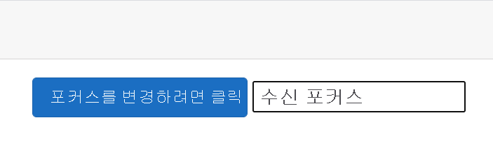
```
참고

앱은 오류 발생 후 사용자에게 입력을 수정하도록 요청하는 등 특정 이유로 특정 컨트롤에만 포커스를 보내야 합니다. 포커스를 사용하여 사용자가 고정된 순서로 페이지의 요소를 탐색하도록 하지마세요. 이렇게 하면 요소를 다시 검토하여 입력을 변경하려는 사용자에게 매우 번거로운 일이 될 수 있습니다.
```

### 인라인 이벤트 처리기 작성

C#은 람다 식을 지원합니다. 람다 식을 사용하면 익명 함수를 만들 수 있습니다. 람다 식은 페이지 또는 구성 요소의 다른 곳에서 다시 사용할 필요가 없는 간단한 이벤트 처리기가 있는 경우에 유용합니다. 이 단원의 시작 부분에 표시된 초기 클릭 횟수 예제에서 IncrementCount 메서드를 제거하고 메서드 호출을 동일한 작업을 수행하는 람다 식으로 바꿀 수 있습니다.

```razor
@page "/counter"

<h1>Counter</h1>

<p>Current count: @currentCount</p>

<button class="btn btn-primary" @onclick="() => currentCount++">Click me</button>

@code {
    private int currentCount = 0;
}
```
```
참고

람다 식의 작동 방식에 대한 자세한 내용은 [람다 식 및 익명 함수](https://learn.microsoft.com/ko-kr/dotnet/csharp/language-reference/operators/lambda-expressions)에서 확인하세요.
```

이 방법은 이벤트 처리 메서드에 대한 다른 인수를 제공하려는 경우에도 유용합니다. 다음 예제에서 메서드 HandleClick은 일반 클릭 이벤트 처리기와 동일한 방식으로 MouseEventArgs 매개 변수를 사용하지만 문자열 매개 변수도 허용합니다. 이 메서드는 이전처럼 클릭 이벤트를 처리하지만 사용자가 Ctrl 키를 눌렀는지 여부에 대한 메시지도 표시합니다. 람다 식은 HandleCLick 메서드를 호출하여 MouseEventArgs 매개 변수(mouseEvent) 및 문자열을 전달합니다.

```razor
@page "/counter"
@inject IJSRuntime JS

<h1>Counter</h1>

<p id="currentCount">Current count: @currentCount</p>

<button class="btn btn-primary" @onclick='mouseEvent => HandleClick(mouseEvent, "Hello")'>Click me</button>

@code {
    private int currentCount = 0;

    private async Task HandleClick(MouseEventArgs e, string msg)
    {
        if (e.CtrlKey) // Ctrl key pressed as well
        {
            await JS.InvokeVoidAsync("alert", msg);
            currentCount += 5;
        }
        else
        {
            currentCount++;
        }
    }
}
```
```
 참고

이 예제에서는 Blazor에서 해당하는 함수가 없으므로 JavaScript alert 함수를 사용하여 메시지를 표시합니다. JavaScript interop를 사용하여 Blazor 코드에서 JavaScript를 호출합니다. 이 기술의 세부 정보는 별도 모듈의 주제입니다.
```

### 이벤트에 대한 기본 DOM 작업 재정의

여러 DOM 이벤트에는 해당 이벤트에 사용할 수 있는 이벤트 처리기가 있는지 여부에 관계없이 이벤트가 발생할 때 실행되는 기본 작업이 있습니다. 예를 들어 <입력> 요소의 @onkeypress 이벤트는 항상 사용자가 누른 키에 해당하는 문자를 표시하고 키 누름을 처리합니다. 다음 예제에서 @onkeypress 이벤트는 사용자의 입력을 대문자로 변환하는 데 사용됩니다. 또한 사용자가 @ 문자를 입력하면 이벤트 처리기가 경고를 표시합니다.

```razor
<input value=@data @onkeypress="ProcessKeyPress"/>

@code {
    private string data;

    private async Task ProcessKeyPress(KeyboardEventArgs e)
    {
        if (e.Key == "@")
        {
            await JS.InvokeVoidAsync("alert", "You pressed @");
        }
        else
        {
            data += e.Key.ToUpper();
        }
    }
}
```
이 코드를 실행하고 @ 키를 누르면 경고가 표시되지만 @ 문자도 입력에 추가됩니다. @ 문자 추가는 이 이벤트의 기본 동작입니다.

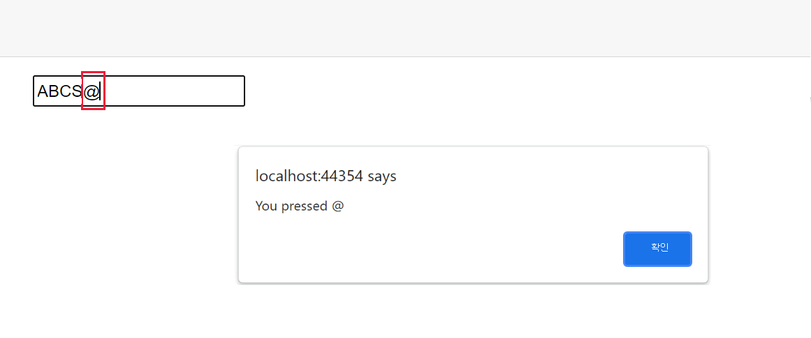

이 문자를 입력 상자에 표시하지 않으려는 경우 다음과 같이 이벤트의 preventDefault 특성으로 기본 작업을 재정의할 수 있습니다.

```razor
<input value=@data @onkeypress="ProcessKeyPress" @onkeypress:preventDefault />
```
이벤트는 계속 발생하지만 이벤트 처리기에서 정의한 작업만 수행됩니다.

DOM에서 자식 요소의 일부 이벤트는 부모 요소의 이벤트를 트리거할 수 있습니다. 다음 예제의 \<div> 요소에는 @onclick 이벤트 처리기가 포함됩니다. \<div> 내의 <단추>에는 자체 @onclick 이벤트 처리기가 있습니다. 또한 div\<div>에는 <입력> 요소가 포함됩니다.

```razor
<div @onclick="HandleDivClick">
    <button class="btn btn-primary" @onclick="IncrementCount">Click me</button>
    <input value=@data @onkeypress="ProcessKeyPress" @onkeypress:preventDefault />
</div>

@code {
    private async Task HandleDivClick()
    {
        await JS.InvokeVoidAsync("alert", "Div click");
    }

    private async Task ProcessKeyPress(KeyboardEventArgs e)
    {
        // Omitted for brevity
    }

    private int currentCount = 0;

    private void IncrementCount(MouseEventArgs e)
    {
        // Omitted for brevity
    }
}
```
앱이 실행될 때 사용자가 \<div> 요소가 차지하는 영역에서 한 요소(또는 빈 공간)를 클릭하면 HandleDivClick 메서드가 실행되고 메시지가 표시됩니다. 사용자가 Click me 단추를 선택하면 IncrementCount 메서드가 실행된 다음 HandleDivClick이 실행됩니다. @onclick 이벤트는 DOM 트리를 따라 전파됩니다. \<div>가 @onclick 이벤트를 처리한 다른 요소의 일부인 경우 해당 이벤트 처리기도 실행되며 이는 DOM 트리의 루트까지 반복됩니다. 다음과 같이 이벤트의 stopPropagation 특성으로 이벤트의 이러한 상향 확산을 줄일 수 있습니다.

```razor
<div @onclick="HandleDivClick">
    <button class="btn btn-primary" @onclick="IncrementCount" @onclick:stopPropagation>Click me</button>
    <!-- Omitted for brevity -->
</div>
```

### EventCallback을 사용하여 구성 요소 간에 이벤트 처리

Blazor 페이지에는 하나 이상의 Blazor 구성 요소가 포함될 수 있으며 구성 요소는 부모-자식 관계에 중첩될 수 있습니다. 자식 구성 요소의 이벤트는 EventCallback을 사용하여 부모 구성 요소에서 이벤트 처리기 메서드를 트리거할 수 있습니다. 콜백은 부모 구성 요소의 메서드를 참조합니다. 자식 구성 요소는 콜백을 호출하여 메서드를 실행할 수 있습니다. 이 메커니즘은 C# 애플리케이션에서 delegate를 사용하여 메서드를 참조하는 것과 비슷합니다.

콜백은 단일 매개 변수를 사용할 수 있습니다. EventCallback가 제네릭 형식인 경우 type 매개 변수는 콜백에 전달되는 인수의 형식을 지정합니다.

한 예로 다음 시나리오를 생각해 보겠습니다. 사용자가 입력 문자열을 입력하고 몇 가지 방식으로 해당 문자열을 변환할 수 있는 TextDisplay라는 구성 요소를 만들려고 합니다. 문자열을 대문자, 소문자, 대/소문자 혼합으로 변한하거나 문자열에서 문자를 필터링하거나 다른 유형의 변환을 수행해야 합니다. 그러나 TextDisplay 구성 요소에 대한 코드를 작성할 때 변환 프로세스가 무엇인지 알 수 없으며 대신 이 작업을 다른 구성 요소로 연기하려고 합니다. 다음 코드는 TextDisplay 구성 요소를 표시합니다. 사용자가 텍스트 값을 입력할 수 있는 <입력> 요소의 양식에 입력 문자열을 제공합니다.

```razor
@* TextDisplay component *@
@using WebApplication.Data;

<p>Enter text:</p>
<input @onkeypress="HandleKeyPress" value="@data" />

@code {
    [Parameter]
    public EventCallback<KeyTransformation> OnKeyPressCallback { get; set; }

    private string data;

    private async Task HandleKeyPress(KeyboardEventArgs e)
    {
        KeyTransformation t = new KeyTransformation() { Key = e.Key };
        await OnKeyPressCallback.InvokeAsync(t);
        data += t.TransformedKey;
    }
}
```

TextDisplay 구성 요소는 OnKeyPressCallback이라는 EventCallback 개체를 사용합니다. 메서드의 코드는 HandleKeypress 콜백을 호출합니다. 키를 누를 때마다 @onkeypress 이벤트 처리기가 실행되고 HandleKeypress 메서드를 호출합니다. HandleKeypress 메서드는 사용자가 누른 키를 사용하여 KeyTransformation 개체를 만들고 이 개체를 콜백에 매개 변수로 전달합니다. KeyTransformation 형식은 두 개의 필드가 있는 간단한 클래스입니다.

```C#
namespace WebApplication.Data
{
    public class KeyTransformation
    {
        public string Key { get; set; }
        public string TransformedKey { get; set; }
    }
}
```

key 필드에는 사용자가 입력한 값이 포함되며, TransformedKey 필드에는 키가 처리될 때 변환된 키의 값이 포함됩니다.

이 예제에서 EventCallback 개체는 구성 요소 매개 변수이며 구성 요소를 만들 때 해당 값이 제공됩니다. 이 작업은 TextTransformer라는 다른 구성 요소에 의해 수행됩니다.

```razor
@page "/texttransformer"
@using WebApplication.Data;

<h1>Text Transformer - Parent</h1>

<TextDisplay OnKeypressCallback="@TransformText" />

@code {
    private void TransformText(KeyTransformation k)
    {
        k.TransformedKey = k.Key.ToUpper();
    }
}
```

TextTransformer 구성 요소는 TextDisplay 구성 요소의 인스턴스를 만드는 Blazor 페이지입니다. OnKeypressCallback 매개 변수를 페이지의 코드 섹션에 있는 TransformText 메서드에 대한 참조로 채울 수 있습니다. TransformText 메서드는 제공된 KeyTransformation 개체를 인수로 사용하고, TransformedKey 속성을 대문자로 변환된 Key 속성의 값으로 채웁니다. 다음 다이어그램에서는 사용자가 TextTransformer 페이지에 표시되는 TextDisplay 구성 요소의 <입력> 필드에 값을 입력할 때의 컨트롤 흐름을 보여줍니다.

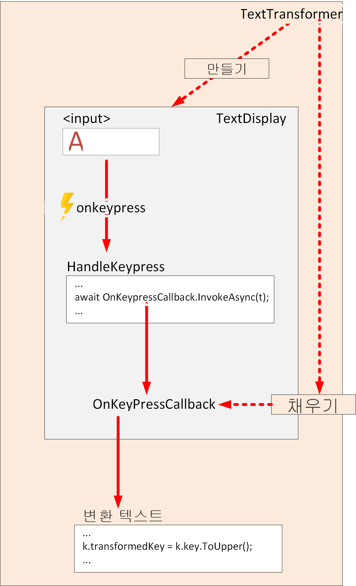

이 방법의 장점은 OnKeypressCallback 매개 변수에 대한 콜백을 제공하는 모든 페이지에서 TextDisplay 구성 요소를 사용할 수 있다는 것입니다. 디스플레이와 처리 작업은 완전히 분리되어 있습니다. TextDisplay 구성 요소에서 EventCallback 매개 변수의 서명과 일치하는 다른 콜백에 대해 TransformText 메서드를 전환할 수 있습니다.

콜백이 적절한 EventArgs 매개 변수를 사용하여 형식이 지정된 경우 중간 메서드를 사용하지 않고 콜백을 이벤트 처리기에 직접 연결할 수 있습니다. 예를 들어 자식 구성 요소는 다음과 같은 @onclick 마우스 이벤트를 처리할 수 있는 콜백을 참조할 수 있습니다.

```razor
<button @onclick="OnClickCallback">
    Click me!
</button>

@code {
    [Parameter]
    public EventCallback<MouseEventArgs> OnClickCallback { get; set; }
}
```

이 경우 EventCallback은 MouseEventArgs 형식 매개 변수를 사용합니다. 그러므로 @onclick 이벤트에 대한 처리기로 지정할 수 있습니다.

---
## 연습 - onclick 이벤트에 대한 Blazor 이벤트 처리기 만들기

Blazer에서는 C# 코드를 HTML DOM 이벤트에 연결할 수 있습니다. 이 기능을 사용하여 기존 앱을 개선합니다.

Blazing Pizza 앱을 개선하는 작업을 수행하는 개발 팀의 일원으로 고객의 주소를 캡처하는 체크 아웃 프로세스를 완료하라는 요청을 받았습니다. 일부 텍스트 필드를 추가하고 체크 아웃 프로세스를 개선합니다.

이 연습에서는 기존 앱을 복제하고 주소 세부 정보를 캡처하는 새 주소 구성 요소를 만듭니다. 필드가 준비되면서 양식의 첫 번째 필드에 포커스를 설정합니다.

### 팀의 기존 앱 복제

```
참고

이 모듈에서는 로컬 개발에 .NET CLI(명령줄 인터페이스) 및 Visual Studio Code를 사용합니다. 이 모듈을 완료하면 Visual Studio(Windows), Mac용 Visual Studio(macOS) 또는 Visual Studio Code(Windows, Linux 및 macOS)를 사용한 연속 개발을 사용하여 개념을 적용할 수 있습니다.
```

이 모듈에서는 .NET 6.0 SDK를 사용합니다. 기본 설정 터미널에서 다음 명령을 실행하여 .NET 6.0이 설치되어 있는지 확인합니다.

```bash
dotnet --list-sdks
```

그러면 다음과 같은 출력이 표시됩니다.

```
3.1.100 [C:\program files\dotnet\sdk]
5.0.100 [C:\program files\dotnet\sdk]
6.0.100 [C:\program files\dotnet\sdk]
```

6으로 시작하는 버전이 나열되어 있는지 확인합니다. 나열되는 버전이 없거나 명령을 찾을 수 없는 경우 [최신 .NET 6.0 SDK](https://dotnet.microsoft.com/download)를 설치합니다.

이전에 Blazor 앱을 만든 적이 없는 경우 [Blazor 설치 지침](https://aka.ms/blazor-getting-started)에 따라 올바른 버전의 .NET을 설치하고 컴퓨터가 올바르게 설정되었는지 확인합니다. 앱 만들기 단계에서 중지합니다.

1. Visual Studio Code를 사용하여 ASP.NET 5 API 앱을 만드는 방법을 보여줍니다.
2. 주 메뉴에서 보기를 선택한 다음 터미널을 선택하여 Visual Studio Code의 통합 터미널을 엽니다.
3. 터미널에서 프로젝트를 만들려는 위치로 이동합니다.
4. GitHub에서 앱을 복제합니다.
    ```bash
    git clone https://github.com/MicrosoftDocs/mslearn-use-forms-in-blazor-web-apps.git BlazingPizza
    ```
5. 파일을 선택한 폴더 열기...를 선택합니다.
6. 열기 대화 상자에서 BlazingPizza 폴더로 이동하고 폴더 선택을 선택합니다.<br>Visual Studio Code에서 해결되지 않은 종속성에 대한 메시지가 표시될 수 있습니다. 복원을 선택합니다.
7. 앱을 실행하여 모든 것이 제대로 작동하는지 확인합니다.
8. Visual Studio Code에서 F5 키를 누르거나 실행>디버깅 시작을 선택합니다.
    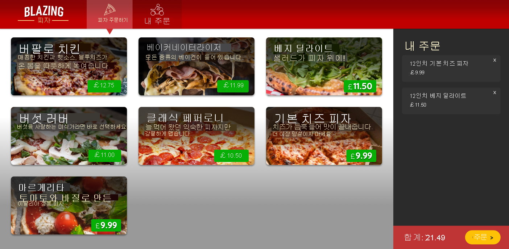
    일부 피자를 구성하고 주문에 추가해 봅니다. 페이지 하단에서 주문 >을 선택합니다. 현재 체크 아웃 페이지가 표시됩니다.
9. Shift + F5 키를 눌러 앱 실행을 중지합니다.

### 체크 아웃 페이지 리팩터링

1. Visual Studio Code의 파일 탐색기에서 페이지를 확장한 다음, Checkout.razor를 선택합니다.<br>현재, 체크 아웃 페이지에는 구성된 피자의 목록만 표시됩니다. 주소 섹션을 포함하도록 페이지를 리팩터링하라는 요청을 받았습니다.
2. 기존 HTML \<div class="main"> 블록을 두 개의 데이터 열로 바꿉니다.
    ```razor
    <div class="main">
        <div class="checkout-cols">
            <div class="checkout-order-details">
                <h4>Review order</h4>
                <OrderReview Order="Order" />
            </div>

            <div class="checkout-delivery-address">
                <h4>Deliver to...</h4>
                <AddressEditor Address="Order.DeliveryAddress" />
            </div>
        </div>

        <button class="checkout-button btn btn-warning" @onclick="PlaceOrder" disabled=@isSubmitting>
            Place order
        </button>
    </div>
    ```
    앞의 코드는 단추 요소의 HTML onclick 이벤트를 @code 블록의 PlaceOrder Blazor 메서드에 연결합니다.<br>
    리팩터링은 두 개의 새 Blazor 컨트롤 OrderReview 및 AddressEditor를 참조합니다. 피자를 나열한 이전의 체크 아웃 코드를 OrderReview 구성 요소로 이동합니다.
3. 파일 탐색기에서 공유를 마우스 오른쪽 단추로 클릭한 다음, 새 파일을 선택합니다.
4. 파일 이름으로 OrderReview.razor를 입력합니다.
5. 주문에서 피자를 표시하는 foreach 루프를 추가합니다.
    ```razor
    @foreach (var pizza in Order.Pizzas)
    {
        <p>
            <strong>
                @(pizza.Size)"
                @pizza.Special.Name
                (£@pizza.GetFormattedTotalPrice())
            </strong>
        </p>
    }

    <p>
        <strong>
            Total price:
            £@Order.GetFormattedTotalPrice()
        </strong>
    </p>

    @code {
        [Parameter] public Order Order { get; set; }
    }
    ```
6. 파일 탐색기에서 공유를 마우스 오른쪽 단추로 클릭한 다음, 새 파일을 선택합니다.
7. 파일 이름으로 AddressEditor.razor를 입력합니다.
8. 주소의 각 필드에 input 요소를 사용하는 코드를 추가합니다. 모델 폴더의 Address 클래스는 모든 필드를 표시합니다.
    ```razor
    <div class="form-field">
        <label>Name:</label>
        <div>
            <input @bind="Address.Name" />
        </div>
    </div>

    <div class="form-field">
        <label>Line 1:</label>
        <div>
            <input @bind="Address.Line1" />
        </div>
    </div>

    <div class="form-field">
        <label>Line 2:</label>
        <div>
            <input @bind="Address.Line2" />
        </div>
    </div>

    <div class="form-field">
        <label>City:</label>
        <div>
            <input @bind="Address.City" />
        </div>
    </div>

    <div class="form-field">
        <label>Region:</label>
        <div>
            <input @bind="Address.Region" />
        </div>
    </div>

    <div class="form-field">
        <label>Postal code:</label>
        <div>
            <input @bind="Address.PostalCode" />
        </div>
    </div>

    @code {
        [Parameter] public Address Address { get; set; }
    }
    ```

### 새 체크 아웃 페이지 테스트
1. Visual Studio Code에서 F5 키를 누르거나 실행>디버깅 시작을 선택합니다.
    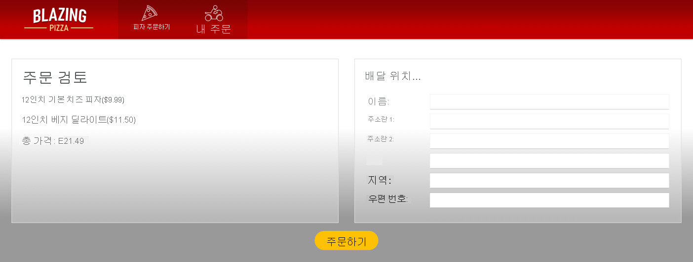
    피자를 추가하고 주문 >을 선택하여 새 체크 아웃 흐름을 확인합니다.
2. Shift + F5 키를 눌러 앱 실행을 중지합니다.

### 양식의 유용성 향상

고객은 체크 아웃 페이지로 이동되면 가장 먼저 이름을 입력합니다. Blazor를 사용하면 페이지의 HTML 요소에 포커스를 설정할 수 있습니다. 이를 추가하여 앱을 개선해 보겠습니다.

1. AddressEditor.razor에서 이름 input 요소의 HTML을 변경하여 @ref="startName"을(를) 추가합니다.
    ```razor
    <input @ref="startName" @bind="Address.Name" />
    ```
    Blazor 지시문 @ref="startName"을 사용하면 코드 블록이 입력 요소를 참조하는 ElementReference를 만들 수 있습니다. 그런 다음 이 요소 참조를 사용하여 페이지가 렌더링된 후 FocusAsync를 호출할 수 있습니다.
2. 페이지가 [Parameter] public Address Address { get; set; } 선언 아래에 로드된 후 FocusAsync를 호출할 코드를 추가합니다.
    ```razor
    private ElementReference startName;

    protected override async Task OnAfterRenderAsync(bool firstRender)
    {
        if (firstRender) {
            await startName.FocusAsync();
        }
    }
    ```
    다음 코드는 ElementReference를 만든 다음 페이지가 렌더링된 후 포커스를 Name 필드에 설정합니다.
3. Visual Studio Code에서 F5 키를 누르거나 실행>디버깅 시작을 선택합니다.
    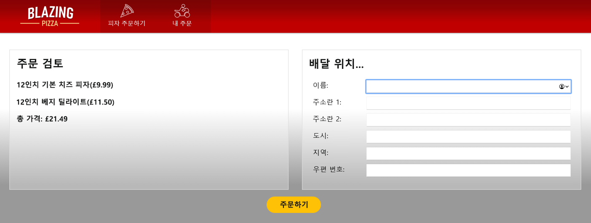
    피자를 추가하고 주문 >을 선택하여 체크 아웃 페이지에서 이름 양식 필드에 포커스가 있는지 확인합니다.
4. Shift + F5 키를 눌러 앱 실행을 중지합니다.

---
## Blazor 양식의 강력한 기능을 활용

사용자는 양식을 사용하여 데이터를 입력합니다. 클래식 웹앱에서는 \<form> 요소를 사용하여 양식을 만들고 \<input> 요소를 사용하여 사용자가 데이터를 입력할 수 있도록 합니다. 사용자가 양식을 제출하면 입력의 유효성을 검사할 수 있습니다. 유효성 검사에 성공하면 제공된 정보를 사용하여 데이터베이스에 새 항목을 추가하거나 레코드를 업데이트하는 등 적절한 작업을 수행할 수 있습니다.

\<form> 및 \<input> 요소가 제공하는 기능은 간단하지만 상대적으로 기본적입니다. Blazor는 \<EditForm> 구성 요소를 통해 양식의 기능을 확장합니다. 또한 Blazor는 사용자가 입력하는 데이터의 형식을 지정하고 유효성을 검사하는 데 사용할 수 있는 일련의 특수 입력 요소를 제공합니다.

이 단원에서는 \<EditForm> 요소와 입력 요소를 사용하여 기능 양식을 빌드하는 방법을 알아봅니다. 양식을 데이터 바인딩하는 방법도 알아봅니다.

### EditForm이란?
EditForm은 Blazor 페이지에서 HTML 양식의 역할을 수행하는 Blazor 구성 요소입니다. EditForm과 HTML 양식의 주요 차이점은 다음과 같습니다.

 - 데이터 바인딩: 개체를 EditForm과 연결할 수 있습니다. EditForm은 데이터 입력 및 표시를 위한 개체 보기처럼 작동합니다.
 - 유효성 검사: EditForm은 광범위하고 확장 가능한 유효성 검사 기능을 제공합니다. 유효성 검사 규칙을 지정하는 EditForm의 요소에 특성을 추가할 수 있습니다. EditForm은 이러한 규칙을 자동으로 적용합니다. 이 기능은 이 모듈의 이후 단원에서 설명합니다.
 - 양식 제출: HTML 양식은 제출될 때 양식 처리기에 게시 요청을 보냅니다. 이 양식 처리기는 제출 프로세스를 수행한 다음 결과를 표시해야 합니다. EditForm은 Blazor 이벤트 모델을 따릅니다. OnSubmit 이벤트를 캡처하는 C# 이벤트 처리기를 지정합니다. 이벤트 처리기는 제출 논리를 수행합니다.
 - 입력 요소: HTML 양식은 \<input> 컨트롤을 사용하여 사용자 입력을 수집하고, submit 단추를 사용하여 처리를 위해 양식을 게시합니다. EditForm은 이러한 동일한 요소를 사용할 수 있지만 Blazor는 기본 제공 유효성 검사 및 데이터 바인딩과 같은 다른 기능이 있는 입력 구성 요소 라이브러리를 제공합니다.

### 데이터 바인딩을 사용하여 EditForm 만들기

\<EditForm> 요소는 Model 매개 변수를 통해 데이터 바인딩을 지원합니다. 개체를 이 매개 변수의 인수로 지정합니다. EditForm의 입력 요소는 @bind-Value 매개 변수를 사용하여 모델에서 노출하는 속성 및 필드에 바인딩될 수 있습니다. 다음 예는 기본 Blazor Server 앱 템플릿으로 만들어진 WeatherForecast 클래스를 기반으로 합니다. 이 클래스는 다음과 같습니다.

```C#
public class WeatherForecast
{
    public DateTime Date { get; set; }

    public int TemperatureC { get; set; }

    public int TemperatureF => 32 + (int)(TemperatureC / 0.5556);

    public string Summary { get; set; }
}
```
EditForm의 모델은 @currentForecast 변수에 저장된 WeatherForecast 클래스의 인스턴스이며 입력 요소는 클래스의 필드에 바인딩됩니다.

```razor
@page "/fetchdata"

@using WebApplication.Data
@inject WeatherForecastService ForecastService

<h1>Weather forecast</h1>

<input type="number" width="2" min="0" max="@upperIndex" @onchange="ChangeForecast" value="@index"/>

<EditForm Model=@currentForecast>
    <InputDate @bind-Value=currentForecast.Date></InputDate>
    <InputNumber @bind-Value=currentForecast.TemperatureC></InputNumber>
    <InputText @bind-Value=currentForecast.Summary></InputText>
</EditForm>

@code {
    private WeatherForecast[] forecasts;
    private WeatherForecast currentForecast;
    private int index = 0;
    private int upperIndex = 0;

    protected override async Task OnInitializedAsync()
    {
        forecasts = await ForecastService.GetForecastAsync(DateTime.Now);
        currentForecast = forecasts[index];
        upperIndex = forecasts.Count() - 1;
    }

    private async Task ChangeForecast(ChangeEventArgs e)
    {
        index = int.Parse(e.Value as string);
        if (index <= upperIndex && index >= 0)
        {
            currentForecast = forecasts[index];
        }
    }
}
```

이 예제에서 OnInitialized 이벤트는 외부 서비스를 사용하여 WeatherForecast 개체의 배열을 채웁니다. currentForecast 변수는 배열의 첫 번째 항목으로 설정됩니다. 이 개체는 EditForm에 의해 표시됩니다. 사용자는 페이지의 EditForm 위쪽에 있는 숫자 입력 필드를 사용하여 배열을 순환할 수 있습니다. 이 필드의 값은 배열의 인덱스로 사용되며 currentForecast 변수는 ChangeForecast 메서드를 사용하여 해당 인덱스에서 찾은 개체로 설정됩니다.

다음 이미지는 실행 중인 페이지의 예를 보여 줍니다.

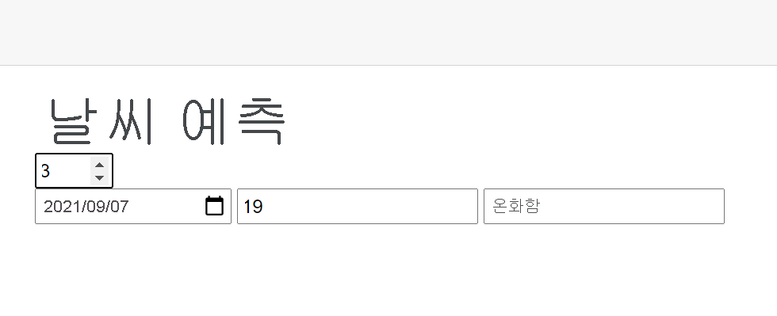

```
중요

EditForm 구성 요소는 양방향 데이터 바인딩을 구현합니다. 양식은 모델에서 검색된 값을 표시하지만 사용자는 양식에서 이러한 값을 업데이트할 수 있으며 해당 값은 모델로 다시 푸시됩니다.
```

### Blazor 입력 컨트롤 이해

HTML \<form> 요소는 사용자가 데이터를 입력할 수 있도록 \<input> 요소를 지원합니다. \<input>에는 입력 형식 및 표시 방법(숫자, 텍스트 상자, 라디오 단추, 확인란, 단추 등)을 지정하는 type 속성이 있습니다.

Blazor에는 특별히 \<EditForm> 요소와 작동하고 다른 기능 간에 데이터 바인딩을 지원하도록 설계된 자체 구성 요소 집합이 있습니다. 다음 표에는 이러한 구성 요소가 나열되어 있습니다. Blazor가 이러한 구성 요소가 포함된 페이지를 렌더링하면 테이블에 나열된 해당하는 HTML \<input> 요소로 변환됩니다. Blazor 구성 요소 중 일부는 제네릭 형식입니다. type 매개 변수는 요소에 바인딩된 데이터의 형식에 따라 Blazor 런타임에 의해 확인됩니다.

| 입력 구성 요소                | HTML로 렌더링됨               |
|-------------------------|--------------------------|
| InputCheckbox           | \<input type="checkbox">  |
| InputDate\<TValue>       | \<input type="date">      |
| InputFile               | \<input type="file">      |
| InputNumber\<TValue>     | \<input type="number">    |
| InputRadio\<TValue>      |\<input type="radio">     |
| InputRadioGroup\<TValue> | 자식 라디오 단추 그룹             |
| InputSelect\<TValue>     | \<select>                 |
| InputText               | \<input>                  |
| InputTextArea           | \<textarea>               |

이러한 각 요소에는 DisplayName(입력 요소를 레이블과 연결하는 데 사용됨) 및 @ref(C# 변수의 필드에 대한 참조를 저장하는 데 사용됨)와 같이 Blazor가 인식하는 특성이 있습니다. 인식할 수 없는 비 Blazor 특성은 HTML 렌더러에 변경되지 않고 전달됩니다. 즉, HTML 입력 요소 특성을 활용할 수 있습니다. 예를 들어, min, max 및 step 특성을 InputNumber 구성 요소에 추가하면 렌더링되는 \<input type="number"> 요소의 일부로 올바르게 작동합니다. 이전 예제에서는 TemperatureC 입력 필드를 다음과 같이 지정할 수 있었습니다.
```razor
<EditForm Model=@currentForecast>
    <InputNumber @bind-Value=currentForecast.TemperatureC width="5" min="-100" step="5"></InputNumber>
</EditForm>
```
다음 예제에서는 InputRadioGroup\<TValue> 및 InputRadio\<TValue> 구성 요소를 사용하는 방법을 보여줍니다. 일반적으로 라디오 단추 그룹을 사용하여 일련의 라디오 단추를 표시합니다. 각 단추를 사용하면 사용자가 지정된 집합에서 하나의 값을 선택할 수 있습니다. EditForm에는 여러 RadioButtonGroup\<TValue> 구성 요소가 포함될 수 있으며, 각 그룹은 EditForm용 모델의 필드에 바인딩될 수 있습니다. 다음 예에서는 의류 매장 앱의 세부 정보를 보여 줍니다. 양식은 티셔츠에 대한 데이터를 표시합니다. Shirt 모델 클래스는 다음과 같습니다.

```C#
public enum ShirtColor
{
    Red, Blue, Yellow, Green, Black, White
};

public enum ShirtSize
{
    Small, Medium, Large, ExtraLarge
};

public class Shirt
{
    public ShirtColor Color { get; set; }
    public ShirtSize Size { get; set; }
    public decimal Price;
}
```
티셔츠의 색상 및 사이즈는 열거형으로 지정됩니다. 다음 Razor 페이지에서 코드는 테스트 데이터 역할을 하는 Shirt 개체를 만듭니다. \<EditForm> 요소가 이 개체에 바인딩됩니다. 양식은 티셔츠의 사이즈, 색상 및 가격을 표시합니다. 첫 번째 \<InputRadioGroup> 요소는 Size 속성에 연결됩니다. foreach 루프는 열거형에서 가능한 값을 반복하고 각 값에 대한 \<InputRadio> 요소를 만듭니다. \<InputRadio> 요소의 Name 특성은 \<InputRadioGroup> 요소의 해당 특성과 일치해야 합니다. HTML 렌더러는 이 특성을 사용하여 그룹과 라디오 단추를 함께 연결합니다. 두 번째 \<InputRadioGroup> 요소는 Color 속성에 연결되며 동일한 기술을 사용하여 각 사이즈즈에 대한 라디오 단추를 생성합니다. 마지막 요소는 \<InputNumber> 요소를 사용하여 가격을 표시합니다. 이 요소는 HTML \<input> 요소와 함께 사용할 수 있는 max, min 및 step 특성을 적용합니다. 이 예제에서는 \<label> 요소를 사용하여 각 구성 요소와 연결된 값의 이름을 표시합니다.

```razor
<EditForm Model="@shirt">
    <label>
        <h3>Size</h3>
        <InputRadioGroup Name="size" @bind-Value=shirt.Size>
            @foreach(var shirtSize in Enum.GetValues(typeof(ShirtSize)))
            {
                <label>@shirtSize:
                    <InputRadio Name="size" Value="@shirtSize"></InputRadio>
                </label>
                <br />
            }
        </InputRadioGroup>
    </label>
    <p></p>
    <label>
        <h3>Color</h3>
        <InputRadioGroup Name="color" @bind-Value=shirt.Color>
            @foreach(var shirtColor in Enum.GetValues(typeof(ShirtColor)))
            {
                <label>@shirtColor:
                    <InputRadio Name="color" Value="@shirtColor"></InputRadio>
                </label>
                <br />
            }
        </InputRadioGroup>
    </label>
    <p></p>
    <label>
        <h3>Price</h3>
        <InputNumber @bind-Value=shirt.Price min="0" max="100" step="0.01"></InputNumber>
    </label>
</EditForm>

@code {
    private Shirt shirt = new Shirt
    {
        Size = ShirtSize.Large,
        Color = ShirtColor.Blue,
        Price = 9.99M
    };
}
```
이 양식을 실행하면 다음과 같이 표시됩니다.
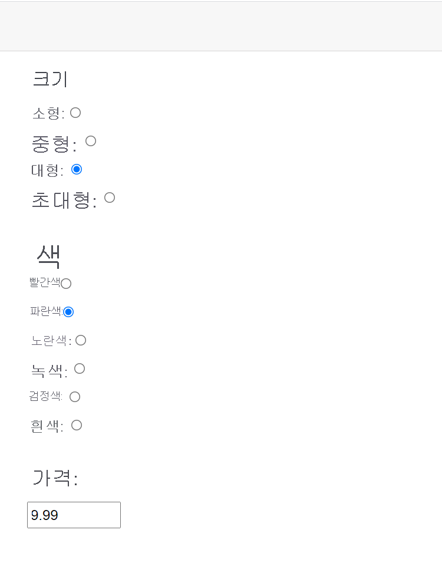

### 양식 제출 처리

EditForm을 사용하여 기본 모델의 데이터를 수정할 수 있음을 보았습니다. 변경이 완료되면 양식을 제출하여 서버에서 데이터의 유효성을 검사하고 변경 내용을 저장할 수 있습니다. Blazor는 선언적 방식과 프로그래밍 방식의 두 가지 유효성 검사를 지원합니다. 선언적 유효성 검사 규칙은 브라우저의 클라이언트에서 작동합니다. 데이터가 서버로 전송되기 전에 기본 클라이언트 쪽 유효성 검사를 수행하는 데 유용합니다. 서버 쪽 유효성 검사는 필드의 데이터를 다른 원본의 데이터에 대해 교차 확인하는 것과 같이 선언적 유효성 검사에서 사용할 수 없는 복잡한 시나리오를 처리하는 데 유용합니다. 실제 애플리케이션은 클라이언트 쪽 및 서버 쪽 유효성 검사의 조합을 활용해야 합니다. 클라이언트 쪽 유효성 검사는 기본 사용자 입력 오류를 트래핑하고 잘못된 데이터가 처리를 위해 서버로 전송되는 많은 경우를 방지합니다. 서버 쪽 유효성 검사는 사용자의 데이터 저장 요청이 데이터 유효성 검사를 무시하고 불완전하거나 손상된 데이터를 저장하지 않도록 합니다.

```
참고

onchange 및 oninput과 같은 JavaScript 이벤트와 EditForm의 여러 컨트롤에 해당하는 Blazor @onchange 및 @oninput 이벤트를 트래핑할 수도 있습니다. 이러한 이벤트를 사용하여 사용자가 양식을 제출하기 전에 필드별로 프로그래밍 방식으로 데이터를 검사하고 유효성을 검사할 수 있습니다. 그러나 이 방법은 권장되지 않습니다. 사용자가 필드 사이에 각 키 또는 탭을 입력할 때 유효성 검사 메시지가 나타나면 불편할 수 있습니다. 사용자가 입력을 완료할 때까지 유효성 검사를 미룹니다.
```

EditForm에는 제출될 때 실행되는 세 가지 이벤트가 있습니다.

 - OnValidSubmit: 이 이벤트는 입력 필드가 유효성 검사 특성에서 정의된 유효성 검사 규칙을 성공적으로 통과하는 경우 트리거됩니다.
 - OnInvalidSubmit: 양식의 입력 필드가 하나라도 유효성 검사 특성에서 정의된 유효성 검사에 실패하면 이 이벤트가 트리거됩니다.
 - OnSubmit: 이 이벤트는 모든 입력 필드가 유효한지 여부에 관계없이 EditForm이 제출될 때 발생합니다.

OnValidSubmit 및 OnInvalidSubmit 이벤트는 개별 입력 필드 수준에서 기본 유효성 검사를 구현하는 EditForm에 유용합니다. 유효한 값 조합을 보장하기 위해 한 입력 필드를 다른 입력 필드에 대해 교차 확인하는 것과 같이 더 복잡한 유효성 검사 요구 사항이 있는 경우 OnSubmit 이벤트를 사용하는 것이 좋습니다. EditForm은 OnValidSubmit 및 OnInvalidSubmit 이벤트 쌍 또는 OnSubmit 이벤트를 처리할 수 있지만 세 가지 모두 처리할 수는 없습니다. EditForm에 Submit 단추를 추가하여 제출을 트리거합니다. 사용자가 이 단추를 선택하면 EditForm에서 지정한 제출 이벤트가 트리거됩니다.

```
참고

빌드 및 배포 프로세스는 잘못된 조합의 제출 이벤트를 확인하지 않지만 잘못된 선택을 하면 런타임에 오류가 발생합니다. 예를 들어 OnValidSubmit을 OnSubmit과 함께 사용하려고 하면 애플리케이션에서 다음과 같은 런타임 예외가 생성됩니다.

Error: System.InvalidOperationException: When supplying an OnSubmit parameter to EditForm, do not also supply OnValidSubmit or OnInvalidSubmit.
```

EditForm은 EditContext 개체를 사용하여 변경된 필드 및 해당 현재 값을 포함하여 모델 역할을 하는 현재 개체의 상태를 추적합니다. “제출” 이벤트는 이 EditContext 개체에 매개 변수로 전달됩니다. 이벤트 처리기는 이 개체의 Model 필드를 사용하여 사용자의 입력을 검색할 수 있습니다.

다음 예에서는 제출 단추가 있는 이전 예의 EditForm을 보여 줍니다. EditForm은 이벤트를 OnSubmit 캡처하여 티셔츠 개체 변경 내용의 유효성을 검사합니다. 이 예제에서는 특정 값 조합만 허용됩니다.

 - 빨간색 티셔츠는 엑스트라 라지 사이드를 선택할 수 없습니다.
 - 파란색 티셔츠는 스몰 또는 미디엄 사이즈를 선택할 수 없습니다.
 - 흰색 티셔츠는 최대 가격이 $50입니다.

잘못된 조합이 검색되면 양식의 Message 필드에 유효성 검사 실패 이유가 표시됩니다. 필드가 유효하면 데이터가 처리되고 데이터가 저장됩니다(이 프로세스에 대한 논리는 표시되어 있지 않음).

```razor
<EditForm Model="@shirt" OnSubmit="ValidateData">
    <!-- Omitted for brevity -->
    <input type="submit" class="btn btn-primary" value="Save"/>
    <p></p>
    <div>@Message</div>
</EditForm>

@code {
    private string Message = String.Empty;

    // Omitted for brevity

    private async Task ValidateData(EditContext editContext)
    {
        if (editContext.Model is not Shirt shirt)
        {
            Message = "T-Shirt object is invalid";
            return;
        }

        if (shirt is { Color: ShirtColor.Red, Size: ShirtSize.ExtraLarge })
        {
            Message = "Red T-Shirts not available in Extra Large size";
            return;
        }

        if (shirt is { Color: ShirtColor.Blue, Size: <= ShirtSize.Medium)
        {
            Message = "Blue T-Shirts not available in Small or Medium sizes";
            return;
        }

        if (shirt is { Color: ShirtColor.White, Price: > 50 })
        {
            Message = "White T-Shirts must be priced at 50 or lower";
            return;
        }

        // Data is valid
        // Save the data
        Message = "Changes saved";
    }
}
```
다음 이미지는 사용자가 잘못된 데이터를 제공하려고 시도하는 경우의 결과를 보여 줍니다.
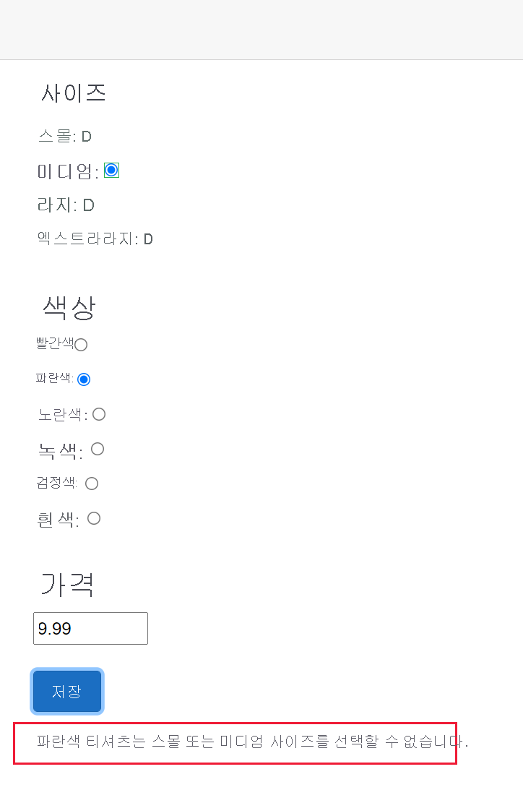

---
## 연습 - Blazor 구성 요소를 사용하여 주소 양식 만들기
현재 Blazing Pizza 앱은 HTML 요소를 사용하여 데이터 및 단추를 캡처합니다. Blazor 프레임워크는 C# 모델에 바인딩할 수 있는 구성 요소를 사용할 수 있도록 양식에 대한 지원을 개선했습니다.

팀에서는 Blazor 구성 요소를 사용하여 현재 HTML 요소를 변경하기를 원합니다. 팀은 주소 및 이름이 비어 있지 않은 경우에만 주문을 제출할 수 있게 하려고 합니다.

이 연습에서는 현재 HTML 필드를 Blazor 구성 요소로 바꾸고 고객이 주문을 제출하는 방법을 변경합니다. EditContext를 사용하여 양식에 대한 수동 유효성 검사를 작성하는 방법을 알아봅니다.

### Blazor EditForm 구성 요소 추가

1. Visual Studio Code의 파일 탐색기에서 페이지를 확장한 다음, Checkout.razor를 선택합니다.
2. \<div class="main"> 블록 아래에 새 EditForm 구성 요소를 추가합니다.
    ```razor
    <div class="main">
        <EditForm Model=Order.DeliveryAddress OnSubmit=CheckSubmission>
    ```
3. \</button> 요소 아래에서 EditForm 구성 요소를 닫습니다.
    ```razor
            </button>
        </EditForm>
    </div>
    ```
4. \</button>에서 @onclick 이벤트를 제거합니다.
    ```razor
    <button class="checkout-button btn btn-warning" disabled=@isSubmitting>
    ```
5. @code 블록에서 기존 PlaceOrder 메서드 위에 양식 제출을 처리하는 코드를 추가합니다.
    ```C#
    private async Task CheckSubmission()
    {
        isSubmitting = true;
        await PlaceOrder();
        isSubmitting = false;
    }
    ```
6. PlaceOrder() 메서드에서 코드의 isSubmitting = true; 줄을 삭제합니다.

### HTML 요소를 Blazor 구성 요소로 바꾸기
1. 파일 탐색기에서 공유를 확장한 다음 AddressEditor.razor를 선택합니다.
2. 편집 메뉴를 선택하고 바꾸기를 선택합니다.
3. 첫 번째 필드에 \<input를 입력하고, 바꾸기 필드에 \<InputText를 입력한 다음 모두 바꾸기를 선택합니다.
    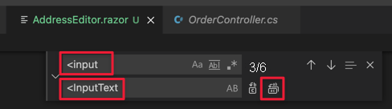
4. 편집 메뉴를 선택하고 바꾸기를 선택합니다.
5. 첫 번째 필드에 @bind=를 입력하고, 바꾸기 필드에 @bind-Value=를 입력한 다음 모두 바꾸기를 선택합니다.
6. 이름 필드에서 @ref="startName" 코드를 제거합니다.
7. @code 블록에서 매개 변수 선언 아래의 모든 코드를 제거합니다. 이제 블록은 다음과 같습니다.
    ```razor
    @code {
        [Parameter] public Address Address { get; set; }
    }
    ```
    FocusAsync는 현재 HTML 요소에서만 지원됩니다.

### 양식을 제출하기 전에 빈 필드 확인

고객이 이름 또는 주소를 입력하지 않으면 앱에서 표시할 수 있는 오류 메시지를 추가해 보겠습니다.

1. 파일 탐색기에서 페이지를 확장한 다음 Checkout.razor를 선택합니다.
2. \<h4>Deliver to...\</h4> 요소 아래에 오류 메시지를 추가합니다.
    ```razor
    <div class="checkout-delivery-address">
    <h4>Deliver to...</h4>
    @if (isError) {
        <div class="alert alert-danger">Please enter a name and address.</div>
    }
    <AddressEditor Address="Order.DeliveryAddress" />
    </div>
    ```
3. @code 블록에서 isError 부울에 대한 선언을 추가합니다.
    ```C#
    bool isError = false;
    ```
4. 이름 및 우편 번호 필드에 데이터가 있는 경우에만 주문을 제출하도록 CheckSubmission() 메서드를 개선합니다.
    ```C#
    private async Task CheckSubmission(EditContext editContext)
    {
        isSubmitting = true;
        var model = editContext.Model as Address;
        isError = string.IsNullOrWhiteSpace(model?.Name)
            || string.IsNullOrWhiteSpace(model?.Line1)
            || string.IsNullOrWhiteSpace(model?.PostalCode);
        if (!isError)
        {
            await PlaceOrder();
        }
        isSubmitting = false;
    }
    ```
5. Visual Studio Code에서 F5 키를 누르거나 실행>디버깅 시작을 선택합니다.<br>아무 정보도 입력하지 않고 피자를 주문해 보세요. 오류 메시지가 표시됩니다.<br>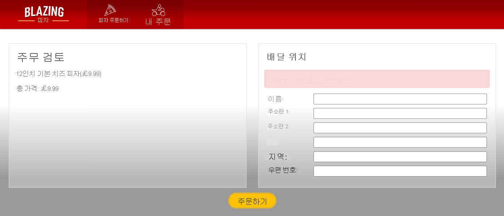
6. Shift + F5 키를 눌러 앱 실행을 중지합니다.

---


---
## 출처
[Microsoft learn Blazor 웹앱에서 폼 및 유효성 검사의 작동 방식 개선](https://learn.microsoft.com/ko-kr/training/modules/use-pages-routing-layouts-control-blazor-navigation/)

---
## [다음](./06_Blazor_웹앱에서_폼_및_유효성_검사의_작동_방식_개선.md)