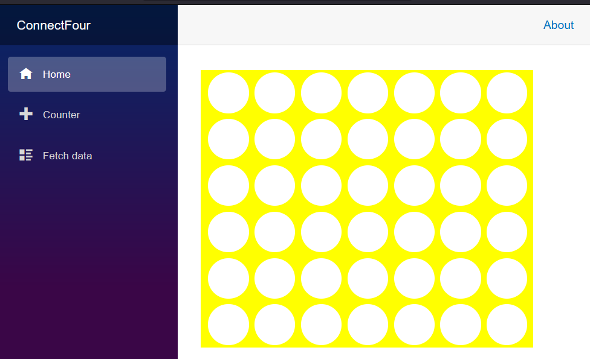
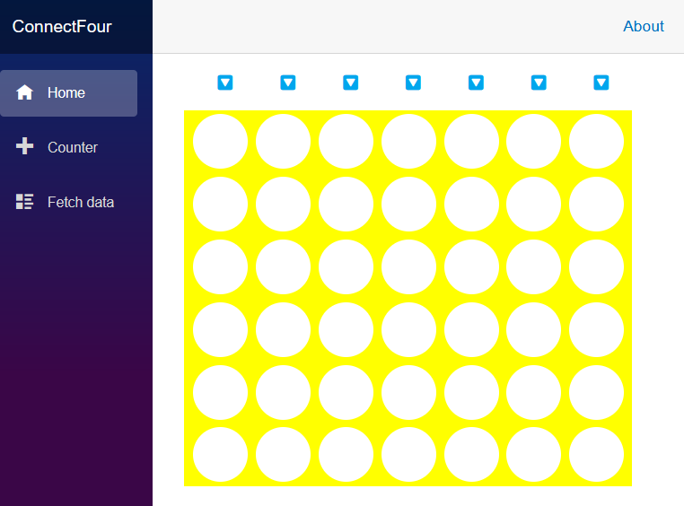
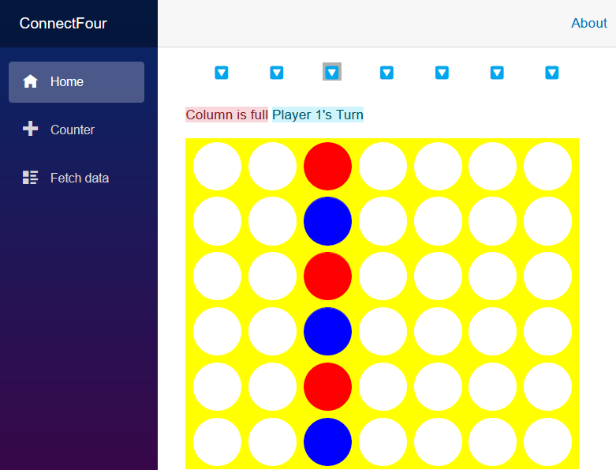
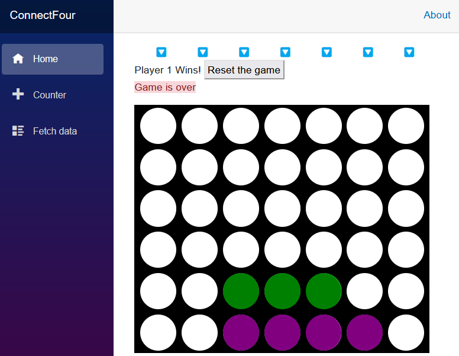

# Blazor를 사용하여 커넥트 4게임 빌드

## 목차
- [Blazor를 사용하여 커넥트 4게임 빌드](#blazor를-사용하여-커넥트-4게임-빌드)
  - [목차](#목차)
  - [소개](#소개)
    - [시나리오 - “Connect Four” 게임 빌드](#시나리오---connect-four-게임-빌드)
    - [무엇을 배울 수 있나요?](#무엇을-배울-수-있나요)
    - [주요 목표는 무엇인가요?](#주요-목표는-무엇인가요)
  - [Blazor](#blazor)
    - [Blazor란?](#blazor란)
    - [WebAssembly란?](#webassembly란)
    - [핫 리로드 사용하여 즉시 앱 업데이트](#핫-리로드-사용하여-즉시-앱-업데이트)
    - [Blazor 구성 요소](#blazor-구성-요소)
    - [Blazor 구성 요소 스타일 지정](#blazor-구성-요소-스타일-지정)
    - [라우팅 가능한 구성 요소](#라우팅-가능한-구성-요소)
  - [연습 - Blazor](#연습---blazor)
    - [새 Blazor 프로젝트 만들기](#새-blazor-프로젝트-만들기)
    - [보드 구성 요소 만들기](#보드-구성-요소-만들기)
    - [게임 보드에 콘텐츠 및 스타일 추가](#게임-보드에-콘텐츠-및-스타일-추가)
    - [구성 요소 스타일 지정](#구성-요소-스타일-지정)
  - [게임 로직](#게임-로직)
    - [Connect Four](#connect-four)
    - [코드의 상태 표시](#코드의-상태-표시)
    - [`OnInitialized`에서 게임 상태 재설정](#oninitialized에서-게임-상태-재설정)
    - [이벤트를 사용하여 플레이어 상호 작용 처리](#이벤트를-사용하여-플레이어-상호-작용-처리)
    - [상태 변경](#상태-변경)
  - [연습 - 게임 로직](#연습---게임-로직)
    - [게임 상태 추가](#게임-상태-추가)
    - [상태 다시 설정](#상태-다시-설정)
    - [게임 조각 만들기](#게임-조각-만들기)
    - [게임 조각 배치 처리](#게임-조각-배치-처리)
    - [열 선택](#열-선택)
    - [승리 및 오류 처리](#승리-및-오류-처리)
    - [요약](#요약)
    - [과제](#과제)
  - [연습 - 매개 변수를 사용하여 사용자 지정](#연습---매개-변수를-사용하여-사용자-지정)
    - [매개변수를 사용하여 보드 커스터마이징하기](#매개변수를-사용하여-보드-커스터마이징하기)
  - [요약](#요약-1)
  - [출처](#출처)
  - [다음](#다음)
---
## 소개

이 모듈에서는 Blazor를 안내하고 다음 개념을 소개합니다.

 - Blazor 구성 요소 기본 사항
 - Blazor Web App 프로젝트 템플릿을 시작하는 방법
 - Blazor 구성 요소에 대한 레이아웃을 생성하고 사용하는 방법
 - 사용자 상호 작용에 대응하는 방법

브라우저에서 실행되는 클래식 4열 "커넥트 4" 게임을 작성하여 위의 목표를 달성합니다.

### 시나리오 - “Connect Four” 게임 빌드

컴퓨터 게임을 빌드하는 회사의 개발자입니다. Blazor로 게임을 빌드하여 Blazor를 평가하기로 결정합니다.

이 게임에서는 두 명의 플레이어가 번갈아 가며 게임 조각(일반적으로 체커)을 보드 위에 놓습니다. 게임 조각은 열의 가장 낮은 행으로 떨어지며, 4개의 게임 조각을 가로, 세로 또는 대각선으로 한 줄로 배치하는 플레이어가 승리합니다.

### 무엇을 배울 수 있나요?

이 문서에서 배울 내용은 다음과 같습니다.

 - Blazor 웹앱을 만듭니다.
 - 앱 상태를 관리합니다.
 - CSS를 사용하여 모양을 사용자 지정합니다.
 - “Connect Four” 게임을 빌드합니다.

### 주요 목표는 무엇인가요?

Blazor에서 기본 개념을 학습하면서 앱을 빌드하는 방법을 알아봅니다.

---

## Blazor

웹앱을 빌드하는 방법에는 여러 가지가 있습니다. 대화형이고 빠른 웹앱을 빌드하려면 일반적으로 많은 JavaScript를 사용합니다.

또 다른 방법은 C# 및 .NET을 사용하여 모든 웹 개발 문제를 처리할 수 있는 Microsoft의 Blazor 프레임워크를 사용하는 것입니다.

### Blazor란?

Blazor는 HTML, CSS 및 C#을 사용하여 웹 페이지를 빌드하기 위한 프레임워크입니다. 표준 HTML 및 CSS를 사용하여 웹 사이트의 레이아웃과 디자인을 정의할 수 있습니다. 웹 페이지의 대화형 구성 요소는 WebAssembly라는 웹 표준 기술을 사용하여 서버 또는 브라우저에서 실행되는 C# 코드로 관리할 수 있습니다. Blazor를 사용하면 HTML과 C#의 편리한 혼합물인 Razor 구문을 사용하여 웹 페이지 및 구성 요소를 정의할 수 있습니다. 다른 페이지 및 구성 요소 내에서 Blazor 구성 요소를 쉽게 다시 사용할 수 있습니다. 이 기능은 앱의 일부를 쉽게 빌드하고 재사용할 수 있습니다.

### WebAssembly란?

WebAssembly는 모든 최신 브라우저에서 사용할 수 있는 표준 기술로, 브라우저에서 JavaScript와 유사한 코드를 실행할 수 있습니다. 도구를 사용하여 브라우저에서 WebAssembly 앱으로 사용할 C# 코드를 준비할 수 있으며 이러한 도구는 .NET SDK에 포함됩니다.

### 핫 리로드 사용하여 즉시 앱 업데이트

앱을 개발할 때 변경 내용이 앱에 미치는 영향을 확인할 수 있도록 개발자 흐름이 빠른지 확인하려고 합니다. 변경하고, 저장하고, 모든 리소스를 다시 빌드하고, 브라우저에서 앱을 다시 배포하는 데 시간이 오래 걸릴 수 있습니다.

핫 리로드 사용하여 이 워크플로를 개선할 수 있습니다. 핫 리로드 다시 시작하지 않고도 실행 중인 앱에 변경 사항을 적용할 수 있습니다.

### Blazor 구성 요소

Blazor를 사용하여 앱을 만들 때 앱은 각각 고유한 책임 영역을 가진 여러 구성 요소로 구성됩니다. 구성 요소를 만들려면 .razor 확장이 있는 Razor 파일을 사용합니다. 그렇다면 Razor란?

Razor는 HTML 구문을 C# 코드와 혼합하는 프로그래밍 구문입니다. 예를 들면 다음과 같습니다.

```razor
<div>@product.Name</div>

@code {
  Product product = new Product{ Name = "Blazor" }
}
```

이 예제 `@product.Name` 에서는 "Blazor" 문자열로 확인되고 태그 내부에 div 렌더링됩니다. 렌더링된 출력은 다음과 같습니다.

```html
<div>Blazor</div>
```

Razor 예제의 맨 위 부분은 실행 시 구성 요소가 렌더링할 HTML 태그로 구성됩니다. 문자를 사용하여 C# 식의 값을 렌더링할 @ 수 있습니다. Razor는 태그를 식별한 다음 @ HTML 렌더링을 다시 시작할 때까지 C# 코드를 계속 해석합니다. C# 식이 파렌을 사용하여 시작되고 끝나는 시기에 대해 명시적일 수 있습니다. `@(...)`

내 `@code {}` 의 모든 항목에는 생성된 구성 요소 클래스의 멤버를 정의하기 위한 C# 코드가 포함되어 있습니다. Razor 파일을 HTML 렌더링 논리를 정의하는 C# 클래스를 정의하는 편리한 방법으로 생각할 수 있습니다. 블록을 사용하여 `@code` 필드, 속성 및 메서드와 같은 구성 요소 형식에 대한 C# 멤버를 정의합니다.

### Blazor 구성 요소 스타일 지정

Blazor 구성 요소는 HTML을 렌더링하므로 일반 CSS 스타일시트를 사용하여 Blazor 구성 요소의 스타일을 지정할 수 있습니다. 또는 Blazor 구성 요소에는 해당 구성 요소의 내용에만 적용되는 스타일 규칙을 만들 수 있는 CSS 격리라는 기능이 있습니다. 구성 요소와 이름이 같은 파일을 만들고 .css 파일 이름 확장명을 추가하면 Blazor는 이 이름을 해당 구성 요소의 HTML 콘텐츠에만 적용해야 하는 스타일로 인식합니다.

Blazor 구성 요소는 특수 `HeadContent` 태그를 사용하여 페이지의 HTML 헤드에 추가할 콘텐츠를 정의할 수도 있습니다.

```razor
<HeadContent>
    <style>
        ...my styles here
    </style>
</HeadContent>
```

이 `style` 태그 및 콘텐츠는 페이지의 태그 내에 `head` 렌더링됩니다.

### 라우팅 가능한 구성 요소

Home.razor 파일은 웹 브라우저에서 탐색할 수 있는 구성 요소입니다. HTML, C# 및 다른 Blazor 구성 요소에 대한 참조를 포함합니다. 첫 번째 줄에 `@page "/"` 지시문이 있으므로 이 파일을 페이지로 식별할 수 있습니다. 이 지시문은 구성 요소에 "/" 경로를 할당하고 "/" 주소의 기본 페이지가 요청되면 Blazor가 이 파일의 내용으로 응답하도록 지시합니다.

---

## 연습 - Blazor

이 연습에서는 Blazor 프로젝트를 만들고 모듈 과정 전체에 걸쳐 "Connect Four" 게임이 되는 앱 빌드를 시작합니다.

### 새 Blazor 프로젝트 만들기

먼저 Visual Studio 2022를 사용하여 게임에 대한 새 프로젝트를 만들어 보겠습니다.

 1. 새 파일 > 프로젝트 메뉴를 선택하여 Visual Studio 2022에서 새 > Blazor 앱을 만듭니다.
 2. 템플릿 목록에서 "Blazor 웹앱"을 선택하고 이름을 "커넥트포"로 지정합니다. 다음을 선택합니다.
 3. 프레임워크 버전에 대해 .NET 8을 선택합니다. 인증 유형을 None으로 설정해야 하고, 대화형 렌더링 모드를 서버로 설정해야 하며, 대화형 작업 위치는 페이지/구성 요소별로 설정해야 합니다. 다른 모든 옵션을 기본값으로 둡니다.<br/>이 작업은 앱이 포함된 커넥트Four 디렉터리를 만들어야 합니다.
 4. Visual Studio 2022에서 F5 키를 눌러 앱을 실행합니다.<br/>이제 브라우저에서 실행 중인 Blazor 앱이 표시됩니다.<br/>

축하합니다! 첫 번째 Blazor 앱을 만들었습니다!

### 보드 구성 요소 만들기

다음으로, 게임에서 플레이어가 사용할 게임 보드 구성 요소를 만들어 보겠습니다. 구성 요소는 HTML과 C#이 혼합된 Razor 구문을 사용하여 정의됩니다.

 1. Visual Studio 솔루션 탐색기 구성 요소 폴더를 마우스 오른쪽 단추로 클릭합니다. 상황에 맞는 메뉴에서 Razor 구성 요소 추가 > 를 선택하고 파일 이름을 Board.razor로 지정합니다.
  이 구성 요소를 사용하여 게임 보드 레이아웃에 필요한 모든 것을 보관하고 상호 작용을 관리할 것입니다. 이 새 구성 요소의 초기 콘텐츠는 `h3` C# 코드를 작성해야 하는 위치를 나타내는 태그 및 `@code` 블록입니다.
  ```razor
  <h3>Board</h3>

  @code {

  }
  ```
 2. `Home` Components/Pages/Home.razor 파일을 열고 'PageTitle' 태그가 있는 세 번째 줄 뒤의 모든 항목을 지워 페이지를 준비합니다.
  ```razor
  @page "/"

  <PageTitle>Home</PageTitle>
  ```
 3. `Board` 새 구성 요소의 `Home` 파일 이름과 일치하는 태그를 `<Board />` 추가하여 구성 요소를 페이지에 추가합니다.
  ```razor
  @page "/"

  <PageTitle>Index</PageTitle>
  <Board />
  ```
 4. F5로 앱을 실행하여 변경 내용을 확인합니다. 앱이 이미 실행 중인 경우 실행/계속 단추 옆에 있는 핫 리로드 단추를 탭하여 실행 중인 앱에 변경 내용을 적용합니다.
  ```
  팁

  핫 리로드 메뉴에서 파일 저장 옵션의 핫 리로드 선택하여 파일을 변경할 때마다 실행 중인 앱에 변경 내용을 적용합니다.
  ```
  

축하합니다! 첫 번째 구성 요소를 빌드하고 Blazor 페이지에서 사용했습니다.

### 게임 보드에 콘텐츠 및 스타일 추가

7개의 열과 6개의 행으로 게임 보드를 정의해 보겠습니다. 보드를 생생하게 만들기 위해 약간의 스타일을 추가하겠습니다.

 1. Board.razor 파일에서 맨 위에 있는 HTML을 제거하고 다음 콘텐츠를 추가하여 게임 조각이 42개인 보드를 정의합니다.
  C# for 루프를 사용하여 42개의 보드 위치를 생성할 수 있습니다. 컨테이너 span 태그는 보드를 나타내기 위해 해당 내용으로 42번 선택되고 반복됩니다.
  ```razor
  <div>
    <div class="board">
        @for (var i = 0; i < 42; i++)
        {
          <span class="container">
              <span></span>
          </span>
        }
    </div>
  </div>
  ```

보드 구성 요소를 저장하면 업데이트된 앱을 다시 빌드하고 시작하는 핫 리로드 기능 덕분에 앱이 새로 고쳐지고 빈 페이지로 표시됩니다.

```
참고

파일이 변경되면 Visual Studio에서 앱을 다시 시작하라는 메시지가 표시될 수 있습니다. 코드 편집에서 앱을 다시 빌드해야 하는지 확인하고 기능을 추가할 때 앱이 자동으로 다시 시작되고 브라우저를 새로 고칩니다.
```

### 구성 요소 스타일 지정

Board.razor 파일의 첫 번째 `div` 태그 위에 있는 보드 프레임과 플레이어의 일부 색을 정의하여 구성 요소에 스타일을 `Board` 추가해 보겠습니다.

  ```razor
  <HeadContent>
      <style>
          :root {
              --board-bg: yellow;  /** the color of the board **/
              --player1: red;      /** Player 1's piece color **/
              --player2: blue;     /** Player 2's piece color **/
          }
      </style>
  </HeadContent>

  <div>...</div>
  ```
이러한 CSS 변수는 `--board-bg--player1: red--player2: blue` 이 구성 요소에 대한 나머지 스타일시트에서 선택되어 사용됩니다.

다음으로, 게임의 완성된 스타일시트를 구성 요소에 `Board` 추가합니다.

 1. 구성 요소 폴더의 솔루션 탐색기 마우스 오른쪽 단추로 클릭하고 Board.razor.css이라는 새 CSS 파일을 만듭니다.
 2. 다음 콘텐츠를 새 Board.razor.css 파일에 복사합니다.
  ```css
  div{position:relative}nav{top:4em;width:30em;display:inline-flex;flex-direction:row;margin-left:10px}nav span{width:4em;text-align:center;cursor:pointer;font-size:1em}div.board{margin-top:1em;flex-wrap:wrap;width:30em;height:24em;overflow:hidden;display:inline-flex;flex-direction:row;flex-wrap:wrap;z-index:-5;row-gap:0;pointer-events:none;border-left:10px solid var(--board-bg)}span.container{width:4em;height:4em;margin:0;padding:4px;overflow:hidden;background-color:transparent;position:relative;z-index:-2;pointer-events:none}.container span{width:3.5em;height:3.5em;border-radius:50%;box-shadow:0 0 0 3em var(--board-bg);left:0;position:absolute;display:block;z-index:5;pointer-events:none}.player1,.player2{width:3.5em;height:3.5em;border-radius:50%;left:0;top:0;position:absolute;display:block;z-index:-8}.player1{background-color:var(--player1);animation-timing-function:cubic-bezier(.5,.05,1,.5);animation-iteration-count:1;animation-fill-mode:forwards;box-shadow:0 0 0 4px var(--player1)}.player2{background-color:var(--player2);animation-timing-function:cubic-bezier(.5,.05,1,.5);animation-iteration-count:1;animation-fill-mode:forwards;box-shadow:0 0 0 4px var(--player2)}.col0{left:calc(0em + 9px)}.col1{left:calc(4em + 9px)}.col2{left:calc(8em + 9px)}.col3{left:calc(12em + 9px)}.col4{left:calc(16em + 9px)}.col5{left:calc(20em + 9px)}.col6{left:calc(24em + 9px)}.drop1{animation-duration:1s;animation-name:drop1}.drop2{animation-duration:1.5s;animation-name:drop2}.drop3{animation-duration:1.6s;animation-name:drop3}.drop4{animation-duration:1.7s;animation-name:drop4}.drop5{animation-duration:1.8s;animation-name:drop5}.drop6{animation-duration:1.9s;animation-name:drop6}@keyframes drop1{100%,75%,90%,97%{transform:translateY(1.27em)}80%{transform:translateY(.4em)}95%{transform:translateY(.8em)}99%{transform:translateY(1em)}}@keyframes drop2{100%,75%,90%,97%{transform:translateY(5.27em)}80%{transform:translateY(3.8em)}95%{transform:translateY(4.6em)}99%{transform:translateY(4.9em)}}@keyframes drop3{100%,75%,90%,97%{transform:translateY(9.27em)}80%{transform:translateY(7.2em)}95%{transform:translateY(8.3em)}99%{transform:translateY(8.8em)}}@keyframes drop4{100%,75%,90%,97%{transform:translateY(13.27em)}80%{transform:translateY(10.6em)}95%{transform:translateY(12em)}99%{transform:translateY(12.7em)}}@keyframes drop5{100%,75%,90%,97%{transform:translateY(17.27em)}80%{transform:translateY(14em)}95%{transform:translateY(15.7em)}99%{transform:translateY(16.5em)}}@keyframes drop6{100%,75%,90%,97%{transform:translateY(21.27em)}80%{transform:translateY(17.4em)}95%{transform:translateY(19.4em)}99%{transform:translateY(20.4em)}}
  ```
  다음은 보드의 서식을 지정하는 데 사용되는 CSS와 각 공간에 대한 "펀치 홀"입니다. CSS 파일에서 게임 조각과 해당 애니메이션을 화면에 표시하는 것보다 더 많은 콘텐츠를 사용할 수 있습니다.
  ```css
  div.board {
      margin-top: 1em;
      flex-wrap: wrap;
      width: 30em;
      height: 24em;
      overflow: hidden;
      display: inline-flex;
      flex-direction: row;
      flex-wrap: wrap;
      z-index: -5;
      row-gap: 0;
      pointer-events: none;
      border-left: 10px solid var(--board-bg);
  }

  span.container {
      width: 4em;
      height: 4em;
      margin: 0;
      padding: 4px;
      overflow: hidden;
      background-color: transparent;
      position: relative;
      z-index: -2;
      pointer-events: none;
  }

  .container span {
      width: 3.5em;
      height: 3.5em;
      border-radius: 50%;
      box-shadow: 0 0 0 3em var(--board-bg);
      left: 0px;
      position: absolute;
      display: block;
      z-index: 5;
      pointer-events: none;
  }
  ```

브라우저가 업데이트되어야 하며(그렇지 않은 경우 F5로 브라우저를 수동으로 새로 고칠 수 있음) 적절한 노란색 커넥트 4개의 보드로 인사해야 합니다.



축하합니다. 이제 게임이 시작됩니다. 이후 단원에서는 게임 논리를 추가합니다.

---

## 게임 로직

이 단원에서는 "Connect Four" 게임의 작동 방식과 게임을 제작하기 위해 알아야 할 Blazor의 구조와 같은 개념을 다룹니다.

### Connect Four

"Connect Four" 게임은 상대편보다 먼저 가로, 세로 또는 대각선으로 행에 네 개의 게임 조각을 배치하는 것입니다. 이 게임을 구현할 때 고려해야 할 사항은 게임 조각의 현재 상태와 상대편을 추적하고 승자를 확인하는 것입니다. 승자를 선언할 때까지 반복해야 하는 작업 집합인 게임 루프를 생각하도록 프로그래밍할 때 유용합니다. 예를 들면 다음과 같습니다.

 1. "초기화" 상태(즉, 게임 조각없이 비어있는 보드)로 시작합니다.
 2. 사용자가 게임 조각을 배치합니다.
 3. 상대는 게임 조각을 배치합니다.
 4. 우승자를 확인합니다.
   1. 승자가 있는 경우 승자를 선언하고 게임을 종료하거나 게임을 다시 시작합니다.
   2. 승자가 없으면 2단계를 반복합니다.

### 코드의 상태 표시

첫째, 상태는 무엇인가요? 게임의 상태는 게임에서 일어나는 일, 가지고 있는 포인트 수, 게임 장소가 배치되는 위치 등입니다.

게임 개발의 상태와 관련하여 중요한 지침은 수정을 더 쉽게 하고 코드를 다른 이점 중에서 더 쉽게 읽을 수 있도록 상태를 UI와 별도로 유지하는 것입니다.

Blazor의 컨텍스트에서 상태 및 상태 관련 논리는 다음과 같이 자체 C# 클래스에 있어야 합니다.

```C#
class State
{
    Player [] players;
    int gameRoundsPlayed;
    bool gameOver;

    State()
    {
        players = new Players[]
        {
            new Player() { Name= "Player", Points = 0 },
            new Player() { Name= "Opponent", Points = 0 }
        };
        gameRoundsPlayed = 0;
        gameOver = false;
    }

    void ResetGame() 
    {
        gameOver = false;
        players[0].Points = 0;
        players[1].Points = 0;
    }

    void EndGame()
    {
        gameOver = true;
        gameRoundsPlayed++;
        // award winner..
    } 
}
```

이 `State` 클래스에는 누가 게임을 플레이하고 있는지, 얼마나 많은 게임 라운드가 진행되었는지, 게임이 여전히 활성 상태인 경우 등에 대한 정보가 포함됩니다.

Blazor 구성 요소에서 이 `State` 클래스의 인스턴스를 사용하여 보드를 그리고 게임이 진행됨에 따라 다른 작업을 수행할 수 있습니다.

### `OnInitialized`에서 게임 상태 재설정 

Blazor에는 다른 작업이 발생하기 전에 구성 요소가 초기화 중일 때 메서드를 호출합니다. 이 방법은 보드를 만들고, 플레이어를 만들고, 이전 게임 세션에서 필요한 경우 점수를 재설정하는 것과 같이 게임을 "재설정" 상태로 만드는 데 도움이 되는 코드를 배치하기에 좋은 장소입니다.

구성 요소의 이 초기화를 처리하는 `OnInitialized` 메서드를 호출 합니다.

게임 상태 재설정을 처리하는 `OnInitialized` 메서드는 다음과 같이 표시될 수 있습니다.

```C#
void OnInitialized() 
{
    state.ResetGame();
}
```

정확히 여기에 무엇이 들어가는지는 사용자에게 달려있지만 이 코드는 아이디어를 줄 것입니다.

### 이벤트를 사용하여 플레이어 상호 작용 처리

사용자 또는 상대편이 움직일 때 이 상호 작용을 캡처해야 합니다. 사용자 상호 작용을 게임/앱이 응답해야 하는 이벤트로 인코딩합니다.

예를 들어 단추를 선택하거나 끌어서 놓기 이동을 수행하여 게임 조각을 이동할 수 있습니다.

코드의 모양은 다음과 같습니다.

```C#
<span title="Click to play a piece" @onclick="() => PlayPiece(0)">🔽</span>
```

위의 코드 `@onclick` 에서 지시문 특성은 이벤트에 대한 `click` 처리기를 지정합니다. 즉, 사용자가 이 요소를 선택했습니다. 이벤트는 함수`PlayPiece(0)`를 호출하는 코드 `() => PlayPiece(0)` 에 의해 처리됩니다.

### 상태 변경

게임에서 수행하는 동작은 게임 상태에 영향을 주어야 합니다. `PlayPiece()` 호출 하는 앞의 예제에서는 보드의 이 부분이 이제 한 조각에 의해 점유되었음을 나타내는 상태를 변경해야 합니다. 즉, 예제 `State` 클래스를 감안할 때 다음과 같이 게임 조각을 나타내는 방법이 필요합니다.

```C#
class State 
{
    // other code omitted
    Piece [] pieces;

    State()
    {
        pieces = new Piece[25]; // 5x5 board
    }

    void PlayPiece(int position)
    {
        pieces[position] = true; // true = occupied
    }
}
```

---

## 연습 - 게임 로직

이 연습에서는 게임 논리를 앱에 추가하여 게임이 완전히 작동하도록 합니다.

Blazor에 대한 교육과 함께 이 자습서를 계속 진행하기 위해 게임 관리 논리를 포함하는 클래스를 `GameState` 제공합니다.

### 게임 상태 추가

프로젝트에 클래스를 `GameState` 추가한 다음 종속성 주입을 통해 구성 요소를 싱글톤 서비스로 사용할 수 있도록 하겠습니다.

 1. [ GameState.cs](https://raw.githubusercontent.com/dotnet/intro-to-dotnet-web-dev/main/5-blazor/1-complete/ConnectFour/GameState.cs) 파일을 프로젝트의 루트에 복사합니다.
 2. 프로젝트의 루트에서 Program.cs 파일을 열고 이 문을 추가하여 앱에서 싱글톤 서비스로 구성 `GameState` 합니다.
  ```C#
  builder.Services.AddSingleton<GameState>();
  ```
  이제 클래스의 인스턴스를 구성 요소에 `GameState` 삽입할 `Board` 수 있습니다.
 3. Board.razor 파일의 맨 위에 다음 `@inject` 지시문을 추가하여 게임의 현재 상태를 구성 요소에 삽입합니다.
  ```razor
  @inject GameState State
  ```
  이제 `Board` 구성 요소를 게임 상태에 연결할 수 있습니다.

### 상태 다시 설정

먼저 `Board` 구성 요소가 화면에 처음 그려질 때 게임 상태를 다시 설정해 보겠습니다. 구성 요소가 초기화될 때 게임 상태를 다시 설정하는 몇 가지 코드를 추가합니다.

 1.  다음과 같이 Board.razor 파일의 맨 아래에 있는 @code 블록 내에  ResetBoard 호출이 있는 OnInitialized 메서드를 추가합니다.
  ```razor
  @code {
      protected override void OnInitialized()
      {
          State.ResetBoard();
      }
  }
  ```
  보드가 사용자에게 처음 표시되면 상태가 게임 시작 부분으로 다시 설정됩니다.

### 게임 조각 만들기

다음으로, 플레이할 수 있는 42개의 게임 조각을 할당해 보겠습니다. 보드의 42개 HTML 요소에서 참조하는 배열로 게임 조각을 나타낼 수 있습니다. 열 및 행 위치가 있는 CSS 클래스 집합을 할당하여 이러한 조각을 이동하고 배치할 수 있습니다.

 1. 코드 블록에서 게임 조각을 저장할 문자열 배열 필드를 정의합니다.
  ```razor
  private string[] pieces = new string[42];
  ```
 2. 동일한 구성 요소에서 각 게임 조각에 대해 하나씩 42개의 `span` 태그를 만드는 HTML 섹션에 코드를 추가합니다.
  ```razor
  @for (var i = 0; i < 42; i++)
  {
    <span class="@pieces[i]"></span>
  }
  ```
  전체 코드는 다음과 같아야 합니다.
  ```razor
  <div>
      <div class="board">...</div>
      @for (var i = 0; i < 42; i++)
      {
        <span class="@pieces[i]"></span>
      }
  </div>
  @code {
      private string[] Pieces = new string[42];

      protected override void OnInitialized()
      {
          State.ResetBoard();
      }
  }
  ```
  그러면 각 게임 조각 범위의 CSS 클래스에 빈 문자열이 할당됩니다. CSS 클래스의 빈 문자열은 스타일이 적용되지 않는 게임 조각이 화면에 나타나지 않도록 합니다.

### 게임 조각 배치 처리

플레이어가 열에 조각을 배치할 때 처리할 메서드를 추가해 보겠습니다. `GameState` 클래스는 게임 조각에 올바른 행을 할당하는 방법을 알고 있으며, 해당 행이 놓인 행을 다시 보고합니다. 이 정보를 사용하여 플레이어의 색, 조각의 최종 위치 및 CSS 드롭 애니메이션을 나타내는 CSS 클래스를 할당할 수 있습니다.

이 메서드 `PlayPiece`를 호출하고 플레이어가 선택한 열을 지정하는 입력 매개 변수를 허용합니다.

 1. 이전 단계에서 정의한 `pieces` 배열 아래에 이 코드를 추가합니다.
  ```razor
  private void PlayPiece(byte col)
  {
      var player = State.PlayerTurn;
      var turn = State.CurrentTurn;
      var landingRow = State.PlayPiece(col);
      pieces[turn] = $"player{player} col{col} drop{landingRow}";
  }
  ```
코드에서 `PlayPiece` 수행하는 일은 다음과 같습니다.

 1. 제출한 `col` 열 에서 조각을 움직이고 조각이 놓여진 행을 캡처하도록 게임 상태에 지시합니다.
 2. 그런 다음 게임 조각에 할당할 세 개의 CSS 클래스를 정의하여 현재 어떤 플레이어가 행동하고 있는지, 조각이 배치된 열과 방문 행을 식별할 수 있습니다.
 3. 메서드의 마지막 줄은 `pieces` 배열의 해당 게임 조각에 이러한 클래스를 할당합니다.

제공된 Board.razor.css를 보면 열, 행 및 플레이어 턴과 일치하는 CSS 클래스를 찾을 수 있습니다.

그 결과 이 메서드가 호출되면 게임 조각이 열에 배치되고 맨 아래 행에 놓이도록 애니메이션됩니다.

### 열 선택

다음으로 플레이어가 열을 선택하고 새로운 PlayPiece 메서드를 호출할 수 있는 몇 가지 컨트롤을 배치해야 합니다. "🔽" 문자를 사용하여 이 열에 조각을 놓을 수 있음을 나타냅니다.

 1. 시작 `<div>` 태그 위에 클릭 가능한 단추 행을 추가합니다.
  ```html
  <nav>
      @for (byte i = 0; i < 7; i++)
      {
          var col = i;
          <span title="Click to play a piece" @onclick="() => PlayPiece(col)">🔽</span>
      }
  </nav>
  ```
  이 특성은 `@onclick` 클릭 이벤트에 대한 이벤트 처리기를 지정합니다. 그러나 UI 이벤트를 처리하려면 대화형 렌더링 모드를 사용하여 Blazor 구성 요소를 렌더링해야 합니다. 기본적으로 Blazor 구성 요소는 서버에서 정적으로 렌더링됩니다. 특성을 사용하여 구성 요소에 대화형 렌더링 모드를 적용할 `@rendermode` 수 있습니다.
 2. 렌더링 모드 `InteractiveServer`를 사용하도록 `Home` 페이지의 `Board` 구성 요소를 업데이트합니다.
  ```razor
  <Board @rendermode="InteractiveServer" />
  ```
  `InteractiveServer` 렌더링 모드는 브라우저와의 WebSocket 연결을 통해 서버의 구성 요소에 대한 UI 이벤트를 처리합니다.
 3. 이러한 변경 내용으로 앱을 실행합니다. 이제 다음과 같이 표시됩니다.<br/> <br/>위쪽에 있는 드롭 단추 중 하나를 선택하면 다음 동작을 관찰할 수 있습니다.<br/>

잘하셨습니다. 이제 보드에 조각을 추가할 수 있습니다. `GameState` 개체는 두 플레이어 간에 앞뒤로 피벗할 수 있을 만큼 똑똑합니다. 더 많은 드롭 버튼을 선택하고 결과를 확인하세요.

### 승리 및 오류 처리

이 시점에서 구성한 게임을 플레이하면 같은 열에 너무 많은 조각을 넣으려고 할 때와 한 플레이어가 게임에서 이겼을 때 오류가 발생합니다.

현재 상태를 명확히 하기 위해 몇 가지 오류 처리 및 지표를 보드에 추가해 보겠습니다. 보드 위와 드롭 단추 아래에 상태 영역을 추가합니다.

 1. `nav` 요소 뒤에 다음 태그를 삽입합니다.
  ```razor
  <nav>...</nav>

  <article>
      @winnerMessage  <button style="@ResetStyle" @onclick="ResetGame">Reset the game</button>
      <br />
      <span class="alert-danger">@errorMessage</span>
      <span class="alert-info">@CurrentTurn</span>
  </article>
  ```
  이 태그를 사용하면 다음의 표시기를 표시할 수 있습니다.

    - 게임 우승자 발표
    - 게임을 다시 시작할 수 있는 단추
    - 오류 메시지
    - 현재 플레이어의 차례
  이러한 값을 설정하는 몇 가지 논리를 입력해 보겠습니다.
 2. 조각 배열 다음에 다음 코드를 추가합니다.
  ```C#
  private string[] pieces = new string[42];
  private string winnerMessage = string.Empty;
  private string errorMessage = string.Empty;

  private string CurrentTurn => (winnerMessage == string.Empty) ? $"Player {State.PlayerTurn}'s Turn" : "";
  private string ResetStyle => (winnerMessage == string.Empty) ? "display: none;" : "";
  ```
    - `CurrentTurn` 속성은 `winnerMessage` 의 상태 및 `PlayerTurn` 속성을 `GameState` 기반으로 자동으로 계산됩니다.
    - `ResetStyle`은 `WinnerMessage`의 콘텐츠를 기반으로 계산됩니다. `winnerMessage`가 있는 경우 다시 설정 단추가 화면에 나타납니다.
 3. 조각을 플레이할 때 오류 메시지를 처리해 보겠습니다. 오류 메시지  를 지우는 줄을 추가한 다음, `PlayPiece` 메서드의  코드를 `try...catch` 블록으로 래핑하여 예외가 발생한 경우 `errorMessage`를 설정합니다.
  ```C#
  errorMessage = string.Empty;
  try
  {
      var player = State.PlayerTurn;
      var turn = State.CurrentTurn;
      var landingRow = State.PlayPiece(col);
      pieces[turn] = $"player{player} col{col} drop{landingRow}";
  }
  catch (ArgumentException ex)
  {
      errorMessage = ex.Message;
  }
  ```
  오류 처리기 표시기는 간단하며 부트스트랩 CSS 프레임워크를 사용하여 위험 모드에서 오류를 표시합니다.<br/>
 4. 다음으로, 게임을 다시 시작하기 위해 단추가 트리거하는 ResetGame 메서드를 추가해 보겠습니다. 현재 게임을 다시 시작하는 유일한 방법은 페이지를 새로 고치는 것입니다. 이 코드를 사용하면 동일한 페이지를 유지할 수 있습니다.
  ```C#
  void ResetGame()
  {
      State.ResetBoard();
      winnerMessage = string.Empty;
      errorMessage = string.Empty;
      pieces = new string[42];
  }
  ```
  이제 ResetGame 메서드에는 다음과 같은 논리가 있습니다.
     - 보드의 상태를 다시 설정합니다.
     - 표시기를 숨깁니다.
     - 조각 배열을 42개 문자열의 빈 배열로 다시 설정합니다.
  이 업데이트를 통해 게임을 다시 플레이할 수 있으며, 이제 보드 바로 위에 플레이어의 차례와 최종적으로 게임이 완료되었음을 알리는 표시기가 표시됩니다.
  <br/><br/>여전히 다시 설정 단추를 선택할 수 없는 상황입니다. `PlayPiece` 메서드에 몇 가지 논리를 추가하여 게임의 종료를 확인해 보겠습니다.
 5. `PlayPiece`의 `try...catch` 블록 뒤에 스위치 식을 추가하여 게임에 우승자가 있는지 확인합니다.
```C#
winnerMessage = State.CheckForWin() switch
{
    GameState.WinState.Player1_Wins => "Player 1 Wins!",
    GameState.WinState.Player2_Wins => "Player 2 Wins!",
    GameState.WinState.Tie => "It's a tie!",
    _ => ""
};
```
CheckForWin 메서드는 어떤 플레이어가 게임에서 이겼는지 또는 게임이 동률인지를 보고하는 열거형을 반환합니다. 이 스위치 식은 게임 오버 상태가 발생한 경우 winnerMessage 필드를 적절하게 설정합니다.
이제 게임을 플레이하고 게임 종료 시나리오에 도달하면 다음 지표가 표시됩니다.


### 요약

우리는 Blazor에 대해 많은 것을 배웠고 작은 게임을 만들었습니다. 학습한 몇 가지 기술은 다음과 같습니다.

 - 구성 요소 만들기
 - 해당 구성 요소를 홈페이지에 추가하기
 - 종속성 주입을 사용하여 게임 상태 관리하기
 - 게임을 이벤트 처리기와 상호 작용하여 조각을 배치하고 게임 다시 설정하기
 - 게임 상태를 보고하는 오류 처리기 작성하기
 - 구성 요소에 매개 변수 추가하기

우리가 만든 프로젝트는 단순한 게임이지만 여러분이 할 수 있는 일은 훨씬 더 많습니다. 개선 방법에 대한 문제를 찾고 계신가요?

### 과제

다음 문제를 고려해 보세요.

 - 앱에서 기본 레이아웃 및 추가 페이지를 제거하여 더 작게 만듭니다.
 - 유효한 CSS 색 값을 전달할 수 있도록 구성 요소에 대한 매개 변수 Board 를 개선합니다.
 - 일부 CSS 및 HTML 레이아웃을 사용하여 표시기 모양을 개선합니다.
 - 소리 효과를 소개합니다.
 - 시각적 표시기를 추가하고 열이 가득 찼을 때 놓기 단추가 사용되지 않도록 방지합니다.
 - 브라우저에서 친구를 재생할 수 있도록 네트워킹 기능을 추가합니다.
 - Blazor 애플리케이션을 사용하여 .NET MAUI에 게임을 삽입하고 휴대폰 또는 태블릿에서 플레이합니다.

즐겁게 코딩하고 행복한 시간 보내세요!

---
## 연습 - 매개 변수를 사용하여 사용자 지정

게임은 작동하지만 기본 색상이 마음에 들지 않을 수 있습니다. Blazor에서는 HTML 태그의 속성처럼 보이는 값들을 전달할 수 있는 컴포넌트 매개변수를 정의할 수 있습니다.

이 연습에서는 매개변수를 사용하여 게임을 사용자 정의하고 보다 멋지게 만드는 데 집중합니다.

### 매개변수를 사용하여 보드 커스터마이징하기

보드의 색상에 대한 몇 가지 매개변수를 추가하고 `Home` 페이지에서 멋진 색상을 전달해 봅시다.

Blazor에서 매개변수는 `Parameter` 속성으로 장식된 컴포넌트 내의 속성입니다.

 1. Board.razor에서 보드 색상 및 각 플레이어의 색상에 대한 세 가지 속성을 정의해 봅시다. `OnInitialized` 메서드 앞에 다음 코드를 추가합니다:
  ```C#
  [Parameter]
  public Color BoardColor { get; set; } = ColorTranslator.FromHtml("yellow");

  [Parameter]
  public Color Player1Color { get; set; } = ColorTranslator.FromHtml("red");

  [Parameter]
  public Color Player2Color { get; set; } = ColorTranslator.FromHtml("blue");
  ```
  우리는 `Color` 형식을 사용하여 Board 컴포넌트에 전달되는 값이 실제로 색상임을 보장합니다.
 2. Board.razor 파일의 맨 위에 `@using` 지시문을 추가하여 `System.Drawing` 네임스페이스에서 가져온 내용을 사용한다고 지정합니다
  ```razor
  @using System.Drawing
  ```
 3. Board.razor의 맨 위에 있는 CSS 블록의 매개변수를 사용하여 CSS 변수의 값을 설정하는 데 이 매개변수를 사용합니다.
  ```razor
  <HeadContent>
      <style>
          :root {
              --board-bg: @ColorTranslator.ToHtml(BoardColor);
              --player1: @ColorTranslator.ToHtml(Player1Color);
              --player2: @ColorTranslator.ToHtml(Player2Color);
          }
      </style>
  </HeadContent>
  ```
  이 변경 사항은 게임 보드의 외관에 아무런 영향을 미치지 않아야 합니다.
4. 이제 Home.razor로 돌아가서 Board 태그에 일부 매개변수를 추가하고 게임이 어떻게 변경되는지 확인해 봅시다.
  ```razor
  <Board @rendermode="InteractiveServer"
      BoardColor="System.Drawing.Color.Black"
      Player1Color="System.Drawing.Color.Green"
      Player2Color="System.Drawing.Color.Purple" />
  ```
  멋진 보드입니다, 그렇지 않나요?
  

---
## 요약

이 모듈에서는 Blazor를 사용하여 “Connect Four” 게임을 빌드했습니다. 이 과정에서 Blazor 프레임워크에 더 잘 익숙해지도록 다양한 핵심 개념에 대해 알아보았습니다.

먼저 새 Blazor 앱을 만들고 주요 부분에 대해 알아보았습니다.

둘째, 스타일 지정을 추가하여 앱의 모양을 사용자 지정했습니다. 또한 C# 클래스를 통해 앱에 상태를 추가했습니다.

마지막으로, 사용자가 상호 작용할 수 있는 앱을 만드는 이벤트에 응답하는 방법을 배웠습니다.

---
## 출처
 - [Microsoft learn Build a Connect Four game with Blazor](https://learn.microsoft.com/en-us/training/modules/dotnet-connect-four/)

---
## [다음]()