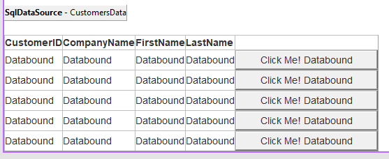

# Work with data

## 목차
- [Work with data](#work-with-data)
  - [목차](#목차)
  - [Entity Framework](#entity-framework)
    - [EF 코드 우선](#ef-코드-우선)
    - [EF 데이터베이스 우선](#ef-데이터베이스-우선)
  - [웹 서비스와 상호 작용](#웹-서비스와-상호-작용)
  - [출처](#출처)
  - [다음](#다음)

---

데이터 액세스는 웹 애플리케이션의 중추입니다. 웹을 위한 폼을 작성할 때, 데이터는 어떻게 처리될까요? 데이터베이스와 상호 작용하기 위해 사용할 수 있는 여러 데이터 액세스 기술이 있습니다:

- 데이터 소스
- ADO.NET
- Entity Framework

데이터 소스는 페이지에 배치하고 다른 컨트롤처럼 구성할 수 있는 컨트롤입니다. Visual Studio는 이러한 컨트롤을 구성하고 페이지에 바인딩하는 친숙한 대화 상자를 제공했습니다. "코드가 거의 없는" 또는 "코드가 없는" 접근 방식을 선호하는 개발자에게 유용했습니다.



ADO.NET은 데이터베이스와 상호 작용하는 저수준 접근 방식입니다. 앱은 명령어, 데이터 테이블 및 데이터셋을 사용하여 데이터베이스에 연결할 수 있습니다. 결과는 화면에 거의 코드 없이 필드에 바인딩될 수 있었습니다. 이 접근 방식의 단점은 각 ADO.NET 객체 세트(`Connection`, `Command`, `DataTable`)가 데이터베이스 공급자가 제공하는 라이브러리에 바인딩된다는 점이었습니다. 이러한 구성 요소를 사용하면 코드가 경직되고 다른 데이터베이스로 마이그레이션하기 어려웠습니다.

## Entity Framework

Entity Framework(EF)는 .NET Foundation에서 유지 관리하는 오픈 소스 객체-관계 매핑 프레임워크입니다. 처음에는 .NET Framework와 함께 출시되었으며, EF는 데이터베이스 연결, 저장 스키마 및 상호 작용을 위한 코드를 생성할 수 있습니다. 이 추상화를 통해 앱의 비즈니스 규칙에 집중할 수 있으며 데이터베이스는 신뢰할 수 있는 데이터베이스 관리자에 의해 관리될 수 있습니다. .NET에서는 EF Core라는 업데이트된 버전을 사용할 수 있습니다. EF Core는 `dotnet ef` 명령줄 도구를 사용하여 코드와 데이터베이스 간의 상호 작용을 생성하고 유지 관리하는 명령어를 제공합니다. 데이터베이스와 작업하는 몇 가지 샘플을 살펴보겠습니다.

### EF 코드 우선

데이터베이스 상호 작용을 시작하는 빠른 방법은 작업하려는 클래스 객체를 시작하는 것입니다. EF는 클래스에 적합한 데이터베이스 코드를 생성하는 도구를 제공합니다. 이 접근 방식을 "코드 우선" 개발이라고 합니다. Microsoft SQL Server와 같은 관계형 데이터베이스에 저장하고자 하는 샘플 상점 앱의 `Product` 클래스를 고려해 보십시오.

```csharp
public class Product
{
    public int Id { get; set; }

    [Required]
    public string Name { get; set; }

    [MaxLength(4000)]
    public string Description { get; set; }

    [Range(0, 99999.99)]
    [DataType(DataType.Currency)]
    public decimal Price { get; set; }
}
```

Product는 기본 키와 데이터베이스에 생성될 세 개의 추가 필드를 가지고 있습니다:

- EF는 규칙에 따라 `Id` 속성을 기본 키로 식별합니다.
- `Name`은 텍스트 저장을 위해 구성된 열에 저장됩니다. 이 속성을 장식하는 `[Required]` 속성은 `not null` 제약 조건을 추가하여 이 속성의 선언된 동작을 적용하는 데 도움이 됩니다.
- `Description`은 텍스트 저장을 위해 구성된 열에 저장되며, `[MaxLength]` 속성에 의해 구성된 최대 길이 4000자로 설정됩니다. 데이터베이스 스키마는 `varchar(4000)` 데이터 유형을 사용하여 `MaxLength`라는 열로 구성됩니다.
- `Price` 속성은 통화로 저장됩니다. `[Range]` 속성은 선언된 최소 및 최대 값 외부의 데이터 저장을 방지하기 위해 적절한 제약 조건을 생성합니다.

이 `Product` 클래스를 데이터베이스와의 연결 및 변환 작업을 정의하는 데이터베이스 컨텍스트 클래스에 추가해야 합니다.

```csharp
public class MyDbContext : DbContext
{
    public DbSet<Product> Products { get; set; }
}
```

`MyDbContext` 클래스는 `Product` 클래스를 위한 액세스 및 변환을 정의하는 하나의 속성을 제공합니다. 다음 항목을 `Startup` 클래스의 `ConfigureServices` 메서드(또는 `services` 대신 `builder.Services` 속성을 사용하는 *Program.cs*의 적절한 위치)에 추가하여 데이터베이스와의 상호 작용을 구성합니다:

```csharp
services.AddDbContext<MyDbContext>(options =>
    options.UseSqlServer("MY DATABASE CONNECTION STRING"));
```

위의 코드는 지정된 연결 문자열을 사용하여 SQL Server 데이터베이스에 연결합니다. 연결 문자열은 *appsettings.json* 파일, 환경 변수 또는 기타 구성 저장 위치에 넣고 적절히 이 임베디드 문자열을 대체할 수 있습니다.

다음 명령어를 사용하여 이 클래스에 적합한 데이터베이스 테이블을 생성할 수 있습니다:

```dotnetcli
dotnet ef migrations add 'Create Product table'
dotnet ef database update
```

첫 번째 명령어는 `Create Product table`이라는 새로운 EF 마이그레이션으로 데이터베이스 스키마에 대한 변경 사항을 정의합니다. 마이그레이션은 새로운 데이터베이스 변경 사항을 적용하고 제거하는 방법을 정의합니다.

적용되면 데이터베이스에 간단한 `Product` 테이블과 데이터베이스 스키마를 관리하는 데 도움이 되는 프로젝트에 새로운 클래스가 추가됩니다. 기본적으로 이 생성된 클래스는 *Migrations*라는 새 폴더에서 찾을 수 있습니다. `Product` 클래스에 변경 사항을 추가하거나 데이터베이스와 상호 작용하는 관련 클래스를 더 추가할 때마다 마이그레이션의 새 이름으로 명령줄 명령어를 다시 실행해야 합니다. 이 명령은 데이터베이스 스키마를 업데이트하는 또 다른 마이그레이션 클래스를 생성합니다.

### EF 데이터베이스 우선

기존 데이터베이스의 경우 .NET 명령줄 도구를 사용하여 EF Core 클래스를 생성할 수 있습니다. 클래스를 스캐폴딩하려면 다음 명령의 변형을 사용하십시오:

```dotnetcli
dotnet ef dbcontext scaffold "CONNECTION STRING" Microsoft.EntityFrameworkCore.SqlServer -c MyDbContext -t Product -t Customer
```

위의 명령어는 지정된 연결 문자열 및 `Microsoft.EntityFrameworkCore.SqlServer` 공급자를 사용하여 데이터베이스에 연결합니다. 연결되면 `MyDbContext`라는 데이터베이스 컨텍스트 클래스가 생성됩니다. 또한 `-t` 옵션으로 지정된 `Product` 및 `Customer` 테이블에 대한 지원 클래스가 생성됩니다. 이 명령에는 데이터베이스에 적합한 클래스 계층 구조를 생성하기 위한 많은 구성 옵션이 있습니다. 전체 참조는 명령어 문서를 참조하십시오.

EF Core에 대한 자세한 내용은 Microsoft Docs 사이트에서 확인할 수 있습니다.

## 웹 서비스와 상호 작용

ASP.NET이 처음 출시되었을 때, SOAP 서비스는 웹 서버와 클라이언트가 데이터를 교환하는 데 선호되는 방식이었습니다. 그 이후로 많은 것이 변했으며, 서비스와의 상호 작용은 직접 HTTP 클라이언트 상호 작용으로 전환되었습니다. ASP.NET Core 및 Blazor에서는 *Program.cs* 또는 `Startup` 클래스의 `ConfigureServices` 메서드에서 `HttpClient` 구성 등록을 할 수 있습니다. HTTP 엔드포인트와 상호 작용해야 할 때 해당 구성을 사용하십시오. 다음 구성 코드를 고려해 보십시오:

```csharp
// in Program.cs
builder.Services.AddHttpClient("github", client =>
{
    client.BaseAddress = new Uri("http://api.github.com/");
    // Github API 버전 관리
    client.DefaultRequestHeaders.Add("Accept", "application/vnd.github.v3+json");
    // Github는 사용자 에이전트를 필요로 합니다
    client.DefaultRequestHeaders.Add("User-Agent", "BlazorWebForms-Sample");
});
```

GitHub에서 데이터를 액세스해야 할 때마다 `github`라는 이름의 클라이언트를 생성합니다. 클라이언트는 기본 주소로 구성되고 요청 헤더가 적절하게 설정됩니다. `@inject` 지시문 또는 속성에 `[Inject]` 특성을 사용하여 Blazor 컴포넌트에 `IHttpClientFactory`를 주입합니다. 다음 구문을 사용하여 명명된 클라이언트를 생성하고 서비스와 상호 작용합니다:

```razor
@inject IHttpClientFactory factory

...

@code {
    protected override async Task OnInitializedAsync()
    {
        var client = factory.CreateClient("github");
        var response = await client.GetAsync("repos/dotnet/docs/issues");
        response.EnsureSuccessStatusCode();
        var content = await response.Content.ReadAsStringAsync();
    }
}
```

이 방법은 *dotnet/docs* GitHub 저장소의 이슈 컬렉션을 설명하는 문자열을 반환합니다.
내용은 JSON 형식으로 반환되며 적절한 GitHub 이슈 객체로 역직렬화됩니다. `HttpClientFactory`를 구성하여 사전 구성된 `HttpClient` 객체를 제공하는 다양한 방법이 있습니다. 여러 `HttpClient` 인스턴스를 다른 이름과 엔드포인트로구성하여 다양한 웹 서비스와의 상호 작용을 각 페이지에서 더 쉽게 만들 수 있도록 시도해 보십시오. 자세한 내용은 IHttpClientFactory를 사용하여 HTTP 요청 만들기를 참조하십시오.
 
---
## 출처
[Work with data](https://learn.microsoft.com/en-us/dotnet/architecture/blazor-for-web-forms-developers/data)

---
## [다음](./11_middleware.md)