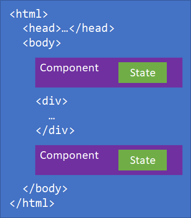
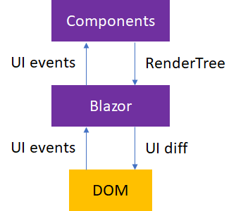

# Architecture comparison of ASP.NET Web Forms and Blazor

## 목차
- [Architecture comparison of ASP.NET Web Forms and Blazor](#architecture-comparison-of-aspnet-web-forms-and-blazor)
  - [목차](#목차)
  - [ASP.NET Web Forms](#aspnet-web-forms)
  - [Blazor](#blazor)
  - [출처](#출처)
  - [다음](#다음)

---
ASP.NET Web Forms와 Blazor는 많은 유사한 개념을 가지고 있지만, 작동 방식에는 차이가 있습니다. 이 장에서는 ASP.NET Web Forms와 Blazor의 내부 작동 방식과 아키텍처를 비교합니다.

## ASP.NET Web Forms

ASP.NET Web Forms 프레임워크는 페이지 중심의 아키텍처를 기반으로 합니다. 앱 내 위치에 대한 각 HTTP 요청은 ASP.NET이 응답하는 별도의 페이지입니다. 페이지가 요청될 때 브라우저의 내용은 요청된 페이지의 결과로 대체됩니다.

페이지는 다음과 같은 구성 요소로 구성됩니다:

- HTML 마크업
- C# 또는 Visual Basic 코드
- 로직과 이벤트 처리 기능을 포함한 코드 비하인드 클래스
- 컨트롤

컨트롤은 페이지에 프로그래밍 방식으로 배치하고 상호작용할 수 있는 재사용 가능한 웹 UI 단위입니다. 페이지는 *.aspx*로 끝나는 파일로 구성되어 있으며, 이 파일에는 마크업, 컨트롤 및 일부 코드가 포함됩니다. 코드 비하인드 클래스는 사용된 프로그래밍 언어에 따라 *.aspx.cs* 또는 *.aspx.vb* 확장자를 가진 동일한 기본 이름의 파일에 있습니다. 흥미롭게도 웹 서버는 *.aspx* 파일의 내용을 해석하고 변경될 때마다 이를 컴파일합니다. 이 재컴파일은 웹 서버가 이미 실행 중인 경우에도 발생합니다.

컨트롤은 마크업으로 빌드되어 사용자 컨트롤로 제공될 수 있습니다. 사용자 컨트롤은 `UserControl` 클래스를 상속받으며 페이지와 유사한 구조를 가집니다. 사용자 컨트롤의 마크업은 *.ascx* 파일에 저장됩니다. 동반하는 코드 비하인드 클래스는 *.ascx.cs* 또는 *.ascx.vb* 파일에 있습니다. 컨트롤은 `WebControl` 또는 `CompositeControl` 기본 클래스를 상속하여 완전히 코드로 빌드될 수도 있습니다.

페이지에는 광범위한 이벤트 라이프사이클도 있습니다. 각 페이지는 ASP.NET 런타임이 각 요청에 대해 페이지의 코드를 실행할 때 발생하는 초기화, 로드, 프리렌더 및 언로드 이벤트에 대해 이벤트를 발생시킵니다.

페이지의 컨트롤은 일반적으로 해당 컨트롤을 표시한 동일한 페이지로 포스트백하며, `ViewState`라는 숨겨진 폼 필드에서 페이로드를 가져옵니다. `ViewState` 필드는 페이지에 렌더링되어 표시될 때 컨트롤의 상태에 대한 정보를 포함하여, ASP.NET 런타임이 서버에 제출된 콘텐츠의 변경 사항을 비교하고 식별할 수 있도록 합니다.

## Blazor

Blazor는 Angular나 React와 같은 JavaScript 프론트엔드 프레임워크와 유사한 클라이언트 측 웹 UI 프레임워크입니다. Blazor는 사용자 상호작용을 처리하고 필요한 UI 업데이트를 렌더링합니다. Blazor는 요청-응답 모델에 기반하지 않습니다. 사용자 상호작용은 특정 HTTP 요청의 컨텍스트 외부에서 이벤트로 처리됩니다.

Blazor 앱은 HTML 페이지에 렌더링된 하나 이상의 루트 컴포넌트로 구성됩니다.

사용자가 컴포넌트를 렌더링할 위치를 지정하고 컴포넌트가 사용자 상호작용을 위해 연결되는 방법은 [호스팅 모델](./03_hosting_models.md)별로 다릅니다.

Blazor [컴포넌트]()는 재사용 가능한 UI 조각을 나타내는 .NET 클래스입니다. 각 컴포넌트는 자체 상태를 유지하고 자체 렌더링 로직을 지정할 수 있으며, 여기에는 다른 컴포넌트를 렌더링하는 것도 포함됩니다. 컴포넌트는 특정 사용자 상호작용에 대한 이벤트 핸들러를 지정하여 컴포넌트의 상태를 업데이트합니다.

컴포넌트가 이벤트를 처리한 후 Blazor는 컴포넌트를 렌더링하고 렌더링된 출력에서 변경된 내용을 추적합니다. 컴포넌트는 직접 DOM에 렌더링되지 않습니다. 대신 Blazor가 변경 사항을 추적할 수 있도록 `RenderTree`라는 메모리 내 표현에 렌더링됩니다. Blazor는 새로 렌더링된 출력과 이전 출력을 비교하여 UI 차이를 계산한 다음 이를 효율적으로 DOM에 적용합니다.

컴포넌트는 정상적인 UI 이벤트 외부에서 상태가 변경된 경우에도 수동으로 렌더링되어야 함을 나타낼 수 있습니다. Blazor는 단일 논리 실행 스레드를 강제하기 위해 `SynchronizationContext`를 사용합니다. 컴포넌트의 라이프사이클 메서드와 Blazor에 의해 발생된 이벤트 콜백은 이 `SynchronizationContext`에서 실행됩니다.

---
## 출처
[Architecture comparison of ASP.NET Web Forms and Blazor](https://learn.microsoft.com/en-us/dotnet/architecture/blazor-for-web-forms-developers/architecture-comparison)

---
## [다음](./03_hosting_models.md)