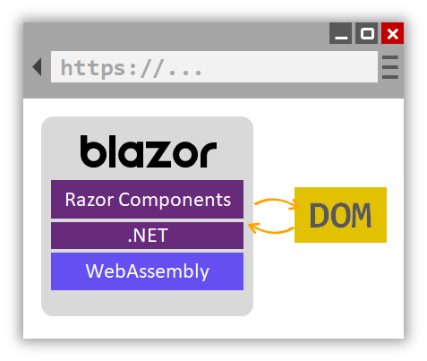
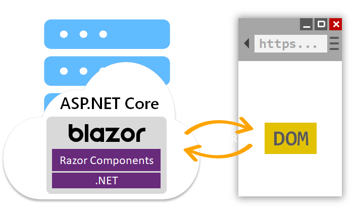

# Blazor app hosting models

## 목차
- [Blazor app hosting models](#blazor-app-hosting-models)
  - [목차](#목차)
  - [Blazor WebAssembly 앱](#blazor-webassembly-앱)
  - [Blazor 서버 앱](#blazor-서버-앱)
  - [올바른 Blazor 호스팅 모델 선택 방법](#올바른-blazor-호스팅-모델-선택-방법)
  - [앱 배포](#앱-배포)
  - [출처](#출처)
  - [다음](#다음)

---

Blazor 앱은 다음과 같은 방식으로 호스팅될 수 있습니다:

- WebAssembly에서 브라우저 내 클라이언트 측에서.
- ASP.NET Core 앱에서 서버 측에서.

## Blazor WebAssembly 앱

Blazor WebAssembly 앱은 WebAssembly 기반 .NET 런타임에서 브라우저 내에서 직접 실행됩니다. Blazor WebAssembly 앱은 Angular나 React와 같은 프론트엔드 JavaScript 프레임워크와 유사하게 동작합니다. 하지만 JavaScript 대신 C#을 작성합니다. .NET 런타임은 앱과 함께 다운로드되며, 앱 어셈블리와 필요한 종속성도 함께 다운로드됩니다. 브라우저 플러그인이나 확장이 필요하지 않습니다.

다운로드된 어셈블리는 다른 .NET 앱에서 사용하는 일반적인 .NET 어셈블리입니다. 런타임이 .NET Standard를 지원하기 때문에 기존 .NET Standard 라이브러리를 Blazor WebAssembly 앱에서 사용할 수 있습니다. 하지만 이러한 어셈블리는 여전히 브라우저 보안 샌드박스 내에서 실행됩니다. 파일 시스템 접근이나 임의의 네트워크 연결을 시도하는 기능은 `PlatformNotSupportedException`을 발생시킬 수 있습니다.

앱이 로드되면 .NET 런타임이 시작되고 앱 어셈블리를 가리킵니다. 앱 시작 로직이 실행되고 루트 컴포넌트가 렌더링됩니다. Blazor는 컴포넌트의 렌더링된 출력에 따라 UI 업데이트를 계산합니다. 그런 다음 DOM 업데이트가 적용됩니다.

Blazor WebAssembly 앱은 순수 클라이언트 측에서 실행됩니다. 이러한 앱은 GitHub Pages나 Azure Static Website Hosting과 같은 정적 사이트 호스팅 솔루션에 배포될 수 있습니다. 서버에 .NET이 전혀 필요하지 않습니다. 앱의 일부로 깊이 링크하는 것은 일반적으로 서버에서 라우팅 솔루션이 필요합니다. 라우팅 솔루션은 요청을 앱의 루트로 리디렉션합니다. 예를 들어, IIS에서 URL 재작성 규칙을 사용하여 이 리디렉션을 처리할 수 있습니다.

Blazor와 풀 스택 .NET 웹 개발의 모든 이점을 얻으려면 ASP.NET Core와 함께 Blazor WebAssembly 앱을 호스트하십시오. 클라이언트와 서버에서 모두 .NET을 사용함으로써 코드를 쉽게 공유하고 일관된 언어, 프레임워크 및 도구 집합을 사용하여 앱을 빌드할 수 있습니다. Blazor는 Blazor WebAssembly 앱과 ASP.NET Core 호스트 프로젝트를 모두 포함하는 솔루션을 설정하기 위한 편리한 템플릿을 제공합니다. 솔루션이 빌드되면 Blazor 앱의 빌드된 정적 파일이 ASP.NET Core 앱에서 호스팅되며, 이미 설정된 폴백 라우팅을 사용합니다.

## Blazor 서버 앱

Blazor 아키텍처 논의에서 기억하듯이, Blazor 컴포넌트는 `RenderTree`라는 중간 추상화에 출력물을 렌더링합니다. Blazor 프레임워크는 렌더링된 내용과 이전에 렌더링된 내용을 비교합니다. 차이점은 DOM에 적용됩니다. Blazor 컴포넌트는 렌더링된 출력이 적용되는 방식과 분리되어 있습니다. 결과적으로 컴포넌트 자체는 UI를 업데이트하는 프로세스와 동일한 프로세스에서 실행될 필요가 없습니다. 사실, 동일한 머신에서 실행될 필요조차 없습니다.

Blazor 서버 앱에서 컴포넌트는 브라우저의 클라이언트 측이 아닌 서버에서 실행됩니다. 브라우저에서 발생하는 UI 이벤트는 실시간 연결을 통해 서버로 전송됩니다. 이벤트는 올바른 컴포넌트 인스턴스에 전달됩니다. 컴포넌트가 렌더링되고 계산된 UI 차이가 직렬화되어 브라우저로 전송되어 DOM에 적용됩니다.

Blazor 서버 호스팅 모델은 ASP.NET AJAX와 `UpdatePanel` 컨트롤을 사용해본 적이 있다면 친숙하게 느껴질 수 있습니다. `UpdatePanel` 컨트롤은 페이지의 트리거 이벤트에 대한 응답으로 부분 페이지 업데이트를 적용합니다. 트리거되면 `UpdatePanel`은 부분 업데이트를 요청한 후 페이지를 새로 고칠 필요 없이 이를 적용합니다. UI 상태는 `ViewState`를 사용하여 관리됩니다. Blazor 서버 앱은 클라이언트와의 활성 연결이 필요하다는 점에서 약간 다릅니다. 또한 모든 UI 상태는 서버에서 유지 관리됩니다. 이러한 차이점 외에도 두 모델은 개념적으로 유사합니다.

## 올바른 Blazor 호스팅 모델 선택 방법

Blazor 호스팅 모델 문서에서 설명한 것처럼, 각기 다른 Blazor 호스팅 모델은 다양한 장단점을 가지고 있습니다.

Blazor WebAssembly 호스팅 모델은 다음과 같은 이점을 제공합니다:

- .NET 서버 측 종속성이 없습니다. 앱은 클라이언트에 다운로드된 후 완전히 작동합니다.
- 클라이언트 리소스와 기능이 완전히 활용됩니다.
- 작업이 서버에서 클라이언트로 오프로드됩니다.
- ASP.NET Core 웹 서버가 앱을 호스트하는 데 필요하지 않습니다. 서버리스 배포 시나리오가 가능합니다(예: CDN에서 앱 제공).

Blazor WebAssembly 호스팅 모델의 단점은 다음과 같습니다:

- 브라우저 기능이 앱을 제한합니다.
- 유능한 클라이언트 하드웨어와 소프트웨어(WebAssembly 지원 등)가 필요합니다.
- 다운로드 크기가 더 크고 앱 로드 시간이 더 길어집니다.
- .NET 런타임 및 도구 지원이 덜 성숙합니다. 예를 들어, .NET Standard 지원 및 디버깅에 제한이 있습니다.

반대로 Blazor 서버 호스팅 모델은 다음과 같은 이점을 제공합니다:

- 다운로드 크기가 클라이언트 측 앱보다 훨씬 작고 앱 로드 시간이 훨씬 빠릅니다.
- 서버 기능을 최대한 활용하여 모든 .NET 호환 API를 사용할 수 있습니다.
- 앱 실행에 서버에서 .NET을 사용하므로 기존 .NET 도구(예: 디버깅)가 예상대로 작동합니다.
- 얇은 클라이언트를 지원합니다. 예를 들어, 서버 측 앱은 WebAssembly를 지원하지 않는 브라우저 및 리소스가 제한된 장치에서도 작동합니다.
- 앱의 .NET/C# 코드 기반(컴포넌트 코드 포함)은 클라이언트에 제공되지 않습니다.

Blazor 서버 호스팅 모델의 단점은 다음과 같습니다:

- UI 대기 시간이 더 길어집니다. 모든 사용자 상호작용에는 네트워크 홉이 필요합니다.
- 오프라인 지원이 없습니다. 클라이언트 연결이 끊어지면 앱이 작동을 멈춥니다.
- 많은 사용자가 있는 앱의 경우 확장성이 어려워집니다. 서버는 여러 클라이언트 연결을 관리하고 클라이언트 상태를 처리해야 합니다.
- 앱을 제공하려면 ASP.NET Core 서버가 필요합니다. 서버리스 배포 시나리오는 불가능합니다. 예를 들어, CDN에서 앱을 제공할 수 없습니다.

위의 트레이드오프 목록은 위협적으로 보일 수 있지만, 호스팅 모델은 나중에 변경할 수 있습니다. 선택한 Blazor 호스팅 모델에 관계없이 컴포넌트 모델은 *동일*합니다. 원칙적으로 동일한 컴포넌트를 두 가지 호스팅 모델 중 하나와 함께 사용할 수 있습니다. 앱 코드는 변경되지 않습니다. 하지만 컴포넌트가 호스팅 모델에 구애받지 않도록 추상화를 도입하는 것이 좋습니다. 추상화를 통해 앱은 다른 호스팅 모델을 더 쉽게 채택할 수 있습니다.

## 앱 배포

ASP.NET Web Forms 앱은 일반적으로 Windows 서버 머신 또는 클러스터에서 IIS에 호스팅됩니다. Blazor 앱도 다음과 같이 호스팅할 수 있습니다:

- 정적 파일로서 또는 ASP.NET Core 앱으로 IIS에 호스팅할 수 있습니다.
- ASP.NET Core의 유연성을 활용하여 다양한 플랫폼과 서버 인프라에서 호스팅할 수 있습니다. 예를 들어, Nginx나 Apache를 사용하여 Linux에서 Blazor 앱을 호스팅할 수 있습니다. Blazor 앱을 게시하고 배포하는 방법에 대한 자세한 내용은 Blazor 호스팅 및 배포 문서를 참조하십시오.

다음 섹션에서는 Blazor WebAssembly와 Blazor 서버 앱의 프로젝트 설정 방법을 살펴보겠습니다.

---
## 출처
[Blazor app hosting models](https://learn.microsoft.com/en-us/dotnet/architecture/blazor-for-web-forms-developers/hosting-models)

---
## [다음](./04_Project_structure.md)