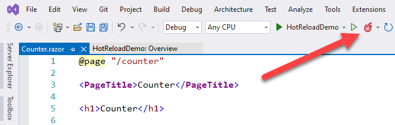
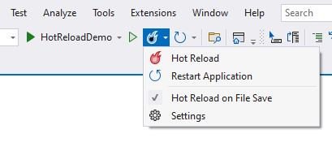
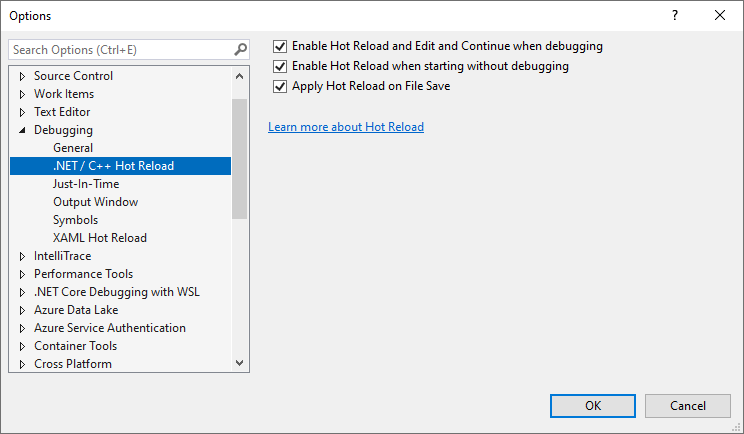

# Project structure for Blazor apps

## 목차
- [Project structure for Blazor apps](#project-structure-for-blazor-apps)
  - [목차](#목차)
  - [프로젝트 파일](#프로젝트-파일)
  - [진입점](#진입점)
  - [정적 파일](#정적-파일)
  - [구성](#구성)
  - [Razor 컴포넌트](#razor-컴포넌트)
  - [페이지](#페이지)
  - [레이아웃](#레이아웃)
  - [Blazor 부트스트랩](#blazor-부트스트랩)
  - [빌드 출력](#빌드-출력)
  - [Hot Reload로 앱 실행](#hot-reload로-앱-실행)
  - [출처](#출처)
  - [다음](#다음)

---

ASP.NET Web Forms와 Blazor는 프로젝트 구조에서 많은 차이점이 있지만, 많은 유사한 개념을 공유합니다. 여기에서는 Blazor 프로젝트의 구조를 살펴보고 이를 ASP.NET Web Forms 프로젝트와 비교해 보겠습니다.

첫 번째 Blazor 앱을 만들려면 Blazor 시작 단계의 지침을 따르십시오. Blazor 서버 앱 또는 ASP.NET Core에서 호스팅되는 Blazor WebAssembly 앱을 만들기 위한 지침을 따를 수 있습니다. 호스팅 모델에 특화된 논리를 제외하면, 두 프로젝트의 대부분의 코드는 동일합니다.

## 프로젝트 파일

Blazor 서버 앱은 .NET 프로젝트입니다. Blazor 서버 앱의 프로젝트 파일은 가능한 한 단순하게 구성되어 있습니다:

```xml
<Project Sdk="Microsoft.NET.Sdk.Web">

  <PropertyGroup>
    <TargetFramework>net8.0</TargetFramework>
  </PropertyGroup>

</Project>
```

Blazor WebAssembly 앱의 프로젝트 파일은 약간 더 복잡합니다(정확한 버전 번호는 다를 수 있습니다):

```xml
<Project Sdk="Microsoft.NET.Sdk.BlazorWebAssembly">

  <PropertyGroup>
    <TargetFramework>net8.0</TargetFramework>
    <ImplicitUsings>enable</ImplicitUsings>
  </PropertyGroup>

  <ItemGroup>
    <PackageReference Include="Microsoft.AspNetCore.Components.WebAssembly" Version="8.0.0" />
    <PackageReference Include="Microsoft.AspNetCore.Components.WebAssembly.DevServer" Version="8.0.0" PrivateAssets="all" />
  </ItemGroup>

</Project>
```

Blazor WebAssembly 프로젝트는 `Microsoft.NET.Sdk.Web` SDK 대신 `Microsoft.NET.Sdk.BlazorWebAssembly`를 타겟으로 합니다. 이는 WebAssembly 기반 .NET 런타임에서 브라우저 내에서 실행되기 때문입니다. 서버나 개발자 머신에 .NET을 설치할 수 있는 것과 달리 웹 브라우저에는 설치할 수 없습니다. 따라서 프로젝트는 개별 패키지 참조를 사용하여 Blazor 프레임워크를 참조합니다.

비교해보면, 기본 ASP.NET Web Forms 프로젝트는 *.csproj* 파일에 거의 300줄의 XML을 포함하며, 대부분은 프로젝트의 다양한 코드 및 콘텐츠 파일을 명시적으로 나열하는 것입니다. .NET 5 릴리스 이후, Blazor 서버 및 Blazor WebAssembly 앱은 쉽게 하나의 통합 런타임을 공유할 수 있습니다.

비록 지원되지만, 개별 어셈블리 참조는 .NET 프로젝트에서 덜 일반적입니다. 대부분의 프로젝트 종속성은 NuGet 패키지 참조로 처리됩니다. .NET 프로젝트에서는 최상위 패키지 종속성만 참조하면 됩니다. 전이적 종속성은 자동으로 포함됩니다. ASP.NET Web Forms 프로젝트에서 패키지를 참조하는 데 일반적으로 사용되는 *packages.config* 파일 대신, 패키지 참조는 `<PackageReference>` 요소를 사용하여 프로젝트 파일에 추가됩니다.

```xml
<ItemGroup>
  <PackageReference Include="Newtonsoft.Json" Version="13.0.2" />
</ItemGroup>
```

## 진입점

Blazor 서버 앱의 진입점은 콘솔 앱에서 볼 수 있는 것처럼 *Program.cs* 파일에 정의됩니다. 앱이 실행되면, 웹 호스트 인스턴스를 생성하고 웹 앱에 특화된 기본값을 사용하여 실행합니다. 웹 호스트는 Blazor 서버 앱의 생명 주기를 관리하고 호스트 수준의 서비스를 설정합니다. 이러한 서비스의 예로는 구성, 로깅, 종속성 주입, HTTP 서버가 있습니다. 이 코드는 대부분 보일러플레이트 코드이며, 종종 변경되지 않은 채로 남아 있습니다.

```csharp
using BlazorApp3.Areas.Identity;
using BlazorApp3.Data;
using Microsoft.AspNetCore.Components.Authorization;
using Microsoft.AspNetCore.Identity;
using Microsoft.EntityFrameworkCore;

var builder = WebApplication.CreateBuilder(args);

// Add services to the container.
var connectionString = builder.Configuration.GetConnectionString("DefaultConnection");
builder.Services.AddDbContext<ApplicationDbContext>(options =>
    options.UseSqlServer(connectionString));
builder.Services.AddDatabaseDeveloperPageExceptionFilter();
builder.Services.AddDefaultIdentity<IdentityUser>(options => options.SignIn.RequireConfirmedAccount = true)
    .AddEntityFrameworkStores<ApplicationDbContext>();
builder.Services.AddRazorPages();
builder.Services.AddServerSideBlazor();
builder.Services.AddScoped<AuthenticationStateProvider, RevalidatingIdentityAuthenticationStateProvider<IdentityUser>>();
builder.Services.AddSingleton<WeatherForecastService>();

var app = builder.Build();

// Configure the HTTP request pipeline.
if (app.Environment.IsDevelopment())
{
    app.UseMigrationsEndPoint();
}
else
{
    app.UseExceptionHandler("/Error");
    // The default HSTS value is 30 days. You may want to change this for production scenarios, see https://aka.ms/aspnetcore-hsts.
    app.UseHsts();
}

app.UseHttpsRedirection();

app.UseStaticFiles();

app.UseRouting();

app.UseAuthorization();

app.MapControllers();
app.MapBlazorHub();
app.MapFallbackToPage("/_Host");

app.Run();
```

Blazor WebAssembly 앱도 *Program.cs* 파일에 진입점을 정의합니다. 코드는 약간 다르게 보이지만, 앱 호스트를 설정하여 앱에 동일한 호스트 수준의 서비스를 제공하는 것은 유사합니다. WebAssembly 앱 호스트는 브라우저 내에서 직접 실행되기 때문에 HTTP 서버를 설정하지 않습니다.

Blazor 앱은 *Global.asax* 파일을 사용하여 앱의 시작 로직을 정의하지 않습니다. 대신, 이 로직은 *Program.cs* 또는 *Program.cs*에서 참조되는 관련 `Startup` 클래스에 포함됩니다. 어느 쪽이든, 이 코드는 앱과 앱 특화 서비스를 구성하는 데 사용됩니다.

Blazor 서버 앱에서는 *Program.cs* 파일이 클라이언트 브라우저와 서버 간의 실시간 연결을 설정하는 데 사용됩니다.

Blazor WebAssembly 앱에서는 *Program.cs* 파일이 앱의 루트 컴포넌트와 이를 렌더링할 위치를 정의합니다:

```csharp
using BlazorApp1;
using Microsoft.AspNetCore.Components.Web;
using Microsoft.AspNetCore.Components.WebAssembly.Hosting;

var builder = WebAssemblyHostBuilder.CreateDefault(args);
builder.RootComponents.Add<App>("#app");
builder.RootComponents.Add<HeadOutlet>("head::after");

builder.Services.AddScoped(sp => new HttpClient { BaseAddress = new Uri(builder.HostEnvironment.BaseAddress) });

await builder.Build().RunAsync();
```

## 정적 파일

ASP.NET Web Forms 프로젝트와 달리, Blazor 프로젝트의 모든 파일이 정적 파일로 요청될 수 있는 것은 아닙니다. *wwwroot* 폴더의 파일만 웹에서 접근할 수 있습니다. 이 폴더는 앱의 "웹 루트"로 불립니다. 앱의 웹 루트 외부의 파일은 웹에서 접근할 수 없습니다. 이러한 설정은 프로젝트 파일이 웹을 통해 실수로 노출되는 것을 방지하는 추가적인 보안 수준을 제공합니다.

## 구성

ASP.NET Web Forms 앱에서 구성은 일반적으로 하나 이상의 *web.config* 파일을 사용하여 처리됩니다. Blazor 앱은 일반적으로 *web.config* 파일을 사용하지 않습니다. 사용하는 경우, 파일은 IIS에서 호스팅될 때 IIS 특화 설정을 구성하는 데만 사용됩니다. 대신, Blazor 서버 앱은 ASP.NET Core 구성 추상화를 사용합니다. (Blazor WebAssembly 앱은 현재 동일한 구성 추상화를 지원하지 않지만, 이는 향후 추가될 수 있는 기능입니다.) 예를 들어, 기본 Blazor 서버 앱은 일부 설정을 *appsettings.json*에 저장합니다.

```json
{
  "Logging": {
    "LogLevel": {
      "Default": "Information",
      "Microsoft": "Warning",
      "Microsoft.Hosting.Lifetime": "Information"
    }
  },
  "AllowedHosts": "*"
}
```

ASP.NET Core 프로젝트에서 구성에 대해 더 자세히 알아보려면 구성 섹션을 참조하십시오.

## Razor 컴포넌트

Blazor 프로젝트의 대부분의 파일은 *.razor* 파일입니다. Razor는 HTML과 C#을 기반으로 웹 UI를 동적으로 생성하는 템플릿 언어입니다. *.razor* 파일은 앱의 UI를 구성하는 컴포넌트를 정의합니다. 대부분의 경우, Blazor 서버 및 Blazor WebAssembly 앱의 컴포넌트는 동일합니다. Blazor의 컴포넌트는 ASP.NET Web Forms의 사용자 컨트롤과 유사합니다.

각 Razor 컴포넌트 파일은 프로젝트가 빌드될 때 .NET 클래스에 컴파일됩니다. 생성된 클래스는 컴포넌트의 상태, 렌더링 로직, 생명주기 메서드, 이벤트 핸들러 및 기타 로직을 캡처합니다. 컴포넌트 작성에 대해 더 자세히 알아보려면 Blazor로 재사용 가능한 UI 컴포넌트 빌드 섹션을 참조하십시오.

*_Imports.razor* 파일은 Razor 컴포넌트 파일이 아닙니다. 대신, 동일한 폴더 및 하위 폴더의 다른 *.razor* 파일에 가져올 Razor 지시문 세트를 정의합니다. 예를 들어, *_Imports.razor* 파일은 자주 사용되는 네임

스페이스에 대한 `using` 지시문을 추가하는 일반적인 방법입니다:

```razor
@using System.Net.Http
@using System.Net.Http.Json
@using Microsoft.AspNetCore.Components.Forms
@using Microsoft.AspNetCore.Components.Routing
@using Microsoft.AspNetCore.Components.Web
@using Microsoft.AspNetCore.Components.Web.Virtualization
@using Microsoft.AspNetCore.Components.WebAssembly.Http
@using Microsoft.JSInterop
@using BlazorApp1
@using BlazorApp1.Shared
```

## 페이지

Blazor 앱에서 페이지는 어디에 있습니까? Blazor는 ASP.NET Web Forms 앱의 *.aspx* 파일과 같이 주소 지정 가능한 페이지에 대한 별도의 파일 확장자를 정의하지 않습니다. 대신, 페이지는 컴포넌트에 라우트를 할당하여 정의됩니다. 라우트는 일반적으로 `@page` Razor 지시문을 사용하여 할당됩니다. 예를 들어, *Pages/Counter.razor* 파일에 작성된 `Counter` 컴포넌트는 다음과 같은 라우트를 정의합니다:

```razor
@page "/counter"
```

Blazor에서 라우팅은 서버가 아닌 클라이언트 측에서 처리됩니다. 사용자가 브라우저에서 탐색할 때 Blazor는 탐색을 가로채고 일치하는 라우트의 컴포넌트를 렌더링합니다.

컴포넌트 라우트는 *.aspx* 페이지 또는 ASP.NET Core Razor Pages와 같이 컴포넌트의 파일 위치에 의해 유추되지 않습니다. 이 기능은 향후 추가될 수 있습니다. 각 라우트는 컴포넌트에 명시적으로 지정해야 합니다. 라우트 가능한 컴포넌트를 *Pages* 폴더에 저장하는 것은 특별한 의미가 없으며, 단지 관례일 뿐입니다.

Blazor에서 라우팅에 대해 더 자세히 알아보려면 페이지, 라우팅 및 레이아웃 섹션을 참조하십시오.

## 레이아웃

ASP.NET Web Forms 앱에서 공통 페이지 레이아웃은 마스터 페이지(*Site.Master*)를 사용하여 처리됩니다. Blazor 앱에서 페이지 레이아웃은 레이아웃 컴포넌트(*Shared/MainLayout.razor*)를 사용하여 처리됩니다. 레이아웃 컴포넌트에 대해서는 페이지, 라우팅 및 레이아웃 섹션에서 더 자세히 다룹니다.

## Blazor 부트스트랩

Blazor를 부트스트랩하려면 앱은 다음을 수행해야 합니다:

- 페이지에서 루트 컴포넌트(*App.Razor*)가 렌더링될 위치를 지정합니다.
- 해당 Blazor 프레임워크 스크립트를 추가합니다.

Blazor 서버 앱에서는 루트 컴포넌트의 호스트 페이지가 *_Host.cshtml* 파일에 정의됩니다. 이 파일은 컴포넌트가 아닌 Razor 페이지를 정의합니다. Razor 페이지는 *.aspx* 페이지와 매우 유사하게 서버에서 주소 지정 가능한 페이지를 정의하는 데 Razor 구문을 사용합니다.

```razor
@page "/"
@namespace BlazorApp3.Pages
@addTagHelper *, Microsoft.AspNetCore.Mvc.TagHelpers
@{
    Layout = "_Layout";
}

<component type="typeof(App)" render-mode="ServerPrerendered" />
```

`render-mode` 속성은 루트 수준 컴포넌트가 렌더링될 위치를 정의하는 데 사용됩니다. `RenderMode` 옵션은 컴포넌트가 렌더링되는 방식을 나타냅니다. 지원되는 `RenderMode` 옵션은 다음 표에 나와 있습니다.

|옵션                        |설명       |
|------------------------------|------------------|
|`RenderMode.Server`           |브라우저와의 연결이 설정되면 상호작용 방식으로 렌더링|
|`RenderMode.ServerPrerendered`|처음에 프리렌더링되고 나중에 상호작용 방식으로 렌더링|
|`RenderMode.Static`           |정적 콘텐츠로 렌더링|

*_Layout.cshtml* 파일에는 앱과 그 구성 요소에 대한 기본 HTML이 포함되어 있습니다.

```razor
@using Microsoft.AspNetCore.Components.Web
@namespace BlazorApp3.Pages
@addTagHelper *, Microsoft.AspNetCore.Mvc.TagHelpers

<!DOCTYPE html>
<html lang="en">
<head>
    <meta charset="utf-8" />
    <meta name="viewport" content="width=device-width, initial-scale=1.0" />
    <base href="~/" />
    <link rel="stylesheet" href="css/bootstrap/bootstrap.min.css" />
    <link href="css/site.css" rel="stylesheet" />
    <link href="BlazorApp3.styles.css" rel="stylesheet" />
    <component type="typeof(HeadOutlet)" render-mode="ServerPrerendered" />
</head>
<body>
    @RenderBody()

    <div id="blazor-error-ui">
        <environment include="Staging,Production">
            An error has occurred. This application may no longer respond until reloaded.
        </environment>
        <environment include="Development">
            An unhandled exception has occurred. See browser dev tools for details.
        </environment>
        <a href="" class="reload">Reload</a>
        <a class="dismiss">🗙</a>
    </div>

    <script src="_framework/blazor.server.js"></script>
</body>
</html>
```

*_framework/blazor.server.js* 스크립트 참조는 서버와의 실시간 연결을 설정한 다음 모든 사용자 상호작용 및 UI 업데이트를 처리합니다.

Blazor WebAssembly 앱에서는 호스트 페이지가 *wwwroot/index.html* 아래의 간단한 정적 HTML 파일입니다. `app`이라는 id를 가진 `<div>` 요소는 루트 컴포넌트가 렌더링될 위치를 나타내는 데 사용됩니다.

```html
<!DOCTYPE html>
<html lang="en">

<head>
    <meta charset="utf-8" />
    <meta name="viewport" content="width=device-width, initial-scale=1.0, maximum-scale=1.0, user-scalable=no" />
    <title>BlazorApp1</title>
    <base href="/" />
    <link href="css/bootstrap/bootstrap.min.css" rel="stylesheet" />
    <link href="css/app.css" rel="stylesheet" />
    <link href="BlazorApp1.styles.css" rel="stylesheet" />
</head>

<body>
    <div id="app">Loading...</div>

    <div id="blazor-error-ui">
        An unhandled error has occurred.
        <a href="" class="reload">Reload</a>
        <a class="dismiss">🗙</a>
    </div>
    <script src="_framework/blazor.webassembly.js"></script>
</body>

</html>
```

렌더링할 루트 컴포넌트는 종속성 주입을 통해 서비스를 등록할 수 있는 유연성을 가지고 앱의 *Program.cs* 파일에 지정됩니다. 자세한 내용은 ASP.NET Core Blazor 종속성 주입을 참조하십시오.

```csharp
var builder = WebAssemblyHostBuilder.CreateDefault(args);
builder.RootComponents.Add<App>("#app");
builder.RootComponents.Add<HeadOutlet>("head::after");
```

## 빌드 출력

Blazor 프로젝트가 빌드되면 모든 Razor 컴포넌트 및 코드 파일이 단일 어셈블리로 컴파일됩니다. ASP.NET Web Forms 프로젝트와 달리, Blazor는 UI 로직의 런타임 컴파일을 지원하지 않습니다.

## Hot Reload로 앱 실행

Blazor 서버 앱을 실행하려면 Visual Studio에서 <kbd>F5</kbd> 키를 눌러 디버거가 연결된 상태로 실행하거나, <kbd>Ctrl</kbd> + <kbd>F5</kbd> 키를 눌러 디버거가 연결되지 않은 상태로 실행합니다.

Blazor WebAssembly 앱을 실행하려면 다음 방법 중 하나를 선택합니다:

- 개발 서버를 사용하여 클라이언트 프로젝트를 직접 실행합니다.
- ASP.NET Core로 앱을 호스팅할 때 서버 프로젝트를 실행합니다.

Blazor WebAssembly 앱은 브라우저와 Visual Studio에서 모두 디버깅할 수 있습니다. 자세한 내용은 ASP.NET Core Blazor WebAssembly 디버깅을 참조하십시오.

Blazor 서버 및 Blazor WebAssembly 앱은 모두 Visual Studio에서 Hot Reload를 지원합니다. Hot Reload는 Blazor 앱에 적용된 변경 사항을 브라우저에서 실시간으로 자동 업데이트하는 기능입니다. 도구 모음의 아이콘을 통해 Hot Reload를 사용할지 여부를 전환할 수 있습니다:



아이콘 옆의 캐럿을 선택하면 추가 옵션이 표시됩니다. Hot Reload를 켜거나 끌 수 있으며, 애플리케이션을 다시 시작할 수 있고, 파일을 저장할 때마다 Hot Reload가 발생할지 여부를 전환할 수 있습니다.



추가 구성 옵션에도 액세스할 수 있습니다. 구성 대화 상자를 통해 디버깅 시 (Edit and Continue와 함께), 디버깅 없이 시작할 때 또는 파일이 저장될 때 Hot Reload가 활성화될지 여부를 지정할 수 있습니다.



Hot Reload를 사용하면 "개발자 내부 루프"가 크게 간소화되었습니다. Hot Reload 없이 Blazor 개발자는 일반적으로 각 변경 사항 후에 앱을 다시 시작하고 다시 실행해야 했으며, 필요한 경우 앱의 적절한 부분으로 이동해야 했습니다. Hot Reload를 사용하면 대부분의 경우 앱을 다시 시작할 필요 없이 실행 중인 앱에 변경 사항을 적용할 수 있습니다. Hot Reload는 페이지의 상태를 유지하므로 양식 값을 다시 입력하거나 앱을 다시 필요한 위치로 되돌릴 필요가 없습니다.

---
## 출처
[Project structure for Blazor apps](https://learn.microsoft.com/en-us/dotnet/architecture/blazor-for-web-forms-developers/project-structure)

---
## [다음](./05_startup.md)