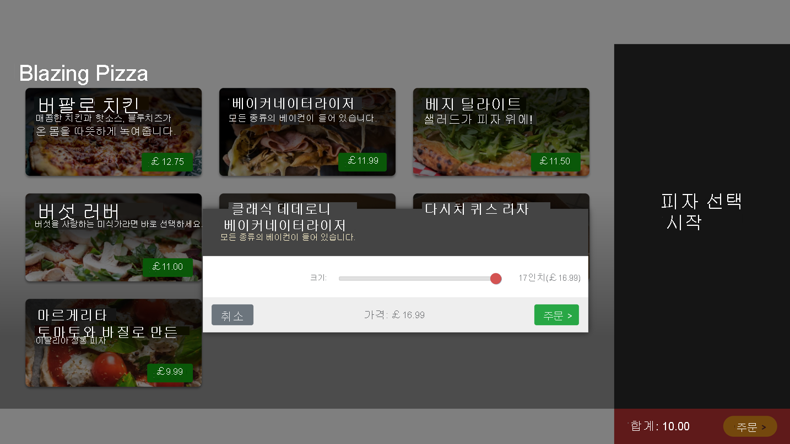
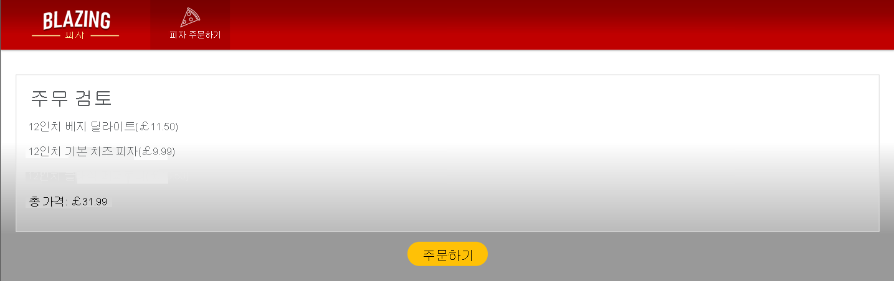
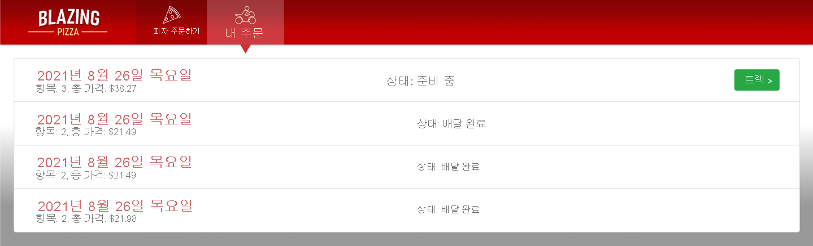
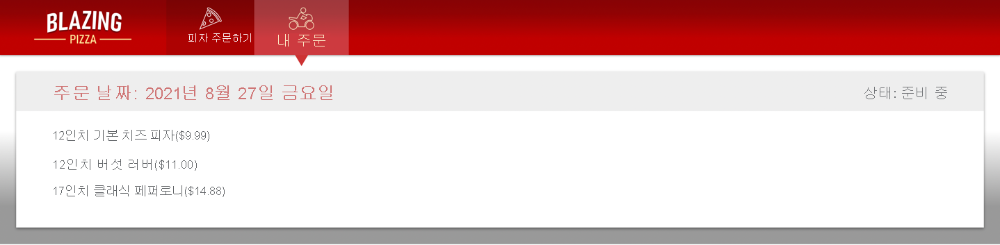
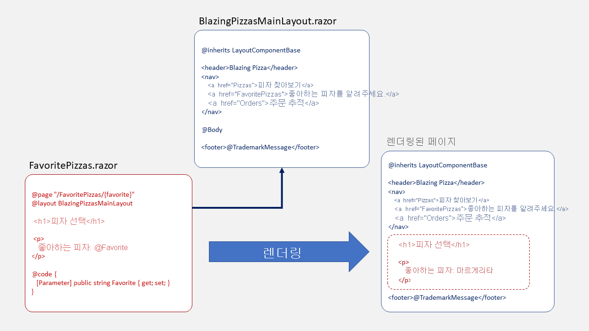
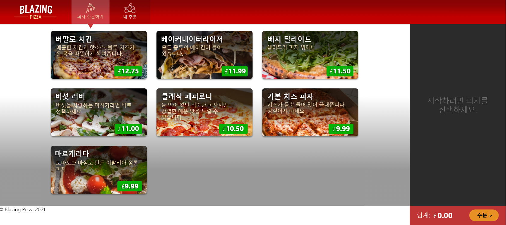
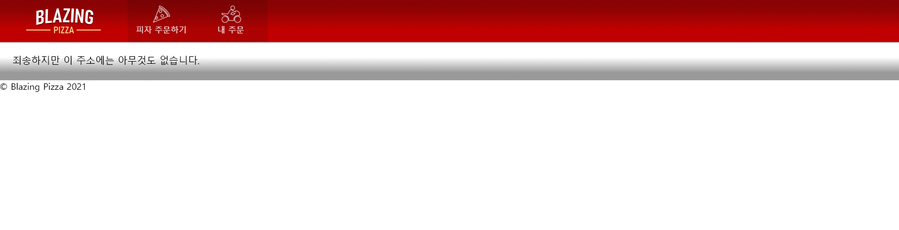

# 페이지, 라우팅 및 레이아웃을 사용하여 Blazor 탐색 개선

## 목차
- [페이지, 라우팅 및 레이아웃을 사용하여 Blazor 탐색 개선](#페이지-라우팅-및-레이아웃을-사용하여-blazor-탐색-개선)
  - [목차](#목차)
  - [소개](#소개)
    - [학습 목표](#학습-목표)
  - [Blazor 라우터 구성 요소를 사용하여 앱의 탐색 제어](#blazor-라우터-구성-요소를-사용하여-앱의-탐색-제어)
    - [경로 템플릿 사용](#경로-템플릿-사용)
    - [@page 지시문 사용](#page-지시문-사용)
    - [위치 정보를 가져오고 NavigationManager를 통해 탐색](#위치-정보를-가져오고-navigationmanager를-통해-탐색)
    - [NavLink 구성 요소 사용](#navlink-구성-요소-사용)
  - [연습 - @page 지시문을 사용하여 Blazor 앱에서의 탐색 변경](#연습---page-지시문을-사용하여-blazor-앱에서의-탐색-변경)
    - [팀의 기존 앱 복제](#팀의-기존-앱-복제)
    - [체크 아웃 페이지 추가](#체크-아웃-페이지-추가)
    - [고객이 주문을 제출하도록 허용](#고객이-주문을-제출하도록-허용)
    - [주문 및 피자에 대한 엔터티 프레임워크 지원 추가](#주문-및-피자에-대한-엔터티-프레임워크-지원-추가)
    - [체크 아웃 기능 테스트](#체크-아웃-기능-테스트)
    - [주문 페이지 추가](#주문-페이지-추가)
  - [경로 매개 변수가 Blazor 앱의 라우팅에 미치는 영향 살펴보기](#경로-매개-변수가-blazor-앱의-라우팅에-미치는-영향-살펴보기)
    - [경로 매개 변수](#경로-매개-변수)
    - [선택적 경로 매개 변수](#선택적-경로-매개-변수)
    - [경로 제약 조건](#경로-제약-조건)
    - [catch-all 경로 매개 변수 설정](#catch-all-경로-매개-변수-설정)
  - [연습 - 경로 매개 변수를 사용하여 앱의 탐색 개선](#연습---경로-매개-변수를-사용하여-앱의-탐색-개선)
    - [주문 세부 정보 페이지 만들기](#주문-세부-정보-페이지-만들기)
    - [경로 매개 변수를 올바른 데이터 형식으로 제한](#경로-매개-변수를-올바른-데이터-형식으로-제한)
    - [주문 페이지 업데이트](#주문-페이지-업데이트)
  - [레이아웃을 사용하여 재사용 가능한 Blazor 구성 요소 빌드](#레이아웃을-사용하여-재사용-가능한-blazor-구성-요소-빌드)
    - [Blazor 레이아웃이란 무엇인가요?](#blazor-레이아웃이란-무엇인가요)
    - [Blazor 레이아웃 코딩](#blazor-레이아웃-코딩)
    - [Blazor 구성 요소에서 레이아웃 사용](#blazor-구성-요소에서-레이아웃-사용)
  - [연습 - Blazor 레이아웃을 추가하여 코드에서 중복 줄이기](#연습---blazor-레이아웃을-추가하여-코드에서-중복-줄이기)
    - [MainLayout 구성 요소 추가](#mainlayout-구성-요소-추가)
    - [페이지 구성 요소에서 Blazor 레이아웃 사용](#페이지-구성-요소에서-blazor-레이아웃-사용)
    - [새 레이아웃을 사용하도록 모든 페이지 업데이트](#새-레이아웃을-사용하도록-모든-페이지-업데이트)
    - [새 레이아웃 테스트](#새-레이아웃-테스트)
  - [요약](#요약)
    - [자세한 정보](#자세한-정보)
  - [출처](#출처)
  - [다음](#다음)

---
## 소개

Blazor는 클라이언트 쪽 JavaScript 라이브러리를 관리하는 복잡성 없이 서버 및 클라이언트 쪽 모두에서 앱 논리를 공유할 수 있는 .NET를 사용하여 대화형 웹 애플리케이션을 만듭니다.

피자 배달 회사에서 고객 대면 웹 사이트를 현대화하기 위해 고용되었다고 가정합니다. 고객이 피자에 대한 토핑을 사용자 지정할 수 있도록 피자를 표시하는 페이지를 이미 빌드했습니다. 주문 페이지를 추가하고 앱의 탐색을 개선하려고 합니다. 또한 고객이 원하는 것을 쉽게 찾을 수 있도록 앱 전체에서 일관된 레이아웃을 유지하려고 합니다.

이 모듈에서는 @page 지시문, Blazor 라우팅 및 NavLink 구성 요소를 사용하여 앱을 통해 고객을 라우팅하는 방법을 알아봅니다. 탐색이 작동하면 앱에 레이아웃을 추가하여 중복 코드를 줄이는 방법에 초점을 맞춥니다.

### 학습 목표

이 모듈을 마치면 다음을 수행할 수 있습니다.

 - 라우터 구성 요소 및 NavLink를 사용하여 Blazor 앱의 탐색을 개선합니다.
 - 경로 매개 변수를 사용하여 기능을 향상합니다.
 - Blazor 앱에서 레이아웃을 사용하여 중복 코드를 줄입니다.

---
## Blazor 라우터 구성 요소를 사용하여 앱의 탐색 제어

Blazor의 라우팅 시스템은 사용자 요청이 해당 요청을 처리하고 사용자가 원하는 정보를 반환할 수 있는 구성 요소에 도달하도록 하는 데 사용할 수 있는 유연한 옵션을 제공합니다.

피자 배달 회사의 웹 사이트에서 작업하고 있다고 가정합니다. 피자 세부 정보와 사용자 지정 토핑 세부 정보에 대한 요청이 모두 동일한 구성 요소에서 처리되도록 사이트를 설정하려고 합니다. 이 단계를 완료했지만 테스트에서는 토핑 요청이 오류 메시지를 수신하고 있음을 보여 줍니다. 이 문제를 해결해야 합니다.

여기서는 @page 지시문을 사용하여 Blazor에서 경로를 구성하는 방법을 알아봅니다.

```
참고

이 단원의 코드 블록은 예시입니다. 다음 단원에서는 사용자 고유의 코드를 작성합니다.
```

### 경로 템플릿 사용

사용자는 웹앱에서 페이지를 요청할 때 URI의 정보로 보려는 내용을 지정할 수 있습니다. 예:

http://www.contoso.com/pizzas/margherita?extratopping=pineapple

프로토콜 및 웹 사이트 주소 후에 이 URI는 사용자가 margherita 피자에 대해 알고 싶어함을 나타냅니다. 또한 물음표 뒤의 쿼리 문자열에서는 추가 토핑으로 파인애플에 관심이 있음을 보여 줍니다. Blazor에서는 라우팅을 사용하여 각 요청이 최상의 구성 요소로 전송되고 해당 구성 요소에 사용자가 원하는 내용을 표시하는 데 필요한 모든 정보가 있는지 확인합니다. 이 경우 요청을 Pizzas 구성 요소로 보내고, 해당 구성 요소가 margherita 피자를 표시하고, 여기에 파인애플을 추가하는 것에 대한 정보를 표시하려고 할 수 있습니다.

Blazor는 라우터 구성 요소라는 특수 구성 요소를 통해 요청을 라우팅합니다. 다음과 같이 App.razor에서 구성됩니다.

```razor
<Router AppAssembly="@typeof(Program).Assembly">
	<Found Context="routeData">
		<RouteView RouteData="@routeData" DefaultLayout="@typeof(MainLayout)" />
	</Found>
	<NotFound>
		<p>Sorry, we haven't found any pizzas here.</p>
	</NotFound>
</Router>
```
앱이 시작되면 Blazor는 AppAssembly 특성을 검사하여 검색해야 하는 어셈블리를 확인합니다. 해당 어셈블리에서 RouteAttribute가 있는 구성 요소를 검색합니다. 이러한 값을 사용하여 Blazor는 요청을 구성 요소로 라우팅하는 방법을 지정하는 RouteData 개체를 컴파일합니다. 앱을 코딩할 때는 각 구성 요소의 @page 지시문을 사용하여 RouteAttribute를 수정합니다.

이전 코드에서 \<Found> 태그는 런타임에 라우팅을 처리하는 구성 요소인 RouteView 구성 요소를 지정합니다. 이 구성 요소는 RouteData 개체와 URI 또는 쿼리 문자열의 매개 변수를 받습니다. 그런 다음 지정된 구성 요소와 해당 레이아웃을 렌더링합니다. \<Found> 태그를 사용하여 기본 레이아웃을 지정할 수 있습니다. 이 레이아웃은 선택한 구성 요소가 @layout 지시문을 사용하여 레이아웃을 지정하지 않을 때 사용됩니다. 이 모듈의 뒷부분에서 레이아웃에 대해 좀 더 자세히 알아봅니다.

\<Router> 구성 요소에서 \<NotFound> 태그를 사용하여 일치하는 경로가 없을 때 사용자에게 반환되는 내용을 지정할 수도 있습니다. 이전 예제에서는 단일 \<p> 단락을 반환하지만 더 복잡한 HTML을 렌더링할 수 있습니다. 예를 들어, 홈페이지에 대한 링크 또는 사이트 관리자를 위한 연락처 페이지가 포함될 수 있습니다.

### @page 지시문 사용

Blazor 구성 요소에서 @page 지시문은 구성 요소가 요청을 직접 처리해야 한다고 지정합니다. @page 지시문에서 RouteAttribute를 문자열로 전달하여 이를 지정할 수 있습니다. 예를 들어 이 특성은 페이지가 /Pizzas 경로에 대한 요청을 처리하도록 지정합니다.

```razor
@page "/Pizzas"
```
구성 요소 경로를 둘 이상 지정하려면 다음 예시와 같이 두 개 이상의 @page 지시문을 사용합니다.
```razor
@page "/Pizzas"
@page "/CustomPizzas"
```

### 위치 정보를 가져오고 NavigationManager를 통해 탐색

사용자가 요청하는 URI를 처리하는 구성 요소를 작성한다고 가정합니다(예: http://www.contoso.com/pizzas/margherita/?extratopping=pineapple).

구성 요소를 작성할 때 다음과 같이 탐색 정보에 액세스해야 할 수 있습니다.

 - 현재 전체 URI(예: http://www.contoso.com/pizzas/margherita?extratopping=pineapple)
 - 기본 URI(예: http://www.contoso.com/)
 - 기본 상대 경로(예: pizzas/margherita)
 - 쿼리 문자열(예: ?extratopping=pineapple)

NavigationManager 개체를 사용하여 이러한 값을 모두 가져올 수 있습니다. 개체를 구성 요소에 삽입한 다음 해당 속성에 액세스할 수 있습니다. 이 코드는 NavigationManager 개체를 사용하여 웹 사이트의 기본 URI를 가져온 다음, 이를 사용하여 홈페이지에 대한 링크를 설정합니다.

```razor
@page "/pizzas"
@inject NavigationManager NavManager

<h1>Buy a Pizza</h1>

<p>I want to order a: @PizzaName</p>

<a href=@HomePageURI>Home Page</a>

@code {
	[Parameter]
	public string PizzaName { get; set; }
	
	public string HomePageURI { get; set; }
	
	protected override void OnInitialized()
	{
		HomePageURI = NavManager.BaseUri;
	}
}
```

쿼리 문자열에 액세스하려면 전체 URI를 구문 분석해야 합니다. Microsoft.AspNetCore.WebUtilities 어셈블리의 QueryHelpers 클래스를 사용하여 이 구문 분석을 실행합니다.

```razor
@page "/pizzas"
@using Microsoft.AspNetCore.WebUtilities
@inject NavigationManager NavManager

<h1>Buy a Pizza</h1>

<p>I want to order a: @PizzaName</p>

<p>I want to add this topping: @ToppingName</p>

@code {
	[Parameter]
	public string PizzaName { get; set; }
	
	private string ToppingName { get; set; }
	
	protected override void OnInitialized()
	{
		var uri = NavManager.ToAbsoluteUri(NavManager.Uri);
		if (QueryHelpers.ParseQuery(uri.Query).TryGetValue("extratopping", out var extraTopping))
		{
			ToppingName = System.Convert.ToString(extraTopping);
		}
	}
}
```
이전 구성 요소가 배포된 경우 사용자가 URI http://www.contoso.com/pizzas?extratopping=Pineapple를 요청하면 렌더링된 페이지에 “다음 토핑을 추가하겠습니다. 파인애플” 메시지가 표시됩니다.

또한 NavigationManager 개체를 사용하여 NavigationManager.NavigateTo() 메서드를 호출해 사용자를 코드의 다른 구성 요소로 보낼 수도 있습니다.

```razor
@page "/pizzas/{pizzaname}"
@inject NavigationManager NavManager

<h1>Buy a Pizza</h1>

<p>I want to order a: @PizzaName</p>

<button class="btn" @onclick="NavigateToPaymentPage">
	Buy this pizza!
</button>

@code {
	[Parameter]
	public string PizzaName { get; set; }
	
	private void NavigateToPaymentPage()
	{
		NavManager.NavigateTo("buypizza");
	}
}
```
```
참고

NavigateTo() 메서드에 전달하는 문자열은 사용자를 보내려는 절대 또는 상대 URI입니다. 해당 주소에 구성 요소가 설정되어 있는지 확인합니다. 이전 코드의 경우 @page "/buypizza" 지시문이 있는 구성 요소가 이 경로를 처리합니다.
```

### NavLink 구성 요소 사용

이전 예제 중 하나에서 코드는 NavigationManager.BaseUri 값을 가져오고 \<a> 태그의 href 특성을 홈페이지로 설정하는 데 사용되었습니다. Blazor에서는 링크의 href 특성이 현재 URL과 일치할 때 active CSS 클래스를 전환하기 때문에 NavLink 구성 요소를 사용하여 \<a> 태그를 렌더링합니다. active 클래스에 스타일을 사용하면 사용자에게 현재 페이지에 대한 탐색 링크를 명확하게 지정할 수 있습니다.

NavLink를 사용하는 경우 홈페이지 링크 예제는 다음 코드와 같습니다.

```razor
@page "/pizzas"
@inject NavigationManager NavManager

<h1>Buy a Pizza</h1>

<p>I want to order a: @PizzaName</p>

<NavLink href=@HomePageURI Match="NavLinkMatch.All">Home Page</NavLink>

@code {
	[Parameter]
	public string PizzaName { get; set; }
	
	public string HomePageURI { get; set; }
	
	protected override void OnInitialized()
	{
		HomePageURI = NavManager.BaseUri;
	}
}
```

NavLink 구성 요소의 Match 특성은 링크가 강조 표시될 때 관리하는 데 사용됩니다. 두 가지 옵션 중이 있습니다.

 - NavLinkMatch.All: 이 값을 사용하면 링크의 href가 현재 URL 전체와 일치하는 경우에만 링크가 활성 링크로 강조 표시됩니다.
 - NavLinkMatch.Prefix: 이 값을 사용하면 링크의 href가 현재 URL의 첫 번째 부분과 일치할 때 링크가 활성으로 강조 표시됩니다. 예를 들어, \<NavLink href="pizzas" Match="NavLinkMatch.Prefix"> 링크가 있다고 가정합니다. 이 링크는 현재 URL이 http://www.contoso.com/pizzas인 경우 해당 URL 내의 모든 위치(예: http://www.contoso.com/pizzas/formaggio)에 대해 강조 표시됩니다. 이 동작은 사용자가 현재 보고 있는 웹 사이트의 섹션을 이해하는 데 도움이 될 수 있습니다.

---
## 연습 - @page 지시문을 사용하여 Blazor 앱에서의 탐색 변경

Blazor에는 C# 코드가 앱의 URI를 관리하는 데 도움이 되는 탐색 상태 도우미가 있습니다. \<a> 요소를 드롭인으로 대체하는 NavLink 구성 요소도 있습니다. NavLink의 기능 중 하나는 앱 메뉴에 대한 HTML 링크에 활성 클래스를 추가하는 것입니다.

팀에서 Blazing Pizza 앱을 시작했으며 피자 및 주문을 나타내는 Blazor 구성 요소를 빌드했습니다. 이제 앱에 체크 아웃 및 기타 주문 관련 페이지가 있어야 합니다.

이 연습에서는 새 체크 아웃 페이지를 추가하고, 앱에 위쪽 탐색을 추가한 다음, Blazor NavLink 구성 요소를 사용하여 코드를 개선합니다.

### 팀의 기존 앱 복제

```
참고

이 모듈에서는 로컬 개발에 .NET CLI(명령줄 인터페이스) 및 Visual Studio Code를 사용합니다. 이 모듈을 완료한 후 Visual Studio(Windows) 또는 Mac용 Visual Studio(macOS)를 사용하여 개념을 적용할 수 있습니다. 지속적인 개발의 경우 Windows, Linux 및 macOS에 Visual Studio Code를 사용합니다.
```

이 모듈에서는 .NET 6.0 SDK를 사용합니다. 기본 설정 터미널에서 다음 명령을 실행하여 .NET 6.0이 설치되어 있는지 확인합니다.

```bash
dotnet --list-sdks
```
그러면 다음과 같은 출력이 표시됩니다.

```
3.1.100 [C:\program files\dotnet\sdk]
5.0.100 [C:\program files\dotnet\sdk]
6.0.100 [C:\program files\dotnet\sdk]
```
6으로 시작하는 버전이 나열되어 있는지 확인합니다. 나열되는 버전이 없거나 명령을 찾을 수 없는 경우 [최신 .NET 6.0 SDK](https://dotnet.microsoft.com/download)를 설치합니다.

이전에 Blazor 앱을 만든 적이 없는 경우 [Blazor 설치 지침](https://aka.ms/blazor-getting-started)에 따라 올바른 버전의 .NET을 설치하고 머신이 올바르게 설정되었는지 확인합니다. 앱 만들기 단계에서 중지합니다.

1. Visual Studio Code를 엽니다.
2. 보기를 선택하여 Visual Studio Code에서 통합 터미널을 엽니다. 그런 다음, 주 메뉴에서 터미널을 선택합니다.
3. 터미널에서 프로젝트를 만들려는 위치로 이동합니다.
4. GitHub에서 앱을 복제합니다.
    ```bash
    git clone https://github.com/MicrosoftDocs/mslearn-blazor-navigation.git BlazingPizza
    ```
5. 파일을 선택한 다음, 폴더 열기를 선택합니다.
6. 열기 대화 상자에서 BlazingPizza 폴더로 이동하고 폴더 선택을 선택합니다.<br>Visual Studio Code에서 해결되지 않은 종속성에 대한 메시지가 표시될 수 있습니다. 복원을 선택합니다.
7. 앱을 실행하여 모든 것이 제대로 작동하는지 확인합니다.
8. Visual Studio Code에서 F5 키를 선택합니다. 또는 실행 메뉴에서 디버깅 시작을 선택합니다.<br>
    
    일부 피자를 구성하고 주문에 추가합니다. 페이지 하단에서 주문 >을 선택합니다. 팀이 아직 체크 아웃 페이지를 만들지 않았기 때문에 기본 “404 찾을 수 없음” 메시지가 표시됩니다.
9. Shift + F5를 선택하여 앱을 중지합니다.

### 체크 아웃 페이지 추가

1. Visual Studio Code의 파일 탐색기에서 App.razor를 선택합니다.
    ```razor
    <Router AppAssembly="@typeof(Program).Assembly" PreferExactMatches="@true">
        <Found Context="routeData">
            <RouteView RouteData="@routeData" />
        </Found>
        <NotFound>
            <LayoutView>
                <p>Sorry, there's nothing at this address.</p>
            </LayoutView>
        </NotFound>
    </Router>
    ```
    \<NotFound> 코드 블록은 고객이 존재하지 않는 페이지로 이동하려고 하면 표시되는 내용입니다.
2. 파일 탐색기에서 페이지를 확장하고 폴더를 마우스 오른쪽 단추로 클릭하여 새 파일을 선택합니다.
3. 새 파일의 이름을 Checkout.razor로 지정합니다. 이 파일에서 다음 코드를 작성합니다.
    ```C#
    @page "/checkout"
    @inject OrderState OrderState
    @inject HttpClient HttpClient
    @inject NavigationManager NavigationManager

    <div class="top-bar">
        <a class="logo" href="">
            
        </a>

        <a href="" class="nav-tab">
            
            <div>Get Pizza</div>
        </a>

    </div>

    <div class="main">
        <div class="checkout-cols">
            <div class="checkout-order-details">
                <h4>Review order</h4>
                @foreach (var pizza in Order.Pizzas)
                {
                    <p>
                        <strong>
                            @(pizza.Size)"
                            @pizza.Special.Name
                            (£@pizza.GetFormattedTotalPrice())
                        </strong>
                    </p>
                }

                <p>
                    <strong>
                        Total price:
                        £@Order.GetFormattedTotalPrice()
                    </strong>
                </p>
            </div>
        </div>

        <button class="checkout-button btn btn-warning">
            Place order
        </button>
    </div>

    @code {
        Order Order => OrderState.Order;
    }
    ```
    이 페이지는 현재 앱을 기반으로 하며 OrderState에 저장된 앱 상태를 사용합니다. 첫 번째 div는 앱의 새 머리글 탐색입니다. 인덱스 페이지에 추가해 보겠습니다.
4. 파일 탐색기에서 페이지를 확장한 다음, index.razor를 선택합니다.
5. \<div class="main"> 클래스 위에 top-bar html을 추가합니다.
    ```html
    <div class="top-bar">
        <a class="logo" href="">
            
        </a>

        <a href="" class="nav-tab" >
            
            <div>Get Pizza</div>
        </a>

    </div>
    ```
    이 페이지에 있는 경우 링크를 강조 표시하여 고객을 표시하는 것이 좋습니다. 팀은 이미 active css 클래스를 만들었으므로 nav-tab 스타일이 이미 포함된 class 특성에 active를 추가합니다.
    ```html
    <div class="top-bar">
        <a class="logo" href="">
            
        </a>

        <a href="" class="nav-tab active" >
            
            <div>Get Pizza</div>
        </a>

    </div>
    ```
6. Visual Studio Code에서 F5 키를 선택합니다. 또는 실행 메뉴에서 디버깅 시작을 선택합니다.<br>이제 앱의 위쪽에 회사 로고를 포함한 멋진 메뉴 모음이 있습니다. 피자 몇 개를 추가하고 주문을 체크 아웃 페이지로 진행합니다. 피자가 나열되고 메뉴에 없는 활성 표시기가 표시됩니다.<br>
7. Shift + F5를 선택하여 앱을 중지합니다.

### 고객이 주문을 제출하도록 허용

현재 체크 아웃 페이지에서는 고객이 주문을 제출할 수 없습니다. 앱의 논리는 주방으로 보낼 주문을 저장해야 합니다. 주문이 전송된 후 고객을 다시 홈페이지로 리디렉션해 보겠습니다.

1. 파일 탐색기에서 페이지를 확장하고 Checkout.razor를 선택합니다.
2. 단추 요소를 수정하여 PlaceOrder 메서드를 호출합니다. 다음과 같이 @onclick 특성 및 disabled 특성을 추가합니다.
    ```razor
    <button class="checkout-button btn btn-warning" @onclick="PlaceOrder" disabled=@isSubmitting>
    Place order
    </button>
    ```
    고객이 중복 주문을 하면 안 되므로 주문이 처리될 때까지 주문하기 단추를 비활성화합니다.
3. @code 블록에서 Order Order => OrderState.Order; 코드 아래에 다음 코드를 추가합니다.
    ```razor
    bool isSubmitting;

    async Task PlaceOrder()
    {
        isSubmitting = true;
        var response = await HttpClient.PostAsJsonAsync(NavigationManager.BaseUri + "orders", OrderState.Order);
        var newOrderId= await response.Content.ReadFromJsonAsync<int>();
        OrderState.ResetOrder();
        NavigationManager.NavigateTo("/");
    }
    ```
    이전 코드는 주문하기 단추를 비활성화하고, pizza.db에 추가될 JSON을 게시하고, 주문을 지우고, NavigationManager를 사용하여 고객을 홈페이지로 리디렉션합니다.<br>
    주문을 처리하는 코드를 추가해야 합니다. 이 작업에 대한 OrderController 클래스를 추가합니다. 
    <br>PizzaStoreContext.cs를 살펴보면 PizzaSpecials에 대한 엔터티 프레임워크 데이터베이스 지원만 있는 것을 알 수 있습니다. 먼저 이 문제를 해결해 보겠습니다.

### 주문 및 피자에 대한 엔터티 프레임워크 지원 추가

1. 파일 탐색기에서 PizzaStoreContext.cs를 선택합니다.
2. PizzaStoreContext 클래스를 다음 코드로 바꿉니다.
    ```C#
    public class PizzaStoreContext : DbContext
    {
            public PizzaStoreContext(
                DbContextOptions options) : base(options)
            {
            }

            public DbSet<Order> Orders { get; set; }

            public DbSet<Pizza> Pizzas { get; set; }

            public DbSet<PizzaSpecial> Specials { get; set; }

            public DbSet<Topping> Toppings { get; set; }

            protected override void OnModelCreating(ModelBuilder modelBuilder)
            {
                base.OnModelCreating(modelBuilder);

                // Configuring a many-to-many special -> topping relationship that is friendly for serialization
                modelBuilder.Entity<PizzaTopping>().HasKey(pst => new { pst.PizzaId, pst.ToppingId });
                modelBuilder.Entity<PizzaTopping>().HasOne<Pizza>().WithMany(ps => ps.Toppings);
                modelBuilder.Entity<PizzaTopping>().HasOne(pst => pst.Topping).WithMany();
            }

    }
    ```
    이 코드는 앱의 주문 및 피자 클래스에 대한 엔터티 프레임워크 지원을 추가합니다.
3. Visual Studio Code의 메뉴에서 파일>새 텍스트 파일을 선택합니다.
4. C# 언어를 선택하고 다음 코드를 입력합니다.
    ```C#
    using Microsoft.AspNetCore.Mvc;
    using Microsoft.EntityFrameworkCore;

    namespace BlazingPizza;

    [Route("orders")]
    [ApiController]
    public class OrdersController : Controller
    {
        private readonly PizzaStoreContext _db;

        public OrdersController(PizzaStoreContext db)
        {
            _db = db;
        }

        [HttpGet]
        public async Task<ActionResult<List<OrderWithStatus>>> GetOrders()
        {
            var orders = await _db.Orders
            .Include(o => o.Pizzas).ThenInclude(p => p.Special)
            .Include(o => o.Pizzas).ThenInclude(p => p.Toppings).ThenInclude(t => t.Topping)
            .OrderByDescending(o => o.CreatedTime)
            .ToListAsync();

            return orders.Select(o => OrderWithStatus.FromOrder(o)).ToList();
        }

        [HttpPost]
        public async Task<ActionResult<int>> PlaceOrder(Order order)
        {
            order.CreatedTime = DateTime.Now;

            // Enforce existence of Pizza.SpecialId and Topping.ToppingId
            // in the database - prevent the submitter from making up
            // new specials and toppings
            foreach (var pizza in order.Pizzas)
            {
                pizza.SpecialId = pizza.Special.Id;
                pizza.Special = null;
            }

            _db.Orders.Attach(order);
            await _db.SaveChangesAsync();

            return order.OrderId;
        }
    }
    ```
    이전 코드를 사용하면 앱이 현재 주문을 모두 받고 주문을 제출할 수 있습니다. [Route("orders")] Blazor 특성을 사용하면 이 클래스가 /orders 및 /orders/{orderId}에 대한 들어오는 HTTP 요청을 처리할 수 있습니다.
5. Ctrl+S를 사용하여 변경 내용을 저장합니다.
6. 파일 이름에 OrderController.cs를사용합니다. 파일을 OrderState.cs와 동일한 디렉터리에 저장해야 합니다.
7. 파일 탐색기에서 OrderState.cs를 선택합니다.
8. 클래스 맨 밑의 RemoveConfiguredPizza 메서드 아래에 ResetOrder()를 수정하여 주문을 다시 설정합니다.
    ```C#
    public void ResetOrder()
    {
        Order = new Order();
    }
    ```

### 체크 아웃 기능 테스트

1. Visual Studio Code에서 F5 키를 선택합니다. 또는 실행 메뉴에서 디버깅 시작을 선택합니다.<br>
    앱이 컴파일되어야 하지만 주문을 만들고 체크 아웃을 시도하면 런타임 오류가 표시됩니다. 주문 및 피자에 대한 지원이 있기 전에 pizza.db SQLLite 데이터베이스가 만들어졌기 때문에 오류가 발생합니다. 새 데이터베이스를 올바르게 만들 수 있도록 파일을 삭제해야 합니다.
2. Shift + F5를 선택하여 앱을 중지합니다.
3. 파일 탐색기에서 pizza.db 파일을 삭제합니다.
4. F5 키를 선택합니다. 또는 실행 메뉴에서 디버깅 시작을 선택합니다.<br>
    테스트로 피자를 추가하고 체크 아웃으로 이동하여 주문을 제출합니다. 홈페이지로 리디렉션되고 주문이 비어 있는 것을 볼 수 있습니다.
5. Shift + F5를 선택하여 앱을 중지합니다.

앱이 개선되고 있습니다. 피자 구성 및 체크 아웃이 있습니다. 고객이 주문을 제출한 후 피자 주문 상태를 볼 수 있도록 하려고 합니다.

### 주문 페이지 추가

1. 파일 탐색기에서 페이지를 확장하고 폴더를 마우스 오른쪽 단추로 클릭하여 새 파일을 선택합니다.
2. 새 파일의 이름을 MyOrders.razor로 지정합니다. 이 파일에서 다음 코드를 작성합니다.
    ```razor
    @page "/myorders"
    @inject HttpClient HttpClient
    @inject NavigationManager NavigationManager

    <div class="top-bar">
        <a class="logo" href="">
            
        </a>

        <a href="" class="nav-tab">
            
            <div>Get Pizza</div>
        </a>

        <a href="myorders" class="nav-tab active">
            
            <div>My Orders</div>
        </a>
    </div>

    <div class="main">
        @if (ordersWithStatus == null)
        {
            <text>Loading...</text>
        }
        else if (!ordersWithStatus.Any())
        {
            <h2>No orders placed</h2>
            <a class="btn btn-success" href="">Order some pizza</a>
        }
        else
        {
            <div class="list-group orders-list">
                @foreach (var item in ordersWithStatus)
                {
                    <div class="list-group-item">
                        <div class="col">
                            <h5>@item.Order.CreatedTime.ToLongDateString()</h5>
                            Items:
                            <strong>@item.Order.Pizzas.Count()</strong>;
                            Total price:
                            <strong>£@item.Order.GetFormattedTotalPrice()</strong>
                        </div>
                        <div class="col">
                            Status: <strong>@item.StatusText</strong>
                        </div>
                        @if (@item.StatusText != "Delivered")
                        {
                            <div class="col flex-grow-0">
                                <a href="myorders/" class="btn btn-success">
                                    Track &gt;
                                </a>
                            </div>
                        }
                    </div>
                }
            </div>
        }
    </div>

    @code {
        List<OrderWithStatus> ordersWithStatus = new List<OrderWithStatus>();

        protected override async Task OnParametersSetAsync()
        {
        ordersWithStatus = await HttpClient.GetFromJsonAsync<List<OrderWithStatus>>(
            $"{NavigationManager.BaseUri}orders");
        }
    }
    ```
    현재의 모든 페이지에서 탐색을 변경하여 새 내 주문 페이지에 대한 링크를 포함해야 합니다. Checkout.razor 및 Index.razor를 열고 탐색을 다음 코드로 바꿉니다.
    ```html
    <div class="top-bar">
        <a class="logo" href="">
            
        </a>

        <a href="" class="nav-tab active" >
            
            <div>Get Pizza</div>
        </a>

        <a href="myorders" class="nav-tab" >
            
            <div>My orders</div>
        </a>

    </div>
    ```
    \<a> 요소를 사용하면 active css 클래스를 추가하여 수동으로 활성 상태가 되는 페이지를 관리할 수 있습니다. NavLink 구성 요소를 대신 사용하도록 모든 탐색을 업데이트해 보겠습니다.
3. 탐색이 있는 세 페이지(Index.razorCheckout.razor, MyOrders.razor) 모두 탐색 시 동일한 Blazor 코드를 사용합니다.
    ```razor
    <div class="top-bar">
        <a class="logo" href="">
            
        </a>

        <NavLink href="" class="nav-tab" Match="NavLinkMatch.All">
            
            <div>Get Pizza</div>
        </NavLink>

        <NavLink href="myorders" class="nav-tab">
            
            <div>My Orders</div>
        </NavLink>
    </div>
    ```
    이제 active css 클래스가 NavLink 구성 요소에 의해 자동으로 페이지에 추가됩니다. 탐색이 있는 각 페이지에서 이 작업을 수행할 필요가 없습니다.
4. 마지막 단계는 주문이 제출된 후 myorders 페이지로 리디렉션하도록 NavigationManager를 변경하는 것입니다. 파일 탐색기에서 페이지를 확장한 다음, Checkout.razor를 선택합니다.
5. 다음과 같이 /myorders를 NavigationManager.NavigateTo()로 전달하여 PlaceOrder 메서드가 올바른 페이지로 리디렉션하도록 변경합니다.
    ```razor
    async Task PlaceOrder()
    {
        isSubmitting = true;
        var response = await HttpClient.PostAsJsonAsync($"{NavigationManager.BaseUri}orders", OrderState.Order);
        var newOrderId = await response.Content.ReadFromJsonAsync<int>();
        OrderState.ResetOrder();
        NavigationManager.NavigateTo("/myorders");
    }
    ```
6. Visual Studio Code에서 F5 키를 선택합니다. 또는 실행 메뉴에서 디버깅 시작을 선택합니다.<br><br>피자를 주문한 다음 데이터베이스에서 현재 주문을 볼 수 있어야 합니다.
7. Shift + F5를 선택하여 앱을 중지합니다.

---

## 경로 매개 변수가 Blazor 앱의 라우팅에 미치는 영향 살펴보기

Blazor에서 URI의 부분을 사용하여 요청을 올바른 구성 요소로 라우팅하는 방법을 보았습니다. 경로 매개 변수를 사용하여 URI의 다른 부분을 가로채 코드에서 액세스할 수도 있습니다.

피자 배달 회사의 웹 사이트에서 작업 중이며 피자 요청을 Pizzas.razor 구성 요소로 라우팅했다고 가정합니다. 이제 URI에서 사용자의 즐겨찾는 피자를 받아서 사용자가 원할 수 있는 다른 피자에 대한 정보를 표시하는 데 사용하려고 합니다.

여기서는 경로 매개 변수를 사용하여 코드에서 처리할 URL의 부분을 지정하는 방법을 알아봅니다.

```
참고

이 단원의 코드 블록은 예시입니다. 다음 단원에서는 사용자 고유의 코드를 작성합니다.
```

### 경로 매개 변수

이 모듈의 앞부분에서는 사용자가 요청하는 URI의 부분을 사용하여 요청을 올바른 구성 요소로 라우팅하는 방법을 배웠습니다. 렌더링된 페이지에서 URI의 다른 부분을 값으로 사용하려는 경우가 많습니다. 예를 들어 사용자가 다음을 요청한다고 가정합니다.

http://www.contoso.com/favoritepizza/hawaiian

@page 지시문을 사용하여 이 요청을 FavoritePizza.razor 구성 요소로 라우팅하는 방법을 배웠습니다. 이제 구성 요소에서 값 hawaiian을 활용하려고 합니다. 이 값을 가져오려면 경로 매개 변수로 선언할 수 있습니다.

@page 지시문을 사용하여 구성 요소에 경로 매개 변수로 전달될 URI의 부분을 지정합니다. 구성 요소의 코드에서 구성 요소 매개 변수의 값을 가져오는 것과 동일한 방식으로 경로 매개 변수의 값을 가져올 수 있습니다.

```razor
@page "/FavoritePizzas/{favorite}"

<h1>Choose a Pizza</h1>

<p>Your favorite pizza is: @Favorite</p>

@code {
	[Parameter]
	public string Favorite { get; set; }
}
```

이전 코드는 @page 지시문에 중괄호를 사용하여 경로 매개 변수를 지정하고 이름을 지정합니다.

```
참고

구성 요소 매개 변수는 부모 구성 요소에서 자식 구성 요소로 전송되는 값입니다. 부모에서 구성 요소 매개 변수 값을 자식 구성 요소 태그의 특성으로 지정합니다. 경로 매개 변수는 다르게 지정됩니다. URI의 일부로 지정됩니다. 백그라운드에서 Blazor 라우터는 이러한 값을 가로채서 구성 요소 값으로 구성 요소에 보냅니다. 따라서 동일한 방식으로 액세스할 수 있습니다. 경로 매개 변수는 대/소문자를 구분하지 않으며 동일한 이름의 구성 요소 매개 변수로 전달됩니다.
```

### 선택적 경로 매개 변수

이전 예제에서 {favorite} 매개 변수는 필수입니다. 경로 매개 변수를 선택 사항으로 만들려면 물음표를 사용합니다.

```razor
@page "/FavoritePizzas/{favorite?}"

<h1>Choose a Pizza</h1>

<p>Your favorite pizza is: @Favorite</p>

@code {
	[Parameter]
	public string Favorite { get; set; }
	
	protected override void OnInitialized()
	{
		Favorite ??= "Fiorentina";
	}
}
```
선택적 매개 변수의 기본값을 설정하는 것이 좋습니다. 이전 예제에서 Favorite 매개 변수의 기본값은 OnInitialized 메서드에서 설정됩니다.

```razor
참고

OnInitialized 메서드는 사용자가 처음으로 페이지를 요청할 때 실행됩니다. 다른 라우팅 매개 변수를 사용하여 동일한 페이지를 요청하는 경우 실행되지 않습니다. 예를 들어, 사용자가 http://www.contoso.com/favoritepizza/hawaiian에서 http://www.contoso.com/favoritepizza로 이동할 것으로 예상하는 경우 대신 OnParametersSet() 메서드에서 기본값을 설정합니다.
```

### 경로 제약 조건

이전 예제에서 URI http://www.contoso.com/favoritepizza/2 요청의 결과는 “즐겨찾는 피자: 2”라는 의미 없는 메시지입니다. 다른 경우에서 이러한 형식 불일치가 예외를 발생시키고 사용자에게 오류를 표시할 수 있습니다. 경로 매개 변수에 대한 형식을 지정하는 것이 좋습니다.

```razor
@page "/FavoritePizza/{preferredsize:int}"

<h1>Choose a Pizza</h1>

<p>Your favorite pizza size is: @FavoriteSize inches.</p>

@code {
	[Parameter]
	public int FavoriteSize { get; set; }
}
```

이 예제에서 사용자가 http://www.contoso.com/favoritepizza/margherita를 요청하는 경우 이전 구성 요소와 일치하는 항목이 없습니다. 따라서 요청은 다른 곳으로 라우팅됩니다. 사용자가 http://www.contoso.com/favoritepizza/12를 요청하는 경우 일치하는 경로가 있고, 구성 요소에 "좋아하는 피자 크기: 12인치"라는 메시지가 표시됩니다. 이와 같은 경로 매개 변수 형식을 경로 제약 조건이라고 합니다. 제약 조건에 다음과 같은 다른 형식을 사용할 수 있습니다.

| 제약 조건    | 예제                   | 일치하는 예제                                                             |
|----------|----------------------|---------------------------------------------------------------------|
| bool     | {vegan:bool}         | http://www.contoso.com/pizzas/true                                  |
| Datetime | {birthdate:datetime} | http://www.contoso.com/customers/1995-12-12                         |
| decimal  | {maxprice:decimal}   | http://www.contoso.com/pizzas/15.00                                 |
| double   | {weight:double}      | http://www.contoso.com/pizzas/1.234                                 |
| float    | {weight:float}       | http://www.contoso.com/pizzas/1.564                                 |
| guid     | {pizza id:guid}      | http://www.contoso.com/pizzas/CD2C1638-1638-72D5-1638-DEADBEEF1638  |
| long     | {totals ales:long}   | http://www.contoso.com/pizzas/568192454                             |

### catch-all 경로 매개 변수 설정

이 단원의 앞부분에 나온 다음 구성 요소를 생각해 보겠습니다.

```razor
@page "/FavoritePizza/{favorite}"

<h1>Choose a Pizza</h1>

<p>Your favorite pizza is: @Favorite</p>

@code {
	[Parameter]
	public string Favorite { get; set; }
}
```

이제 사용자가 http://www.contoso.com/favoritepizza/margherita/hawaiian이라는 URI를 요청하여 두 개의 즐겨찾기를 지정하려고 했다고 가정합니다. 페이지에 “즐겨찾는 피자: margherita”라는 메시지가 표시되고 하위 폴더 hawaiian은 무시됩니다. 여러 URI 폴더 경계(슬래시)에서 경로를 캡처하는 catch-all 경로 매개 변수를 사용하여 이 동작을 변경할 수 있습니다. 경로 매개 변수 이름에 별표(*)를 접두사로 지정하여 경로 매개 변수를 catch-all로 만듭니다.

```razor
@page "/FavoritePizza/{*favorites}"

<h1>Choose a Pizza</h1>

<p>Your favorite pizzas are: @Favorites</p>

@code {
	[Parameter]
	public string Favorites { get; set; }
}
```
이제 동일한 요청 URI를 사용하면 페이지에 “즐겨찾는 피자: margherita/hawaiian”이라는 메시지가 표시됩니다.

---
## 연습 - 경로 매개 변수를 사용하여 앱의 탐색 개선

Blazor 경로 매개 변수를 사용하면 구성 요소가 URL에서 전달된 데이터에 액세스할 수 있습니다. 경로 매개 변수를 사용하면 앱이 OrderId를 통해 특정 주문에 액세스할 수 있습니다.

고객은 특정 주문에 대한 자세한 정보를 볼 수 있기를 원합니다. 고객이 제출한 주문으로 직접 이동할 수 있도록 체크 아웃 페이지를 업데이트합니다. 그런 다음 현재 미처리 주문을 추적할 수 있도록 주문 페이지를 업데이트합니다.

이 연습에서는 경로 매개 변수를 사용하는 새 주문 세부 정보 페이지를 추가합니다. 매개 변수에 제약 조건을 추가하여 올바른 데이터 형식을 확인하는 방법을 확인할 수 있습니다.

### 주문 세부 정보 페이지 만들기
1. Visual Studio Code의 메뉴에서 파일>새 텍스트 파일을 선택합니다.
2. 언어는 ASP.NET Razor를 선택합니다.
3. 이 코드를 사용하여 주문 세부 정보 페이지 구성 요소를 만듭니다.
    ```razor
    @page "/myorders/{orderId}"
    @inject NavigationManager NavigationManager
    @inject HttpClient HttpClient

    <div class="top-bar">
        <a class="logo" href="">
            
        </a>

        <NavLink href="" class="nav-tab" Match="NavLinkMatch.All">
            
            <div>Get Pizza</div>
        </NavLink>

        <NavLink href="myorders" class="nav-tab">
            
            <div>My Orders</div>
        </NavLink>

    </div>

    <div class="main">
        @if (invalidOrder)
        {
            <h2>Order not found</h2>
            <p>We're sorry but this order no longer exists.</p>
        }
        else if (orderWithStatus == null)
        {
            <div class="track-order">
                <div class="track-order-title">
                    <h2>
                    <text>Loading...</text>
                    </h2>
                    <p class="ml-auto mb-0">
                        ...
                    </p>
                </div>
            </div>
        }
        else
        {
            <div class="track-order">
                <div class="track-order-title">
                    <h2>
                        Order placed @orderWithStatus.Order.CreatedTime.ToLongDateString()
                    </h2>
                    <p class="ml-auto mb-0">
                        Status: <strong>@orderWithStatus.StatusText</strong>
                    </p>
                </div>
                <div class="track-order-body">
                    <div class="track-order-details">
                    @foreach (var pizza in orderWithStatus.Order.Pizzas)
                    {
                        <p>
                            <strong>
                                @(pizza.Size)"
                                @pizza.Special.Name
                                (£@pizza.GetFormattedTotalPrice())
                            </strong>
                        </p>
                    }
                    </div>
                </div>
            </div>
        }
    </div>

    @code {
        [Parameter] public int OrderId { get; set; }

        OrderWithStatus orderWithStatus;
        bool invalidOrder = false;

        protected override async Task OnParametersSetAsync()
        {
        try
        {
            orderWithStatus = await HttpClient.GetFromJsonAsync<OrderWithStatus>(
                $"{NavigationManager.BaseUri}orders/{OrderId}");
        }
        catch (Exception ex)
        {
            invalidOrder = true;
            Console.Error.WriteLine(ex);
        }
        }
    }
    ```
    이 페이지는 MyOrders 구성 요소와 유사합니다. OrderController를 호출하지만 이번에는 특정 주문을 요청합니다. OrderId와 일치하는 항목이 필요합니다. 이 요청을 처리하는 코드를 추가해 보겠습니다.
4. Ctrl+S를 선택하여 변경 내용을 저장합니다.
5. 파일 이름에 OrderDetail.razor를 사용합니다. 파일을 Pages 디렉터리에 저장해야 합니다.
6. 파일 탐색기에서 OrderController.cs를 선택합니다.
7. PlaceOrder 메서드 아래에서 특정 상태의 주문을 반환하는 새 메서드를 추가합니다.
    ```razor
    [HttpGet("{orderId}")]
    public async Task<ActionResult<OrderWithStatus>> GetOrderWithStatus(int orderId)
    {
        var order = await _db.Orders
            .Where(o => o.OrderId == orderId)
            .Include(o => o.Pizzas).ThenInclude(p => p.Special)
            .Include(o => o.Pizzas).ThenInclude(p => p.Toppings).ThenInclude(t => t.Topping)
            .SingleOrDefaultAsync();

        if (order == null)
        {
            return NotFound();
        }

        return OrderWithStatus.FromOrder(order);
    }
    ```
    이 코드를 사용하여 Order 컨트롤러가 URL에 있는 orderId를 사용하여 HTTP 요청에 응답할 수 있었습니다. 그런 다음 메서드는 이 ID를 사용하여 데이터베이스를 쿼리하고, 주문이 발견되면 OrderWithStatus 개체를 반환합니다.
    <br>고객이 체크 아웃할 때 이 새 페이지를 사용해 보겠습니다. Checkout.razor 구성 요소를 업데이트해야 합니다.
8. 파일 탐색기에서 페이지를 확장합니다. 그런 다음, Checkout.razor를 선택합니다.
9. 제출된 주문의 주문 ID를 사용하도록 NavigationManager.NavigateTo("/myorders")에 대한 호출을 변경합니다.
    ```razor
    NavigationManager.NavigateTo($"myorders/{newOrderId}");
    ```
    기존 코드는 이미 newOrderId를 주문 제출의 응답으로 캡처하고 있었습니다. 이제 이 주문을 사용하여 해당 주문으로 직접 이동할 수 있습니다.

### 경로 매개 변수를 올바른 데이터 형식으로 제한

앱은 (http://localhost:5000/myorders/6) 등의 숫자 순서 ID가 있는 요청에만 응답해야 합니다. 숫자가 아닌 주문을 사용하려고 하는 사용자를 차단하는 것은 없습니다. 이제 변경해 보겠습니다.

1. 파일 탐색기에서 페이지를 확장합니다. 그런 다음, OrderDetail.razor를 선택합니다.
2. 구성 요소가 정수만 허용하도록 경로 매개 변수를 변경합니다.
    ```razor
    @page "/myorders/{orderId:int}"
    ```
3. 이제 누군가가 (http://localhost:5000/myorders/non-number)로 이동하려고 하면 Blazor 라우팅에서는 URL과 일치하는 항목을 찾아서 페이지를 찾을 수 없음을 반환하지 않습니다.<br>
4. Visual Studio Code에서 F5 키를 선택합니다. 또는 실행 메뉴에서 디버깅 시작을 선택합니다. <br>
    앱, 주문 및 체크 아웃을 진행합니다. 자세한 주문 화면으로 이동되면 주문 상태를 확인합니다.
5. 다른 주문 ID를 사용해 보세요. 유효한 주문이 아닌 정수를 사용하는 경우 주문을 찾을 수 없음 메시지가 표시됩니다.<br><br>정수가 아닌 주문 ID를 사용하는 경우 페이지를 찾을 수 없음이 표시됩니다. 더 중요한 것은 앱에는 처리되지 않은 예외가 없다는 것입니다.
6. Shift + F5를 선택하여 앱을 중지합니다.

### 주문 페이지 업데이트

현재 내 주문 페이지에는 세부 정보를 볼 수 있는 링크가 있지만 URL이 잘못되었습니다.
1. 파일 탐색기에서 페이지를 확장합니다. 그런 다음, MyOrders.razor를 선택합니다.
2. \<a href="myorders/" class="btn btn-success"> 요소를 다음 코드로 바꿉니다.
    ```razor
    <a href="myorders/@item.Order.OrderId" class="btn btn-success">
    ```

이 연습의 마지막 피자 주문을 만들어 어떻게 작동하는지 테스트할 수 있습니다. 그런 다음, 내 주문을 선택하고 추적 > 링크를 따라갑니다.

---
## 레이아웃을 사용하여 재사용 가능한 Blazor 구성 요소 빌드

Blazor에는 앱의 여러 페이지에 표시되는 일반적인 UI(사용자 인터페이스) 요소를 쉽게 코딩할 수 있는 레이아웃이 포함되어 있습니다.

피자 배달 회사의 웹 사이트에서 작업 중이며 대부분의 기본 페이지에 대한 콘텐츠를 Blazor 구성 요소 집합으로 만들었다고 가정합니다. 이러한 페이지에 동일한 브랜딩, 탐색 메뉴 및 바닥글 섹션이 있는지 확인하려고 하지만 해당 코드를 복사하여 여러 파일에 붙여넣는 것은 원하지 않습니다.

여기서는 Blazor에서 레이아웃 구성 요소를 사용하여 여러 페이지에서 공통 HTML을 렌더링하는 방법을 알아봅니다.

```
참고

이 단원의 코드 블록은 예시입니다. 다음 단원에서는 사용자 고유의 코드를 작성합니다.
```

### Blazor 레이아웃이란 무엇인가요?

대부분의 웹 사이트에서 UI 요소의 배열은 여러 페이지에서 공유됩니다. 예를 들어, 페이지 맨 위에 브랜드 배너가 있고, 기본 사이트 탐색 링크가 왼쪽 아래에 있고, 맨 아래에 법적 고지 사항이 있을 수 있습니다. 이러한 공통 UI 요소를 한 페이지에 코딩한 후 다른 모든 페이지의 코드에 복사하여 붙여넣는 것은 번거롭습니다. 게다가, 나중에 연결할 사이트의 새 주요 섹션 또는 사이트 리브랜딩과 같은 변경 내용이 있는 경우 모든 개별 구성 요소에서 동일한 변경을 반복해야 합니다. 대신 레이아웃 구성 요소를 사용하여 공통 UI 요소를 단순화하고 재사용합니다.

Blazor의 레이아웃 구성 요소는 렌더링된 태그를 참조하는 모든 구성 요소와 해당 태그를 공유하는 구성 요소입니다. 레이아웃에 탐색 메뉴, 브랜딩, 바닥글과 같은 공통 UI 요소를 배치합니다. 그런 다음, 다른 여러 구성 요소에서 해당 레이아웃을 참조합니다. 페이지가 렌더링될 때 공통 요소는 레이아웃에서 가져오고 요청된 피자의 세부 정보 등 고유한 요소는 참조 구성 요소에서 제공됩니다. 레이아웃에서 공통 UI 요소를 한 번만 코딩하면 됩니다. 그런 다음, 리브랜딩 또는 기타 변경 내용이 있는 경우 레이아웃만 수정하면 됩니다. 변경 내용은 참조하는 모든 구성 요소에 자동으로 적용됩니다.

### Blazor 레이아웃 코딩

Blazor 레이아웃은 특정 유형의 구성 요소이므로 Blazor 레이아웃을 작성하는 것은 앱에서 UI를 렌더링하는 다른 구성 요소를 작성하는 작업과 비슷합니다. 예를 들어, @code 블록 및 여러 지시문을 동일한 방식으로 사용합니다. 레이아웃은 .razor 확장명의 파일에 정의됩니다. 이 파일은 앱 내의 Shared 폴더에 저장되는 경우가 많지만 해당 파일을 사용하는 구성 요소에 액세스할 수 있는 어떤 위치에도 저장할 수 있습니다.

레이아웃 구성 요소에 고유한 두 가지 요구 사항은 다음과 같습니다.

 - LayoutComponentBase 클래스를 상속해야 합니다.
 - 참조 구성 요소의 콘텐츠를 렌더링할 위치에 @Body 지시문을 포함해야 합니다.

```razor
@inherits LayoutComponentBase

<header>
	<h1>Blazing Pizza</h1>
</header>

<nav>
	<a href="Pizzas">Browse Pizzas</a>
	<a href="Toppings">Browse Extra Toppings</a>
	<a href="FavoritePizzas">Tell us your favorite</a>
	<a href="Orders">Track Your Order</a>
</nav>

@Body

<footer>
	@new MarkdownString(TrademarkMessage)
</footer>

@code {
	public string TrademarkMessage { get; set; } = "All content is &copy; Blazing Pizzas 2021";
}
```

```
참고

레이아웃 구성 요소는 요청을 직접 처리하지 않고 생성된 경로가 없어야 하므로 @page 지시문을 포함하지 않습니다. 대신 참조 구성 요소는 @page 지시문을 사용합니다.
```
Blazor 앱을 Blazor 프로젝트 템플릿에서 만든 경우 앱의 기본 레이아웃은 Shared/MainLayout.razor 구성 요소입니다.

### Blazor 구성 요소에서 레이아웃 사용

다른 구성 요소의 레이아웃을 사용하려면 적용할 레이아웃의 이름으로 @layout 지시문을 추가합니다. 구성 요소의 HTML은 @Body 지시문의 위치에 렌더링됩니다.

```razor
@page "/FavoritePizzas/{favorite}"
@layout BlazingPizzasMainLayout

<h1>Choose a Pizza</h1>

<p>Your favorite pizza is: @Favorite</p>

@code {
	[Parameter]
	public string Favorite { get; set; }
}
```
이 다이어그램에서는 구성 요소와 레이아웃을 결합하여 최종 HTML을 렌더링하는 방법을 보여줍니다.


폴더의 모든 Blazor 구성 요소에 템플릿을 적용하려는 경우 바로 가기로 _Imports.razor 파일을 사용할 수 있습니다. Blazor 컴파일러는 이 파일을 찾을 때 폴더의 모든 구성 요소에 해당 지시문을 자동으로 포함합니다. 이 기술은 모든 구성 요소에 @layout 지시문을 추가할 필요를 없애며 _Imports.razor 파일과 동일한 폴더 및 모든 하위 폴더에 있는 구성 요소에 적용됩니다.

```
중요

프로젝트의 루트 폴더에 있는 _Imports.razor 파일에 @layout 지시문을 추가하지 마세요. 이로 인해 레이아웃에 무한 루프가 발생하기 때문입니다.
```

웹앱의 모든 폴더에 있는 모든 구성 요소에 기본 레이아웃을 적용하려는 경우 단원 2에서 배운 대로 라우터 구성 요소를 구성하는 App.razor 구성 요소에서 이 작업을 수행할 수 있습니다. \<RouteView> 태그에서 DefaultLayout 특성을 사용합니다.

```Razor
<Router AppAssembly="@typeof(Program).Assembly">
	<Found Context="routeData">
		<RouteView RouteData="@routeData" DefaultLayout="@typeof(BlazingPizzasMainLayout)" />
	</Found>
	<NotFound>
		<p>Sorry, there's nothing at this address.</p>
	</NotFound>
</Router>
```

자체 @layout 지시문 또는 _Imports.razor 파일에 레이아웃이 지정된 구성 요소는 이 기본 레이아웃 설정을 재정의합니다.

---
## 연습 - Blazor 레이아웃을 추가하여 코드에서 중복 줄이기

Blazing Pizza 앱에 페이지를 추가했으니 탐색 HTML을 복사한다는 것을 알 수 있습니다. Blazor는 다음과 같은 종류의 페이지 스캐폴딩을 한 곳에서 만들 수 있도록 지원합니다. 이를 Blazor 레이아웃이라고 합니다.

이제 여러 페이지에 중복된 HTML이 많이 있습니다. 다음으로, 탐색 및 회사 정보를 한 곳에서 추가할 수 있도록 전체 앱에 대한 레이아웃을 만듭니다.

이 연습에서는 MainLayout 구성 요소를 만듭니다. 특정 페이지에 이 레이아웃을 사용한 다음 전체 앱의 기본 레이아웃으로 만드는 방법을 살펴봅니다.

### MainLayout 구성 요소 추가
1. Visual Studio Code의 메뉴에서 파일>새 텍스트 파일을 선택합니다.
2. 언어는 ASP.NET Razor를 선택합니다.
3. 레이아웃 구성 요소를 만들고 모든 페이지에서 탐색 HTML을 복사합니다.
    ```razor
    @inherits LayoutComponentBase

    <div id="app">

    <header class="top-bar">
        <a class="logo" href="">
        
        </a>

        <NavLink href="" class="nav-tab" Match="NavLinkMatch.All">
        
        <div>Get Pizza</div>
        </NavLink>

        <NavLink href="myorders" class="nav-tab">
        
        <div>My Orders</div>
        </NavLink>
    </header>

    <div class="content">
        @Body
    </div>

    <footer>
        &copy; Blazing Pizza @DateTime.UtcNow.Year
    </footer>

    </div>
    ```
    이 레이아웃은 _Host.cshtml의 태그를 일부 사용했으므로 해당 위치에서 제거해야 합니다.
4. Ctrl+S를 선택하여 변경 내용을 저장합니다.
5. 파일 이름에 MainLayout.razor를 사용합니다. 공유 디렉터리에 파일을 저장해야 합니다.
6. 파일 탐색기에서 페이지를 확장합니다. 그런 다음, _Host.cshtml을 선택합니다.
7. Blazor 앱 구성 요소 주위의 요소를 다음 코드에서
    ```razor
    <div id="app">
        <div class="content">
            <component type="typeof(App)" render-mode="ServerPrerendered" />
        </div>
    </div>
    ```
    다음 코드로 변경합니다.
    ```razor
    <component type="typeof(App)" render-mode="ServerPrerendered" />
    ```

### 페이지 구성 요소에서 Blazor 레이아웃 사용

1. 파일 탐색기에서 페이지를 확장합니다. 그런 다음, Index.razor를 선택합니다.
2. top-bar div 요소를 삭제하고 @page 지시문 아래에 새 레이아웃에 대한 참조를 추가합니다.
    ```razor
    @layout MainLayout
    ```
3. 이전 \<h1>Blazing Pizzas\</h1> 요소도 삭제하겠습니다. 레이아웃에 위쪽 막대가 있으므로 이 요소가 더 이상 필요하지 않습니다.
4. Visual Studio Code에서 F5 키를 선택합니다. 또는 실행 메뉴에서 디버깅 시작을 선택합니다.
    
    새 홈페이지에는 자동으로 업데이트되는 올해 저작권 바닥글이 있습니다. 이 레이아웃을 사용하지 않는 페이지의 모양을 확인하려면 내 주문을 선택합니다. 또는 (http://localhost:5000/help) 같은 잘못된 페이지로 이동합니다. 현재 404 페이지를 찾을 수 없음은 브랜딩을 사용하지 않습니다.
    .png)
5. Shift + F5를 선택하여 앱을 중지합니다.

### 새 레이아웃을 사용하도록 모든 페이지 업데이트

이제 앱의 모든 페이지에 @layout MainLayout 지시문을 추가할 수 있습니다. Blazor에는 더 나은 솔루션이 있습니다. 먼저 Index.razor에 방금 추가된 레이아웃 지시문을 삭제합니다.

1. Index.razor 구성 요소에서 @layout MainLayout을 삭제합니다.
2. 파일 탐색기에서 페이지를 확장합니다. 그런 다음, MyOrders.razor를 선택합니다.
3. top-bar div 요소를 삭제합니다.
4. 파일 탐색기에서 페이지를 확장합니다. 그런 다음, OrderDetail.razor를 선택합니다.
5. top-bar div 요소를 삭제합니다.
6. 파일 탐색기에서 페이지를 확장합니다. 그런 다음, Checkout.razor를 선택합니다.
7. top-bar div 요소를 삭제합니다.

App.razor 구성 요소는 페이지를 라우팅하는 방법을 변경할 수 있는 곳이지만, Blazor에 기본 레이아웃을 사용하도록 지시할 수도 있습니다.

1. 파일 탐색기에서 App.razor를 선택합니다.
2. DefaultLayout="typeof(MainLayout)" 선언을 RouteView 요소에 추가합니다.
3. Layout="typeof(MainLayout)"를 LayoutView에 추가합니다.
4. 이제 App.razor는 다음 예제와 같습니다.
    ```razor
    <Router AppAssembly="typeof(Program).Assembly" Context="routeData">
        <Found>
            <RouteView RouteData="routeData" DefaultLayout="typeof(MainLayout)" />
        </Found>
        <NotFound>
            <LayoutView Layout="typeof(MainLayout)">
                <div class="main">Sorry, there's nothing at this address.</div>
            </LayoutView>
        </NotFound>
    </Router>
    ```

### 새 레이아웃 테스트

1. Visual Studio Code에서 F5 키를 선택합니다. 또는 실행 메뉴에서 디버깅 시작을 선택합니다.
    
    기본 레이아웃을 사용하는 이점은 모든 페이지에 적용할 수 있고 찾을 수 없는 페이지의 레이아웃 뷰에 사용할 수 있다는 것입니다.
2. Shift + F5를 선택하여 앱을 중지합니다.

앱에 대해 수행해야 하는 작업은 이 모듈에서 완료되었습니다. 양식 및 유효성 검사를 처리하는 방법을 확인하려면 이 학습 경로의 다음 모듈을 완료하세요.

---
## 요약

피자 회사의 앱에는 이제 향상된 탐색이 포함됩니다. 전체 앱에서 공통 페이지 정렬을 공유하기 위해 레이아웃을 사용하여 앱을 간소화했습니다. 페이지 매개 변수와 Blazor 구성 요소 간에 데이터를 공유하여 앱의 기능을 개선하는 방법을 확인해 보았습니다.

Blazor를 사용하면 C# 환경을 재사용하고 프런트 엔드 웹 개발로 가져올 수 있습니다.

### 자세한 정보

 - [ASP.NET Core Blazor 소개](https://learn.microsoft.com/ko-kr/aspnet/core/blazor)
 - [ASP.NET Core Blazor 라우팅](https://learn.microsoft.com/ko-kr/aspnet/core/blazor/fundamentals/routing)
 - [ASP.NET Core Blazor 레이아웃](https://learn.microsoft.com/ko-kr/aspnet/core/blazor/components/layouts)


---
## 출처
[Microsoft learn 페이지, 라우팅 및 레이아웃을 사용하여 Blazor 탐색 개선](https://learn.microsoft.com/ko-kr/training/modules/use-pages-routing-layouts-control-blazor-navigation/)

---
## [다음](./06_Blazor_웹앱에서_폼_및_유효성_검사의_작동_방식_개선.md)