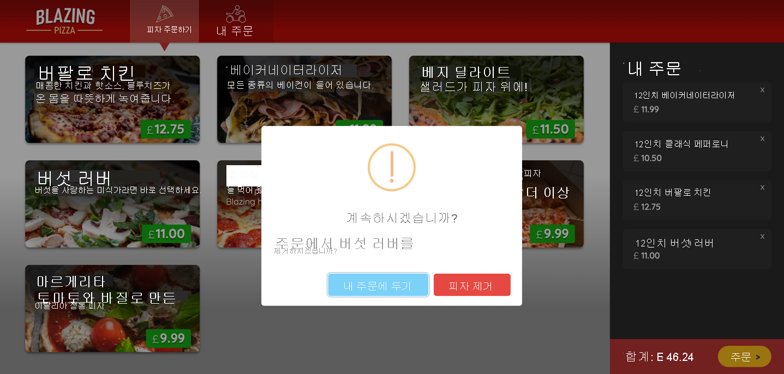

# Blazor 웹앱에 대한 풍부한 대화형 구성 요소 빌드

## 목차
- [Blazor 웹앱에 대한 풍부한 대화형 구성 요소 빌드](#blazor-웹앱에-대한-풍부한-대화형-구성-요소-빌드)
  - [목차](#목차)
- [소개](#소개)
    - [학습 목표](#학습-목표)
    - [사전 요구 사항](#사전-요구-사항)
      - [.NET 8.0 SDK](#net-80-sdk)
  - [JavaScript와 Blazor의 상호 운용성](#javascript와-blazor의-상호-운용성)
    - [Blazor JavaScript 상호 운용성 사용](#blazor-javascript-상호-운용성-사용)
    - [Blazor 앱에서 JavaScript 코드 로드](#blazor-앱에서-javascript-코드-로드)
    - [.NET 코드에서 JavaScript 호출](#net-코드에서-javascript-호출)
      - [ElementReference 개체를 사용하여 DOM 업데이트](#elementreference-개체를-사용하여-dom-업데이트)
    - [JavaScript에서 .NET 코드 호출](#javascript에서-net-코드-호출)
      - [JavaScript에서 .NET 인스턴스 메서드 호출](#javascript에서-net-인스턴스-메서드-호출)
    - [연습 - Blazor 앱에서 JavaScript 라이브러리 사용](#연습---blazor-앱에서-javascript-라이브러리-사용)
      - [기존 앱 복제](#기존-앱-복제)
      - [주문 프로세스 리팩터링](#주문-프로세스-리팩터링)
      - [Blazor 앱에 타사 JavaScript 라이브러리 추가](#blazor-앱에-타사-javascript-라이브러리-추가)
      - [주문 상태를 실시간으로 표시하도록 주문 페이지 업데이트](#주문-상태를-실시간으로-표시하도록-주문-페이지-업데이트)
  - [Blazor 구성 요소 수명 주기 이해](#blazor-구성-요소-수명-주기-이해)
    - [Blazor 구성 요소 수명 주기](#blazor-구성-요소-수명-주기)
    - [수명 주기 메서드 이해](#수명-주기-메서드-이해)
      - [SetParametersAsync 메서드](#setparametersasync-메서드)
      - [OnInitialized 및 OnInitializedAsync 메서드](#oninitialized-및-oninitializedasync-메서드)
      - [OnParametersSet 및 OnParametersSetAsync 메서드](#onparametersset-및-onparameterssetasync-메서드)
      - [OnAfterRender 및 OnAfterRenderAsync 메서드](#onafterrender-및-onafterrenderasync-메서드)
      - [Dispose 및 DisposeAsync 메서드](#dispose-및-disposeasync-메서드)
    - [수명 주기 메서드에서 예외 처리](#수명-주기-메서드에서-예외-처리)
  - [연습 - 수명 주기 이벤트를 통해 앱 대화형 작업 향상](#연습---수명-주기-이벤트를-통해-앱-대화형-작업-향상)
    - [새로운 패밀리 사이즈 피자 만들기](#새로운-패밀리-사이즈-피자-만들기)
    - [사이즈 슬라이더 제거](#사이즈-슬라이더-제거)
    - [템플릿 구성 요소 이해](#템플릿-구성-요소-이해)
      - [RenderFragment 형식](#renderfragment-형식)
      - [제네릭 `RenderFragment<T>` 매개 변수](#제네릭-renderfragmentt-매개-변수)
  - [연습 - 템플릿을 만들어 구성 요소 재사용](#연습---템플릿을-만들어-구성-요소-재사용)
    - [페이지 매김 템플릿 구성 요소 만들기](#페이지-매김-템플릿-구성-요소-만들기)
      - [파일을 만들고 태그 추가](#파일을-만들고-태그-추가)
      - [코드 지시문 추가](#코드-지시문-추가)
    - [MyOrders 구성 요소 업데이트](#myorders-구성-요소-업데이트)
    - [업데이트 테스트](#업데이트-테스트)
  - [요약](#요약)
  - [출처](#출처)
  - [다음](#다음)

---
# 소개

피자 배달 회사에서 피자 목록, 주문 페이지 및 기타 기능을 포함하는 고객 관련 Blazor 웹 사이트를 현대화하도록 고용합니다. Blazor 대화형 웹 애플리케이션은 .NET을 사용하여 서버와 클라이언트 코드 간에 논리를 공유합니다.

업데이트에서 다음을 수행하려고 합니다.

 - JavaScript를 사용하여 렌더링된 HTML 구성 요소에 애니메이션 효과를 줍니다.
 - JavaScript 라이브러리를 사용하여 경고 페이지에 브랜딩을 적용합니다.
 - 페이지 렌더링이 완료된 후 앱이 이벤트에 응답하는 방식을 변경합니다.
 - 템플릿 구성 요소를 만들고 적용하여 여러 페이지를 업데이트합니다.

이 모듈에서는 Blazor에서 JavaScript 코드와 상호 운용하고, 템플릿 구성 요소를 사용하고, 구성 요소 수명 주기 이벤트에 응답하는 방법을 보여 줍니다.

### 학습 목표

 - .NET 코드에서 JavaScript 함수를 호출하고 Blazor 앱의 JavaScript에서 .NET 코드를 호출합니다.
 - Blazor 구성 요소의 수명 주기에서 이벤트를 처리합니다.
 - Blazor 앱에 통합할 수 있는 재사용 가능한 템플릿 구성 요소를 만듭니다.

### 사전 요구 사항

 - HTML, CSS, JavaScript 웹 개발 친숙성.
C# 코드를 작성할 수 있는 초보자 능력.
 - .NET 8.0 SDK가 설치됨.
 - IDE(통합 개발 환경). 이 모듈에서는 Visual Studio Code를 사용합니다.

```
팁

이 모듈에서는 로컬 개발에 .NET CLI(명령줄 인터페이스) 및 Visual Studio Code를 사용합니다. 이 모듈을 완료한 후 Windows용 Visual Studio 또는 Mac용 Visual Studio를 사용하거나 Windows, Linux 또는 Mac용 Visual Studio Code를 사용하여 개념을 적용하고 개발을 계속할 수 있습니다.
```

#### .NET 8.0 SDK

이 모듈에서는 .NET 8.0 SDK를 사용합니다. 기본 설정 터미널에서 다음 명령을 실행하여 .NET 8.0이 설치되어 있는지 확인합니다.

```.NET CLI
dotnet --list-sdks
```
다음 예제와 유사한 출력이 표시됩니다.
```
6.0.317 [C:\Program Files\dotnet\sdk]
7.0.401 [C:\Program Files\dotnet\sdk]
8.0.100 [C:\Program Files\dotnet\sdk]
```
8으로 시작하는 버전이 나열되어 있는지 확인합니다. 나열되는 버전이 없거나 명령을 찾을 수 없는 경우 [최신 .NET 8.0 SDK](https://dotnet.microsoft.com/download)를 설치합니다.

---
## JavaScript와 Blazor의 상호 운용성

Blazor는 JavaScript가 아닌 C# 구성 요소를 사용하여 동적 콘텐츠가 있는 웹 페이지 또는 HTML 섹션을 만듭니다. 그러나 Blazor JS interop(JavaScript 상호 운용성)을 사용하여 Blazor 앱에서 JavaScript 라이브러리를 호출하고 .NET C# 코드에서 JavaScript 함수를 호출할 수 있습니다.

이 단원에서는 Blazor 페이지의 C# 코드에서 JavaScript를 호출하는 방법과 JavaScript 함수에서 C# 메서드를 호출하는 방법을 알아봅니다. 다음 단원에서는 JavaScript 라이브러리의 경고 구성 요소를 사용하여 Blazor 피자 배달 웹 사이트를 업데이트합니다.

### Blazor JavaScript 상호 운용성 사용

일반적인 Blazor 구성 요소는 레이아웃 및 사용자 인터페이스 논리를 사용하여 런타임에 HTML을 렌더링합니다. C# 코드를 사용하여 사용자 및 외부 서비스와 상호 작용하는 이벤트 및 기타 동적 페이지 기능을 처리합니다. 대부분의 경우 JavaScript 코드를 사용할 필요가 없습니다. 대신 많은 동등한 기능을 제공하는 .NET 라이브러리와 함께 Blazor를 사용할 수 있습니다.

그러나 기존 JavaScript 라이브러리를 사용해야 하는 경우가 있습니다. 예를 들어 일부 오픈 소스 JavaScript 라이브러리는 특수한 방식으로 구성 요소를 렌더링하고 사용자 인터페이스 요소를 처리합니다. 또는 C#으로 변환하는 대신 재사용하려는 기존의 검증된 JavaScript 코드가 있을 수 있습니다.

Blazor JavaScript 상호 운용성 또는 JS interop을 사용하여 JavaScript 라이브러리를 애플리케이션에 통합할 수 있습니다. JS interop을 사용하여 .NET 메서드에서 JavaScript 함수를 호출하고 JavaScript 함수에서 .NET 메서드를 호출합니다. JS interop은 Blazor와 JavaScript 간에 데이터 및 개체 참조 마샬링을 처리하여 쉽게 전환할 수 있도록 합니다.

### Blazor 앱에서 JavaScript 코드 로드

HTML `<script>` 요소를 사용하여 표준 HTML 웹앱에 추가하는 것과 동일한 방식으로 Blazor 앱에 JavaScript를 추가합니다. Blazor 호스팅 모델에 따라 Pages/_Host.cshtml 파일 또는 wwwroot/index.html 파일에서 기존 `<script src="_framework/blazor.*.js"></script>` 태그 뒤에 `<script>` 태그를 추가합니다. 자세한 내용은 ASP.NET Core Blazor 호스팅 모델을 참조하세요.

페이지의 `<head>` 요소에 스크립트를 배치하지 않는 것이 좋습니다. Blazor는 HTML 페이지의 `<body>` 요소에 있는 콘텐츠만 제어하므로 스크립트가 Blazor를 사용하는 경우 JS interop이 실패할 수 있습니다. 또한 JavaScript 코드를 구문 분석하는 데 걸리는 시간으로 인해 페이지가 더 느리게 표시될 수 있습니다.

`<script>` 태그는 HTML 웹앱에서와 마찬가지로 작동합니다. 태그 본문에 직접 코드를 작성하거나 기존 JavaScript 파일을 참조할 수 있습니다. 자세한 내용은 [ASP.NET Core Blazor JavaScript 상호 운용성(JS interop): JavaScript 위치](https://learn.microsoft.com/ko-kr/aspnet/core/blazor/javascript-interoperability#location-of-javascript)를 참조하세요.
```
 중요

Blazor 앱의 wwwroot 폴더 아래에 JavaScript 파일을 배치합니다.
```
또 다른 옵션은 JavaScript 파일을 참조하는 `<script>` 요소를 Pages/_Host.cshtml 페이지에 동적으로 삽입하는 것입니다. 이 접근 방식은 런타임에만 확인할 수 있는 조건에 따라 다른 스크립트를 로드해야 하는 경우에 유용합니다. 또한 이 접근 방식은 페이지가 렌더링된 후 발생하는 이벤트로 논리를 트리거하는 경우 앱의 초기 로딩 속도를 단축할 수 있습니다. 자세한 내용은 [ASP.NET Core Blazor 스타트업](https://learn.microsoft.com/ko-kr/aspnet/core/blazor/fundamentals/startup)을 참조하세요.

### .NET 코드에서 JavaScript 호출

IJSRuntime을 사용하여 .NET 코드에서 JavaScript 함수를 호출합니다. JS interop 런타임을 사용할 수 있도록 설정하려면 Blazor 페이지에서 파일 시작 부분 근처에 있는 `@page` 지시문 뒤에 `IJSRuntime` 추상화의 인스턴스를 삽입합니다.

`IJSRuntime` 인터페이스는 InvokeAsync 및 InvokeVoidAsync 메서드를 노출하여 JavaScript 코드를 호출합니다. `InvokeAsync<TValue>`를 사용하여 값을 반환하는 JavaScript 함수를 호출합니다. 그렇지 않으면 `InvokeVoidAsync`를 호출합니다. 이름에서 알 수 있듯이, 두 메서드는 모두 비동기식이므로 C# `await` 연산자를 사용하여 결과를 캡처합니다.

`InvokeAsync` 또는 `InvokeVoidAsync` 메서드에 대한 매개 변수는 호출할 JavaScript 함수의 이름이며 함수에 필요한 인수가 뒤에 추가됩니다. JavaScript 함수는 `window` 범위의 일부이거나 `window`의 하위 범위여야 합니다. 인수는 JSON 직렬화 가능해야 합니다.

```
 참고

JS interop은 Blazor Server 앱이 브라우저와의 SignalR 연결을 설정했을 때만 사용할 수 있습니다. 렌더링이 완료될 때까지 interop 호출을 만들 수 없습니다. 렌더링이 완료되었는지 여부를 검색하려면 Blazor 코드에서 OnAfterRender 또는 OnAfterRenderAsync 이벤트를 사용합니다.
```

#### ElementReference 개체를 사용하여 DOM 업데이트

Blazor는 DOM(문서 개체 모델)의 표현을 가상 렌더링 트리로 유지 관리합니다. 페이지 구조가 변경되면 Blazor는 차이점이 포함된 새 렌더링 트리를 생성합니다. 변경이 완료되면 Blazor는 차이점을 반복하여 사용자 인터페이스의 브라우저 표시와 JavaScript에서 사용하는 DOM의 브라우저 버전을 업데이트합니다.

많은 타사 JavaScript 라이브러리를 사용하여 페이지에서 요소를 렌더링할 수 있으며 이러한 라이브러리는 DOM을 업데이트할 수 있습니다. JavaScript 코드가 DOM의 요소를 수정하면 DOM의 Blazor 복사본은 더 이상 현재 상태와 일치하지 않습니다. 이 상황으로 인해 예기치 않은 동작이 발생할 수 있으며 보안 위험이 발생할 수 있습니다. DOM의 Blazor 뷰 손상을 초래할 수 있는 변경을 수행하지 않는 것이 중요합니다.

이 상황을 처리하는 가장 간단한 방법은 Blazor 구성 요소에 자리 표시자 요소(일반적으로 빈 `<div @ref="placeHolder"></div>` 요소)를 만드는 것입니다. Blazor 코드는 이 코드를 빈 공간으로 해석하며 Blazor 렌더링 트리는 해당 콘텐츠를 추적하려고 시도하지 않습니다. 이 `<div>`에 JavaScript 코드 요소를 자유롭게 추가할 수 있으며 Blazor는 해당 요소를 변경하려고 시도하지 않습니다.

Blazor 앱 코드는 `<div>` 요소에 대한 참조를 저장할 ElementReference 형식의 필드를 정의합니다. `<div>` 요소의 `@ref` 특성은 필드 값을 설정합니다. 그런 다음, ElementReference 개체는 JavaScript 함수에 전달되며, 이 함수는 해당 참조를 사용하여 `<div>` 요소에 콘텐츠를 추가할 수 있습니다.

### JavaScript에서 .NET 코드 호출

JavaScript 코드는 JS interop 라이브러리의 일부인 `DotNet` 유틸리티 클래스를 사용하여 Blazor 코드에서 정의하는 .NET 메서드를 실행할 수 있습니다. `DotNet` 클래스는 `invokeMethod` 및 `invokeMethodAsync` 도우미 함수를 노출합니다. `invokeMethod`를 사용하여 메서드를 실행하고 결과를 기다리거나, `invokeMethodAsync`를 사용하여 메서드를 비동기식으로 호출합니다. `invokeMethodAsync` 메서드는 JavaScript `Promise`를 반환합니다.

```
 팁

애플리케이션에서 응답성을 유지 관리하려면 .NET 메서드를 `async`로 정의하고 JavaScript에서 `invokeMethodAsync`를 사용하여 호출합니다.
```

JSInvokableAttribute를 사용하여 호출되는 .NET 메서드에 태그를 지정해야 합니다. 메서드는 `public`이어야 하며 모든 매개 변수는 JSON으로 직렬화할 수 있어야 합니다. 또한 비동기 메서드의 경우 반환 형식은 `void`, `Task` 또는 제네릭 `Task<T>` 개체여야 합니다. 여기서 T는 JSON 직렬화 가능 형식입니다.

`static` 메서드를 호출하려면 클래스를 포함하는 .NET 어셈블리의 이름, 메서드의 식별자, 메서드가 `invokeMethod` 또는 `invokeMethodAsync` 함수의 인수로 허용하는 매개 변수를 제공합니다. 기본적으로 메서드 식별자는 메서드 이름과 동일하지만 `JSInvokable` 특성을 사용하여 다른 값을 지정할 수 있습니다.

#### JavaScript에서 .NET 인스턴스 메서드 호출

인스턴스 메서드를 실행하려면 JavaScript에 인스턴스를 가리키는 개체 참조가 필요합니다. JS interop은 .NET 코드에서 개체 참조를 만드는 데 사용할 수 있는 제네릭 DotNetObjectReference 형식을 제공합니다. 코드가 JavaScript에서 이 개체 참조를 사용할 수 있도록 설정해야 합니다.

그러면 JavaScript 코드는 .NET 메서드의 이름 및 메서드에 필요한 매개 변수를 사용하여 `invokeMethodAsync`를 호출할 수 있습니다. 메모리 누수를 방지하기 위해 .NET 코드는 더 이상 필요하지 않을 때 개체 참조를 삭제해야 합니다.

### 연습 - Blazor 앱에서 JavaScript 라이브러리 사용

고객이 주문에 피자를 추가한 후 X 아이콘을 선택하여 확인 없이 주문에서 피자를 제거할 수 있습니다. 고객이 실수로 주문에서 피자를 제거하는 것을 방지하기 위해 피자 회사는 항목 제거에 대한 확인 프롬프트를 추가하려고 합니다.

또한 피자 회사는 고객이 실시간으로 주문 진행 상황을 확인하기를 원합니다. 주문 세부 정보 페이지를 업데이트하여 주문 상태 지속적으로 쿼리하고 페이지가 업데이트되고 있다는 피드백을 고객에게 제공해야 합니다.

이 연습에서는 클라이언트 쪽에서 JavaScript를 호출하는 데 Blazor 구성 요소의 JS interop을 사용하여 피자 배달 회사의 기존 앱을 확장합니다. 타사 JavaScript 라이브러리와 통합하여 취소 팝업을 개선하고 JavaScript에서 Blazor 메서드를 호출하여 고객 주문의 실시간 상태를 가져옵니다.

#### 기존 앱 복제

Blazor를 사용하려면 .NET 8.0 SDK가 설치되어 있는지 확인하세요.

 1. Visual Studio Code를 열고 위쪽 메뉴에서 터미널>새 터미널을 선택하여 통합 터미널을 엽니다.
 2. 터미널에서 프로젝트를 만들려는 디렉터리로 변경합니다.
 3. 다음 명령을 실행하여 GitHub에서 로컬 하위 디렉터리로 앱을 복제합니다.
    ```Bash
    git clone https://github.com/MicrosoftDocs/mslearn-build-interactive-components-blazor.git BlazingPizza
    ```
 4. 위쪽 메뉴 모음에서 **파일>폴더 열기**를 선택합니다.
 5. 폴더 열기 대화 상자에서 *BlazingPizza* 폴더로 이동하고 폴더 선택을 선택합니다. <br/>Visual Studio Code에서 누락된 자산 또는 해결되지 않은 종속성에 대한 메시지를 표시하면 예 또는 복원을 선택합니다.
 6. 앱을 실행하고 모든 것이 올바르게 작동하는지 확인하려면 F5 키를 누르거나 실행>디버깅 시작을 선택합니다.
 7. 웹앱에서 몇 가지 피자를 선택하고 주문에 추가합니다. 주문 목록에 몇 가지 피자가 있는 상태에서 피자 중 하나의 옆에 있는 X를 선택하고 프롬프트 없이 항목이 사라지는지 확인합니다.
 8. Shift+F5를 누르거나 Run>디버깅 중지를 선택하여 앱을 중지합니다.

#### 주문 프로세스 리팩터링

JS interop을 사용하려면 `IJSRuntime` 추상화를 삽입합니다.

 1. Visual Studio Code Explorer에서 Pages를 확장한 다음, Index.razor를 선택합니다.
 2. Index.razor 파일의 `@inject OrderState OrderState` 문 뒤에 다음과 같이 `IJSRuntime` 삽입을 추가합니다.
    ```razor
    @inject OrderState OrderState
    @inject IJSRuntime JavaScript
    ```
 3. 현재, 피자 함수 호출 제거에 대한 `onclick` 이벤트는 `OrderState.RemoveConfiguredPizza(configuredPizza))` 메서드를 직접 호출합니다. 전체 `<a @onclick="@(() => OrderState.RemoveConfiguredPizza(configuredPizza))" class="delete-item">❌</a>` 요소를 다음 코드로 바꿉니다.
    ```razor
    <button type="button" class="close text-danger" aria-label="Close"
        @onclick="@(async () => await RemovePizzaConfirmation(configuredPizza))">
        <span aria-hidden="true">&times;</span>
    </button>
    ```
 4. 파일 끝에 있는 `@code` 지시문에서 네이티브 JavaScript `confirm` 함수를 호출하는 새 메서드를 추가합니다. 고객이 프롬프트에서 확인을 선택하면 이 메서드는 `OrderState.RemoveConfiguredPizza`를 호출하여 주문에서 피자를 제거합니다. 그렇지 않으면 피자는 주문에 남아 있습니다.
    ```C#
    async Task RemovePizzaConfirmation(Pizza removePizza)
    {
        if (await JavaScript.InvokeAsync<bool>(
            "confirm",
            $"""Do you want to remove the "{removePizza.Special!.Name}" from your order?"""))
        {
            OrderState.RemoveConfiguredPizza(removePizza);
        }
    }
    ```
    서버는 IJSRuntime.InvokeAsync 메서드를 사용하여 클라이언트 쪽에 `confirm` 함수를 호출합니다. 호출의 응답은 `bool` 값을 반환합니다. 확인 대화 상자의 결과가 `true`이면 피자가 주문에서 제거됩니다.
 5. F5 키를 누르거나 실행>디버깅 시작을 선택합니다.
 6. 앱에서 몇 가지 피자를 주문에 추가합니다.
 7. 주문에 몇 가지 피자가 있는 상태에서 피자 중 하나의 옆에 있는 X를 선택합니다. 표준 JavaScript 확인 대화 상자가 나타납니다.<br>
 8. 확인을 선택하고 피자가 주문에서 제거되었는지 확인합니다. 다른 피자 옆에 있는 X를 선택하고, 확인 대화 상자에서 취소 를 선택하고, 피자가 주문에 남아 있는지 확인합니다.
 9. Shift+F5를 누르거나 Run>디버깅 중지를 선택하여 앱을 중지합니다.

#### Blazor 앱에 타사 JavaScript 라이브러리 추가

피자 회사는 확인 대화 상자의 단추에서 더 명확한 텍스트를 원하고 대화 상자에서 해당 브랜딩과 스타일을 사용하려고 합니다. 일부 연구 후에 표준 대화 상자의 좋은 대체 항목으로 SweetAlert라는 작은 JavaScript 라이브러리를 표준 대화 상자를 사용하기로 결정합니다.

 1. Visual Studio Code Explorer에서 Pages를 확장한 다음, _Host.cshtml을 선택합니다.

 2. _Host.cshtml 파일 끝에 있는 뒤 `<script src="_framework/blazor.server.js"></script>` 줄 뒤, 하지만 `</body>` 줄 앞에 다음 `script` 요소를 추가하여 SweetAlert 라이브러리를 포함합니다.
    ```HTML
    -
    <script src="https://cdn.jsdelivr.net/npm/sweetalert@latest/dist/sweetalert.min.js"></script>
    ```
    이제 SweetAlert 라이브러리를 클라이언트 쪽에서 호출할 수 있습니다.
 3. 새 라이브러리를 사용하려면 다음과 같이 Index.razor 파일에서 `RemovePizzaConfirmation` 메서드를 업데이트합니다.
    ```C#
    async Task RemovePizzaConfirmation(Pizza removePizza)
    {
        var messageParams = new
        {
            title = "Remove Pizza?",
            text = $"""Do you want to remove the "{removePizza.Special!.Name}" from your order?""",
            icon = "warning",
            buttons = new
            {
                abort = new { text = "No, leave it in my order", value = false },
                confirm = new { text = "Yes, remove pizza", value = true }
            },
            dangerMode = true
        };

        if (await JavaScript.InvokeAsync<bool>("swal", messageParams))
        {
            OrderState.RemoveConfiguredPizza(removePizza);
        }
    }
    ```
    `"swal"` 이름은 타사 sweetalert.js 참조에서 제공되는 JavaScript 함수의 식별자입니다. 함수를 호출하는 `swal` 코드는 `confirm`과 유사합니다. 대부분의 업데이트는 함수가 매개 변수를 수신하는 방법으로 수행됩니다. SweetAlert는 필요한 모든 설정이 포함된 JSON 개체를 수락합니다.
 4. Visual Studio Code에서 F5 키를 누르거나 실행>디버깅 시작을 선택합니다.
 5. 이제 `confirm` 대화 상자에 아니요. 내 주문 그대로 유지 및 예. 피자 제거라는 두 개의 단추가 있는지 확인하고 예상대로 작동하는지 확인합니다.<br>
 6. Shift+F5를 누르거나 Run>디버깅 중지를 선택하여 앱을 중지합니다.

#### 주문 상태를 실시간으로 표시하도록 주문 페이지 업데이트

고객이 피자 주문을 제출하면 내 주문 페이지는 `OrderDetail` 구성 요소를 사용하여 주문의 현재 상태를 표시합니다. 피자 회사는 고객이 실시간으로 주문 진행 상황을 확인하기를 원합니다. JavaScript에서 .NET 메서드를 호출하여 상태가 배달됨으로 표시될 때까지 주문 상태를 지속적으로 가져오도록 구성 요소를 업데이트합니다.

 1. Visual Studio Code Explorer에서 Pages를 확장한 다음, OrderDetail.razor를 선택합니다.
 2. OrderDetail.razor 파일에서 구성 요소 위쪽에 있는 다음 선언을 마지막 `@inject` 문 아래에 추가합니다.
    ```razor
    @implements IDisposable
    ```
    이 `@implements` 선언을 사용하여 `Dispose` 메서드를 정의할 수 있습니다.
 3. 고객에게 페이지가 업데이트 중이라는 피드백을 제공하는 회전자를 추가합니다. `<div class="track-order-details">`에서 `@foreach` 문 위에 다음 코드를 추가합니다.
    ```razor
    @if (IsOrderIncomplete)
    {
        <div class="spinner-grow text-danger float-right" role="status">
            <span class="sr-only">Checking your order status...</span>
        </div>
    }
    ```
 4. `@code` 지시문에서 `OrderId` 속성 선언 아래에 다음 멤버를 추가합니다.
    ```C#
    bool IsOrderIncomplete =>
        orderWithStatus is null || orderWithStatus.IsDelivered == false;

    PeriodicTimer timer = new(TimeSpan.FromSeconds(3));
    ```
 5. 기존 `OnParametersSetAsync` 메서드를 다음 코드로 바꿉니다.
    ```C#
    protected override async Task OnParametersSetAsync() =>
        await GetLatestOrderStatusUpdatesAsync();
    ```
    이제 이 코드는 `GetLatestOrderStatusUpdatesAsync` 메서드를 호출하여 주문 상태를 업데이트합니다.

 6. 업데이트된 `OnParametersSetAsync` 메서드 뒤에 다음 메서드를 추가합니다.
    ```C#
    protected override Task OnAfterRenderAsync(bool firstRender) =>
        firstRender ? StartPollingTimerAsync() : Task.CompletedTask;

    async Task GetLatestOrderStatusUpdatesAsync()
    {
        try
        {
            orderWithStatus = await HttpClient.GetFromJsonAsync<OrderWithStatus>(
                $"{NavigationManager.BaseUri}orders/{OrderId}");
        }
        catch (Exception ex)
        {
            invalidOrder = true;
            Console.Error.WriteLine(ex);
        }
    }

    async Task StartPollingTimerAsync()
    {
        while (IsOrderIncomplete && await timer.WaitForNextTickAsync())
        {
            await GetLatestOrderStatusUpdatesAsync();
            StateHasChanged();
        }
    }

    public void Dispose() => timer.Dispose();
    ```
    `OrderDetail` 구성 요소는 페이지가 렌더링된 후 폴링을 시작하고 주문이 배달될 때 폴링을 중지합니다. 주문 상태가 미완료인 경우 `StartPollingTimerAsync` 함수는 PeriodicTimer를 사용하여 다음 틱을 비동기적으로 대기합니다. 주문이 배달될 때 애니메이션 회전자가 제거되고 페이지에는 최종 주문 상태가 표시됩니다.
 7. Visual Studio Code에서 F5 키를 누르거나 실행>디버깅 시작을 선택합니다.
 8. 앱에서 피자를 주문합니다. 내 주문 화면으로 이동하고 주문이 미완료인 동안 애니메이션 빨간색 점이 나타나고 상태가 배달됨으로 표시될 때 사라지는지 확인합니다.<br/>
 9. Shift+F5를 누르거나 Run>디버깅 중지를 선택하여 앱을 중지합니다.

---
## Blazor 구성 요소 수명 주기 이해

Blazor 구성 요소에는 잘 정의된 수명 주기가 있으며, 이 수명 주기는 처음 만들어질 때 시작되고 제거될 때 종료됩니다. 구성 요소 수명 주기는 특정 트리거에 대한 응답으로 발생하는 이벤트 세트에 의해 관리됩니다. 해당 트리거에는 초기화되는 구성 요소, 구성 요소와 상호 작용하는 사용자 또는 구성 요소가 닫혀 있는 페이지가 포함됩니다.

이 단원에서는 Blazor 구성 요소 수명 주기 동안 발생하는 이벤트에 대해 알아봅니다. 이 이벤트를 처리하여 수행된 작업을 최적화하고 Blazor 페이지의 응답성을 높이는 방법을 알아봅니다.

### Blazor 구성 요소 수명 주기

Blazor 구성 요소는 레이아웃 및 UI 논리를 정의하는 Blazor 앱의 뷰를 나타냅니다. 이 구성 요소는 앱이 실행될 때 HTML 태그를 생성합니다. 사용자 상호 작용 이벤트는 사용자 지정 코드를 트리거할 수 있으며 구성 요소는 표시를 다시 렌더링하도록 업데이트될 수 있습니다. 페이지가 닫히면 Blazor는 구성 요소를 제거하고 모든 리소스를 정리합니다. 사용자가 페이지로 돌아오면 새 인스턴스가 만들어집니다.

다음 다이어그램에서는 구성 요소의 수명 동안 발생하는 이벤트와 이러한 이벤트를 처리하는 데 사용할 수 있는 메서드를 보여줍니다. Blazor는 `SetParametersAsync`를 제외하고 각 메서드의 동기 및 비동기 버전을 둘 다 제공합니다.

모든 Blazor 구성 요소는 표시된 메서드를 정의하고 기본 동작을 제공하는 ComponentBase 클래스 또는 IComponent에서 상속됩니다. 해당 메서드를 재정의하여 이벤트를 처리합니다.


다이어그램에서는 수명 주기 메서드 간에 단일 스레드 흐름이 있음을 암시하지만 이러한 메서드의 비동기 버전을 사용하면 Blazor 앱이 렌더링 프로세스를 촉진할 수 있습니다. 예를 들어 `SetParametersAsync`에서 첫 번째 `await`가 발생하면 Blazor 구성 요소는 `OnInitialized` 및 `OnInitializedAsync` 메서드를 실행합니다. 대기한 문이 완료되면 `SetParametersAsync`의 실행 스레드가 다시 시작됩니다.

동일한 논리가 일련의 수명 주기 메서드 전체에 적용됩니다. 또한 `OnInitializedAsync` 및 `OnParametersSetAsync` 중에 발생하는 각 `await` 작업은 구성 요소의 상태가 변경되었음을 나타내며 페이지의 즉각적인 렌더링을 트리거할 수 있습니다. 초기화가 완전히 완료되기 전에 페이지가 여러 번 렌더링될 수 있습니다.

### 수명 주기 메서드 이해

각 구성 요소 수명 주기 메서드에는 특정 목적이 있으며 메서드를 재정의하여 구성 요소에 사용자 지정 논리를 추가할 수 있습니다. 다음 표에서는 수명 주기 메서드가 발생하는 순서대로 나열되고 해당 용도를 설명합니다.

| 순서 | 수명 주기 메서드                              | Description                                                                     |
|----|----------------------------------------|---------------------------------------------------------------------------------|
| 1  | 만든 구성 요소                               | 구성 요소가 인스턴스화됩니다.                                                                |
| 2  | SetParametersAsync                     | 렌더링 트리에서 구성 요소 부모에서 매개 변수를 설정합니다.                                               |
| 3  | OnInitialized / OnInitializedAsync     | 구성 요소를 시작할 준비가 될 때 발생합니다.                                                       |
| 4  | OnParametersSet / OnParametersSetAsync | 구성 요소가 매개 변수를 수신하고 속성이 할당되었을 때 발생합니다.                                           |
| 5  | OnAfterRender / OnAfterRenderAsync     | 구성 요소가 렌더링된 후 발생합니다.                                                            |
| 6  | Dispose / DisposeAsync                 | 구성 요소가 IDisposable 또는 IAsyncDisposable를 구현하는 경우 구성 요소 제거의 일부로 적절한 삭제 가능이 발생합니다. |

#### SetParametersAsync 메서드

사용자가 Blazor 구성 요소가 포함된 페이지를 방문하면 Blazor 런타임에서 구성 요소의 새 인스턴스를 만들고 기본 생성자를 실행합니다. 구성 요소가 생성되면 Blazor 런타임이 `SetParametersAsync` 메서드를 호출합니다.

구성 요소가 매개 변수를 정의하는 경우 Blazor 런타임은 이 매개 변수의 값을 호출 환경에서 구성 요소로 삽입합니다. 이러한 매개 변수는 `ParameterView` 개체에 포함되며 `SetParametersAsync` 메서드에 액세스할 수 있습니다. `base.SetParametersAsync` 메서드를 호출하여 구성 요소의 `Parameter` 속성을 이러한 값으로 채웁니다.

또는 다른 방식으로 매개 변수를 처리해야 하는 경우 이 메서드로 처리할 수 있습니다. 예를 들어 구성 요소에 전달된 매개 변수를 사용하기 전에 유효성을 검사해야 할 수 있습니다.

```
 참고

`SetParametersAsync` 메서드는 구성 요소에 매개 변수가 없는 경우에도 구성 요소를 만들 때 항상 실행됩니다.
```

#### OnInitialized 및 OnInitializedAsync 메서드

`OnInitialized` 및 `OnInitializedAsync` 메서드를 재정의하여 사용자 지정 기능을 포함할 수 있습니다. 이 메서드는 `SetParametersAsync` 메서드가 `ParameterAttribute` 또는 `CascadingParameterAttribute`로 특성이 지정된 구성 요소의 매개 변수 기반 속성을 채운 후 실행됩니다. 이러한 메서드에서 초기화 논리를 실행합니다.

애플리케이션의 `render-mode` 속성이 `Server`로 설정된 경우 `OnInitialized` 및 `OnInitializedAsync` 메서드는 구성 요소 인스턴스에 대해 한 번만 실행됩니다. 구성 요소의 부모가 구성 요소 매개 변수를 수정하는 경우 `SetParametersAsync` 메서드는 다시 실행되지만 이러한 메서드는 실행되지 않습니다. 매개 변수가 변경될 때 구성 요소를 다시 초기화해야 하는 경우 `SetParametersAsync` 메서드를 사용합니다. 초기화를 한 번 수행하려면 다음 메서드를 사용합니다.

`render-mode` 속성이 `ServerPrerendered`로 설정된 경우 `OnInitialized` 및 `OnInitializedAsync` 메서드는 두 번 실행됩니다. 정적 페이지 출력을 생성하는 사전 렌더링 단계 중에 한 번 실행되고 서버가 브라우저에 대한 SignalR 연결을 설정할 때 다시 실행됩니다. Blazor 구성 요소 상태를 설정하는 데 사용하는 웹 서비스에서 데이터를 검색하는 등 이러한 메서드에서 비용이 많이 드는 초기화 작업을 수행할 수 있습니다. 이 경우 첫 번째 실행 중에 상태 정보를 캐시하고 두 번째 실행 중에 저장된 상태를 다시 사용합니다.

Blazor 구성 요소에서 사용하는 모든 종속성은 인스턴스가 만들어질 때 삽입되지만 `OnInitialized` 또는 `OnInitializedAsync` 메서드가 실행되기 전에 삽입됩니다. `OnInitialized` 또는 `OnInitializedAsync` 메서드에서 이러한 종속성에 의해 삽입된 개체를 사용할 수 있지만 그 이전에는 사용할 수 없습니다.

```
 중요

Blazor 구성 요소는 생성자 종속성 삽입을 지원하지 않습니다. 대신 구성 요소 마크업에 `@inject` 지시문을 사용하거나 속성 선언에서 InjectAttribute를 사용합니다.
```

사전 렌더링 단계에서는 Blazor Server 구성 요소의 코드가 JavaScript 코드 호출과 같이 브라우저에 연결해야 하는 작업을 수행할 수 없습니다. `OnAfterRender` 또는 `OnAfterRenderAsync` 메서드에서 브라우저에 대한 연결을 사용하는 논리를 배치해야 합니다.

#### OnParametersSet 및 OnParametersSetAsync 메서드

`OnParametersSet` 및 `OnParametersSetAsync` 메서드는 구성 요소가 처음 렌더링될 때 `OnInitialized` 또는 `OnInitializedAsync` 메서드 뒤에 실행되거나 후속 렌더링에서 `SetParametersAsync` 메서드 뒤에 실행됩니다. `SetParametersAsync`와 마찬가지로 이러한 메서드는 구성 요소에 매개 변수가 없더라도 항상 호출됩니다.

각 메서드를 사용하여 계산된 속성에 대한 값 계산과 같이 구성 요소 매개 변수 값을 사용하는 초기화 작업을 완료합니다. 생성자에서 이러한 장기 실행 작업을 수행하지 마세요. 생성자는 동기식이므로 장기 실행 작업이 완료될 때까지 기다리면 구성 요소가 포함된 페이지의 응답성에 영향을 미칩니다.

#### OnAfterRender 및 OnAfterRenderAsync 메서드

`OnAfterRender` 및 `OnAfterRenderAsync` 메서드는 Blazor 런타임이 사용자 인터페이스의 구성 요소가 나타내는 보기를 업데이트해야 할 때마다 실행됩니다. 이 상태는 다음과 같은 경우에 자동으로 발생합니다.

 - 예를 들어 구성 요소 상태는 `OnInitialized` 또는 `OnInitializedAsync` 메서드가 실행되거나 `OnParametersSet` 및 `OnParametersSetAsync` 메서드가 실행될 때 변경됩니다.
 - UI 이벤트가 트리거됩니다.
 - 애플리케이션 코드는 구성 요소의 `StateHasChanged` 메서드를 호출합니다.

외부 이벤트 또는 UI 트리거에서 StateHasChanged 호출 시 구성 요소는 조건부로 다시 렌더링됩니다. 다음 목록에서는 `StateHasChanged`를 포함한 메서드 호출의 순서를 자세히 설명합니다.

 1. StateHasChanged: 구성 요소가 다시 렌더링해야 하는 것으로 표시됩니다.
 2. ShouldRender: 구성 요소가 렌더링되어야 하는지 여부를 나타내는 플래그를 반환합니다.
 3. BuildRenderTree: 구성 요소를 렌더링합니다.

`StateHasChanged` 메서드는 구성 요소의 `ShouldRender` 메서드를 호출합니다. 이 메서드의 목적은 상태 변경 시 실제로 구성 요소가 보기를 다시 렌더링해야 하는지 여부를 확인하는 것입니다. 기본적으로 모든 상태 변경은 렌더링 작업을 트리거하지만, `ShouldRender` 메서드를 재정의하고 의사 결정 논리를 정의할 수 있습니다. `ShouldRender` 메서드는 보기를 다시 렌더링해야 하는 경우 `true`를 반환하고, 그렇지 않으면 `false`를 반환합니다.

구성 요소에 렌더링이 필요한 경우 `BuildRenderTree` 메서드를 사용하여 브라우저에서 UI를 표시하는 데 사용하는 DOM 버전을 업데이트할 수 있는 모델을 생성할 수 있습니다. `ComponentBase` 클래스에서 제공하는 기본 메서드 구현을 사용하거나 특정 요구 사항이 있는 경우 사용자 지정 논리로 재정의할 수 있습니다.

다음으로 구성 요소 보기가 렌더링되고 UI가 업데이트됩니다. 마지막으로 구성 요소는 `OnAfterRender` 및 `OnAfterRenderAsync` 메서드를 실행합니다. 이 시점에서 UI는 완벽하게 작동하며 JavaScript 및 DOM의 모든 요소와 상호 작용할 수 있습니다. 이러한 메서드를 사용하여 JS interop에서 JavaScript 코드를 호출하는 것과 같이 완전히 렌더링된 콘텐츠에 액세스해야 하는 다른 단계를 수행합니다.

`OnAfterRender` 및 `OnAfterRenderAsync` 메서드는 `firstRender`라는 부울 매개 변수를 사용합니다. 이 매개 변수는 메서드가 처음 실행될 때는 `true`이고 그 이후에는 `false`입니다. 이 매개 변수를 평가하여 구성 요소가 렌더링될 때마다 반복할 경우 리소스를 너무 많이 소비할 수 있는 일회성 작업을 수행할 수 있습니다.

```
 참고

사전 렌더링을 Blazor 구성 요소에 대한 첫 번째 렌더링과 혼동하지 마세요. 사전 렌더링은 브라우저와 SignalR 연결이 설정되기 전에 발생하며 페이지의 정적 버전을 생성합니다. 첫 번째 렌더링은 브라우저와의 연결이 완전히 활성화되고 모든 기능을 사용할 수 있을 때 발생합니다.
```

#### Dispose 및 DisposeAsync 메서드

모든 .NET 클래스와 마찬가지로 Blazor 구성 요소는 관리되는 리소스와 관리되지 않는 리소스를 사용할 수 있습니다. 런타임은 관리되는 리소스를 자동으로 회수합니다. 그러나 `IDisposable` 또는 `IAsyncDisposable` 인터페이스를 구현하고 `Dispose` 또는 `DisposeAsync` 메서드를 제공하여 관리되지 않는 리소스를 해제해야 합니다. 이 사례는 서버에서 메모리 누수 가능성을 줄입니다.

### 수명 주기 메서드에서 예외 처리

Blazor 구성 요소에 대한 수명 주기 메서드가 실패하면 브라우저에 대한 SignalR 연결을 닫아 Blazor 앱의 작동을 중지합니다. 이 결과를 방지하려면 수명 주기 메서드에 대한 논리의 일부로 예외를 처리할 준비가 되어 있는지 확인합니다. 자세한 내용은 [ASP.NET Core Blazor 앱의 오류 처리](https://learn.microsoft.com/ko-kr/aspnet/core/blazor/fundamentals/handle-errors)를 참조하세요.

---
## 연습 - 수명 주기 이벤트를 통해 앱 대화형 작업 향상

피자 회사는 24인치 한 사이즈로만 제공되는 특별한 패밀리 사이즈의 피자를 판매하기로 결정했습니다. 현재 피자 앱에는 단일 사이즈 피자를 지원하지 않는 사이즈 슬라이더가 있습니다. 새 패밀리 사이즈 피자를 추가하고 해당 피자의 사이즈 옵션을 사용하지 않도록 설정하라는 요청을 받습니다.

이 연습에서는 피자 데이터베이스를 변경하여 패밀리 사이트 피자를 추가하고 새 피자를 지원하도록 피자 모델을 변경합니다. Blazor 구성 요소 수명 주기 이벤트를 처리하려면 고정 사이즈 사례를 처리하도록 피자 구성 대화 상자를 변경합니다.

### 새로운 패밀리 사이즈 피자 만들기

먼저 피자 모델에 새 `FixedSize` 기능을 추가하고 피자 데이터베이스에 새 패밀리 사이즈 피자를 만듭니다.

 1. Visual Studio Code Explorer에서 Models를 확장하고 PizzaSpecial.cs를 선택합니다.
 2. PizzaSpecial.cs 파일의 `ImageUrl` 속성 뒤에 다음 새 속성을 추가합니다.
    ```C#
    public int? FixedSize { get; set; }
    ```
 3. *TestStatusBarCommand.cs* 파일을 열고 `GetBasePrice` 메서드를 다음 코드로 바꿉니다.
    ```C#
    public decimal GetBasePrice() =>
        Special is { FixedSize: not null }
            ? Special.BasePrice
            : (decimal)Size / DefaultSize * Special?.BasePrice ?? 1;
    ```
    이 코드는 이제 `BasePrice`를 반환할 때 `FixedSize`를 포함하는 특수 항목을 고려합니다.
 4. Data를 확장하고 SeedData.cs를 선택합니다.
 5. SeedData.cs 파일에서 새 패밀리 사이즈 피자에 대한 다음 코드를 `InitializeAsync` 메서드의 `specials` 배열 선언 끝에 추가합니다.
    ```C#
    new()
    {
        Id = 9,
        Name = "Margherita Family Size",
        Description = "24\" of pure tomatoes and basil",
        BasePrice = 14.99m,
        ImageUrl = "img/pizzas/margherita.jpg",
        FixedSize = 24
    }
    ```
 6. `SeedData` 클래스는 피자 데이터베이스를 스페셜 피자로 미리 채웁니다. 새 `PizzaSpecial`을 만들려면 기존 데이터베이스를 삭제해야 합니다. Explorer에서 pizza.db, pizza.db-shm 및 pizza.db-wal 파일을 선택하고 삭제합니다.
 7. Visual Studio Code에서 F5 키를 누르거나 실행>디버깅 시작을 선택합니다.
 8. 앱에서 새 Margherita Family Size 피자를 선택합니다.<br>
 9. 주문 양식에서도 피자 사이즈를 변경할 수 있습니다.
 10. Shift+F5를 누르거나 Run>디버깅 중지를 선택하여 앱을 중지합니다.

### 사이즈 슬라이더 제거

`ConfigurePizzaDialog` 구성 요소는 HTML `range` 요소를 사용하여 고객이 피자 사이즈를 선택할 수 있도록 합니다. 사용자 입력을 사용하지 않도록 설정하는 한 가지 방법은 사이즈 사용자 컨트롤의 렌더링을 모두 조건부로 생략하는 것입니다.

 1. Visual Studio Code Explorer에서 Shared를 확장한 다음, ConfigurePizzaDialog.razor를 선택합니다.
 2. `@code` 지시문의 기존 속성 뒤에 다음 멤버를 추가합니다.
    ```C#
    bool supportSizing = true;

    protected override void OnInitialized()
    {
        if (Pizza is { Special.FixedSize: not null })
        {
            Pizza.Size = Pizza.Special.FixedSize.Value;
            supportSizing = false;
        }
    }
    ```
    `supportSizing` 필드는 기본적으로 `true`로 설정되지만 피자가 고정 사이즈인 경우 `false`로 설정됩니다. `OnInitialized` 수명 주기 메서드 재정의는 피자 사이즈를 고정 사이즈로 설정하고 크기 조정 지원을 사용하지 않도록 설정합니다.
    ```
    참고

    코드에서 JavaScript interop를 사용한 경우 `OnInitialized` 메서드 사용은 작동하지 않습니다. 대신 `OnAfterRenderAsync` 메서드를 사용하여 JavaScript interop을 사용할 수 있는지 확인해야 합니다.
    ```
 3. <form class="dialog-body">에서 파일의 거의 맨 위에 있는 기존 label 및 input 줄을 다음 코드로 바꿉니다.
    ```razor
    @if (supportSizing)
    {
        <label>Size:</label>
        <input type="range" min="@Pizza.MinimumSize" max="@Pizza.MaximumSize"
            step="1" @bind="Pizza.Size" @bind:event="oninput" />
    }
    ```
 4. F5 키를 누르거나 실행>디버깅 시작을 선택합니다.
 5. 패밀리 사이즈 피자를 추가하고 렌더링에서 생략되어 사이즈 슬라이더가 사용하지 않도록 설정되었는지 확인합니다.<br>
 6. 다른 피자를 주문하고 해당 피자의 사이즈 슬라이더를 계속 사용할 수 있는지 확인합니다.
 7. Shift+F5를 누르거나 Run>디버깅 중지를 선택하여 앱을 중지합니다.

### 템플릿 구성 요소 이해

여러 앱에서 재사용할 수 있는 템플릿 구성 요소는 UI 요소 사용자 지정을 위해 시도되고 테스트된 레이아웃과 논리의 기초를 제공합니다. 템플릿 구성 요소는 공통 요소를 정의하고 모든 페이지에 적용하여 웹앱에서 표준화된 디자인을 적용합니다. 중앙 템플릿 위치에서만 수정하기 때문에 템플릿은 리브랜딩과 같은 업데이트를 간소화할 수 있습니다.

이 단원에서는 템플릿 구성 요소를 만드는 방법과 Blazor 애플리케이션에 통합하는 방법을 알아봅니다.

#### RenderFragment 형식

템플릿 구성 요소는 하나 이상의 HTML 태그 조각에 대한 레이아웃 및 논리를 제공합니다. HTML은 템플릿 구성 요소가 제공하는 컨텍스트를 사용하여 렌더링합니다. 템플릿 구성 요소는 RenderFragment 개체를 런타임에 태그가 삽입되는 자리 표시자로 사용합니다.

템플릿은 일반 Razor 구성 요소일 뿐입니다. 템플릿을 사용하기 위해 소비 구성 요소는 다른 구성 요소와 마찬가지로 템플릿을 참조합니다. `ChildContent` 이름은 `RenderFragment` 매개 변수의 기본 이름입니다. 매개 변수에 다른 이름을 지정할 수 있지만 테스트 페이지가 템플릿을 적용할 때 이 이름을 지정해야 합니다.

#### 제네릭 `RenderFragment<T>` 매개 변수

기본적으로 `RenderFragment` 클래스는 HTML 태그 블록의 자리 표시자 역할을 합니다. 그러나 형식 매개 변수를 사용하고 템플릿 구성 요소에서 지정된 형식을 처리하는 논리를 제공하여 다른 형식의 콘텐츠를 렌더링하는 데 제네릭 형식 `RenderFragment<TValue>`를 사용할 수 있습니다.

예를 들어 컬렉션의 항목을 표시하는 템플릿을 만들려고 한다고 가정합니다. C# `foreach` 루프를 사용하여 컬렉션을 반복하고 찾은 항목을 표시할 수 있습니다. 그러나 컬렉션에는 모든 형식의 데이터가 포함될 수 있으므로 각 항목을 렌더링하는 일반적인 방법이 필요합니다.

제네릭 형식 템플릿 구성 요소를 작성하려면 템플릿 구성 요소 자체의 형식 매개 변수와 템플릿의 소비 구성 요소를 지정해야 합니다. 다음 목록은 제네릭 형식 템플릿 구성 요소의 일반적인 특성을 나타냅니다.

 - 템플릿 구성 요소의 형식 매개 변수는 `@typeparam` 지시문을 사용하여 도입됩니다. 템플릿 구성 요소에는 필요한 경우 여러 형식 매개 변수가 있을 수 있습니다.
 - 템플릿은 형식 매개 변수로 지정된 형식의 개체의 열거 가능한 컬렉션이 포함된 매개 변수를 정의할 수 있습니다.
 - 또한 템플릿은 동일한 형식 매개 변수를 갖는 제네릭 `RenderFragment` 형식을 기반으로 `ChildContent` 매개 변수를 정의합니다.

자세한 내용은 [ASP.NET Core 템플릿 기반 구성 요소](https://learn.microsoft.com/ko-kr/aspnet/core/blazor/components/templated-components)를 참조하세요.

---
## 연습 - 템플릿을 만들어 구성 요소 재사용

피자 회사는 내 주문 페이지에 주문한 피자, 고객이 주문한 시간 등 과거 주문에 대한 자세한 정보를 고객에게 표시하려고 합니다.

템플릿은 Blazing Pizza 앱에서 내 주문 페이지의 표시 및 기능을 개선하는 데 도움이 될 수 있습니다. 이 연습에서는 내 주문 페이지에서 재사용하는 페이지 매김 템플릿 구성 요소를 만듭니다.

### 페이지 매김 템플릿 구성 요소 만들기

새 Blazor 페이지 매김 템플릿 구성 요소 파일 및 페이지 매김 컨트롤을 만듭니다.

#### 파일을 만들고 태그 추가

 1. Visual Studio Code의 Blazor 앱 프로젝트에서 Components라는 새 폴더를 만든 다음, 이 폴더에 PaginationComponent.razor라는 새 파일을 만듭니다.
 2. 새로 만든 템플릿 구성 요소에 다음 Razor 태그를 추가합니다.
    ```razor
    @typeparam TItem

    <div class="container-sm py-4">
        @ItemContent(Items.ElementAt(selectedIndex))
    </div>
    <nav aria-label="Pagination functionality">
        <ul class="pagination pagination-lg justify-content-center">
            <li class="page-item @(previousDisabled ? "disabled" : "")" disabled="@previousDisabled">
                <a class="page-link" @onclick="@(() => SetIndex(0))">
                    <span>⏪</span>
                </a>
            </li>
            <li class="page-item @(previousDisabled ? "disabled" : "")" disabled="@previousDisabled">
                <a class="page-link" @onclick="DecrementIndex"><span>⬅️</span></a>
            </li>
            @foreach ((int index, TItem item) in Items.Select((item, index) => (index, item)))
            {
                var isActive = index == selectedIndex;
                <li class="page-item @(isActive ? "active" :"")">
                    <a class="page-link" @onclick="@(() => SetIndex(index))">
                        @ItemLabel(item)
                    </a>
                </li>
            }
            <li class="page-item @(nextDisabled ? "disabled" : "")" disabled="@nextDisabled">
                <a class="page-link" @onclick="IncrementIndex"><span>➡️</span></a>
            </li>
            <li class="page-item @(nextDisabled ? "disabled" : "")" disabled="@nextDisabled">
                <a class="page-link" @onclick="@(() => SetIndex(Items.Count - 1))">
                    <span>⏩</span>
                </a>
            </li>
        </ul>
    </nav>
    ```
이 태그는 제네릭 형식 매개 변수 `TItem`을 허용하고, 선택한 항목을 표시할 컨테이너를 정의하고, `<nav>` 요소를 사용하여 페이지 매김 컨트롤을 표시합니다.

이 컨트롤은 각 목록 항목이 페이지 번호가 되는 `<ul>` 요소를 사용합니다. 페이지 번호는 매개 변수로 전달되는 `ItemLabel` 렌더링 조각에 의해 정의됩니다. `ItemLabel` 렌더링 조각은 템플릿을 사용하는 구성 요소에서 정의됩니다.

#### 코드 지시문 추가

활성 상태인 항목을 처리하는 `@code` 지시문을 추가합니다.

```C#
@code {
    [Parameter, EditorRequired]
    public required List<TItem> Items { get; set; }

    [Parameter, EditorRequired]
    public required RenderFragment<TItem> ItemContent { get; set; }

    [Parameter, EditorRequired]
    public required Func<TItem, MarkupString> ItemLabel { get; set; }

    int selectedIndex;

    bool previousDisabled => selectedIndex == 0;
    bool nextDisabled => selectedIndex == Items.Count - 1;

    void IncrementIndex() => selectedIndex++;
    void DecrementIndex() => selectedIndex--;
    void SetIndex(int index) => selectedIndex = index;

    protected override void OnInitialized() =>
        selectedIndex = Items.Count - 1;
}
```

이전 코드 블록은 템플릿을 사용하는 데 필요한 매개 변수를 정의합니다.

 - `Items` 매개 변수는 표시할 `TItem` 항목 목록입니다.
 - `ItemContent` 매개 변수는 선택한 항목의 콘텐츠를 표시하는 방법을 정의하는 렌더링 조각입니다.
 - `ItemLabel` 매개 변수는 각 항목의 레이블을 표시하는 방법을 정의하는 함수입니다.

`selectedIndex` 필드는 현재 선택된 항목을 추적합니다. `IncrementIndex`, `DecrementIndex`및 `SetIndex` 메서드는 선택한 항목 인덱스 변경에 사용됩니다.

`OnInitialized` 메서드는 처음에 선택한 항목을 목록의 마지막 항목으로 설정합니다.

### MyOrders 구성 요소 업데이트

이제 템플릿 구성 요소를 사용하도록 내 주문 페이지를 업데이트합니다.

 1. 탐색기에서 Pages를 확장한 다음, MyOrders.razor를 선택합니다.
 2. 마지막 `@inject` 지시문 뒤에 `@using` 지시문을 추가합니다.
    ```razor
    @using BlazingPizza.Components
    ```
    이 줄을 사용하면 MyOrder 구성 요소가 새로 만든 구성 요소 템플릿을 사용할 수 있습니다.
 3. `<div class="main">` 태그 내의 `if` / `else if` / `else` 논리 블록에서 기존 `else` 분기를 다음 코드로 바꿉니다.
    ```razor
    else
    {
        <PaginationComponent TItem="OrderWithStatus"
            Items="ordersWithStatus.OrderBy(o => o.Order.CreatedTime).ToList()"
            ItemLabel='item => new($"{item.Order.CreatedTime:ddd, MMM. d, yyyy}")'>
            <ItemContent>
                <div class="list-group-item bg-secondary text-white">
                    <div class="col">
                        <h5>@($"{context.Order.CreatedTime:dddd, MMMM d, yyyy hh:mm tt}")</h5>
                        Items:
                        <strong>@context.Order.Pizzas.Count</strong>
                    </div>
                    <div class="col">
                        Status: <strong>@context.StatusText</strong>
                    </div>
                    @if (@context.StatusText != "Delivered")
                    {
                        <div class="col flex-grow-0">
                            <a href="myorders/@context.Order.OrderId" class="btn btn-success">
                                Track &gt;
                            </a>
                        </div>
                    }
                </div>
                <div class="list-group-item">
                    <div class="col">
                        <OrderReview Order="@context.Order" />
                    </div>
                </div>
            </ItemContent>
        </PaginationComponent>
    }
    ```

이제 코드는 `OrderWithStatus`의 제네릭 형식, 생성 날짜별로 정렬된 과거 주문 목록 및 각 항목에 대한 레이블을 생성하는 함수를 제공하는 `PaginationComponent`를 사용합니다. `ItemContent` 렌더링 조각은 각 항목에 대한 태그를 정의합니다.

### 업데이트 테스트

 1. Visual Studio Code에서 F5 키를 누르거나 실행>디버깅 시작을 선택합니다.
 2. 앱에서 몇 가지 주문을 제출한 다음, 내 주문을 선택합니다. 주문 목록이 있는 페이지 매김 컨트롤이 표시되고 주문을 선택하여 주문 세부 정보를 로드할 수 있는지 확인합니다.<br>
 3. Shift+F5를 누르거나 Run>디버깅 중지를 선택하여 앱을 중지합니다.

---
## 요약

JavaScript 상호 운용성을 사용하면 기존 JavaScript 라이브러리에서 작동하는 Blazor 코드를 작성하거나 JavaScript에서 .NET 코드를 호출할 수 있습니다.

Blazor 구성 요소에는 잘 정의된 수명 주기가 있습니다. 구성 요소가 생성, 초기화, 렌더링될 때 트리거되는 이벤트에 후크한 다음, `ComponentBase` 클래스에서 제공하는 수명 주기 메서드를 재정의하여 사용자 지정 논리를 추가할 수 있습니다.

여러 애플리케이션에서 재사용하고 다양한 시나리오에 맞게 조정하는 Blazor 템플릿 구성 요소를 만들 수 있습니다.

이 모듈에서 학습한 내용은 다음과 같습니다.

 - .NET 코드에서 JavaScript 함수를 호출하고 Blazor 앱의 JavaScript에서 .NET 코드를 호출합니다.
 - Blazor 구성 요소 수명 주기에서 이벤트를 처리합니다.
 - 템플릿을 전달하여 구성 요소 표시를 변경합니다.

---
## 출처
 - [Microsoft learn Build rich interactive components with Blazor web apps](https://learn.microsoft.com/en-us/training/modules/blazor-build-rich-interactive-components/)

---
## [다음](./08_Blazor를_통해_재사용_가능한_구성_요소_빌드.md)