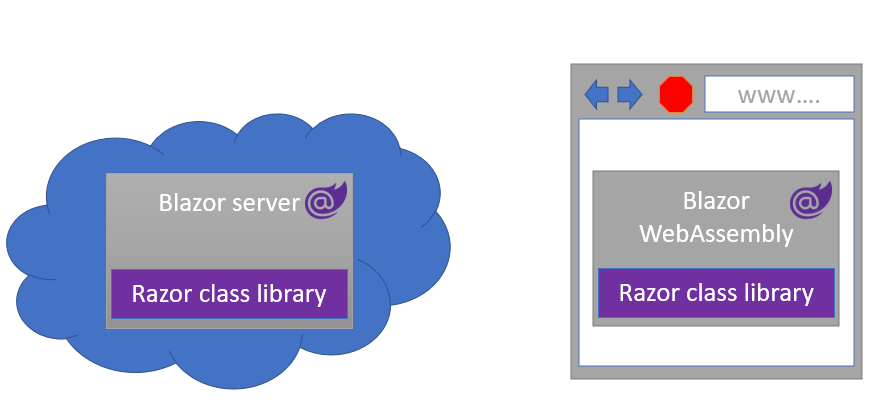
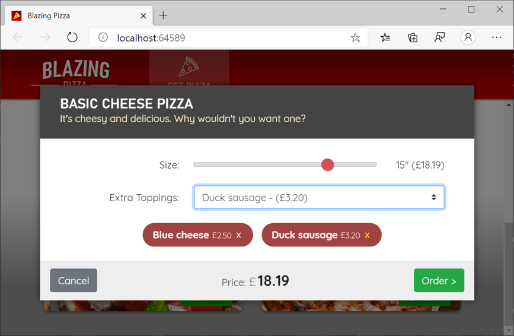
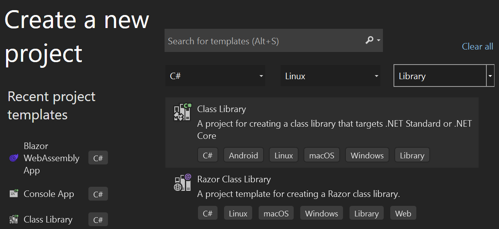
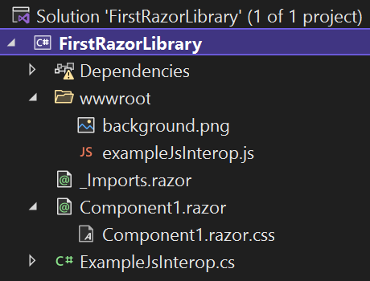
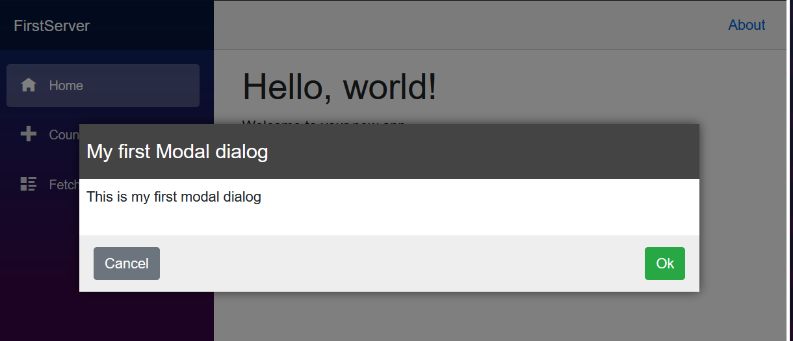

# Blazor를 통해 재사용 가능한 구성 요소 빌드

## 목차
- [Blazor를 통해 재사용 가능한 구성 요소 빌드](#blazor를-통해-재사용-가능한-구성-요소-빌드)
  - [목차](#목차)
  - [Razor 클래스 라이브러리 소개](#razor-클래스-라이브러리-소개)
    - [예제 시나리오](#예제-시나리오)
    - [이 모듈에서 수행할 작업](#이-모듈에서-수행할-작업)
    - [주요 목표는 무엇인가요?](#주요-목표는-무엇인가요)
    - [필수 조건](#필수-조건)
  - [Razor 클래스 라이브러리 만들기 및 개념](#razor-클래스-라이브러리-만들기-및-개념)
    - [Razor 클래스 라이브러리란?](#razor-클래스-라이브러리란)
    - [기본 템플릿을 사용하여 프로젝트 만들기](#기본-템플릿을-사용하여-프로젝트-만들기)
      - [클래스 라이브러리와 Razor 클래스 라이브러리의 차이점](#클래스-라이브러리와-razor-클래스-라이브러리의-차이점)
      - [Razor 구성 요소 콘텐츠](#razor-구성-요소-콘텐츠)
      - [정적 자산 제공](#정적-자산-제공)
      - [Razor 클래스 라이브러리 참조](#razor-클래스-라이브러리-참조)
  - [Razor 클래스 라이브러리 만들기](#razor-클래스-라이브러리-만들기)
    - [Razor 클래스 라이브러리 프로젝트 만들기](#razor-클래스-라이브러리-프로젝트-만들기)
    - [모달 대화 상자 구성 요소 빌드](#모달-대화-상자-구성-요소-빌드)
    - [모달 구성 요소 참조 및 사용](#모달-구성-요소-참조-및-사용)
    - [작업 확인](#작업-확인)
  - [Razor 클래스 라이브러리 패키지](#razor-클래스-라이브러리-패키지)
    - [NuGet 패키징을 위한 Razor 클래스 라이브러리 구성](#nuget-패키징을-위한-razor-클래스-라이브러리-구성)
    - [라이브러리 패키지](#라이브러리-패키지)
  - [NuGet 패키지 만들기](#nuget-패키지-만들기)
    - [FirstClassLibrary에 패키지 속성 추가](#firstclasslibrary에-패키지-속성-추가)
    - [재사용을 위해 라이브러리 패키지](#재사용을-위해-라이브러리-패키지)
    - [MyBlazorServer 애플리케이션에서 NuGet 패키지에 대한 참조 추가](#myblazorserver-애플리케이션에서-nuget-패키지에-대한-참조-추가)
    - [작업 확인](#작업-확인-1)
  - [요약](#요약)
  - [출처](#출처)
---

## Razor 클래스 라이브러리 소개

Razor 클래스 라이브러리를 사용하여 Blazor 애플리케이션 간에 사용자 인터페이스 구성 요소를 공유하고 재사용할 수 있습니다. 이 모듈에서는 Blazor 애플리케이션용 구성 요소를 빌드하고 공유하는 데 초점을 맞추겠습니다.



### 예제 시나리오

다양한 고객을 위해 웹 애플리케이션을 빌드하는 컨설팅 회사에서 근무한다고 가정합니다. 고객에게 제공하는 모달 창 구성 요소와 같은 웹 기능 컬렉션이 있습니다. 시간을 절약하기 위해 애플리케이션에서 이러한 기능을 재사용할 수 있어야 합니다.

Razor 클래스 라이브러리를 사용하여 고객을 위해 빌드하는 애플리케이션 간에 해당 기능을 공유할 수 있습니다.



### 이 모듈에서 수행할 작업

이 모듈에서는 다음 목표를 달성하기 위해 Razor 클래스 라이브러리를 만듭니다.

 - 기본 테마가 있는 모달 대화 상자 표시
 - Blazor 애플리케이션에서 모달 대화 상자 사용 및 사용자 지정
 - 다른 애플리케이션에서 사용할 모달 대화 상자 패키지

### 주요 목표는 무엇인가요?

이 모듈을 마치면 다른 Blazor 애플리케이션에서 공유하고 사용자 지정할 수 있는 모달 창 구성 요소를 디자인할 수 있습니다.

### 필수 조건

 - HTML, CSS, JavaScript 웹 개발 친숙성.
 - C# 코드를 작성할 수 있는 초보자 능력.
 - .NET 8.0 SDK가 설치됨.
 - IDE(통합 개발 환경). 이 모듈에서는 Visual Studio Code를 사용합니다.

```
참고

이 모듈에서는 로컬 개발에 .NET CLI(명령줄 인터페이스) 및 Visual Studio Code를 사용합니다. 이 모듈을 완료하면 Visual Studio(Windows) 또는 Visual Studio Code(Windows, Linux 및 macOS)를 사용한 연속 개발을 사용하여 개념을 적용할 수 있습니다.
```

이 모듈에서는 .NET 8.0 SDK를 사용합니다. 기본 설정 터미널에서 다음 명령을 실행하여 .NET 8.0이 설치되어 있는지 확인합니다.

```bash
dotnet --list-sdks
```
다음 예제와 유사한 출력이 표시됩니다.
```
6.0.317 [C:\Program Files\dotnet\sdk]
7.0.401 [C:\Program Files\dotnet\sdk]
8.0.100 [C:\Program Files\dotnet\sdk]
```
8으로 시작하는 버전이 나열되어 있는지 확인합니다. 나열되는 버전이 없거나 명령을 찾을 수 없는 경우 최신 .NET 8.0 SDK를 설치합니다.

---
## Razor 클래스 라이브러리 만들기 및 개념

웹 애플리케이션의 구성 요소를 통해 개발자는 애플리케이션 전체에서 애플리케이션 사용자 인터페이스의 일부분을 재사용할 수 있습니다. Razor 클래스 라이브러리를 사용하면 개발자는 여러 애플리케이션에서 이러한 구성 요소를 공유하고 재사용할 수 있습니다.

이 단원에서는 Razor 클래스 라이브러리를 만들고 이를 사용하여 Blazor 애플리케이션이 사용자 지정하고 표시할 수 있도록 렌더링된 정적 콘텐츠를 공유하는 방법을 알아봅니다.

### Razor 클래스 라이브러리란?

Razor 클래스 라이브러리는 Blazor 애플리케이션에서 참조할 수 있는 Razor 구성 요소, 페이지, HTML, CSS 파일, JavaScript, 이미지 및 기타 정적 웹 콘텐츠가 포함된 .NET 프로젝트 형식입니다. 다른 .NET 클래스 라이브러리 프로젝트와 마찬가지로 Razor 클래스 라이브러리는 NuGet 패키지로 번들로 묶고 NuGet.org와 같은 NuGet 패키지 리포지토리에서 공유할 수 있습니다.

Razor 클래스 라이브러리를 만들기 위한 기본 템플릿을 살펴보겠습니다.

### 기본 템플릿을 사용하여 프로젝트 만들기

선택적으로 파일>새 프로젝트를 선택하여 Visual Studio Razor 클래스 라이브러리를 만들기 시작할 수 있습니다.



명령줄 인터페이스에서 다음 명령을 실행하여 프로젝트를 만들 수도 있습니다.

```bash
dotnet new razorclasslib -o MyProjectName
```

이 템플릿은 구성 요소에서 사용할 수 있는 몇 가지 중요한 기능이 포함된 Component1이라는 초기 구성 요소를 제공합니다.

 - Component1.razor와 동일한 폴더에 저장되는 Component1.razor.css라는 격리된 계단식 CSS 스타일 시트. Component1.razor.css 파일은 Component1을 참조하는 Blazor 애플리케이션에 조건부로 포함됩니다.
 - 런타임에 Blazor 애플리케이션에서 사용할 수 있고 Component1 내에서 참조되는 정적 콘텐츠(예: 이미지 및 JavaScript 파일). 이 콘텐츠는 ASP.NET Core 또는 Blazor 애플리케이션의 wwwroot 폴더와 동일하게 동작하는 wwwroot 폴더에서 제공됩니다.
 - 포함된 JavaScript 파일에 있는 함수를 실행하는 .NET 코드.



#### 클래스 라이브러리와 Razor 클래스 라이브러리의 차이점

클래스 라이브러리는 .NET 애플리케이션에서 일반적인 패키지 배달 구조이며 Razor 클래스 라이브러리는 프로젝트 파일에 구성된 몇 가지 다른 기능과 구조가 유사합니다.

```xml
<Project Sdk="Microsoft.NET.Sdk.Razor">

  <PropertyGroup>
    <TargetFramework>net8.0</TargetFramework>
    <Nullable>enable</Nullable>
    <ImplicitUsings>enable</ImplicitUsings>
  </PropertyGroup>

  
  <ItemGroup>
    <SupportedPlatform Include="browser" />
  </ItemGroup>

  <ItemGroup>
    <PackageReference Include="Microsoft.AspNetCore.Components.Web" Version="8.0.0" />
  </ItemGroup>

</Project>
```

 - 프로젝트 파일은 Microsoft.NET.Sdk.Razor에 대한 SDK 참조를 포함하여 Razor 클래스 라이브러리로 Razor 콘텐츠를 만들고 포함한다고 선언합니다.
 - `SupportedPlatform` 항목은 이 라이브러리를 `browser` 플랫폼, 즉 WebAssembly에서 사용할 수 있음을 선언합니다.
 - `Microsoft.AspNetCore.Components.Web` 라이브러리에 대한 `PackageReference`는 프레임워크와 함께 배달되는 기본 Blazor 구성 요소에 대한 액세스를 제공합니다. 그러므로 이러한 간단한 구성 요소를 사용하여 더 복잡한 구성 요소를 빌드할 수 있습니다.

#### Razor 구성 요소 콘텐츠

제공되는 초기 Razor 구성 요소는 간단합니다. 짧은 텍스트 블록이 있는 HTML `div` 요소만 포함합니다.

```razor
<div class="my-component">
    This component is defined in the <strong>FirstRazorLibrary</strong> library.
</div>
```

이 구성 요소는 동일한 프로젝트에 제공된 구성 요소가 동작할 것으로 예상하는 것과 동일한 방식으로 참조하는 다른 Blazor 구성 요소 및 페이지와 상호 작용합니다. 즉, Component1.razor.css 파일의 CSS 격리 스크립트는 application.css 파일의 나머지 애플리케이션 CSS와 함께 인라인으로 렌더링됩니다.

#### 정적 자산 제공

wwwroot 폴더의 콘텐츠를 해당 폴더의 다른 콘텐츠 및 구성 요소의 개별 CSS 파일(예: Component1.razor.css) 사이에서 기본 폴더의 파일로 상대적으로 참조할 수 있습니다. 예를 들어 기본 CSS는 2픽셀 파선 빨간색 테두리와 wwwroot 폴더의 background.png 이미지를 사용하는 배경 이미지 스타일을 추가합니다. CSS에서 wwwroot 폴더에 있는 콘텐츠로 이 참조를 만드는 데 필요한 경로는 없습니다.


```css
.my-component {
    border: 2px dashed red;
    padding: 1em;
    margin: 1em 0;
    background-image: url('background.png');
}
```

wwwroot 폴더의 콘텐츠는 다음 형식의 절대 폴더 참조를 사용하여 호스팅된 Blazor 애플리케이션에서 참조할 수 있습니다.

```bash
/_content/{PACKAGE_ID}/{PATH_AND_FILENAME_INSIDE_WWWROOT}
```

#### Razor 클래스 라이브러리 참조

.NET 솔루션에서 Razor 클래스 라이브러리가 이 라이브러리를 참조하는 Blazor 애플리케이션 옆의 디스크에 상주하는 경우 다음과 같이 표준 Visual Studio 참조 추가 대화 상자를 사용하고 .NET CLI `add reference` 명령을 사용하여 Razor 클래스 라이브러리를 참조하도록 Blazor 애플리케이션을 업데이트할 수 있습니다.

```bash
dotnet add reference ../MyClassLibrary
```

NuGet 패키지 형식으로 제공되는 라이브러리의 경우 다음과 같이 Visual Studio NuGet 패키지 설치 프로그램을 사용하거나 .NET CLI add package 명령을 사용하여 참조를 추가할 수 있습니다.

```bash
dotnet add package MyClassLibrary
```

---
## Razor 클래스 라이브러리 만들기

이 연습에서는 기본 Blazor 템플릿 애플리케이션에서 재사용할 수 있는 Razor 클래스 라이브러리의 모달 대화 상자를 만듭니다.



### Razor 클래스 라이브러리 프로젝트 만들기

이 모듈에서는 .NET 6.0 SDK를 사용합니다. 기본 설정 터미널에서 다음 명령을 실행하여 .NET 6.0이 설치되어 있는지 확인합니다.

```bash
dotnet --list-sdks
```

그러면 다음과 같은 출력이 표시됩니다.

```
3.1.100 [C:\program files\dotnet\sdk]
5.0.100 [C:\program files\dotnet\sdk]
6.0.100 [C:\program files\dotnet\sdk]
```

6으로 시작하는 버전이 나열되어 있는지 확인합니다. 나열되는 버전이 없거나 명령을 찾을 수 없는 경우 최신 .NET 6.0 SDK를 설치합니다.

먼저 모달 대화 상자 구성 요소에 대한 Razor 클래스 라이브러리 프로젝트를 만듭니다. Visual Studio를 사용하여 새 프로젝트를 만들거나 다음과 같이 .NET 명령줄 도구를 사용하여 새 폴더에 프로젝트를 만들 수 있습니다.

```bash
dotnet new razorclasslib -o FirstClassLibrary -f net8.0
```

### 모달 대화 상자 구성 요소 빌드

다음으로, 적절한 CSS 파일을 사용하여 프로젝트에서 모달 구성 요소를 빌드하고 초기 형식을 제공합니다.

 1. Component1.razor 파일의 이름을 Modal.razor로 바꾸고 `Component1.razor.css` 파일의 이름을 Modal.razor.css로 바꿉니다. Modal.razor 파일에는 만들 구성 요소가 포함되어 있으며 나중에 프로젝트에 빈 텍스트 파일을 추가하고 Razor 또는 CSS용 콘텐츠로 적절하게 서식을 지정할 수 있습니다.
 2. Modal.razor 파일에 다음 Razor 콘텐츠를 추가합니다.
    ```razor
    @if (Show) {

    <div class="dialog-container">
    <div class="dialog">
    <div class="dialog-title">
        <h2>@Title</h2>
    </div>

    <div class="dialog-body">
        @ChildContent
    </div>

    <div class="dialog-buttons">
        <button class="btn btn-secondary mr-auto" @onclick="OnCancel">@CancelText</button>
        <button class="btn btn-success ml-auto" @onclick="OnConfirm">@ConfirmText</button>
    </div>

    </div>
    </div>

    }

    @code {

    [Parameter]
    public string Title { get; set; }

    [Parameter]
    public string CancelText { get; set; } = "Cancel";

    [Parameter]
    public string ConfirmText { get; set; } = "Ok";

    [Parameter]
    public RenderFragment ChildContent { get; set; }

    [Parameter]
    public bool Show { get; set; }


    [Parameter] public EventCallback OnCancel { get; set; }
    [Parameter] public EventCallback OnConfirm { get; set; }

    }
    ```
    이 구성 요소에는 프로젝트 간에 공유할 수 있는 몇 가지 멋진 기능이 있습니다.
     - 제목.
     - 취소 및 확인 단추(레이블을 구성할 수 있고 클릭 이벤트를 관리할 수 있음).
     - ChildContent 매개 변수를 통해 구성 요소의 내부 콘텐츠를 설정할 수 있습니다.
     - Show 매개 변수를 사용하여 대화 상자의 표시 상태를 제어할 수 있습니다.
 3. 구성 요소에 대한 기본 서식을 제공하려면 다음 CSS를 Modal.razor.css 파일에 추가합니다.
    ```css
    .dialog-container {
    position: absolute;
    top: 0;
    bottom: 0;
    left: 0;
    right: 0;
    background-color: rgba(0,0,0,0.5);
    z-index: 2000;
    display: flex;
    animation: dialog-container-entry 0.2s;
    }

    @keyframes dialog-container-entry {
    0% {
    opacity: 0;
    }

    100% {
    opacity: 1;
    }
    }

    .dialog {
    background-color: white;
    box-shadow: 0 0 12px rgba(0,0,0,0.6);
    display: flex;
    flex-direction: column;
    z-index: 2000;
    align-self: center;
    margin: auto;
    width: 700px;
    max-height: calc(100% - 3rem);
    animation: dialog-entry 0.4s;
    animation-timing-function: cubic-bezier(0.075, 0.820, 0.165, 1.000);
    }

    @keyframes dialog-entry {
    0% {
    transform: translateY(30px) scale(0.95);
    }

    100% {
    transform: translateX(0px) scale(1.0);
    }
    }

    .dialog-title {
    background-color: #444;
    color: #fff2cc;
    padding: 1.3rem 0.5rem;
    }

    .dialog-title h2 {
    color: white;
    font-size: 1.4rem;
    margin: 0;
    font-family: Arial, Helvetica, sans-serif;
    line-height: 1.3rem;
    }

    .dialog-body {
    flex-grow: 1;
    padding: 0.5rem 3rem 1rem 0.5rem;
    }

    .dialog-buttons {
    height: 4rem;
    flex-shrink: 0;
    display: flex;
    align-items: center;
    background-color: #eee;
    padding: 0 1rem;
    }
    ```
이 태그는 아래쪽의 제목 표시줄 및 단추 표시줄에 몇 가지 기본 색 지정을 제공하므로 단순한 회색 HTML 요소 집합보다 더 흥미롭습니다.

### 모달 구성 요소 참조 및 사용

FirstClassLibrary 프로젝트에 있는 모달 구성 요소를 사용하여 새 Blazor Server 애플리케이션을 추가하고 모달 구성 요소 사용을 시작합니다.
 1. Visual Studio 새 프로젝트 추가 기능을 사용하거나 다음 명령을 실행하여 FirstClassLibrary 프로젝트 옆에 있는 폴더에 MyBlazorApp이라는 새 Blazor Server 프로젝트를 만듭니다.
    ```bash
    dotnet new blazor -o MyBlazorApp -f net8.0
    ```
 2. MyBlazorApp 프로젝트에서 Visual Studio 참조 추가 기능을 사용하거나 MyBlazorApp 폴더에서 다음 명령을 실행하여 FirstClassLibrary 프로젝트에 대한 참조를 추가합니다.
    ```bash
    dotnet add reference ../FirstClassLibrary
    ```

이 프로젝트 참조를 추가하면 MyBlazorApp 애플리케이션이 FirstClassLibrary 프로젝트의 구성 요소와 상호 작용할 수 있습니다.

 1. MyBlazorApp 애플리케이션에서 Components 폴더에 있는 _Imports.razor 파일의 끝에 항목을 추가하여 모달 구성 요소를 더 쉽게 참조할 수 있도록 합니다. 이렇게 하면 구성 요소의 전체 네임스페이스를 지정하지 않고도 모달 구성 요소를 참조할 수 있습니다.
    ```bash
    @using FirstClassLibrary
    ```
 2. 이 애플리케이션의 시작 페이지 Components/Pages/Home.razor 파일에 모달 구성 요소를 추가합니다.
    ```razor
    <Modal Title="My first Modal dialog" Show="true">
    <p>
    This is my first modal dialog
    </p>
    </Modal>
    ```
    1. 구성 요소에 "My first Modal dialog"라는 제목을 지정합니다.
    2. 대화 상자 안에 표시할 짧은 단락을 추가합니다. 이 내용은 대화 상자의 목적을 설명합니다.
    3. `Show` 매개 변수를 사용하여 대화 상자를 표시하도록 설정합니다.

### 작업 확인

`dotnet run`으로 MyBlazorApp 애플리케이션을 시작하고 브라우저에서 해당 애플리케이션으로 이동합니다. My first Modal dialog 대화 상자가 화면의 나머지 콘텐츠 위에 표시됩니다.


---
## Razor 클래스 라이브러리 패키지

자주 수행할 작업은 다른 개발자가 재사용할 수 있는 라이브러리를 패키지하는 것입니다. NuGet 패키징을 사용하면 모든 개발자가 애플리케이션에 대해 모든 .NET 참조를 획득하고 적절히 구성할 수 있습니다.

이전 단원에서는 모달 대화 상자 구성 요소를 빌드하고 자체 애플리케이션에서 사용했습니다. 이제 다른 애플리케이션에서 재사용하려고 합니다.

이 단원에서는 Razor 클래스 라이브러리를 NuGet 패키지로 구성하는 데 필요한 단계를 알아봅니다. NuGet.org 또는 GitHub 리포지토리와 같은 패키지 리포지토리 서비스를 사용하여 배포를 위해 라이브러리를 패키지하는 방법도 알아봅니다.

### NuGet 패키징을 위한 Razor 클래스 라이브러리 구성

.NET 에코시스템을 이용하면 다른 개발자가 구성 요소를 식별하고 사용하는 데 필요한 속성을 쉽게 정의할 수 있습니다. 이러한 속성은 모두 Razor 클래스 라이브러리의 프로젝트 파일(*.csproj)에서 정의할 수 있으므로 라이브러리와 함께 이동하고 라이브러리가 업데이트될 때 적절히 업데이트됩니다.

패키지를 식별하는 필드를 Visual Studio 프로젝트 속성 - 패키지 대화 상자에서 구성하거나 직접 *.csproj 파일에 항목을 만들 수 있습니다.

패키지를 만드는 데 필요한 4개 필드는 다음과 같습니다.

| 필드        | Description                                                                      | 기본값                  |
|-----------|----------------------------------------------------------------------------------|----------------------|
| PackageId | 전체 NuGet 리포지토리에서 고유한 패키지 식별자입니다.                                                 | 라이브러리의 `AssemblyName`  |
| Version   | Major.Minor.Patch[-Suffix] 형식의 특정 버전 번호입니다. 여기서 -Suffix는 선택적으로 사전 릴리스 버전을 정의합니다. | 1.0.0                |
| 작성자       | 패키지 작성자입니다.                                                                      | `AssemblyName`         |
| 회사        | 패키지를 만들고 게시하는 회사의 이름입니다.                                                         | `AssemblyName`         |

이러한 필드 중 일부는 기본값이 있습니다. 회사 이름이 MyFirstLibrary인 패키지를 게시한다면 이상할 수 있으므로 이러한 값을 명시적으로 정의해야 합니다.

이전 단원에서는 Razor 클래스 라이브러리의 정적 콘텐츠를 `_content/[PACKAGE_ID]/`에서 사용할 수 있음을 알았고 이제 `PackageId` 값이 구성되는 위치를 확인했습니다.

이러한 값이 구성된 샘플 프로젝트 파일은 다음과 같습니다.

```xml
<PropertyGroup>
    <PackageId>Learn.MyFirstLibrary</PackageId>
    <Version>0.1.0-alpha1</Version>
    <Authors>Susan Developer, Terry Programmer</Authors>
    <Company>AdventureWorks</Company>
</PropertyGroup>
```

프로젝트를 빌드할 때 Visual Studio의 프로젝트 속성 대화 상자에서 빌드 시 NuGet 패키지 생성 옵션을 선택하거나 다음과 같이 다른 패키지 필드 옆에 `GeneratePackageOnBuild` 항목을 추가하여 빌드할 때 NuGet 패키지를 생성하도록 구성할 수도 있습니다.

```xml
<GeneratePackageOnBuild>True</GeneratePackageOnBuild>
```

다음을 포함하여 많은 선택적 프로젝트 속성을 구성할 수 있습니다.

 - NuGet 리포지토리에 표시하는 데 적합한 `Description`
 - 저작권 표시
 - 라이선싱 정보
 - 아이콘
 - URL 보호

속성의 전체 목록은 MSBuild 팩 대상에 대한 Microsoft 설명서를 확인하세요.

### 라이브러리 패키지

*.csproj 파일에 라이브러리 구성을 작성한 후 Visual Studio에서 프로젝트를 마우스 오른쪽 단추로 클릭하고 Pack 명령을 선택하거나 프로젝트 폴더에서 다음 명령을 실행하여 NuGet 패키지를 생성할 수 있습니다.

```bash
dotnet pack
```

이 `dotnet pack` 명령은 PackageID 및 버전 번호가 있는 패키지를 생성하여 표준 프로젝트 빌드 출력 폴더에 배치합니다.

---
## NuGet 패키지 만들기

Razor 클래스 라이브러리를 패키지하면 Blazor 프로젝트가 참조할 수 있는 이진 결과물이 만들어지고 Blazor 프로젝트에서 그 안의 구성 요소를 사용할 수 있습니다.

이전 단원에서 Blazor 애플리케이션에 대한 모달 대화 상자 창을 제공하는 모달 구성 요소가 포함된 Razor 클래스 라이브러리를 만들었습니다. 이 구성 요소를 다른 애플리케이션에서 사용하도록 공유하려면 이를 패키지하여 다른 개발자가 액세스할 수 있는 리포지토리 또는 폴더에 배치해야 합니다.

이 단원에서는 해당 프로젝트를 업데이트하고 NuGet 패키지를 생성합니다. 마지막으로 해당 NuGet 패키지를 Blazor 서버 애플리케이션에 배포합니다.

### FirstClassLibrary에 패키지 속성 추가

먼저 FirstClassLibrary 프로젝트를 NuGet 패키지로 배포하기 위해 패키지할 수 있는 속성으로 업데이트합니다.

 1. Visual Studio 솔루션 탐색기에서 프로젝트를 두 번 클릭하거나 Visual Studio Code에서 MyClassLibrary.csproj를 열어 MyClassLibrary 프로젝트에 대한 프로젝트 파일을 엽니다.
 2. 파일 맨 위 근처의 `<PropertyGroup>` 태그가 있는 섹션에서 닫는 `</PropertyGroup>` 태그 앞에 다음 콘텐츠를 추가합니다.
    ```xml
    <PackageId>My.FirstClassLibrary</PackageId>
        <Version>0.1.0</Version>
        <Authors>YOUR NAME</Authors>
        <Company>YOUR COMPANY NAME</Company>
        <Description>This is a Razor component library with a cool modal window component.</Description>
    </PropertyGroup>
    ```
    이 코드는 Razor 클래스 라이브러리가 `<PackageId>` "My.FirstClassLibrary"와 `<Version>` 0.1.0을 갖는 것으로 정의합니다. 이 두 필드에서 개발자 이름과 회사 이름을 입력합니다.

### 재사용을 위해 라이브러리 패키지

다음으로 명령줄에서 .NET 명령을 실행하여 솔루션 외부의 다른 애플리케이션에서 참조할 수 있도록 Razor 클래스 라이브러리를 패키지합니다.

연속 통합 프로세스에서 동일한 단계를 실행하여 라이브러리를 패키지하고 NuGet.org, GitHub 리포지토리 또는 조직에서 공유할 다른 위치에 배포할 수 있습니다.

MyClassLibrary.csproj 파일과 동일한 폴더에서 다음 명령을 실행합니다.

```bash
dotnet pack
```

이 명령은 My.FirstClassLibrary.0.1.0.nupkg라는 파일을 bin/Debug 폴더에 씁니다.

### MyBlazorServer 애플리케이션에서 NuGet 패키지에 대한 참조 추가

웹 애플리케이션과 동일한 폴더 구조에 있으므로 이미 MyBlazorServer 애플리케이션의 FirstClassLibrary 프로젝트를 참조한 것입니다.

이제 이 프로젝트 참조를 실행 취소하고 앞서 만든 NuGet 패키지에 대한 참조를 추가해 보겠습니다.

이러한 단계는 일반적인 구성이 아닙니다. 참조하는 애플리케이션과 동일한 폴더 또는 솔루션에 있는 라이브러리 프로젝트는 이전 연습에서 본 것처럼 프로젝트를 직접 참조할 수 있습니다.

 1. Visual Studio에서 MyBlazorServer 프로젝트 이름을 두 번 클릭하여 MyBlazorServer.csproj 파일을 열거나 Visual Studio Code에서 이 파일을 엽니다.
 2. MyBlazorServer.csproj 파일에서 다음 줄을 제거합니다.<br>`<ProjectReference Include="..\FirstClassLibrary\FirstClassLibrary.csproj" />`
 3. MyBlazorServer.csproj와 동일한 폴더에서 다음 명령을 실행합니다.
    ```bash
    dotnet add package My.FirstClassLibrary -s ..\FirstClassLibrary\bin\Debug
    ```
    이 명령은 앞서 만든 NuGet 패키지를 그랩하고 로컬 NuGet 패키지 캐시에 복사본을 설치한 다음 MyBlazorServer.csproj 파일에서 해당 패키지에 대한 참조를 추가합니다.

### 작업 확인

새 패키지가 제대로 설치되었나요? FirstServer 애플리케이션을 시작하고 애플리케이션이 시작될 때 모달 창을 볼 수 있나요?

살펴보겠습니다.

 1. Visual Studio에서 F5를 선택하거나 MyBlazorServer 폴더에서 다음 명령을 실행하여 MyBlazorServer 애플리케이션을 시작합니다.<br>`dotnet run`
 2. 브라우저에서 MyBlazorServer 애플리케이션의 홈페이지(https://localhost:5000)로 이동합니다.<br>My first Modal dialog 대화 상자가 표시되었나요? 그렇다면 축하합니다. FirstClassLibrary 프로젝트를 올바르게 패키지하고 배포했습니다. 이제 모든 애플리케이션에서 새로 만든 NuGet 패키지를 참조하여 모달 창 구성 요소를 사용할 수 있습니다.

---
## 요약

이 모듈에서는 Blazor 애플리케이션 간에 사용 및 재사용할 수 있는 Blazor 구성 요소를 빌드, 패키지, 공유하는 과정에서 발생한 문제를 해결했습니다.

많은 애플리케이션과 공유하려는 구성 요소가 포함된 Razor 클래스 라이브러리를 빌드하는 방법을 배웠습니다. 라이브러리를 어셈블하기 위해

 - .NET 템플릿에서 새 Razor 클래스 라이브러리를 만들었습니다.
 - Blazor 구성 요소가 포함된 .razor 파일과 해당 스타일시트가 포함된 .razor.css 파일을 추가했습니다.
 - 프로젝트 파일에 다른 개발자를 위해 패키지를 정의하는 패키지 메타데이터를 추가했습니다.
. - NET 명령줄 인터페이스를 사용하여 Razor 클래스 라이브러리에서 NuGet 패키지를 만들었습니다.

Blazor 구성 요소는 더 복잡한 애플리케이션을 쉽게 빌드할 수 있도록 하는 빌딩 블록입니다. 다른 구성 요소를 참조하는 구성 요소 및 페이지를 빌드하면 다른 개발자가 공유한 사용자 인터페이스 패러다임을 활용하는 애플리케이션을 더 빠르게 제공할 수 있습니다. 다른 개발자가 이전에 투자한 구성 요소를 다시 사용할 수 있는 경우 자체 프로젝트에서도 시간과 비용을 절약할 수 있습니다.

---
## 출처
 - [Microsoft learn Build reusable components with Blazor](https://learn.microsoft.com/en-us/training/modules/blazor-build-reusable-components/)
