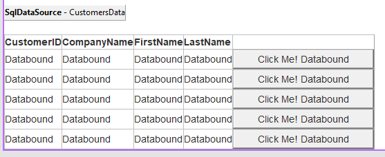

# Work with data

## 목차
- [Work with data](#work-with-data)
  - [목차](#목차)
  - [Entity Framework](#entity-framework)
    - [EF 코드 우선](#ef-코드-우선)
    - [EF 데이터베이스 우선](#ef-데이터베이스-우선)
  - [웹 서비스와 상호 작용](#웹-서비스와-상호-작용)
  - [출처](#출처)
  - [다음](#다음)

---

데이터 액세스는 ASP.NET Web Forms 앱의 중추입니다. 웹을 위한 폼을 작성할 때, 그 데이터는 어떻게 처리되나요? Web Forms를 사용할 때 데이터베이스와 상호 작용하기 위해 사용할 수 있는 여러 데이터 액세스 기술이 있었습니다:

- 데이터 소스
- ADO.NET
- Entity Framework

데이터 소스는 Web Forms 페이지에 배치하고 다른 컨트롤처럼 구성할 수 있는 컨트롤이었습니다. Visual Studio는 이러한 컨트롤을 구성하고 Web Forms 페이지에 바인딩하는 친숙한 대화 상자를 제공했습니다. Web Forms가 처음 출시되었을 때 "코드가 거의 없는" 또는 "코드가 없는" 접근 방식을 선호하는 개발자는 이 기술을 선호했습니다.



ADO.NET은 데이터베이스와 상호 작용하는 저수준 접근 방식입니다. 앱은 명령어, 데이터 테이블 및 데이터셋을 사용하여 데이터베이스에 연결할 수 있었습니다. 결과는 화면에 거의 코드 없이 필드에 바인딩될 수 있었습니다. 이 접근 방식의 단점은 각 ADO.NET 객체 세트(`Connection`, `Command`, `DataTable`)가 데이터베이스 공급자가 제공하는 라이브러리에 바인딩된다는 점이었습니다. 이러한 구성 요소를 사용하면 코드가 경직되고 다른 데이터베이스로 마이그레이션하기 어려웠습니다.

## Entity Framework

Entity Framework(EF)는 .NET Foundation에서 유지 관리하는 오픈 소스 객체-관계 매핑 프레임워크입니다. 처음에는 .NET Framework와 함께 출시되었으며, EF는 데이터베이스 연결, 저장 스키마 및 상호 작용을 위한 코드를 생성할 수 있습니다. 이 추상화를 통해 앱의 비즈니스 규칙에 집중할 수 있으며 데이터베이스는 신뢰할 수 있는 데이터베이스 관리자에 의해 관리될 수 있습니다. .NET에서는 EF Core라는 업데이트된 버전을 사용할 수 있습니다. EF Core는 `dotnet ef` 명령줄 도구를 사용하여 코드와 데이터베이스 간의 상호 작용을 생성하고 유지 관리하는 명령어를 제공합니다. 데이터베이스와 작업하는 몇 가지 샘플을 살펴보겠습니다.

### EF 코드 우선

데이터베이스 상호 작용을 시작하는 빠른 방법은 작업하려는 클래스 객체를 시작하는 것입니다. EF는 클래스에 적합한 데이터베이스 코드를 생성하는 도구를 제공합니다. 이 접근 방식을 "코드 우선" 개발이라고 합니다. Microsoft SQL Server와 같은 관계형 데이터베이스에 저장하고자 하는 샘플 상점 앱의 `Product` 클래스를 고려해 보십시오.

```csharp
public class Product
{
    public int Id { get; set; }

    [Required]
    public string Name { get; set; }

    [MaxLength(4000)]
    public string Description { get; set; }

    [Range(0, 99999.99)]
    [DataType(DataType.Currency)]
    public decimal Price { get; set; }
}
```

Product는 기본 키와 데이터베이스에 생성될 세 개의 추가 필드를 가지고 있습니다:

- EF는 규칙에 따라 `Id` 속성을 기본 키로 식별합니다.
- `Name`은 텍스트 저장을 위해 구성된 열에 저장됩니다. 이 속성을 장식하는 `[Required]` 속성은 `not null` 제약 조건을 추가하여 이 속성의 선언된 동작을 적용하는 데 도움이 됩니다.
- `Description`은 텍스트 저장을 위해 구성된 열에 저장되며, `[MaxLength]` 속성에 의해 구성된 최대 길이 4000자로 설정됩니다. 데이터베이스 스키마는 `varchar(4000)` 데이터 유형을 사용하여 `MaxLength`라는 열로 구성됩니다.
- `Price` 속성은 통화로 저장됩니다. `[Range]` 속성은 선언된 최소 및 최대 값 외부의 데이터 저장을 방지하기 위해 적절한 제약 조건을 생성합니다.

이 `Product` 클래스를 데이터베이스와의 연결 및 변환 작업을 정의하는 데이터베이스 컨텍스트 클래스에 추가해야 합니다.

```csharp
public class MyDbContext : DbContext
{
    public DbSet<Product> Products { get; set; }
}
```

`MyDbContext` 클래스는 `Product` 클래스를 위한 액세스 및 변환을 정의하는 하나의 속성을 제공합니다. 다음 항목을 `Startup` 클래스의 `ConfigureServices` 메서드(또는 `services` 대신 `builder.Services` 속성을 사용하는 *Program.cs*의 적절한 위치)에 추가하여 데이터베이스와의 상호 작용을 구성합니다:

```csharp
services.AddDbContext<MyDbContext>(options =>
    options.UseSqlServer("MY DATABASE CONNECTION STRING"));
```

위의 코드는 지정된 연결 문자열을 사용하여 SQL Server 데이터베이스에 연결합니다. 연결 문자열은 *appsettings.json* 파일, 환경 변수 또는 기타 구성 저장 위치에 넣고 적절히 이 임베디드 문자열을 대체할 수 있습니다.

다음 명령어를 사용하여 이 클래스에 적합한 데이터베이스 테이블을 생성할 수 있습니다:

```dotnetcli
dotnet ef migrations add 'Create Product table'
dotnet ef database update
```

첫 번째 명령어는 `Create Product table`이라는 새로운 EF 마이그레이션으로 데이터베이스 스키마에 대한 변경 사항을 정의합니다. 마이그레이션은 새로운 데이터베이스 변경 사항을 적용하고 제거하는 방법을 정의합니다.

적용되면 데이터베이스에 간단한 `Product` 테이블과 데이터베이스 스키마를 관리하는 데 도움이 되는 프로젝트에 새로운 클래스가 추가됩니다. 기본적으로 이 생성된 클래스는 *Migrations*라는 새 폴더에서 찾을 수 있습니다. `Product` 클래스에 변경 사항을 추가하거나 데이터베이스와 상호 작용하는 관련 클래스를 더 추가할 때마다 마이그레이션의 새 이름으로 명령줄 명령어를 다시 실행해야 합니다. 이 명령은 데이터베이스 스키마를 업데이트하는 또 다른 마이그레이션 클래스를 생성합니다.

### EF 데이터베이스 우선

기존 데이터베이스의 경우 .NET 명령줄 도구를 사용하여 EF Core 클래스를 생성할 수 있습니다. 클래스를 스캐폴딩하려면 다음 명령의 변형을 사용하십시오:

```dotnetcli
dotnet ef dbcontext scaffold "CONNECTION STRING" Microsoft.EntityFrameworkCore.SqlServer -c MyDbContext -t Product -t Customer
```

위의 명령어는 지정된 연결 문자열 및 `Microsoft.EntityFrameworkCore.SqlServer` 공급자를 사용하여 데이터베이스에 연결합니다. 연결되면 `MyDbContext`라는 데이터베이스 컨텍스트 클래스가 생성됩니다. 또한 `-t` 옵션으로 지정된 `Product` 및 `Customer` 테이블에 대한 지원 클래스가 생성됩니다. 이 명령에는 데이터베이스에 적합한 클래스 계층 구조를 생성하기 위한 많은 구성 옵션이 있습니다. 전체 참조는 명령어 문서를 참조하십시오.

EF Core에 대한 자세한 내용은 Microsoft Docs 사이트에서 확인할 수 있습니다.

## 웹 서비스와 상호 작용

ASP.NET이 처음 출시되었을 때, SOAP 서비스는 웹 서버와 클라이언트가 데이터를 교환하는 데 선호되는 방식이었습니다. 그 이후로 많은 것이 변했으며, 서비스와의 상호 작용은 직접 HTTP 클라이언트 상호 작용으로 전환되었습니다. ASP.NET Core 및 Blazor에서는 *Program.cs* 또는 `Startup` 클래스의 `ConfigureServices` 메서드에서 `HttpClient` 구성 등록을 할 수 있습니다. HTTP 엔드포인트와 상호 작용해야 할 때 해당 구성을 사용하십시오. 다음 구성 코드를 고려해 보십시오:

```csharp
// in Program.cs
builder.Services.AddHttpClient("github", client =>
{
    client.BaseAddress = new Uri("http://api.github.com/");
    // Github API 버전 관리
    client.DefaultRequestHeaders.Add("Accept", "application/vnd.github.v3+json");
    // Github는 사용자 에이전트를 필요로 합니다
    client.DefaultRequestHeaders.Add("User-Agent", "BlazorWebForms-Sample");
});
```

GitHub에서 데이터를 액세스해야 할 때마다 `github`라는 이름의 클라이언트를 생성합니다. 클라이언트는 기본 주소로 구성되고 요청 헤더가 적절하게 설정됩니다. `@inject` 지시문 또는 속성에 `[Inject]` 특성을 사용하여 Blazor 컴포넌트에 `IHttpClientFactory`를 주입합니다. 다음 구문을 사용하여 명명된 클라이언트를 생성하고 서비스와 상호 작용합니다:

```razor
@inject IHttpClientFactory factory

...

@code {
    protected override async Task OnInitializedAsync()
    {
        var client = factory.CreateClient("github");
        var response = await client.GetAsync("repos/dotnet/docs/issues");
        response.EnsureSuccessStatusCode();
        var content = await response.Content.ReadAsStringAsync();
    }
}
```

이 방법은 *dotnet/docs* GitHub 저장소의 이슈 컬렉션을 설명하는 문자열을 반환합니다.

 내용은 JSON 형식으로 반환되며 적절한 GitHub 이슈 객체로 역직렬화됩니다. `HttpClientFactory`를 구성하여 사전 구성된 `HttpClient` 객체를 제공하는 다양한 방법이 있습니다. 여러 `HttpClient` 인스턴스를 다른 이름과 엔드포인트로 구성하여 다양한 웹 서비스와의 상호 작용을 각 페이지에서 더 쉽게 만들 수 있도록 시도해 보십시오. 자세한 내용은 IHttpClientFactory를 사용하여 HTTP 요청 만들기를 참조하십시오.
 
---
## 출처
[Work with data](https://learn.microsoft.com/en-us/dotnet/architecture/blazor-for-web-forms-developers/data)

---
## [다음](./11_middleware.md)